# 🏗️ Sincpro Framework - Architecture Documentation

## 📋 Table of Contents

1.  [Overview](#overview)
2.  [Component Matrix](#component-matrix)
3.  [Architecture Diagrams](#architecture-diagrams)
4.  [Execution Flows](#execution-flows)
5.  [Implemented Patterns](#implemented-patterns)
6.  [External Dependencies](#external-dependencies)
7.  [Current State and Roadmap](#current-state-and-roadmap)
8.  [Design Considerations](#design-considerations)

---

## 🎯 Overview

The **Sincpro Framework** is an implementation of **Hexagonal Architecture** with **DDD** and **CQRS** patterns that replaces the traditional application layer with a unified bus system for command/query handling.

### Fundamental Principles

-   **Separation of concerns** by layers
-   **Dependency inversion** through IoC
-   **Unified bus** as single entry point
-   **Decoupling** between business logic and infrastructure
-   **Automatic validation** of DTOs with Pydantic
-   **Integrated observability** with structured logging

### Usage Context

The framework is designed for enterprise applications that require:

-   Multiple independent bounded contexts
-   Complex use case orchestration
-   Horizontal and vertical scalability
-   Long-term maintainability
-   Automated testing and simple mocking

---

## 📊 Component Matrix

| Module | File | Primary Responsibility | Architectural Layer | Dependencies |
|---|---|---|---|---|
| **Core Abstractions** | `sincpro_abstractions.py` | Defines base contracts (Bus, Feature, ApplicationService, DTO) | Domain | Pydantic |
| **Bus System** | `bus.py` | Implements execution buses (Feature, ApplicationService, Framework) | Application | sincpro_abstractions, sincpro_logger |
| **Framework Orchestrator** | `use_bus.py` | Main entry point and framework configuration | Application | bus, ioc, sincpro_log |
| **Dependency Injection** | `ioc.py` | IoC Container and registration decorators | Infrastructure | dependency-injector, bus |
| **Configuration Management** | `sincpro_conf.py` | Configuration and environment variable handling | Infrastructure | PyYAML, Pydantic |
| **Logging Integration** | `sincpro_logger.py` | Logging system integration | Infrastructure | sincpro-log |
| **Value Objects** | `ddd/value_object.py` | DDD Value Objects implementation | Domain | - |
| **Exception Handling** | `exceptions.py` | Framework-specific exceptions | Cross-cutting | - |

### Component Details

#### 🔷 Core Abstractions (`sincpro_abstractions.py`)

```python
# Fundamental contracts
- DataTransferObject: Pydantic BaseModel for data transfer
- Bus: Abstract interface for execution buses  
- Feature: Atomic use case (Command/Query Handler)
- ApplicationService: Multi-Feature orchestrator
```

#### 🚌 Bus System (`bus.py`)

The bus system implements a **three-layer registry architecture**:

```python
# Layer 1: FeatureBus - Atomic operations
class FeatureBus:
    feature_registry: Dict[str, Feature] = dict()  # DTO name → Feature mapping
    
    def register_feature(self, dto: Type[DataTransferObject], feature: Feature):
        # Registry management with conflict detection
        self.feature_registry[dto.__name__] = feature
    
    def execute(self, dto: TypeDTO) -> TypeDTOResponse:
        # Registry lookup: DTO class name → Feature instance → execute
        return self.feature_registry[dto.__class__.__name__].execute(dto)

# Layer 2: ApplicationServiceBus - Orchestration
class ApplicationServiceBus:
    app_service_registry: Dict[str, ApplicationService] = dict()  # DTO name → Service mapping
    
    def register_app_service(self, dto: Type[DataTransferObject], service: ApplicationService):
        # Registry management for complex workflows
        self.app_service_registry[dto.__name__] = service
    
    def execute(self, dto: TypeDTO) -> TypeDTOResponse:
        # Registry lookup: DTO class name → ApplicationService instance → execute
        return self.app_service_registry[dto.__class__.__name__].execute(dto)

# Layer 3: FrameworkBus - Facade with priority resolution
class FrameworkBus:
    def execute(self, dto: TypeDTO) -> TypeDTOResponse:
        dto_name = dto.__class__.__name__
        
        # Priority registry resolution:
        # 1. Check conflicts between registries
        # 2. Try feature_registry first (atomic operations)
        # 3. Fallback to app_service_registry (orchestration)
        # 4. Raise UnknownDTOToExecute if not found
        
        if dto_name in self.feature_bus.feature_registry:
            return self.feature_bus.execute(dto)
        if dto_name in self.app_service_bus.app_service_registry:
            return self.app_service_bus.execute(dto)
        raise UnknownDTOToExecute(f"DTO {dto_name} not registered")
```

**Registry Conflict Detection:**

-   FrameworkBus validates that the same DTO is not registered in both `feature_registry` and `app_service_registry`.
-   Ensures clear separation between atomic operations (Features) and orchestration (ApplicationServices).

#### ⚙️ Framework Orchestrator (`use_bus.py`)

```python
# Configuration and entry point with dynamic dependency registry
class UseFramework:
    dynamic_dep_registry: Dict[str, Any] = dict()  # name → dependency instance
    
    def add_dependency(self, name: str, dep: Any):
        # Dynamic dependency registration for IoC injection
        self.dynamic_dep_registry[name] = dep
    
    def build_root_bus(self):
        # Registry building process:
        # 1. Inject dependencies from dynamic_dep_registry into IoC container
        # 2. Build feature_registry and app_service_registry via decorators
        # 3. Create unified FrameworkBus with all registries
        self._add_dependencies_provided_by_user()
        self.bus = self._sp_container.framework_bus()
```

#### 🔧 IoC Container and Registry Pattern (`ioc.py`)

El módulo `ioc.py` implementa el **patrón Registry** más importante del framework. Es responsable de:

1.  **Gestionar múltiples registries** para diferentes tipos de componentes.
2.  **Proveer decoradores** que automáticamente registran Features y ApplicationServices.
3.  **Inyectar dependencias** dinámicamente en los componentes registrados.

```python
# IoC Container con múltiples registries
class FrameworkContainer:
    # Registries principales
    feature_registry: Dict[str, Feature] = providers.Dict({})
    app_service_registry: Dict[str, ApplicationService] = providers.Dict({})
    injected_dependencies: dict = providers.Dict()
    
    # Instancias de buses con inyección de registries
    feature_bus: FeatureBus = providers.Singleton(FeatureBus, logger_bus)
    app_service_bus: ApplicationServiceBus = providers.Singleton(ApplicationServiceBus, logger_bus)
    framework_bus: FrameworkBus = providers.Factory(
        FrameworkBus, feature_bus, app_service_bus, logger_bus
    )

# Decorador para registro automático de Features
def inject_feature_to_bus(container: FrameworkContainer, dto: TypeDTO):
    def decorator(feature_class):
        # Proceso de registro dinámico:
        # 1. Agregar feature_class al feature_registry[dto.__name__]
        # 2. Actualizar referencia en FeatureBus.feature_registry
        # 3. Validar que no hay conflictos con app_service_registry
        
        if dto.__name__ in container.feature_registry.kwargs:
            raise DTOAlreadyRegistered(f"DTO {dto.__name__} already registered")
        
        # Actualización dinámica del registry
        container.feature_registry = providers.Dict({
            **{dto.__name__: providers.Factory(feature_class)},
            **container.feature_registry.kwargs
        })
        
        # Conectar registry al bus
        container.feature_bus.add_attributes(
            feature_registry=container.feature_registry
        )
        
        return feature_class
    return decorator

# Decorador para registro automático de ApplicationServices
def inject_app_service_to_bus(container: FrameworkContainer, dto: TypeDTO):
    def decorator(service_class):
        # Proceso similar al feature, pero para app_service_registry
        
        if dto.__name__ in container.app_service_registry.kwargs:
            raise DTOAlreadyRegistered(f"DTO {dto.__name__} already registered")
        
        # Actualización dinámica del registry
        container.app_service_registry = providers.Dict({
            **{dto.__name__: providers.Factory(service_class, container.feature_bus)},
            **container.app_service_registry.kwargs
        })
        
        # Conectar registry al bus
        container.app_service_bus.add_attributes(
            app_service_registry=container.app_service_registry
        )
        
        return service_class
    return decorator
```

**Patrón Registry con IoC - Características clave:**

-   **Registro automático**: Los decoradores `@framework.feature()` y `@framework.app_service()` registran automáticamente.
-   **Resolución dinámica**: Los registries se actualizan en tiempo de ejecución.
-   **Inyección de dependencias**: Los componentes registrados reciben dependencias automáticamente.
-   **Detección de conflictos**: Validación de DTOs duplicados entre registries.

#### 🏗️ DDD Value Objects (`ddd/value_object.py`)

```python
# Factory pattern para value objects type-safe
def new_value_object(new_type: Type[PrimitiveType], validate_fn: Callable):
    # Crea un tipo en tiempo de ejecución con validación
    # Combina NewType para type safety + validación + repr apropiado
    class ValueObjectType(base_type):
        def __new__(cls, value):
            if validate_fn:
                validate_fn(value)  # Validación de reglas de negocio
            return super().__new__(cls, value)
```

#### Decoradores IoC para registro automático

```python
@framework.feature(PaymentDTO)
class ProcessPayment(Feature):
    ...

@framework.app_service(ComplexPaymentDTO)
class ComplexPaymentService(ApplicationService):
    ...
```

-   `@framework.feature()`: Decorador para registrar Features automáticamente en el registry del IoC.
-   `@framework.app_service()`: Decorador para registrar ApplicationServices automáticamente en el registry del IoC.

---

## 🏛️ Architecture Diagrams

### Framework General Architecture

```mermaid
graph TD
    subgraph "🌐 Client Layer"
        C[Client Code]
    end
    
    subgraph "🚌 Framework Bus Layer"
        UF[UseFramework]
        FB[FrameworkBus]
    end
    
    subgraph "🎯 Application Layer"
        ASB[ApplicationServiceBus]
        FTB[FeatureBus]
    end
    
    subgraph "🧩 Business Logic"
        AS[ApplicationService]
        F[Feature]
    end
    
    subgraph "🔧 Infrastructure"
        IOC[IoC Container]
        CFG[Configuration]
        LOG[Logger]
        DEP[Dependencies]
    end
    
    C --> UF
    UF --> FB
    FB --> ASB
    FB --> FTB
    ASB --> AS
    FTB --> F
    AS --> FTB
    
    IOC --> ASB
    IOC --> FTB
    CFG --> UF
    LOG --> FB
    DEP --> IOC
    
    style UF fill:#e1f5fe
    style FB fill:#f3e5f5
    style ASB fill:#e8f5e8
    style FTB fill:#fff3e0
```



### CQRS Execution Flow


### Hexagonal Architecture with Sincpro Framework


---

## 🔄 Execution Flows

### 1. Framework Initialization


### 2. DTO Execution


### 3. Error Handling


---

## 🎨 Implemented Patterns

### 📊 Pattern Implementation Matrix

| Pattern | Component | Implementation Details | Benefits | Usage Context |
|---|---|---|---|---|
| **Command Query Responsibility Segregation (CQRS)** | FrameworkBus | Single entry point for Commands/Queries via DTOs | Clear separation, scalability | All business operations |
| **Hexagonal Architecture** | Framework Layer | Ports (buses) + Adapters (Features/Services) | Decoupling, testability | Complete application architecture |
| **Domain Driven Design (DDD)** | UseFramework + Value Objects | Bounded contexts + Value Objects module | Business focus, ubiquitous language | Complex business domains |
| **Dependency Injection (IoC)** | FrameworkContainer + Registries | dependency-injector with dynamic registration | Loose coupling, testability | All component dependencies |
| **Registry Pattern** | feature_registry, app_service_registry | Dict-based component storage with IoC decorators | Dynamic discovery, loose coupling | Component lifecycle management |
| **Facade Pattern** | FrameworkBus + UseFramework | Single interface for complex subsystems | Simplicity, unified API | Client interactions |
| **Decorator Pattern** | @feature, @app_service | Automatic registration via decorators | Clean registration, AOP | Component registration |
| **Factory Pattern** | IoC Providers | Dynamic component instantiation | Flexible creation, dependency resolution | Object creation |
| **Observer Pattern** | Error Handlers | Configurable error handling per layer | Flexible error management | Error handling |
| **Strategy Pattern** | Feature/ApplicationService | Interchangeable algorithms via same interface | Flexibility, extensibility | Business logic variations |

### 🏗️ IoC Container and Registry System

El **patrón Registry** es el corazón del framework. El módulo `ioc.py` implementa un sistema de registros múltiples que permite el registro automático y la resolución dinámica de componentes.

#### Registry Architecture


#### Registry Lifecycle

```python
# 1. REGISTRATION PHASE (via decorators)
@framework.feature(PaymentDTO)
class ProcessPayment(Feature):
    # Auto-registered in feature_registry["PaymentDTO"] = ProcessPayment
    pass

@framework.app_service(ComplexPaymentDTO)  
class ComplexPaymentService(ApplicationService):
    # Auto-registered in app_service_registry["ComplexPaymentDTO"] = ComplexPaymentService
    pass

# 2. DEPENDENCY INJECTION PHASE
framework.add_dependency("payment_gateway", PaymentGatewayAdapter())
# Stored in dynamic_dep_registry["payment_gateway"] = PaymentGatewayAdapter()

# 3. BUILDING PHASE (first execution)
framework.build_root_bus()
# - Creates IoC container with all registries
# - Injects dependencies into registered components
# - Creates bus hierarchy with proper wiring

# 4. EXECUTION PHASE
result = framework(PaymentDTO(...))
# - FrameworkBus resolves DTO name
# - Routes to appropriate registry (feature_registry or app_service_registry)
# - Executes with injected dependencies
```

#### Registry Resolution Logic

```python
class FrameworkBus:
    def execute(self, dto: TypeDTO) -> TypeDTOResponse:
        dto_name = dto.__class__.__name__
        
        # 1. Check for conflicts
        if (dto_name in self.app_service_bus.app_service_registry and 
            dto_name in self.feature_bus.feature_registry):
            raise DTOAlreadyRegistered("Conflicting registration")
        
        # 2. Resolve in priority order
        if dto_name in self.feature_bus.feature_registry:
            return self.feature_bus.execute(dto)  # Direct Feature execution
            
        if dto_name in self.app_service_bus.app_service_registry:
            return self.app_service_bus.execute(dto)  # ApplicationService execution
            
        # 3. Not found
        raise UnknownDTOToExecute(f"DTO {dto_name} not registered")
```

### 🔄 Bus System Patterns

#### 1. **Layered Bus Architecture**

```python
# Layer 1: Atomic Operations
FeatureBus.feature_registry: Dict[str, Feature]
# - Direct DTO → Feature mapping
# - Single responsibility per Feature
# - Atomic business operations

# Layer 2: Orchestration  
ApplicationServiceBus.app_service_registry: Dict[str, ApplicationService]
# - Complex workflows
# - Can use FeatureBus internally
# - Multi-Feature coordination

# Layer 3: Facade
FrameworkBus
# - Unified entry point
# - Routing logic
# - Error handling coordination
```

#### 2. **Registry Pattern Implementation**

```python
class FeatureBus:
    def __init__(self):
        self.feature_registry: Dict[str, Feature] = dict()  # Registry storage
    
    def register_feature(self, dto: Type[DataTransferObject], feature: Feature):
        # Registry management with conflict detection
        if dto.__name__ in self.feature_registry:
            raise DTOAlreadyRegistered()
        self.feature_registry[dto.__name__] = feature
    
    def execute(self, dto: TypeDTO):
        # Registry lookup and execution
        return self.feature_registry[dto.__class__.__name__].execute(dto)
```

### 🏛️ DDD Value Objects Pattern

#### Value Object Factory Pattern

```python
# Pattern: Type-safe value object creation
UserId = NewType('UserId', int)
Email = NewType('Email', str)

def validate_email(email: str) -> None:
    if '@' not in email:
        raise ValueError("Invalid email format")

# Usage with validation
EmailValueObject = new_value_object(Email, validate_email)
user_email = EmailValueObject("user@domain.com")  # Type-safe + validated
```

### 🎯 Advanced Pattern Combinations

#### 1. **CQRS + Registry + IoC Pattern**

```python
# Command side
@framework.feature(CreateUserCommand)
class CreateUserFeature(Feature):
    user_repository: UserRepository  # Auto-injected via IoC
    
    def execute(self, cmd: CreateUserCommand) -> UserCreatedEvent:
        # Registry routes CreateUserCommand → CreateUserFeature
        # IoC injects user_repository dependency
        return self.user_repository.save(User(cmd.data))

# Query side  
@framework.feature(GetUserQuery)
class GetUserFeature(Feature):
    user_query_service: UserQueryService  # Auto-injected via IoC
    
    def execute(self, query: GetUserQuery) -> UserDTO:
        # Registry routes GetUserQuery → GetUserFeature
        return self.user_query_service.find_by_id(query.user_id)
```

#### 2. **Hexagonal + Facade + Registry Pattern**

```python
# Port (Application)
class PaymentPort:
    def process_payment(self, payment_data: PaymentDTO) -> PaymentResult:
        return framework(payment_data)  # Facade entry point

# Adapter (Infrastructure)
@framework.feature(PaymentDTO)
class PaymentAdapter(Feature):  # Registered in registry
    payment_gateway: PaymentGateway  # IoC dependency
    
    def execute(self, dto: PaymentDTO) -> PaymentResult:
        return self.payment_gateway.charge(dto.amount, dto.card)
```

### 📈 Pattern Benefits Analysis

| Pattern Combination | Benefit | Trade-off | Best Use Case |
|---|---|---|---|
| **CQRS + Registry** | Clear separation, dynamic routing | Learning curve | Complex business domains |
| **IoC + Decorator** | Clean registration, loose coupling | Magic behavior | Large applications |
| **Facade + Layered Bus** | Simple API, flexible internal structure | Additional abstraction | Framework libraries |
| **DDD + Value Objects** | Type safety, domain modeling | Boilerplate code | Financial/critical domains |
| **Hexagonal + Registry** | Testability, port/adapter clarity | Architectural complexity | Enterprise applications |

### 🔍 Pattern Implementation Quality

#### ✅ Well-Implemented Patterns

-   **Registry Pattern**: Clean Dict-based storage with conflict detection
-   **Facade Pattern**: FrameworkBus provides excellent unified interface
-   **IoC Pattern**: Powerful dependency-injector integration
-   **Decorator Pattern**: Seamless @feature/@app_service registration

#### 🔄 Evolving Patterns

-   **Observer Pattern**: Basic error handlers, could be extended
-   **Strategy Pattern**: Features provide strategy, could be more explicit
-   **Factory Pattern**: IoC providers work well, could add more factory types

#### 🎯 Future Pattern Opportunities

-   **Chain of Responsibility**: For middleware pipeline (PRD_02)
-   **Command Pattern**: Enhanced command handling with undo/redo
-   **Mediator Pattern**: More sophisticated bus coordination
-   **Composite Pattern**: Nested Feature compositions

---

## 🔗 External Dependencies

### Core Dependencies

```toml
dependency-injector = "^4.46.0"    # IoC Container
pydantic = "^2.9.2"               # DTO Validation
pyyaml = "6.0.1"                  # YAML Configuration
sincpro-log = "^1.0.1"            # Logging System
```

### Dependency Analysis

| Dependency | Purpose | Criticality | Alternatives |
|---|---|---|---|
| `dependency-injector` | IoC Container and Factory patterns | High | `injector`, custom implementation |
| `pydantic` | DTO validation and serialization | High | `dataclasses`, `marshmallow` |
| `pyyaml` | YAML configuration parsing | Medium | `toml`, `json`, env variables |
| `sincpro-log` | Structured logging | Medium | `structlog`, `loguru`, `logging` |

### Python Ecosystem Integration

-   **Compatible** with FastAPI, Django, Flask
-   **Async-ready** for asynchronous operations
-   **Testing-friendly** with simple mocking
-   **Type-safe** with full mypy/pyright support

---

## 📈 Current State and Roadmap

### ✅ Implemented Features

-   [x] Unified bus for CQRS
-   [x] Dependency Injection with IoC
-   [x] Automatic DTO validation
-   [x] Configuration management
-   [x] Layered error handling
-   [x] Integrated logging
-   [x] DDD Value Objects
-   [x] Complete type safety

### 🔄 Planned Improvements (according to roadmap)

#### PRD_01: Typed Dependency Container (1 week) - HIGHEST PRIORITY

-   **PRD**: [`docs/prd/PRD_01_typed-dependency-container.md`](../prd/PRD_01_typed-dependency-container.md)
-   [ ] Eliminate "tricky typing" antipattern
-   [ ] Framework[T_DepMap] implementation
-   [ ] Real type safety with TypedDict
-   [ ] Perfect IDE autocomplete

#### PRD_02: Middleware System (2 weeks)

-   **PRD**: [`docs/prd/PRD_02_middleware-system.md`](../prd/PRD_02_middleware-system.md)
-   [ ] Validation pipeline
-   [ ] Authorization middleware
-   [ ] Caching middleware
-   [ ] Rate limiting

#### PRD_03: Observability and Tracing (2-3 weeks)

-   **PRD**: [`docs/prd/PRD_03_observability-tracing.md`](../prd/PRD_03_observability-tracing.md)
-   [ ] Distributed execution tracing
-   [ ] Metrics collection (Prometheus/StatsD)
-   [ ] Performance monitoring
-   [ ] Request correlation IDs

#### PRD_04: Auto-Documentation (1-2 weeks)

-   **PRD**: [`docs/prd/PRD_04_auto-documentation.md`](../prd/PRD_04_auto-documentation.md)
-   [ ] Configuration validation
-   [ ] Health checks endpoint
-   [ ] Graceful shutdown
-   [ ] Circuit breaker pattern

### 🎯 SIAT Context (Recommendations)

For the specific SIAT context, we recommend:

#### Option A: Context as Dependency (RECOMMENDED)

```python
# Inject context as dependency
framework.add_dependency("siat_context", SiatContext())

@framework.feature(ProcessSiatRequest)
class SiatProcessor(Feature):
    siat_context: SiatContext  # Auto-injected
    
    def execute(self, dto):
        return self.siat_context.process(dto)
```

#### Option B: Context in DTO (SIMPLE)

```python
class SiatRequestDTO(DataTransferObject):
    context: SiatContextDTO
    payload: Dict[str, Any]
```

---

## 🔍 Design Considerations

### Architectural Advantages

1.  **Bounded Context**: Each framework instance = isolated bounded context
2.  **Testing**: Simple mocking through dependency injection
3.  **Scalability**: Dynamic registration of Features/ApplicationServices
4.  **Maintainability**: Clear separation of responsibilities
5.  **Extensibility**: Easy addition of middleware and plugins

### Identified Trade-offs

1.  **Initial complexity**: Learning curve for new developers
2.  **Registration overhead**: Decorators require explicit import
3.  **Debugging**: Deeper stack traces due to multiple layers
4.  **Memory overhead**: IoC container maintains references to all objects

### Recommended Patterns

1.  **One framework per bounded context**
2.  **Small and cohesive Features**
3.  **ApplicationServices for complex orchestration**
4.  **Immutable and validated DTOs**
5.  **Context-specific error handlers**

---

*Documentation generated for Sincpro Framework v2.4.1*
*Last updated: July 2025*
