# 🏗️ Sincpro Framework - Architecture Documentation

## 📋 Table of Contents
1. [Overview](#overview)
2. [Component Matrix](#component-matrix)
3. [Architecture Diagrams](#architecture-diagrams)
4. [Execution Flows](#execution-flows)
5. [Implemented Patterns](#implemented-patterns)
6. [External Dependencies](#external-dependencies)

---

## 🎯 Overview

The **Sincpro Framework** is an implementation of **Hexagonal Architecture** with **DDD** and **CQRS** patterns that replaces the traditional application layer with a unified bus system for command/query handling.

### Fundamental Principles
- **Separation of concerns** by layers
- **Dependency inversion** through IoC
- **Unified bus** as single entry point
- **Decoupling** between business logic and infrastructure
- **Automatic validation** of DTOs with Pydantic
- **Integrated observability** with structured logging

### Usage Context
The framework is designed for enterprise applications that require:
- Multiple independent bounded contexts
- Complex use case orchestration
- Horizontal and vertical scalability
- Long-term maintainability
- Automated testing and simple mocking

---

## 📊 Component Matrix

| Module | File | Primary Responsibility | Architectural Layer | Dependencies |
|--------|------|------------------------|-------------------|--------------|
| **Core Abstractions** | `sincpro_abstractions.py` | Defines base contracts (Bus, Feature, ApplicationService, DTO) | Domain | Pydantic |
| **Bus System** | `bus.py` | Implements execution buses (Feature, ApplicationService, Framework) | Application | sincpro_abstractions, sincpro_logger |
| **Framework Orchestrator** | `use_bus.py` | Main entry point and framework configuration | Application | bus, ioc, sincpro_log |
| **Dependency Injection** | `ioc.py` | IoC Container and registration decorators | Infrastructure | dependency-injector, bus |
| **Configuration Management** | `sincpro_conf.py` | Configuration and environment variable handling | Infrastructure | PyYAML, Pydantic |
| **Logging Integration** | `sincpro_logger.py` | Logging system integration | Infrastructure | sincpro-log |
| **Value Objects** | `ddd/value_object.py` | DDD Value Objects implementation | Domain | - |
| **Exception Handling** | `exceptions.py` | Framework-specific exceptions | Cross-cutting | - |

### Component Details

#### 🔷 Core Abstractions (`sincpro_abstractions.py`)
```python
# Fundamental contracts
- DataTransferObject: Pydantic BaseModel for data transfer
- Bus: Abstract interface for execution buses  
- Feature: Atomic use case (Command/Query Handler)
- ApplicationService: Multi-Feature orchestrator
```

#### 🚌 Bus System (`bus.py`)
```python
# Three bus layers
- FeatureBus: Atomic use case execution
- ApplicationServiceBus: Feature orchestration
- FrameworkBus: Facade that unifies both buses
```

#### ⚙️ Framework Orchestrator (`use_bus.py`)
```python
# Configuration and entry point
- UseFramework: Main class for configuring bounded contexts
- Dynamic dependency management
- Error handler configuration per layer
- IoC container building
```

#### 🔧 Dependency Injection (`ioc.py`)
```python
# Container and decorators
- FrameworkContainer: Main container with dependency-injector
- @framework.feature(): Decorator for registering Features
- @framework.app_service(): Decorator for registering ApplicationServices
```

---

## 🏛️ Architecture Diagrams

### Framework General Architecture

```mermaid
graph TD
    subgraph "🌐 Client Layer"
        C[Client Code]
    end
    
    subgraph "🚌 Framework Bus Layer"
        UF[UseFramework]
        FB[FrameworkBus]
    end
    
    subgraph "🎯 Application Layer"
        ASB[ApplicationServiceBus]
        FTB[FeatureBus]
    end
    
    subgraph "🧩 Business Logic"
        AS[ApplicationService]
        F[Feature]
    end
    
    subgraph "🔧 Infrastructure"
        IOC[IoC Container]
        CFG[Configuration]
        LOG[Logger]
        DEP[Dependencies]
    end
    
    C --> UF
    UF --> FB
    FB --> ASB
    FB --> FTB
    ASB --> AS
    FTB --> F
    AS --> FTB
    
    IOC --> ASB
    IOC --> FTB
    CFG --> UF
    LOG --> FB
    DEP --> IOC
    
    style UF fill:#e1f5fe
    style FB fill:#f3e5f5
    style ASB fill:#e8f5e8
    style FTB fill:#fff3e0
```



### CQRS Execution Flow


### Hexagonal Architecture with Sincpro Framework


---

## 🔄 Execution Flows

### 1. Framework Initialization


### 2. DTO Execution


### 3. Error Handling


---

## 🎨 Implemented Patterns

### 1. **Command Query Responsibility Segregation (CQRS)**
- **Commands**: DTOs that modify state → Features/ApplicationServices
- **Queries**: DTOs that query data → Features/ApplicationServices
- **Separation**: Same interface, different internal implementation

### 2. **Hexagonal Architecture (Ports & Adapters)**
- **Ports**: Interfaces defined by buses and abstractions
- **Adapters**: Concrete implementations of Features and ApplicationServices
- **Core**: Business logic independent of infrastructure

### 3. **Domain Driven Design (DDD)**
- **Bounded Context**: Each UseFramework represents a bounded context
- **Aggregates**: Handled within Features
- **Value Objects**: Module `ddd/value_object.py`
- **Domain Services**: Implemented as specialized Features

### 4. **Dependency Injection**
- **IoC Container**: `dependency-injector` for dependency management
- **Service Locator**: Automatic injection in Features and ApplicationServices
- **Configuration**: Dynamic dependency resolution

### 5. **Facade Pattern**
- **FrameworkBus**: Facade that unifies FeatureBus and ApplicationServiceBus
- **UseFramework**: Facade for complete configuration and execution

### 6. **Decorator Pattern**
- **@framework.feature()**: Automatic Feature registration
- **@framework.app_service()**: Automatic ApplicationService registration
- **Auto-discovery**: Transparent registration through decorators

---

## 🔗 External Dependencies

### Core Dependencies
```toml
dependency-injector = "^4.46.0"    # IoC Container
pydantic = "^2.9.2"               # DTO Validation
pyyaml = "6.0.1"                  # YAML Configuration
sincpro-log = "^1.0.1"            # Logging System
```

### Dependency Analysis

| Dependency | Purpose | Criticality | Alternatives |
|------------|---------|-------------|--------------|
| `dependency-injector` | IoC Container and Factory patterns | High | `injector`, custom implementation |
| `pydantic` | DTO validation and serialization | High | `dataclasses`, `marshmallow` |
| `pyyaml` | YAML configuration parsing | Medium | `toml`, `json`, env variables |
| `sincpro-log` | Structured logging | Medium | `structlog`, `loguru`, `logging` |

### Python Ecosystem Integration
- **Compatible** with FastAPI, Django, Flask
- **Async-ready** for asynchronous operations
- **Testing-friendly** with simple mocking
- **Type-safe** with full mypy/pyright support

---

## 📈 Current State and Roadmap

### ✅ Implemented Features
- [x] Unified bus for CQRS
- [x] Dependency Injection with IoC
- [x] Automatic DTO validation
- [x] Configuration management
- [x] Layered error handling
- [x] Integrated logging
- [x] DDD Value Objects
- [x] Complete type safety

### 🔄 Planned Improvements (according to roadmap)

#### PRD_01: Typed Dependency Container (1 week) - HIGHEST PRIORITY
- **PRD**: [`docs/prd/PRD_01_typed-dependency-container.md`](../prd/PRD_01_typed-dependency-container.md)
- [ ] Eliminate "tricky typing" antipattern
- [ ] Framework[T_DepMap] implementation
- [ ] Real type safety with TypedDict
- [ ] Perfect IDE autocomplete

#### PRD_02: Middleware System (2 weeks)
- **PRD**: [`docs/prd/PRD_02_middleware-system.md`](../prd/PRD_02_middleware-system.md)
- [ ] Validation pipeline
- [ ] Authorization middleware
- [ ] Caching middleware
- [ ] Rate limiting

#### PRD_03: Observability and Tracing (2-3 weeks)
- **PRD**: [`docs/prd/PRD_03_observability-tracing.md`](../prd/PRD_03_observability-tracing.md)
- [ ] Distributed execution tracing
- [ ] Metrics collection (Prometheus/StatsD)
- [ ] Performance monitoring
- [ ] Request correlation IDs

#### PRD_04: Auto-Documentation (1-2 weeks)
- **PRD**: [`docs/prd/PRD_04_auto-documentation.md`](../prd/PRD_04_auto-documentation.md)
- [ ] Configuration validation
- [ ] Health checks endpoint
- [ ] Graceful shutdown
- [ ] Circuit breaker pattern

### 🎯 SIAT Context (Recommendations)
For the specific SIAT context, we recommend:

**Option A: Context as Dependency (RECOMMENDED)**
```python
# Inject context as dependency
framework.add_dependency("siat_context", SiatContext())

@framework.feature(ProcessSiatRequest)
class SiatProcessor(Feature):
    siat_context: SiatContext  # Auto-injected
    
    def execute(self, dto):
        return self.siat_context.process(dto)
```

**Option B: Context in DTO (SIMPLE)**
```python
class SiatRequestDTO(DataTransferObject):
    context: SiatContextDTO
    payload: Dict[str, Any]
```

---

## 🔍 Design Considerations

### Architectural Advantages
1. **Bounded Context**: Each framework instance = isolated bounded context
2. **Testing**: Simple mocking through dependency injection
3. **Scalability**: Dynamic registration of Features/ApplicationServices
4. **Maintainability**: Clear separation of responsibilities
5. **Extensibility**: Easy addition of middleware and plugins

### Identified Trade-offs
1. **Initial complexity**: Learning curve for new developers
2. **Registration overhead**: Decorators require explicit import
3. **Debugging**: Deeper stack traces due to multiple layers
4. **Memory overhead**: IoC container maintains references to all objects

### Recommended Patterns
1. **One framework per bounded context**
2. **Small and cohesive Features**
3. **ApplicationServices for complex orchestration**
4. **Immutable and validated DTOs**
5. **Context-specific error handlers**

---

*Documentation generated for Sincpro Framework v2.4.1*
*Last updated: July 2025*
