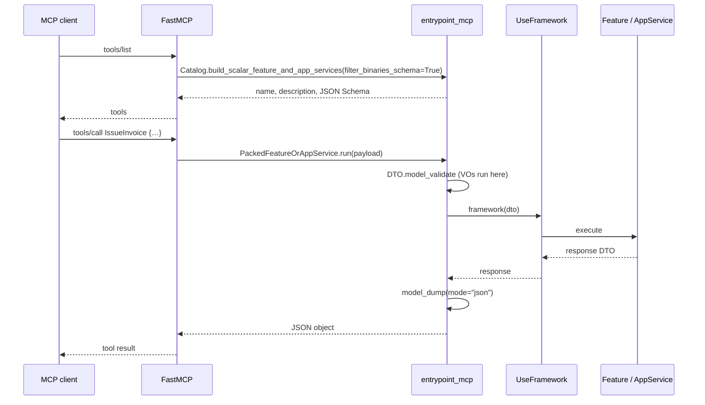

# `entrypoint_mcp` — bus catalog as MCP tools

**`entrypoint_mcp`** is the shipped feature: take a `UseFramework` instance and publish its Features / ApplicationServices as MCP tools. Docstrings contextualize the LLM (`tools/list`); `tools/call` is `framework(dto)`.

This is **not** a generic “entrypoints” product. REST is another host. JSON-RPC is **[`entrypoint_rpc`](./entrypoint_rpc.md)**.

The domain does not know MCP exists. There is no `expose_mcp=True` on a Feature. The bus is the catalog; `entrypoint_mcp` is the MCP host.

```
entrypoint_mcp (this feature)     Application                 Domain
────────────────────────────      ────────────                ──────
stdio / MCP HTTP                  UseFramework                Feature
(FastMCP extra)                   FeatureBus                  ApplicationService
                                  registries                  DataTransferObject
Python remains: framework(dto)                                ValueObject
```

Real SDK evaluation (SIAT SOAP, not Greeting): **[entrypoint_mcp_use_case.md](./entrypoint_mcp_use_case.md)**.

`build_documentation(...)` is a **read-only catalog**. `entrypoint_mcp` is **live** `tools/call`. Both read the same registries.

Package path: `sincpro_framework.entrypoints.mcp` (`build_mcp_server`, `Entrypoint`). The **feature name** in docs and product language is `entrypoint_mcp`.

The bus projection is `Catalog` / `PackedFeatureOrAppService` (`entrypoints/catalog.py`), built on `sincpro_framework.introspection` (features/app_services registries — shared with `generate_documentation`). This host only binds FastMCP.

---

## Why this host exists

Hexagonal architecture (`sincpro_architecture_guidelines`, layer `entrypoints/`): the MCP adapter receives JSON, calls the bus, returns JSON. It does not own business rules.

Sincpro SDKs already expose Python:

```python
result = siat_soap_sdk(SomeCommand(...), SomeResponse)
```

`entrypoint_mcp` is that call over MCP. Without it, every SDK would invent its own FastMCP mapping and leak transport types into Features.

---

## Public API

```python
from sincpro_framework.entrypoints.mcp import build_mcp_server, Entrypoint

# Default — every JSON-safe Feature and ApplicationService becomes a tool
build_mcp_server(siat_soap_sdk).run()

# Optional policies
Entrypoint(siat_soap_sdk).include(IssueInvoice).exclude(InternalDebug).run()
```

```bash
pip install sincpro-framework[mcp]
```

`fastmcp` is optional. Missing extra → `ImportError` that names `sincpro-framework[mcp]`. The rest of the framework does not depend on FastMCP.

| Symbol | Role |
|---|---|
| `build_mcp_server(instance)` | Composition root. Collect tools, skip binary DTOs, return a FastMCP server. |
| `Entrypoint(instance)` | Same projection with `include` / `exclude` / `wrap`. |
| `Entrypoint.tools()` | In-process `PackedFeatureOrAppService` DTOs (tests, LangChain). |
| `Entrypoint.to_callables()` | `name → payload dict → result dict`. No FastMCP required. |
| `Entrypoint.run(**kwargs)` | Start the host. Omit transport = stdio. `transport="http"` = MCP Streamable HTTP at `/mcp` (not REST). |

---

## Projection: bus → PackedFeatureOrAppService

A `PackedFeatureOrAppService` is a `DataTransferObject` that packages one `introspection.FeatureOrAppServiceMetadata` for a JSON wire (shared with `entrypoint_rpc`; this host maps it to an MCP tool):

| Field | Source |
|---|---|
| `name` | DTO class name (`IssueInvoice`) — the bus key |
| `layer` | `"features"` or `"app_services"` — the bus's own vocabulary |
| `description` | LLM instruction (see below) |
| `dto` | Input DTO type |
| `json_schema` | `dto.model_json_schema()` |
| `run` | Bound callable: JSON object → `framework(dto)` → JSON object |

Both Features **and** ApplicationServices become MCP tools by default. Value Objects are **field types**, never tools.

### Instruction (description)

The host must not publish the inherited `Feature` / `ApplicationService` base essay. Resolution:

1. Feature/ApplicationService class **own** docstring (`cls.__dict__['__doc__']`, not inherited).
2. Else the `execute` method's **own** docstring.
3. Else the input DTO's **own** docstring.
4. Final: DTO class name.

That string is what the LLM reads on `tools/list` before it decides to `tools/call`. Write it as an instruction: **what the tool does, when to use it, what it does not do**. Do not restate parameter types (JSON Schema already has them). Do not use Args/Returns.

Attribute docstrings and `Field(description=...)` on the DTO feed JSON Schema properties (Pydantic `use_attribute_docstrings=True`). They describe **fields** — the arguments the model fills on execute — not the tool.

```python
class CommandVerifyInvoiceState(DataTransferObject):
    cuf: str
    """CUF returned by CommandGenerateCUF. Hex string, no spaces."""
    environment: SIATEnvironment
    """SIAT environment code (1 test, 2 production), not the enum member name."""


@siat_soap_sdk.feature(CommandVerifyInvoiceState)
class VerifyInvoiceStateSiat(Feature):
    """Ask SIAT the current state of an invoice by CUF.

    Use after reception. Requires cuis/cufd already issued for this NIT.
    Does not send XML.
    """
```

A class with only comments inside `execute` (no `__doc__`) publishes the DTO name. Fine for Python callers; poor for an agent choosing among 70 SIAT tools.

### JSON Schema and Value Objects

`model_json_schema()` is the MCP input schema. A `ValueObject` stays a primitive on the wire (`int`, `str`, …) with `title` set to the VO name (`NIT`, `Email`). On `tools/call`:

1. JSON payload → `dto.model_validate(payload)`.
2. Pydantic hydrates fields; VO `__get_pydantic_core_schema__` runs `validate_fn`.
3. `framework(dto)` executes the Feature / ApplicationService (middleware, tracing, error handlers — unchanged).
4. Response `model_dump(mode="json")` so VOs leave as primitives.

### Binary DTOs

MCP JSON cannot carry `bytes` / `format: binary|byte`. Those tools are **skipped** at `server()` time with a warning. They remain callable in-process via `framework(dto)`. `to_callables()` still includes them; the FastMCP host does not.

---

## Execution flow



Nothing in `execute` changes. `entrypoint_mcp` is a serializer in front of the bus.

---

## Optional policies

Default: `build_mcp_server(instance)` — full JSON-safe catalog.

| Policy | Effect |
|---|---|
| `include(*dtos)` | Allow-list by DTO class or name. |
| `exclude(*dtos)` | Drop from the catalog. |
| `wrap(dto, wrapper)` | Decorate one `run` (auth, audit, extra logging). |

There is **no runtime on/off flag** in this iteration. Shipping MCP is a process decision (`pip install …[mcp]` + `build_mcp_server(…).run()`), not a Feature flag.

---

## Module map

```
sincpro_framework/
├── introspection/                    # shared: bus → FeatureOrAppServiceMetadata/DtoMetadata (name, type, own-docstring description)
└── entrypoints/
    ├── scalar_executor.py            # shared: Scalar (dict) in/out execution against a UseFramework
    ├── json_utils.py                # shared: DTO JSON Schema + binary-field detection ($defs/$ref aware)
    ├── catalog.py                    # shared: FeatureOrAppServiceMetadata → PackedFeatureOrAppService
    └── mcp/                          # entrypoint_mcp
        ├── __init__.py               # re-exports Entrypoint, build_mcp_server
        ├── mcp.py                    # FastMCP-specific wire: fastmcp_callable
        └── entrypoint.py             # orchestrates catalog.py + mcp.py — the FastMCP facade
```

Callees above callers, public API last (`sincpro_coding_style` Principle 3). `__init__.py` files re-export only.

`introspection` describes what exists (own-docstring resolution lives there, not here). `scalar_executor.py` is the boundary that marshals a Scalar (`dict[str, Any]`) into a DTO call and back — `UseFramework.__call__` itself never learns about dicts or JSON, only typed DTOs; that stays a wire concern, isolated here rather than pushed into `use_bus.py`. `json_utils.py` answers one question — can this DTO travel as JSON — by walking Pydantic's `model_json_schema()` tree (`$defs`/`$ref`/`items`/`additionalProperties`/`anyOf` included, so a `bytes` field nested inside a submodel, list, dict, or Optional is still caught). `catalog.py` packages a described handler into a `PackedFeatureOrAppService` for a JSON wire using those two — it does no reflection on classes and no JSON Schema walking itself, and is usable without FastMCP, shared with `entrypoint_rpc`. `mcp.py` is the FastMCP-only wire: keyword-only signature from DTO fields so FastMCP advertises typed parameters. `entrypoint.py` is the thin orchestrator — every protocol under `entrypoints/` follows this same `entrypoint.py` + `{protocol}.py` split (see `entrypoint_rpc.md`).

---

## Constraints (do not regress)

| Rule | Why |
|---|---|
| No `expose_mcp` / transport flags on Feature or ApplicationService | Domain must not know the host (hexagonal). |
| Do not put FastMCP-specific code (`Entrypoint`, `fastmcp_callable`) on `entrypoints/` root | Root only holds the shared, protocol-agnostic `Catalog` / `PackedFeatureOrAppService`. |
| No implementation in `__init__.py` | Re-exports only. |
| Do not treat Value Objects as tools | They are field types; JSON hydrates them. |
| Do not skip ApplicationServices | Both layers are tools by default. |
| Python 3.12 only | `list[str]`, `X \| None`, `Self` — no `from __future__ import annotations`. |
| `fastmcp` stays an extra | Core bus must install without an MCP stack. |

---

## How this differs from auto-documentation

| | `build_documentation` | `entrypoint_mcp` |
|---|---|---|
| Direction | Read registries, write Markdown / JSON | Read registries, **execute** |
| Consumer | Humans, MkDocs, embedding indexes | Agents, Cursor, Claude Desktop, LangChain |
| Schema | Generated docs | Live `tools/list` + `tools/call` |
| Side effects | None | Same as `framework(dto)` |

If a Feature is safe to call from Python, it is the same operation over MCP. Authorization, if needed, belongs in `wrap` or in the process that hosts the server — not in the Feature.

---

## FastMCP 3 binding

The extra is `fastmcp >= 3.0,<4` (lock: 3.4.7). FastMCP 4 is prerelease; do not float onto it.

After `@framework.feature` / `@framework.app_service`, the bus already has the catalog. `entrypoint_mcp` does **not** invent a second schema. It builds a typed function whose signature is the DTO fields, then registers it with the FastMCP 3 public API:

```python
mcp.tool(fn, name=dto_name, description=instruction, tags={layer})
```

That is the documented “direct function call” form (`server.tool(my_function, name="custom_name")`). FastMCP then:

1. Uses `fn.__name__` / `name=` as the tool name.
2. Uses the docstring / `description=` as the LLM instruction.
3. Generates input JSON Schema from **type annotations** (Pydantic models, Value Objects, `Field`, unions). `$ref` is inlined at serve-time for Cursor / Claude Desktop.
4. On `tools/call`, coerces JSON (flexible validation by default) and invokes `fn`.
5. Serializes a returned `dict` or Pydantic model as structured content.

Fields are flattened on purpose. A single parameter typed as the DTO (`def tool(payload: ChargePayment)`) would nest arguments under `payload` in MCP. Agents should fill `nit`, `email`, `amount` at the top level — the same shape as `framework(ChargePayment(...))`.

`tags={layer}` is `"features"` or `"app_services"`. FastMCP can filter with `include_tags` / `exclude_tags` on the server; we do not set that by default (full catalog).

`.run()` with no args is stdio (Cursor / Claude Desktop / CLI). HTTP is still MCP:

```python
build_mcp_server(sdk).run()                                      # stdio
build_mcp_server(sdk).run(transport="http", port=8000)           # http://127.0.0.1:8000/mcp
Entrypoint(sdk).include(IssueInvoice).run(transport="http")      # same catalog, fluent
```

That URL speaks **Streamable HTTP MCP** (`tools/list`, `tools/call`). It is not OpenAPI, not `POST /invoices`.

SSE (`transport="sse"`) exists for old clients. Do not use it for new work.

---

## Verification

- Unit: `tests/test_entrypoints.py` — catalog (Feature + ApplicationService), own docstring (not base class), VO roundtrip + `validate_fn`, `Field` / attribute descriptions in schema, include/exclude/wrap, binary skip, extra import contract.
- Manual: `pip install sincpro-framework[mcp]`, `build_mcp_server(your_sdk).run()`, point Cursor / Claude Desktop at stdio, call one Feature and one ApplicationService.
- Failure mode: a new DTO with `bytes` silently missing from MCP is expected (warning log). A Feature whose docstring is only inherited from `Feature` will publish a useless description — add a class or `execute` docstring.

---

## SDK recipe

In the bounded context package (not inside domain Features):

```python
# your_sdk/entrypoint_mcp.py  — or entrypoints/mcp.py; the feature is still entrypoint_mcp
from sincpro_framework.entrypoints.mcp import build_mcp_server
from your_sdk import your_framework

def main() -> None:
    build_mcp_server(your_framework).run()  # stdio; use transport="http" for a URL

if __name__ == "__main__":
    main()
```

Cursor / Claude Desktop (stdio):

```json
{
  "mcpServers": {
    "your-sdk": {
      "command": "python",
      "args": ["-m", "your_sdk.entrypoint_mcp"]
    }
  }
}
```

The SDK still has no MCP types in `domain/` or `services/`. `entrypoint_mcp` is the adapter.
