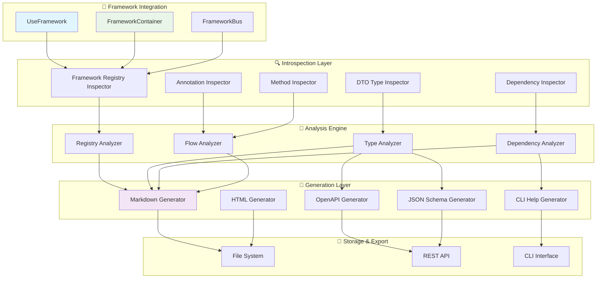

# 🎨 Auto-Documentation System - Technical Design Document

## 📋 Document Information

- **Title**: Sistema de Auto-Documentación - Diseño Técnico Detallado
- **Version**: 1.0
- **Date**: July 29, 2025
- **Related PRD**: [PRD_04: Auto-Documentation Generator](../prd/PRD_04_auto-documentation.md)
- **Architecture Reference**: [ARCHITECTURE.md](../architecture/ARCHITECTURE.md)

---

## 🎯 Executive Summary

Este documento define el diseño técnico detallado para implementar el sistema de auto-documentación del Sincpro Framework. El sistema utilizará introspección avanzada del IoC container y los registries para generar documentación completa y actualizada automáticamente.

### Objetivos del Diseño

1. **Introspección Completa**: Extraer información de todos los componentes registrados
2. **Generación Multi-formato**: Markdown, OpenAPI, JSON Schema, CLI Help
3. **Integración Nativa**: Métodos integrados en `UseFramework`
4. **Extensibilidad**: Sistema de plugins para nuevos formatos
5. **Performance**: Introspección rápida sin afectar runtime

---

## 🏗️ Architecture Overview

### Sistema de Capas



---

## 📊 Component Design

### 1. Framework Registry Inspector

#### 1.1 Core Inspector Class

```python
# sincpro_framework/auto_docs/introspection/framework_inspector.py
from typing import Dict, List, Any, Optional, Type, get_type_hints
from dataclasses import dataclass, field
import inspect
from datetime import datetime

@dataclass
class ComponentMetadata:
    """Metadata común para todos los componentes"""
    name: str
    class_name: str
    module_path: str
    file_path: Optional[str] = None
    line_number: Optional[int] = None
    docstring: Optional[str] = None
    created_at: datetime = field(default_factory=datetime.now)

@dataclass
class DTOMetadata(ComponentMetadata):
    """Metadata específica para DTOs"""
    fields: Dict[str, Any] = field(default_factory=dict)
    validators: List[str] = field(default_factory=list)
    examples: List[Dict[str, Any]] = field(default_factory=list)
    is_input: bool = True
    is_output: bool = False

@dataclass
class DependencyMetadata:
    """Metadata para dependencias inyectadas"""
    name: str
    type_annotation: str
    is_optional: bool = False
    default_value: Any = None
    description: Optional[str] = None
    source: str = "ioc"  # ioc, dynamic, factory

@dataclass
class FeatureMetadata(ComponentMetadata):
    """Metadata específica para Features"""
    input_dto: Optional[DTOMetadata] = None
    output_dto: Optional[DTOMetadata] = None
    dependencies: List[DependencyMetadata] = field(default_factory=list)
    execution_time_ms: Optional[float] = None
    error_handlers: List[str] = field(default_factory=list)

@dataclass
class ApplicationServiceMetadata(ComponentMetadata):
    """Metadata específica para ApplicationServices"""
    input_dto: Optional[DTOMetadata] = None
    output_dto: Optional[DTOMetadata] = None
    dependencies: List[DependencyMetadata] = field(default_factory=list)
    orchestrated_features: List[str] = field(default_factory=list)
    workflow_description: Optional[str] = None

@dataclass
class FrameworkIntrospectionResult:
    """Resultado completo de introspección"""
    framework_name: str
    version: str
    features: Dict[str, FeatureMetadata] = field(default_factory=dict)
    app_services: Dict[str, ApplicationServiceMetadata] = field(default_factory=dict)
    dtos: Dict[str, DTOMetadata] = field(default_factory=dict)
    global_dependencies: Dict[str, DependencyMetadata] = field(default_factory=dict)
    introspection_timestamp: datetime = field(default_factory=datetime.now)
    
    @property
    def total_components(self) -> int:
        return len(self.features) + len(self.app_services)
    
    @property
    def summary(self) -> Dict[str, Any]:
        return {
            "framework_name": self.framework_name,
            "total_features": len(self.features),
            "total_app_services": len(self.app_services),
            "total_dtos": len(self.dtos),
            "total_dependencies": len(self.global_dependencies),
            "introspection_date": self.introspection_timestamp.isoformat()
        }
```

#### 1.2 Registry Inspector Implementation

```python
class FrameworkRegistryInspector:
    """Inspector principal para el framework y sus registries"""
    
    def __init__(self, framework: "UseFramework"):
        self.framework = framework
        self.result = FrameworkIntrospectionResult(
            framework_name=getattr(framework, '_logger_name', 'unknown'),
            version=self._get_framework_version()
        )
    
    def inspect_complete_framework(self) -> FrameworkIntrospectionResult:
        """Realiza introspección completa del framework"""
        
        # Asegurar que el framework está construido
        if not self._is_framework_built():
            self.framework.build_root_bus()
        
        # Inspeccionar componentes principales
        self._inspect_features()
        self._inspect_application_services()
        self._inspect_global_dependencies()
        
        # Análisis de relaciones
        self._analyze_component_relationships()
        
        return self.result
    
    def _inspect_features(self):
        """Inspecciona todos los Features registrados"""
        if not hasattr(self.framework, 'bus') or not hasattr(self.framework.bus, 'feature_bus'):
            return
        
        feature_registry = self._get_feature_registry()
        
        for dto_name, feature_instance in feature_registry.items():
            try:
                feature_metadata = self._extract_feature_metadata(dto_name, feature_instance)
                self.result.features[dto_name] = feature_metadata
                
                # Registrar DTOs relacionados
                if feature_metadata.input_dto:
                    self.result.dtos[feature_metadata.input_dto.name] = feature_metadata.input_dto
                if feature_metadata.output_dto:
                    self.result.dtos[feature_metadata.output_dto.name] = feature_metadata.output_dto
                    
            except Exception as e:
                # Log error pero continúa con otros features
                print(f"Error inspecting feature {dto_name}: {e}")
    
    def _inspect_application_services(self):
        """Inspecciona todos los ApplicationServices registrados"""
        if not hasattr(self.framework, 'bus') or not hasattr(self.framework.bus, 'app_service_bus'):
            return
        
        app_service_registry = self._get_app_service_registry()
        
        for dto_name, service_instance in app_service_registry.items():
            try:
                service_metadata = self._extract_app_service_metadata(dto_name, service_instance)
                self.result.app_services[dto_name] = service_metadata
                
                # Registrar DTOs relacionados
                if service_metadata.input_dto:
                    self.result.dtos[service_metadata.input_dto.name] = service_metadata.input_dto
                if service_metadata.output_dto:
                    self.result.dtos[service_metadata.output_dto.name] = service_metadata.output_dto
                    
            except Exception as e:
                print(f"Error inspecting app service {dto_name}: {e}")
    
    def _extract_feature_metadata(self, dto_name: str, feature_instance) -> FeatureMetadata:
        """Extrae metadata completa de un Feature"""
        
        feature_class = feature_instance.__class__
        
        # Metadata básica
        metadata = FeatureMetadata(
            name=dto_name,
            class_name=feature_class.__name__,
            module_path=feature_class.__module__,
            file_path=self._get_source_file(feature_class),
            line_number=self._get_source_line(feature_class),
            docstring=self._extract_docstring(feature_class)
        )
        
        # Análisis del método execute
        execute_method = getattr(feature_instance, 'execute', None)
        if execute_method:
            type_hints = get_type_hints(execute_method)
            
            # DTO de entrada
            if 'dto' in type_hints:
                input_dto_class = type_hints['dto']
                metadata.input_dto = self._extract_dto_metadata(dto_name, input_dto_class, is_input=True)
            
            # DTO de salida
            return_type = type_hints.get('return')
            if return_type and return_type != type(None):
                output_dto_name = f"{dto_name}Response"
                metadata.output_dto = self._extract_dto_metadata(output_dto_name, return_type, is_output=True)
        
        # Dependencias inyectadas
        metadata.dependencies = self._extract_dependencies(feature_instance)
        
        return metadata
    
    def _extract_dto_metadata(self, name: str, dto_class: Type, 
                            is_input: bool = False, is_output: bool = False) -> DTOMetadata:
        """Extrae metadata completa de un DTO"""
        
        if not dto_class:
            return None
        
        metadata = DTOMetadata(
            name=name,
            class_name=dto_class.__name__,
            module_path=dto_class.__module__,
            file_path=self._get_source_file(dto_class),
            line_number=self._get_source_line(dto_class),
            docstring=self._extract_docstring(dto_class),
            is_input=is_input,
            is_output=is_output
        )
        
        # Extraer campos si es un modelo Pydantic
        if hasattr(dto_class, 'model_fields'):
            metadata.fields = self._extract_pydantic_fields(dto_class)
            metadata.examples = self._generate_dto_examples(dto_class)
        
        return metadata
    
    def _extract_pydantic_fields(self, dto_class: Type) -> Dict[str, Any]:
        """Extrae campos de un modelo Pydantic v2"""
        fields = {}
        
        for field_name, field_info in dto_class.model_fields.items():
            fields[field_name] = {
                'type': str(field_info.annotation),
                'required': field_info.is_required(),
                'default': field_info.default if field_info.default is not None else None,
                'description': field_info.description,
                'constraints': self._extract_field_constraints(field_info)
            }
        
        return fields
    
    def _extract_dependencies(self, instance) -> List[DependencyMetadata]:
        """Extrae dependencias inyectadas de una instancia"""
        dependencies = []
        
        # Obtener type hints de la clase
        type_hints = get_type_hints(instance.__class__)
        
        # Analizar atributos que no son métodos
        for attr_name in dir(instance):
            if (not attr_name.startswith('_') and 
                not callable(getattr(instance, attr_name)) and
                attr_name not in ['execute', 'feature_bus', 'app_service_bus']):
                
                attr_value = getattr(instance, attr_name)
                type_hint = type_hints.get(attr_name, type(attr_value))
                
                dependency = DependencyMetadata(
                    name=attr_name,
                    type_annotation=str(type_hint),
                    is_optional=self._is_optional_type(type_hint),
                    description=f"Injected dependency: {attr_name}"
                )
                dependencies.append(dependency)
        
        return dependencies
    
    def _get_feature_registry(self) -> Dict[str, Any]:
        """Obtiene el registry de Features del framework"""
        try:
            return self.framework.bus.feature_bus.feature_registry
        except AttributeError:
            return {}
    
    def _get_app_service_registry(self) -> Dict[str, Any]:
        """Obtiene el registry de ApplicationServices del framework"""
        try:
            return self.framework.bus.app_service_bus.app_service_registry
        except AttributeError:
            return {}
    
    def _is_framework_built(self) -> bool:
        """Verifica si el framework ya fue construido"""
        return hasattr(self.framework, 'bus') and self.framework.bus is not None
    
    def _get_framework_version(self) -> str:
        """Obtiene la versión del framework"""
        try:
            import sincpro_framework
            return getattr(sincpro_framework, '__version__', 'unknown')
        except:
            return 'unknown'
    
    def _get_source_file(self, cls: Type) -> Optional[str]:
        """Obtiene el archivo fuente de una clase"""
        try:
            return inspect.getfile(cls)
        except:
            return None
    
    def _get_source_line(self, cls: Type) -> Optional[int]:
        """Obtiene la línea de definición de una clase"""
        try:
            return inspect.getsourcelines(cls)[1]
        except:
            return None
    
    def _extract_docstring(self, cls: Type) -> Optional[str]:
        """Extrae y limpia el docstring de una clase"""
        if cls and cls.__doc__:
            return inspect.cleandoc(cls.__doc__)
        return None
```

### 2. Documentation Generators

#### 2.1 Base Generator

```python
# sincpro_framework/auto_docs/generators/base_generator.py
from abc import ABC, abstractmethod
from typing import Any, Dict, Optional
from ..introspection.framework_inspector import FrameworkIntrospectionResult

class BaseDocumentationGenerator(ABC):
    """Generador base para documentación"""
    
    def __init__(self, introspection_result: FrameworkIntrospectionResult):
        self.result = introspection_result
        self.config = self._get_default_config()
    
    @abstractmethod
    def generate(self) -> str:
        """Genera la documentación en el formato específico"""
        pass
    
    @abstractmethod
    def save_to_file(self, output_path: str) -> str:
        """Guarda la documentación en un archivo"""
        pass
    
    def _get_default_config(self) -> Dict[str, Any]:
        """Configuración por defecto del generador"""
        return {
            'include_examples': True,
            'include_dependencies': True,
            'include_type_details': True,
            'include_source_links': False
        }
    
    def configure(self, **kwargs):
        """Configura el generador"""
        self.config.update(kwargs)
        return self
```

#### 2.2 Markdown Generator

```python
# sincpro_framework/auto_docs/generators/markdown_generator.py
from typing import List, Dict, Any
from datetime import datetime
from .base_generator import BaseDocumentationGenerator
from ..introspection.framework_inspector import FeatureMetadata, ApplicationServiceMetadata, DTOMetadata

class MarkdownDocumentationGenerator(BaseDocumentationGenerator):
    """Generador de documentación en formato Markdown"""
    
    def generate(self) -> str:
        """Genera documentación completa en Markdown"""
        sections = [
            self._generate_header(),
            self._generate_overview(),
            self._generate_table_of_contents(),
            self._generate_features_section(),
            self._generate_app_services_section(),
            self._generate_dtos_section(),
            self._generate_dependencies_section(),
            self._generate_usage_examples(),
            self._generate_footer()
        ]
        
        return '\n\n'.join(filter(None, sections))
    
    def _generate_header(self) -> str:
        """Genera el encabezado del documento"""
        return f"""# 📚 {self.result.framework_name.title()} - Auto-Generated Documentation

> **⚠️ IMPORTANT**: This documentation is auto-generated from the framework registry.  
> **Last updated**: {self.result.introspection_timestamp.strftime('%Y-%m-%d %H:%M:%S')}  
> **Framework version**: {self.result.version}

---"""
    
    def _generate_overview(self) -> str:
        """Genera la sección de overview"""
        summary = self.result.summary
        
        return f"""## 📊 Framework Overview

This framework contains **{summary['total_features']} Features** and **{summary['total_app_services']} Application Services** 
with a total of **{summary['total_dtos']} DTOs** and **{summary['total_dependencies']} global dependencies**.

### Quick Stats

| Component Type | Count | Description |
|---|---|---|
| **Features** | {summary['total_features']} | Atomic business operations (Command/Query handlers) |
| **Application Services** | {summary['total_app_services']} | Complex workflows orchestrating multiple Features |
| **DTOs** | {summary['total_dtos']} | Data Transfer Objects for input/output |
| **Global Dependencies** | {summary['total_dependencies']} | Shared dependencies injected across components |

### Architecture Summary

This framework follows the **Sincpro Framework** architecture patterns:
- **CQRS**: Commands and Queries handled through DTOs
- **Hexagonal Architecture**: Clear separation between business logic and infrastructure
- **Dependency Injection**: IoC container managing all dependencies
- **Registry Pattern**: Dynamic component registration and resolution"""
    
    def _generate_table_of_contents(self) -> str:
        """Genera tabla de contenidos"""
        return """## 📋 Table of Contents

1. [Framework Overview](#-framework-overview)
2. [Features](#-features)
3. [Application Services](#-application-services)
4. [Data Transfer Objects (DTOs)](#-data-transfer-objects-dtos)
5. [Dependencies](#-dependencies)
6. [Usage Examples](#-usage-examples)

---"""
    
    def _generate_features_section(self) -> str:
        """Genera la sección de Features"""
        if not self.result.features:
            return "## ⚡ Features\n\nNo features registered in this framework."
        
        sections = ["## ⚡ Features\n"]
        sections.append("Features are atomic business operations that handle single responsibilities.\n")
        
        for dto_name, feature in self.result.features.items():
            sections.append(self._generate_feature_documentation(feature))
        
        return '\n'.join(sections)
    
    def _generate_feature_documentation(self, feature: FeatureMetadata) -> str:
        """Genera documentación para un Feature específico"""
        
        # Header
        doc = f"### 🔧 {feature.name}\n\n"
        
        # Basic info
        doc += f"**Class**: `{feature.class_name}`  \n"
        doc += f"**Module**: `{feature.module_path}`  \n"
        
        if feature.file_path and self.config.get('include_source_links', False):
            doc += f"**Source**: [`{feature.file_path}`]({feature.file_path})\n"
        
        doc += "\n"
        
        # Description
        if feature.docstring:
            doc += f"{feature.docstring}\n\n"
        else:
            doc += "*No description available.*\n\n"
        
        # Input/Output
        doc += "#### Input/Output\n\n"
        
        if feature.input_dto:
            doc += f"**Input**: `{feature.input_dto.name}`  \n"
            if self.config.get('include_type_details', True):
                doc += self._generate_dto_summary_table(feature.input_dto)
        else:
            doc += "**Input**: *No specific input DTO*\n"
        
        if feature.output_dto:
            doc += f"**Output**: `{feature.output_dto.name}`  \n"
            if self.config.get('include_type_details', True):
                doc += self._generate_dto_summary_table(feature.output_dto)
        else:
            doc += "**Output**: *Dynamic return type*\n"
        
        # Dependencies
        if self.config.get('include_dependencies', True) and feature.dependencies:
            doc += "\n#### Dependencies\n\n"
            for dep in feature.dependencies:
                doc += f"- **{dep.name}**: `{dep.type_annotation}`"
                if dep.description:
                    doc += f" - {dep.description}"
                doc += "\n"
        
        # Usage example
        if self.config.get('include_examples', True):
            doc += self._generate_feature_usage_example(feature)
        
        doc += "\n---\n"
        
        return doc
    
    def _generate_dto_summary_table(self, dto: DTOMetadata) -> str:
        """Genera tabla resumen para un DTO"""
        if not dto.fields:
            return "*No fields defined*\n"
        
        table = "\n| Field | Type | Required |\n|---|---|---|\n"
        
        for field_name, field_info in dto.fields.items():
            required = "✅" if field_info.get('required', False) else "❌"
            table += f"| `{field_name}` | `{field_info['type']}` | {required} |\n"
        
        return table + "\n"
    
    def _generate_feature_usage_example(self, feature: FeatureMetadata) -> str:
        """Genera ejemplo de uso para un Feature"""
        
        example = "\n#### Usage Example\n\n```python\n"
        
        if feature.input_dto and feature.input_dto.examples:
            example_data = feature.input_dto.examples[0]
            example += f"# Create input DTO\n"
            example += f"dto = {feature.input_dto.name}(\n"
            for key, value in example_data.items():
                example += f"    {key}={repr(value)},\n"
            example += ")\n\n"
        else:
            example += f"# Create your input DTO\n"
            example += f"dto = {feature.input_dto.name if feature.input_dto else 'YourDTO'}(...)\n\n"
        
        example += "# Execute through framework\n"
        example += "result = framework(dto)\n"
        example += "print(result)\n"
        example += "```\n"
        
        return example
    
    def save_to_file(self, output_path: str = "FRAMEWORK_DOCS.md") -> str:
        """Guarda la documentación en un archivo"""
        content = self.generate()
        
        with open(output_path, 'w', encoding='utf-8') as f:
            f.write(content)
        
        return output_path
```

### 3. Integration Strategy

#### 3.1 UseFramework Integration

```python
# Extensión de sincpro_framework/use_bus.py
from typing import Optional, Dict, Any
from .auto_docs.introspection.framework_inspector import FrameworkRegistryInspector
from .auto_docs.generators.markdown_generator import MarkdownDocumentationGenerator

class UseFramework:
    def __init__(self, logger_name: str = "sincpro"):
        # ... código existente ...
        self._introspector: Optional[FrameworkRegistryInspector] = None
        self._auto_docs_config: Dict[str, Any] = {}
    
    @property
    def introspector(self) -> FrameworkRegistryInspector:
        """Lazy loading del introspector"""
        if self._introspector is None:
            self._introspector = FrameworkRegistryInspector(self)
        return self._introspector
    
    def generate_documentation(self, output_path: str = "FRAMEWORK_DOCS.md", 
                             format: str = "markdown", **config) -> str:
        """
        Genera documentación automática del framework
        
        Args:
            output_path: Ruta donde guardar la documentación
            format: Formato de salida ('markdown', 'openapi', 'json')
            **config: Configuración específica del generador
        
        Returns:
            Ruta del archivo generado
        """
        
        # Realizar introspección
        introspection_result = self.introspector.inspect_complete_framework()
        
        if format == "markdown":
            generator = MarkdownDocumentationGenerator(introspection_result)
            generator.configure(**config)
            return generator.save_to_file(output_path)
        
        elif format == "openapi":
            # TODO: Implementar OpenAPIGenerator
            raise NotImplementedError("OpenAPI generator not yet implemented")
        
        else:
            raise ValueError(f"Unknown format: {format}")
    
    def get_framework_summary(self) -> Dict[str, Any]:
        """Obtiene resumen rápido del framework"""
        introspection_result = self.introspector.inspect_complete_framework()
        return introspection_result.summary
    
    def print_framework_summary(self):
        """Imprime resumen del framework en consola"""
        summary = self.get_framework_summary()
        
        print(f"🚌 Framework: {summary['framework_name']}")
        print(f"⚡ Features: {summary['total_features']}")
        print(f"🎯 Application Services: {summary['total_app_services']}")
        print(f"📝 DTOs: {summary['total_dtos']}")
        print(f"🔧 Dependencies: {summary['total_dependencies']}")
        print(f"📅 Last introspection: {summary['introspection_date']}")
    
    def list_registered_components(self) -> Dict[str, List[str]]:
        """Lista todos los componentes registrados"""
        introspection_result = self.introspector.inspect_complete_framework()
        
        return {
            "features": list(introspection_result.features.keys()),
            "app_services": list(introspection_result.app_services.keys()),
            "dtos": list(introspection_result.dtos.keys())
        }
```

---

## 📋 Implementation Strategy

### Phase 1: Core Introspection (Days 1-3)

#### Day 1: Base Infrastructure
- [ ] Crear estructura de directorios `auto_docs/`
- [ ] Implementar `ComponentMetadata` y clases de datos
- [ ] Crear `BaseDocumentationGenerator`
- [ ] Tests unitarios básicos

#### Day 2: Framework Inspector
- [ ] Implementar `FrameworkRegistryInspector`
- [ ] Métodos de extracción de Features y ApplicationServices
- [ ] Extracción de metadata de DTOs
- [ ] Tests de introspección

#### Day 3: Dependency Analysis
- [ ] Análisis de dependencias inyectadas
- [ ] Detección de relaciones entre componentes
- [ ] Validación de la introspección completa

### Phase 2: Documentation Generation (Days 4-6)

#### Day 4: Markdown Generator
- [ ] Implementar `MarkdownDocumentationGenerator`
- [ ] Templates para Features y ApplicationServices
- [ ] Generación de ejemplos automáticos

#### Day 5: Advanced Features
- [ ] Tabla de contenidos automática
- [ ] Links internos y referencias cruzadas
- [ ] Configuración de generadores

#### Day 6: Integration & Testing
- [ ] Integración con `UseFramework`
- [ ] CLI básico para generación
- [ ] Tests de integración completos

### Phase 3: Polish & Extensions (Days 7-10)

#### Day 7-8: OpenAPI Generator
- [ ] Implementar `OpenAPIGenerator` 
- [ ] Conversión de DTOs a JSON Schema
- [ ] Endpoints REST ficticios para Features

#### Day 9-10: Documentation & Examples
- [ ] Documentación del sistema de auto-docs
- [ ] Ejemplos de uso completos
- [ ] Integración con Poetry/CI

---

## 🧪 Testing Strategy

### 1. Unit Tests

```python
# tests/auto_docs/test_framework_inspector.py
import pytest
from sincpro_framework import UseFramework
from sincpro_framework.auto_docs.introspection.framework_inspector import FrameworkRegistryInspector

def test_framework_inspector_creation():
    framework = UseFramework("test")
    inspector = FrameworkRegistryInspector(framework)
    assert inspector.framework == framework

def test_introspection_with_features():
    # Crear framework con features de prueba
    framework = create_test_framework_with_features()
    
    inspector = FrameworkRegistryInspector(framework)
    result = inspector.inspect_complete_framework()
    
    assert len(result.features) > 0
    assert result.framework_name == "test"

def test_dto_metadata_extraction():
    # Test específico para extracción de DTOs
    pass
```

### 2. Integration Tests

```python
# tests/auto_docs/test_integration.py
def test_full_documentation_generation():
    # Test completo de generación de documentación
    framework = create_complex_test_framework()
    
    # Generar documentación
    doc_path = framework.generate_documentation("/tmp/test_docs.md")
    
    # Verificar que el archivo existe y tiene contenido válido
    assert os.path.exists(doc_path)
    
    with open(doc_path) as f:
        content = f.read()
        assert "Framework Overview" in content
        assert "Features" in content
```

### 3. Performance Tests

```python
def test_introspection_performance():
    # Verificar que la introspección es rápida
    framework = create_large_test_framework()  # 100+ features
    
    start_time = time.time()
    framework.get_framework_summary()
    end_time = time.time()
    
    assert (end_time - start_time) < 5.0  # Menos de 5 segundos
```

---

## 📦 Project Structure

```
sincpro_framework/
├── auto_docs/
│   ├── __init__.py
│   ├── introspection/
│   │   ├── __init__.py
│   │   ├── framework_inspector.py
│   │   ├── dto_analyzer.py
│   │   └── dependency_analyzer.py
│   ├── generators/
│   │   ├── __init__.py
│   │   ├── base_generator.py
│   │   ├── markdown_generator.py
│   │   ├── openapi_generator.py
│   │   └── json_schema_generator.py
│   ├── cli/
│   │   ├── __init__.py
│   │   └── docs_cli.py
│   └── templates/
│       ├── markdown/
│       └── html/
├── tests/
│   └── auto_docs/
│       ├── test_framework_inspector.py
│       ├── test_generators.py
│       └── test_integration.py
└── examples/
    └── auto_docs_example.py
```

---

## 🔧 Poetry Integration

### 1. Dependencies

```toml
# pyproject.toml additions
[tool.poetry.dependencies]
# Existing dependencies...
click = "^8.1.0"  # For CLI
jinja2 = "^3.1.0"  # For templates (optional)

[tool.poetry.group.dev.dependencies]
# Existing dev dependencies...
```

### 2. Scripts

```toml
[tool.poetry.scripts]
sincpro-docs = "sincpro_framework.auto_docs.cli.docs_cli:main"
```

### 3. CLI Commands

```bash
# Generar documentación
poetry run sincpro-docs generate --framework-module my_app.framework --output docs/api.md

# Inspeccionar framework
poetry run sincpro-docs inspect --framework-module my_app.framework

# Con el framework
poetry run python -c "
from my_app import framework
framework.generate_documentation('docs/my_api.md')
framework.print_framework_summary()
"
```

---

## 📊 Success Metrics

### Development Metrics
- [ ] **Code Coverage**: > 90% en módulos de auto-docs
- [ ] **Performance**: Introspección < 5 segundos para frameworks grandes
- [ ] **Accuracy**: 100% de componentes detectados correctamente

### Usage Metrics
- [ ] **Documentation Quality**: Documentación generada legible y completa
- [ ] **Integration**: Funciona con diferentes configuraciones de framework
- [ ] **Extensibility**: Fácil agregar nuevos generadores

### User Experience
- [ ] **API Simple**: `framework.generate_documentation()` funciona out-of-the-box
- [ ] **CLI Intuitivo**: Comandos claros y bien documentados
- [ ] **Error Handling**: Mensajes de error claros y recovery automático

---

## 🚀 Next Steps

1. **Crear estructura de directorios**
2. **Implementar clases base de metadata**
3. **Desarrollar FrameworkRegistryInspector**
4. **Crear MarkdownDocumentationGenerator**
5. **Integrar con UseFramework**
6. **Escribir tests completos**
7. **Documentar y crear ejemplos**

---

*Technical Design Document - Sincpro Framework Auto-Documentation System*  
*Version 1.0 - July 29, 2025*
