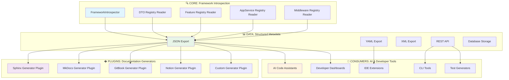

# 🎨 Auto-Documentation System - Technical Design Document

## 📋 Document Information

- **Title**: Sistema de Auto-Documentación - Diseño Técnico Detallado
- **Version**: 2.0 (Actualizada)
- **Date**: July 29, 2025
- **Related PRD**: [PRD_04: Auto-Documentation Generator](../prd/PRD_04_auto-documentation.md)
- **Architecture Reference**: [ARCHITECTURE.md](../architecture/ARCHITECTURE.md)

---

## 🎯 Executive Summary

Este documento define el diseño técnico detallado para implementar el sistema de auto-documentación del Sincpro Framework. El sistema se enfoca en **separar completamente la introspección de la generación**, creando una arquitectura **technology-agnostic** que puede adaptarse a cualquier herramienta de documentación (Markdown, Sphinx, MkDocs, etc.) y ser consumida por IAs y desarrolladores.

### Objetivos del Diseño Actualizado

1. **Introspección Agnóstica**: API unificada para extraer metadata sin depender de formato final
2. **Generación Pluggable**: Sistema de plugins para cualquier tecnología (Sphinx, MkDocs, etc.)
3. **Datos Estructurados**: Formato estándar que sirva para IAs y herramientas automatizadas
4. **Framework Integration**: API simple en `UseFramework` sin acoplamientos
5. **Technology Evolution**: Preparado para adoptar nuevas herramientas sin refactoring

---

## 🏗️ Architecture Overview - Technology Agnostic Design

### Principio de Separación de Responsabilidades



### Arquitectura de 3 Capas Desacopladas

1. **CORE Layer**: Introspección pura sin formato específico
2. **DATA Layer**: Estructuras de datos estándar (JSON/YAML/API)
3. **PLUGIN Layer**: Generadores específicos por tecnología

---

## 📊 Component Design - Technology Agnostic Architecture

### 1. Core Introspection Engine (Technology Independent)

El motor de introspección se enfoca únicamente en **extraer metadata estructurada** sin ninguna dependencia de formato o tecnología de documentación.

#### 1.1 Structured Metadata Classes

```python
# sincpro_framework/generate_documentation/domain/models.py
from typing import Dict, List, Any, Optional, Type, Union
from dataclasses import dataclass, field
from datetime import datetime
from enum import Enum

class ComponentType(Enum):
    """Tipos de componentes del framework"""
    FEATURE = "feature"
    APP_SERVICE = "app_service"
    DTO = "dto"
    MIDDLEWARE = "middleware"
    DEPENDENCY = "dependency"

@dataclass
class ComponentMetadata:
    """Base metadata para todos los componentes - agnóstica de formato"""
    name: str
    component_type: ComponentType
    class_name: str
    module_path: str
    file_path: Optional[str] = None
    line_number: Optional[int] = None
    docstring: Optional[str] = None
    created_at: datetime = field(default_factory=datetime.now)
    tags: List[str] = field(default_factory=list)
    
    def to_dict(self) -> Dict[str, Any]:
        """Serialización agnóstica para cualquier generador"""
        return {
            "name": self.name,
            "component_type": self.component_type.value,
            "class_name": self.class_name,
            "module_path": self.module_path,
            "file_path": self.file_path,
            "line_number": self.line_number,
            "docstring": self.docstring,
            "created_at": self.created_at.isoformat(),
            "tags": self.tags
        }

@dataclass
class DTOMetadata(ComponentMetadata):
    """Metadata agnóstica para DTOs - compatible con cualquier generador"""
    fields: Dict[str, Any] = field(default_factory=dict)
    validators: List[str] = field(default_factory=list)
    examples: List[Dict[str, Any]] = field(default_factory=list)
    is_input: bool = True
    is_output: bool = False
    json_schema: Optional[Dict[str, Any]] = None  # Para OpenAPI/JSON Schema
    
    def __post_init__(self):
        super().__init__()
        self.component_type = ComponentType.DTO

@dataclass
class FeatureMetadata(ComponentMetadata):
    """Metadata agnóstica para Features"""
    input_dto: Optional[DTOMetadata] = None
    output_dto: Optional[DTOMetadata] = None
    dependencies: List[str] = field(default_factory=list)  # Solo nombres, no tipos específicos
    execution_patterns: List[str] = field(default_factory=list)  # Command/Query/etc
    business_rules: List[str] = field(default_factory=list)
    
    def __post_init__(self):
        super().__init__()
        self.component_type = ComponentType.FEATURE

@dataclass
class MiddlewareMetadata(ComponentMetadata):
    """Metadata para Middleware - nuevo en el diseño"""
    order: Optional[int] = None
    applies_to: List[str] = field(default_factory=list)  # DTOs que afecta
    transformations: List[str] = field(default_factory=list)
    validation_rules: List[str] = field(default_factory=list)
    
    def __post_init__(self):
        super().__init__()
        self.component_type = ComponentType.MIDDLEWARE

@dataclass
class FrameworkDocumentationData:
    """Estructura de datos completa - agnóstica de tecnología"""
    framework_name: str
    version: str
    components: Dict[str, ComponentMetadata] = field(default_factory=dict)
    relationships: Dict[str, List[str]] = field(default_factory=dict)
    global_configuration: Dict[str, Any] = field(default_factory=dict)
    introspection_timestamp: datetime = field(default_factory=datetime.now)
    
    def to_json(self) -> Dict[str, Any]:
        """Exportación JSON completa para cualquier generador"""
        return {
            "framework_name": self.framework_name,
            "version": self.version,
            "components": {name: comp.to_dict() for name, comp in self.components.items()},
            "relationships": self.relationships,
            "global_configuration": self.global_configuration,
            "introspection_timestamp": self.introspection_timestamp.isoformat(),
            "statistics": self._get_statistics()
        }
    
    def _get_statistics(self) -> Dict[str, int]:
        """Estadísticas del framework para dashboards/IAs"""
        stats = {}
        for comp_type in ComponentType:
            stats[comp_type.value] = len([c for c in self.components.values() 
                                         if c.component_type == comp_type])
        return stats
    
    def get_components_by_type(self, component_type: ComponentType) -> List[ComponentMetadata]:
        """Filtro por tipo de componente"""
        return [comp for comp in self.components.values() 
                if comp.component_type == component_type]
```

#### 1.2 Technology-Agnostic Introspector

```python
# sincpro_framework/generate_documentation/domain/introspector.py
from typing import Protocol, Dict, Any
from .models import FrameworkDocumentationData

class FrameworkIntrospector(Protocol):
    """Protocol agnóstico - no depende de formato de salida"""
    
    def extract_framework_data(self) -> FrameworkDocumentationData:
        """Extrae toda la metadata del framework en formato estructurado"""
        ...
    
    def extract_component_relationships(self) -> Dict[str, List[str]]:
        """Mapea relaciones entre componentes"""
        ...
    
    def validate_framework_completeness(self) -> Dict[str, Any]:
        """Valida que el framework esté completo para documentación"""
        ...

class SincproFrameworkIntrospector:
    """Implementación concreta del introspector"""
    
    def __init__(self, framework: "UseFramework"):
        self.framework = framework
    
    def extract_framework_data(self) -> FrameworkDocumentationData:
        """Extrae metadata completa sin asumir formato final"""
        
        data = FrameworkDocumentationData(
            framework_name=self._get_framework_name(),
            version=self._get_framework_version()
        )
        
        # Extraer todos los tipos de componentes
        data.components.update(self._extract_features())
        data.components.update(self._extract_app_services())
        data.components.update(self._extract_dtos())
        data.components.update(self._extract_middlewares())  # Nuevo
        
        # Analizar relaciones
        data.relationships = self.extract_component_relationships()
        
        return data
    
    def _extract_middlewares(self) -> Dict[str, MiddlewareMetadata]:
        """Extrae metadata de middleware registrados"""
        middlewares = {}
        
        # Inspeccionar middleware pipeline si existe
        if hasattr(self.framework, 'middleware_pipeline'):
            for i, middleware in enumerate(self.framework.middleware_pipeline.middlewares):
                name = f"middleware_{i}_{middleware.__class__.__name__}"
                
                metadata = MiddlewareMetadata(
                    name=name,
                    class_name=middleware.__class__.__name__,
                    module_path=middleware.__class__.__module__,
                    docstring=self._extract_docstring(middleware.__class__),
                    order=i,
                    file_path=self._get_source_file(middleware.__class__),
                    line_number=self._get_source_line(middleware.__class__)
                )
                
                middlewares[name] = metadata
        
        return middlewares
```

### 2. Plugin-Based Generation System

#### 2.1 Generator Plugin Protocol

```python
# sincpro_framework/generate_documentation/domain/generator.py
from typing import Protocol, Dict, Any, Optional
from .models import FrameworkDocumentationData

class DocumentationGenerator(Protocol):
    """Protocol para generadores - permite cualquier tecnología"""
    
    def generate(self, data: FrameworkDocumentationData, 
                config: Optional[Dict[str, Any]] = None) -> str:
        """Genera documentación en el formato específico del plugin"""
        ...
    
    def get_supported_features(self) -> List[str]:
        """Retorna features soportadas por este generador"""
        ...
    
    def validate_configuration(self, config: Dict[str, Any]) -> bool:
        """Valida configuración específica del generador"""
        ...

class GeneratorRegistry:
    """Registry de generadores - extensible para cualquier tecnología"""
    
    def __init__(self):
        self._generators: Dict[str, DocumentationGenerator] = {}
    
    def register_generator(self, name: str, generator: DocumentationGenerator):
        """Registra un nuevo generador"""
        self._generators[name] = generator
    
    def get_generator(self, name: str) -> Optional[DocumentationGenerator]:
        """Obtiene generador por nombre"""
        return self._generators.get(name)
    
    def list_available_generators(self) -> List[str]:
        """Lista generadores disponibles"""
        return list(self._generators.keys())
```

#### 2.2 Example Plugin Implementations

```python
# sincpro_framework/generate_documentation/infrastructure/sphinx_generator.py
class SphinxDocumentationGenerator:
    """Plugin para Sphinx - RST format con autodoc"""
    
    def generate(self, data: FrameworkDocumentationData, 
                config: Optional[Dict[str, Any]] = None) -> str:
        """Genera estructura para Sphinx"""
        
        # Generar conf.py para Sphinx
        sphinx_config = self._generate_sphinx_config(data, config)
        
        # Generar archivos .rst principales
        index_rst = self._generate_index_rst(data)
        api_rst = self._generate_api_rst(data)
        
        # Generar autodoc directives
        autodoc_files = self._generate_autodoc_files(data)
        
        return {
            "conf.py": sphinx_config,
            "index.rst": index_rst,
            "api.rst": api_rst,
            **autodoc_files
        }
    
    def get_supported_features(self) -> List[str]:
        return ["autodoc", "cross_references", "pdf_export", "themes", "extensions"]

# sincpro_framework/generate_documentation/infrastructure/mkdocs_generator.py  
class MkDocsDocumentationGenerator:
    """Plugin para MkDocs - Markdown with navigation"""
    
    def generate(self, data: FrameworkDocumentationData, 
                config: Optional[Dict[str, Any]] = None) -> str:
        """Genera estructura para MkDocs"""
        
        # Generar mkdocs.yml
        mkdocs_config = self._generate_mkdocs_config(data, config)
        
        # Generar páginas Markdown
        pages = self._generate_markdown_pages(data)
        
        return {
            "mkdocs.yml": mkdocs_config,
            **pages
        }
    
    def get_supported_features(self) -> List[str]:
        return ["material_theme", "search", "navigation", "code_highlighting"]

# sincpro_framework/generate_documentation/infrastructure/ai_friendly_generator.py
class AIFriendlyDocumentationGenerator:
    """Plugin específico para IAs - JSON estructurado con contexto completo"""
    
    def generate(self, data: FrameworkDocumentationData, 
                config: Optional[Dict[str, Any]] = None) -> str:
        """Genera documentación optimizada para IAs"""
        
        ai_context = {
            "framework_summary": self._generate_ai_summary(data),
            "component_index": self._generate_component_index(data),
            "usage_patterns": self._extract_usage_patterns(data),
            "code_examples": self._generate_code_examples(data),
            "troubleshooting_guide": self._generate_troubleshooting(data)
        }
        
        return json.dumps(ai_context, indent=2, ensure_ascii=False)
    
    def get_supported_features(self) -> List[str]:
        return ["semantic_search", "code_completion", "pattern_recognition", "auto_suggestions"]
```

### 3. Simplified Framework Integration

```python
# sincpro_framework/generate_documentation/service.py
class AutoDocumentationService:
    """Servicio principal - technology agnostic"""
    
    def __init__(self, framework: "UseFramework"):
        self.introspector = SincproFrameworkIntrospector(framework)
        self.generator_registry = GeneratorRegistry()
        self._register_default_generators()
    
    def get_framework_data(self) -> FrameworkDocumentationData:
        """API pública: datos estructurados para cualquier uso"""
        return self.introspector.extract_framework_data()
    
    def generate_documentation(self, generator_name: str, 
                             output_path: Optional[str] = None,
                             **config) -> str:
        """API pública: genera documentación con cualquier generador"""
        
        data = self.get_framework_data()
        generator = self.generator_registry.get_generator(generator_name)
        
        if not generator:
            available = self.generator_registry.list_available_generators()
            raise ValueError(f"Generator '{generator_name}' not found. Available: {available}")
        
        result = generator.generate(data, config)
        
        if output_path and isinstance(result, str):
            with open(output_path, 'w', encoding='utf-8') as f:
                f.write(result)
        
        return result
    
    def export_for_ai(self, output_path: Optional[str] = None) -> Dict[str, Any]:
        """API específica para IAs: datos JSON estructurados"""
        data = self.get_framework_data()
        json_data = data.to_json()
        
        if output_path:
            with open(output_path, 'w', encoding='utf-8') as f:
                json.dump(json_data, f, indent=2, ensure_ascii=False)
        
        return json_data
    
    def _register_default_generators(self):
        """Registra generadores por defecto - extensible"""
        self.generator_registry.register_generator("mkdocs", MkDocsDocumentationGenerator())
        self.generator_registry.register_generator("sphinx", SphinxDocumentationGenerator()) 
        self.generator_registry.register_generator("ai", AIFriendlyDocumentationGenerator())
```

### 4. UseFramework Integration - Simple & Future-Proof

```python
# Extensión de sincpro_framework/use_bus.py
from typing import Optional, Dict, Any, List
from .generate_documentation.service import AutoDocumentationService

class UseFramework:
    def __init__(self, logger_name: str = "sincpro"):
        # ... código existente ...
        self._auto_docs: Optional[AutoDocumentationService] = None
    
    @property
    def docs(self) -> AutoDocumentationService:
        """Lazy loading del servicio de documentación"""
        if self._auto_docs is None:
            self._auto_docs = AutoDocumentationService(self)
        return self._auto_docs
    
    # === API SIMPLE PARA DESARROLLADORES ===
    
    def export_framework_data(self, output_path: str = "framework_data.json") -> Dict[str, Any]:
        """
        Exporta metadata completa del framework en JSON estructurado
        Ideal para IAs, herramientas de análisis, y generadores custom
        """
        return self.docs.export_for_ai(output_path)
    
    def generate_documentation(self, technology: str = "mkdocs", 
                             output_path: Optional[str] = None, **config) -> str:
        """
        Genera documentación con la tecnología especificada
        
        Args:
            technology: "mkdocs", "sphinx", "ai", o cualquier plugin registrado
            output_path: Donde guardar la documentación  
            **config: Configuración específica del generador
        
        Examples:
            # MkDocs con Material theme
            framework.generate_documentation("mkdocs", 
                                            output_path="docs/",
                                            theme="material",
                                            features=["navigation.tabs"])
            
            # Sphinx con autodoc
            framework.generate_documentation("sphinx",
                                            output_path="sphinx_docs/", 
                                            extensions=["sphinx.ext.autodoc"])
            
            # AI-friendly JSON
            framework.generate_documentation("ai", output_path="ai_context.json")
        """
        return self.docs.generate_documentation(technology, output_path, **config)
    
    def list_available_documentation_generators(self) -> List[str]:
        """Lista tecnologías de documentación disponibles"""
        return self.docs.generator_registry.list_available_generators()
    
    def register_documentation_generator(self, name: str, generator):
        """Registra un generador custom"""
        self.docs.generator_registry.register_generator(name, generator)
    
    # === API PARA DEBUGGING Y DESARROLLO ===
    
    def print_framework_summary(self):
        """Imprime resumen del framework para debugging"""
        data = self.docs.get_framework_data()
        stats = data._get_statistics()
        
        print(f"🚌 Framework: {data.framework_name}")
        print(f"📊 Components Summary:")
        for comp_type, count in stats.items():
            print(f"  {comp_type}: {count}")
        print(f"📅 Last introspection: {data.introspection_timestamp}")
    
    def validate_framework_documentation_readiness(self) -> Dict[str, Any]:
        """Valida que el framework esté listo para documentar"""
        data = self.docs.get_framework_data()
        
        validation = {
            "ready": True,
            "issues": [],
            "recommendations": []
        }
        
        # Validar que hay componentes
        if not data.components:
            validation["ready"] = False
            validation["issues"].append("No components found in framework")
        
        # Validar docstrings
        missing_docs = [name for name, comp in data.components.items() 
                       if not comp.docstring]
        if missing_docs:
            validation["recommendations"].append(
                f"Consider adding docstrings to: {', '.join(missing_docs[:5])}"
            )
        
        return validation
```

## 🔄 Evolution Strategy - From Current State to Future

### Current State Assessment

```python
# Lo que ya tenemos
current_system = {
    "introspection": "✅ Framework registries access",
    "middleware_detection": "✅ MiddlewarePipeline inspection",
    "dto_analysis": "⚠️ Partial Pydantic field extraction", 
    "generation": "✅ Hardcoded Markdown generation"
}

# Nuevo diseño mantiene y extiende
new_design = {
    "introspection": "✅ Enhanced + Middleware metadata", 
    "generation": "✅ Plugin system (Sphinx, MkDocs, AI, Custom)",
    "ai_integration": "🆕 Structured JSON for AI consumption",
    "extensibility": "🆕 Technology-agnostic plugin registry"
}
```

### Migration Path

#### Phase 1: Core Technology-Agnostic Infrastructure (Week 1)

**Day 1-2: Data Models**
- Crear `ComponentMetadata` y subclases agnósticas
- Implementar `FrameworkDocumentationData` con serialización JSON
- Migrar metadata existente al nuevo formato

**Day 3-4: Enhanced Introspector**  
- Extender `SincproFrameworkIntrospector` para incluir middleware
- Mejorar extracción de DTOs Pydantic con `model_fields`
- Implementar análisis de relaciones entre componentes

**Day 5: Plugin Infrastructure**
- Crear `DocumentationGenerator` protocol
- Implementar `GeneratorRegistry` 
- Crear `AutoDocumentationService` como punto de entrada único

#### Phase 2: Generator Plugins (Week 2)

**Day 6-7: MkDocs Plugin**
- Migrar generación Markdown existente a `MkDocsDocumentationGenerator`
- Implementar configuración automática de `mkdocs.yml`
- Soporte para Material theme y navegación

**Day 8-9: AI-Friendly Plugin** 
- Implementar `AIFriendlyDocumentationGenerator`
- Estructura JSON optimizada para code assistants
- Ejemplos de uso y patrones de código

**Day 10: Sphinx Plugin (Base)**
- Implementar `SphinxDocumentationGenerator` básico
- Generación de archivos `.rst` y `conf.py`
- Soporte para autodoc directives

#### Phase 3: Integration & Polish (Week 3)

**Day 11-12: UseFramework Integration**
- Integrar `AutoDocumentationService` en `UseFramework`
- APIs simples: `generate_documentation()`, `export_framework_data()`
- Backward compatibility con métodos existentes

**Day 13-15: Testing & Documentation**
- Tests para cada plugin y el core
- Documentación del sistema de plugins
- Ejemplos de generadores custom

### Technology Adoption Examples

#### Example 1: Adopting GitBook in the Future

```python
# Nuevo plugin sin cambiar el core
class GitBookDocumentationGenerator:
    def generate(self, data: FrameworkDocumentationData, config=None):
        # Genera estructura de GitBook
        gitbook_structure = {
            "README.md": self._generate_summary(data),
            "SUMMARY.md": self._generate_navigation(data),
            **self._generate_pages(data)
        }
        return gitbook_structure

# Registro simple
framework.register_documentation_generator("gitbook", GitBookDocumentationGenerator())
framework.generate_documentation("gitbook", output_path="gitbook_docs/")
```

#### Example 2: AI-Specific Documentation  

```python
# Plugin especializado para IAs
class CopilotOptimizedGenerator:
    def generate(self, data: FrameworkDocumentationData, config=None):
        return {
            "component_signatures": self._extract_signatures(data),
            "usage_patterns": self._extract_patterns(data), 
            "code_completion_hints": self._generate_hints(data),
            "semantic_search_index": self._build_search_index(data)
        }

# Uso específico
ai_data = framework.generate_documentation("copilot", output_path="copilot_context.json")
```

#### Example 3: Custom Enterprise Documentation

```python
# Plugin custom para empresa
class EnterpriseDocGenerator:
    def generate(self, data: FrameworkDocumentationData, config=None):
        # Genera documentación con estándares específicos
        confluence_pages = self._generate_confluence_format(data)
        api_catalog = self._generate_api_catalog(data)
        compliance_report = self._generate_compliance_report(data)
        
        return {
            "confluence": confluence_pages,
            "api_catalog": api_catalog, 
            "compliance": compliance_report
        }
```

### 2. Documentation Generators

#### 2.1 Base Generator

```python
# sincpro_framework/auto_docs/generators/base_generator.py
from abc import ABC, abstractmethod
from typing import Any, Dict, Optional
from ..introspection.framework_inspector import FrameworkIntrospectionResult

class BaseDocumentationGenerator(ABC):
    """Generador base para documentación"""
    
    def __init__(self, introspection_result: FrameworkIntrospectionResult):
        self.result = introspection_result
        self.config = self._get_default_config()
    
    @abstractmethod
    def generate(self) -> str:
        """Genera la documentación en el formato específico"""
        pass
    
    @abstractmethod
    def save_to_file(self, output_path: str) -> str:
        """Guarda la documentación en un archivo"""
        pass
    
    def _get_default_config(self) -> Dict[str, Any]:
        """Configuración por defecto del generador"""
        return {
            'include_examples': True,
            'include_dependencies': True,
            'include_type_details': True,
            'include_source_links': False
        }
    
    def configure(self, **kwargs):
        """Configura el generador"""
        self.config.update(kwargs)
        return self
```

#### 2.2 Markdown Generator

```python
# sincpro_framework/auto_docs/generators/markdown_generator.py
from typing import List, Dict, Any
from datetime import datetime
from .base_generator import BaseDocumentationGenerator
from ..introspection.framework_inspector import FeatureMetadata, ApplicationServiceMetadata, DTOMetadata

class MarkdownDocumentationGenerator(BaseDocumentationGenerator):
    """Generador de documentación en formato Markdown"""
    
    def generate(self) -> str:
        """Genera documentación completa en Markdown"""
        sections = [
            self._generate_header(),
            self._generate_overview(),
            self._generate_table_of_contents(),
            self._generate_features_section(),
            self._generate_app_services_section(),
            self._generate_dtos_section(),
            self._generate_dependencies_section(),
            self._generate_usage_examples(),
            self._generate_footer()
        ]
        
        return '\n\n'.join(filter(None, sections))
    
    def _generate_header(self) -> str:
        """Genera el encabezado del documento"""
        return f"""# 📚 {self.result.framework_name.title()} - Auto-Generated Documentation

> **⚠️ IMPORTANT**: This documentation is auto-generated from the framework registry.  
> **Last updated**: {self.result.introspection_timestamp.strftime('%Y-%m-%d %H:%M:%S')}  
> **Framework version**: {self.result.version}

---"""
    
    def _generate_overview(self) -> str:
        """Genera la sección de overview"""
        summary = self.result.summary
        
        return f"""## 📊 Framework Overview

This framework contains **{summary['total_features']} Features** and **{summary['total_app_services']} Application Services** 
with a total of **{summary['total_dtos']} DTOs** and **{summary['total_dependencies']} global dependencies**.

### Quick Stats

| Component Type | Count | Description |
|---|---|---|
| **Features** | {summary['total_features']} | Atomic business operations (Command/Query handlers) |
| **Application Services** | {summary['total_app_services']} | Complex workflows orchestrating multiple Features |
| **DTOs** | {summary['total_dtos']} | Data Transfer Objects for input/output |
| **Global Dependencies** | {summary['total_dependencies']} | Shared dependencies injected across components |

### Architecture Summary

This framework follows the **Sincpro Framework** architecture patterns:
- **CQRS**: Commands and Queries handled through DTOs
- **Hexagonal Architecture**: Clear separation between business logic and infrastructure
- **Dependency Injection**: IoC container managing all dependencies
- **Registry Pattern**: Dynamic component registration and resolution"""
    
    def _generate_table_of_contents(self) -> str:
        """Genera tabla de contenidos"""
        return """## 📋 Table of Contents

1. [Framework Overview](#-framework-overview)
2. [Features](#-features)
3. [Application Services](#-application-services)
4. [Data Transfer Objects (DTOs)](#-data-transfer-objects-dtos)
5. [Dependencies](#-dependencies)
6. [Usage Examples](#-usage-examples)

---"""
    
    def _generate_features_section(self) -> str:
        """Genera la sección de Features"""
        if not self.result.features:
            return "## ⚡ Features\n\nNo features registered in this framework."
        
        sections = ["## ⚡ Features\n"]
        sections.append("Features are atomic business operations that handle single responsibilities.\n")
        
        for dto_name, feature in self.result.features.items():
            sections.append(self._generate_feature_documentation(feature))
        
        return '\n'.join(sections)
    
    def _generate_feature_documentation(self, feature: FeatureMetadata) -> str:
        """Genera documentación para un Feature específico"""
        
        # Header
        doc = f"### 🔧 {feature.name}\n\n"
        
        # Basic info
        doc += f"**Class**: `{feature.class_name}`  \n"
        doc += f"**Module**: `{feature.module_path}`  \n"
        
        if feature.file_path and self.config.get('include_source_links', False):
            doc += f"**Source**: [`{feature.file_path}`]({feature.file_path})\n"
        
        doc += "\n"
        
        # Description
        if feature.docstring:
            doc += f"{feature.docstring}\n\n"
        else:
            doc += "*No description available.*\n\n"
        
        # Input/Output
        doc += "#### Input/Output\n\n"
        
        if feature.input_dto:
            doc += f"**Input**: `{feature.input_dto.name}`  \n"
            if self.config.get('include_type_details', True):
                doc += self._generate_dto_summary_table(feature.input_dto)
        else:
            doc += "**Input**: *No specific input DTO*\n"
        
        if feature.output_dto:
            doc += f"**Output**: `{feature.output_dto.name}`  \n"
            if self.config.get('include_type_details', True):
                doc += self._generate_dto_summary_table(feature.output_dto)
        else:
            doc += "**Output**: *Dynamic return type*\n"
        
        # Dependencies
        if self.config.get('include_dependencies', True) and feature.dependencies:
            doc += "\n#### Dependencies\n\n"
            for dep in feature.dependencies:
                doc += f"- **{dep.name}**: `{dep.type_annotation}`"
                if dep.description:
                    doc += f" - {dep.description}"
                doc += "\n"
        
        # Usage example
        if self.config.get('include_examples', True):
            doc += self._generate_feature_usage_example(feature)
        
        doc += "\n---\n"
        
        return doc
    
    def _generate_dto_summary_table(self, dto: DTOMetadata) -> str:
        """Genera tabla resumen para un DTO"""
        if not dto.fields:
            return "*No fields defined*\n"
        
        table = "\n| Field | Type | Required |\n|---|---|---|\n"
        
        for field_name, field_info in dto.fields.items():
            required = "✅" if field_info.get('required', False) else "❌"
            table += f"| `{field_name}` | `{field_info['type']}` | {required} |\n"
        
        return table + "\n"
    
    def _generate_feature_usage_example(self, feature: FeatureMetadata) -> str:
        """Genera ejemplo de uso para un Feature"""
        
        example = "\n#### Usage Example\n\n```python\n"
        
        if feature.input_dto and feature.input_dto.examples:
            example_data = feature.input_dto.examples[0]
            example += f"# Create input DTO\n"
            example += f"dto = {feature.input_dto.name}(\n"
            for key, value in example_data.items():
                example += f"    {key}={repr(value)},\n"
            example += ")\n\n"
        else:
            example += f"# Create your input DTO\n"
            example += f"dto = {feature.input_dto.name if feature.input_dto else 'YourDTO'}(...)\n\n"
        
        example += "# Execute through framework\n"
        example += "result = framework(dto)\n"
        example += "print(result)\n"
        example += "```\n"
        
        return example
    
    def save_to_file(self, output_path: str = "FRAMEWORK_DOCS.md") -> str:
        """Guarda la documentación en un archivo"""
        content = self.generate()
        
        with open(output_path, 'w', encoding='utf-8') as f:
            f.write(content)
        
        return output_path
```

### 3. Integration Strategy

#### 3.1 UseFramework Integration

```python
# Extensión de sincpro_framework/use_bus.py
from typing import Optional, Dict, Any
from .auto_docs.introspection.framework_inspector import FrameworkRegistryInspector
from .auto_docs.generators.markdown_generator import MarkdownDocumentationGenerator

class UseFramework:
    def __init__(self, logger_name: str = "sincpro"):
        # ... código existente ...
        self._introspector: Optional[FrameworkRegistryInspector] = None
        self._auto_docs_config: Dict[str, Any] = {}
    
    @property
    def introspector(self) -> FrameworkRegistryInspector:
        """Lazy loading del introspector"""
        if self._introspector is None:
            self._introspector = FrameworkRegistryInspector(self)
        return self._introspector
    
    def generate_documentation(self, output_path: str = "FRAMEWORK_DOCS.md", 
                             format: str = "markdown", **config) -> str:
        """
        Genera documentación automática del framework
        
        Args:
            output_path: Ruta donde guardar la documentación
            format: Formato de salida ('markdown', 'openapi', 'json')
            **config: Configuración específica del generador
        
        Returns:
            Ruta del archivo generado
        """
        
        # Realizar introspección
        introspection_result = self.introspector.inspect_complete_framework()
        
        if format == "markdown":
            generator = MarkdownDocumentationGenerator(introspection_result)
            generator.configure(**config)
            return generator.save_to_file(output_path)
        
        elif format == "openapi":
            # TODO: Implementar OpenAPIGenerator
            raise NotImplementedError("OpenAPI generator not yet implemented")
        
        else:
            raise ValueError(f"Unknown format: {format}")
    
    def get_framework_summary(self) -> Dict[str, Any]:
        """Obtiene resumen rápido del framework"""
        introspection_result = self.introspector.inspect_complete_framework()
        return introspection_result.summary
    
    def print_framework_summary(self):
        """Imprime resumen del framework en consola"""
        summary = self.get_framework_summary()
        
        print(f"🚌 Framework: {summary['framework_name']}")
        print(f"⚡ Features: {summary['total_features']}")
        print(f"🎯 Application Services: {summary['total_app_services']}")
        print(f"📝 DTOs: {summary['total_dtos']}")
        print(f"🔧 Dependencies: {summary['total_dependencies']}")
        print(f"📅 Last introspection: {summary['introspection_date']}")
    
    def list_registered_components(self) -> Dict[str, List[str]]:
        """Lista todos los componentes registrados"""
        introspection_result = self.introspector.inspect_complete_framework()
        
        return {
            "features": list(introspection_result.features.keys()),
            "app_services": list(introspection_result.app_services.keys()),
            "dtos": list(introspection_result.dtos.keys())
        }
```

---

## 📋 Implementation Strategy - Technology Agnostic Approach

### New Implementation Phases

#### Phase 1: Core Data Infrastructure (Week 1)

**Goal**: Crear la base de datos estructurada agnóstica de tecnología

##### Day 1-2: Enhanced Data Models

- [ ] Implementar `ComponentMetadata` base class agnóstica
- [ ] Crear `DTOMetadata`, `FeatureMetadata`, `MiddlewareMetadata` 
- [ ] Implementar `FrameworkDocumentationData` con serialización JSON
- [ ] Tests unitarios para serialización/deserialización

##### Day 3-4: Enhanced Introspector

- [ ] Extender `SincproFrameworkIntrospector` para middleware
- [ ] Mejorar extracción Pydantic con `model_fields` API
- [ ] Implementar análisis de relaciones entre componentes
- [ ] Validación de completitud del framework

##### Day 5: Plugin Infrastructure

- [ ] Crear `DocumentationGenerator` protocol
- [ ] Implementar `GeneratorRegistry` extensible
- [ ] Crear `AutoDocumentationService` como orchestrator
- [ ] API base para plugins

#### Phase 2: Generator Plugins (Week 2)

**Goal**: Implementar generadores para diferentes tecnologías

##### Day 6-7: MkDocs Plugin

- [ ] Migrar generador Markdown existente a plugin
- [ ] Implementar configuración automática `mkdocs.yml`
- [ ] Soporte para Material theme y navegación automática
- [ ] Tests de generación MkDocs

##### Day 8-9: AI-Friendly Plugin

- [ ] Implementar `AIFriendlyDocumentationGenerator`
- [ ] Estructura JSON optimizada para code assistants
- [ ] Índices semánticos y patrones de código
- [ ] Ejemplos de uso automáticos

##### Day 10: Sphinx Foundation

- [ ] Implementar `SphinxDocumentationGenerator` básico
- [ ] Generación automática de `conf.py` y archivos `.rst`
- [ ] Soporte para autodoc directives
- [ ] Configuración extensible

#### Phase 3: Integration & Polish (Week 3)

**Goal**: Integración completa y pulimiento

##### Day 11-12: UseFramework Integration

- [ ] Integrar `AutoDocumentationService` en `UseFramework`
- [ ] APIs simples: `generate_documentation()`, `export_framework_data()`
- [ ] Backward compatibility con sistema existente
- [ ] Lazy loading y performance optimization

##### Day 13-15: Testing & Documentation

- [ ] Tests de integración para todos los plugins
- [ ] Documentación del sistema de plugins
- [ ] Ejemplos de generadores custom
- [ ] Performance benchmarking

---

## 🧪 Testing Strategy - Technology Agnostic

### 1. Core Data Tests

```python
# tests/generate_documentation/test_data_models.py
def test_component_metadata_serialization():
    """Test que metadata se serializa correctamente para cualquier generador"""
    metadata = FeatureMetadata(
        name="TestFeature",
        class_name="TestFeature", 
        module_path="test.module"
    )
    
    json_data = metadata.to_dict()
    assert json_data["component_type"] == "feature"
    assert "created_at" in json_data

def test_framework_data_export():
    """Test exportación completa para IAs"""
    framework = create_test_framework()
    data = SincproFrameworkIntrospector(framework).extract_framework_data()
    
    json_export = data.to_json()
    assert "components" in json_export
    assert "statistics" in json_export
```

### 2. Plugin Compatibility Tests

```python 
# tests/generate_documentation/test_plugin_compatibility.py
def test_all_generators_work_with_same_data():
    """Test que todos los generadores funcionen con los mismos datos"""
    framework = create_complex_test_framework()
    data = SincproFrameworkIntrospector(framework).extract_framework_data()
    
    generators = ["mkdocs", "sphinx", "ai"] 
    for gen_name in generators:
        result = generator_registry.get_generator(gen_name).generate(data)
        assert result is not None
        # Cada generador puede retornar formato diferente pero debe funcionar

def test_custom_generator_registration():
    """Test que se pueden registrar generadores custom"""
    custom_gen = CustomTestGenerator()
    service = AutoDocumentationService(framework)
    service.generator_registry.register_generator("custom", custom_gen)
    
    result = service.generate_documentation("custom")
    assert "custom content" in result
```

### 3. Technology Evolution Tests

```python
# tests/generate_documentation/test_future_compatibility.py  
def test_new_component_types_support():
    """Test que el sistema soporte nuevos tipos de componentes"""
    # Simular componente nuevo
    class EventHandlerMetadata(ComponentMetadata):
        component_type = ComponentType.EVENT_HANDLER
    
    # El sistema debe manejar nuevos tipos sin romper
    data = FrameworkDocumentationData()
    data.components["test_handler"] = EventHandlerMetadata(...)
    
    # Todos los generadores deben seguir funcionando
    for generator in generator_registry.list_available_generators():
        result = generator.generate(data)
        assert result is not None

def test_backward_compatibility():
    """Test que nuevas versiones mantengan compatibilidad"""
    # Datos de versión anterior
    old_format_data = load_test_data("v1_format.json")
    
    # Debe poder procesar formato anterior
    service = AutoDocumentationService(framework)
    result = service.generate_documentation("mkdocs", data=old_format_data)
    assert result is not None
```

---

## 📦 Project Structure - Technology Agnostic

```
sincpro_framework/
├── generate_documentation/
│   ├── __init__.py
│   ├── service.py                    # Main orchestrator service
│   ├── domain/
│   │   ├── __init__.py
│   │   ├── models.py                 # Technology-agnostic data models
│   │   ├── introspector.py           # Introspection protocols
│   │   └── generator.py              # Generator protocols
│   ├── infrastructure/
│   │   ├── __init__.py  
│   │   ├── sincpro_introspector.py   # Concrete introspector implementation
│   │   ├── mkdocs_generator.py       # MkDocs plugin
│   │   ├── sphinx_generator.py       # Sphinx plugin
│   │   ├── ai_generator.py           # AI-optimized plugin
│   │   └── markdown_generator.py     # Legacy compatibility
│   └── cli/
│       ├── __init__.py
│       └── docs_cli.py               # CLI for external usage
├── tests/
│   └── generate_documentation/
│       ├── test_models.py
│       ├── test_introspector.py
│       ├── test_generators.py
│       ├── test_service.py
│       └── test_plugin_compatibility.py
└── examples/
    ├── custom_generator_example.py   # How to create custom generators
    └── ai_integration_example.py     # AI consumption examples
```

---

## 🔧 Dependencies & Technology Stack

### Core Dependencies (Minimal)

```toml
# pyproject.toml - Core requirements only
[tool.poetry.dependencies]
python = "^3.10"
pydantic = "^2.0"           # For DTO introspection
click = "^8.1.0"            # For CLI (optional)

# Plugin-specific dependencies (optional)
mkdocs = {version = "^1.6", optional = true}
mkdocs-material = {version = "^9.5", optional = true}
sphinx = {version = "^7.0", optional = true}

[tool.poetry.extras]
mkdocs = ["mkdocs", "mkdocs-material"]
sphinx = ["sphinx", "sphinx-autodoc"]
all = ["mkdocs", "mkdocs-material", "sphinx"]
```

### Installation Examples

```bash
# Core functionality only
pip install sincpro-framework

# With MkDocs support
pip install sincpro-framework[mkdocs]

# With Sphinx support  
pip install sincpro-framework[sphinx]

# Everything
pip install sincpro-framework[all]
```

---

## 🚀 Usage Examples - Different Technologies

### 1. MkDocs Material Documentation

```python
from my_app import framework

# Generate MkDocs site with Material theme
framework.generate_documentation(
    "mkdocs",
    output_path="docs/",
    theme="material",
    features=[
        "navigation.tabs",
        "navigation.sections", 
        "search.highlight"
    ],
    plugins=["search", "minify"]
)

# Resultado: docs/ con mkdocs.yml y páginas Markdown completas
# Comando: cd docs && mkdocs serve
```

### 2. Sphinx Documentation with Autodoc

```python
# Generate Sphinx documentation
framework.generate_documentation(
    "sphinx", 
    output_path="sphinx_docs/",
    extensions=[
        "sphinx.ext.autodoc",
        "sphinx.ext.viewcode", 
        "sphinx.ext.napoleon"
    ],
    theme="sphinx_rtd_theme",
    autodoc_modules=["my_app.features", "my_app.dtos"]
)

# Resultado: sphinx_docs/ con conf.py y archivos .rst
# Comando: cd sphinx_docs && make html
```

### 3. AI-Optimized Documentation

```python
# Export structured data for AI consumption
ai_context = framework.export_framework_data("ai_context.json")

# Generate AI-friendly documentation
framework.generate_documentation(
    "ai",
    output_path="ai_docs.json",
    include_patterns=True,
    include_examples=True,
    semantic_index=True
)

# Resultado: JSON estructurado para code assistants
```

### 4. Custom Generator Plugin

```python
# Create custom generator
class ConfluenceGenerator:
    def generate(self, data: FrameworkDocumentationData, config=None):
        # Generate Confluence-compatible pages
        pages = {}
        for component in data.components.values():
            pages[f"{component.name}.html"] = self._generate_confluence_page(component)
        return pages

# Register and use
framework.register_documentation_generator("confluence", ConfluenceGenerator())
framework.generate_documentation("confluence", output_path="confluence_export/")
```

---

## 🧪 Testing Strategy

### 1. Unit Tests

```python
# tests/auto_docs/test_framework_inspector.py
import pytest
from sincpro_framework import UseFramework
from sincpro_framework.auto_docs.introspection.framework_inspector import FrameworkRegistryInspector

def test_framework_inspector_creation():
    framework = UseFramework("test")
    inspector = FrameworkRegistryInspector(framework)
    assert inspector.framework == framework

def test_introspection_with_features():
    # Crear framework con features de prueba
    framework = create_test_framework_with_features()
    
    inspector = FrameworkRegistryInspector(framework)
    result = inspector.inspect_complete_framework()
    
    assert len(result.features) > 0
    assert result.framework_name == "test"

def test_dto_metadata_extraction():
    # Test específico para extracción de DTOs
    pass
```

### 2. Integration Tests

```python
# tests/auto_docs/test_integration.py
def test_full_documentation_generation():
    # Test completo de generación de documentación
    framework = create_complex_test_framework()
    
    # Generar documentación
    doc_path = framework.generate_documentation("/tmp/test_docs.md")
    
    # Verificar que el archivo existe y tiene contenido válido
    assert os.path.exists(doc_path)
    
    with open(doc_path) as f:
        content = f.read()
        assert "Framework Overview" in content
        assert "Features" in content
```

### 3. Performance Tests

```python
def test_introspection_performance():
    # Verificar que la introspección es rápida
    framework = create_large_test_framework()  # 100+ features
    
    start_time = time.time()
    framework.get_framework_summary()
    end_time = time.time()
    
    assert (end_time - start_time) < 5.0  # Menos de 5 segundos
```

---

## 📦 Project Structure

```
sincpro_framework/
├── auto_docs/
│   ├── __init__.py
│   ├── introspection/
│   │   ├── __init__.py
│   │   ├── framework_inspector.py
│   │   ├── dto_analyzer.py
│   │   └── dependency_analyzer.py
│   ├── generators/
│   │   ├── __init__.py
│   │   ├── base_generator.py
│   │   ├── markdown_generator.py
│   │   ├── openapi_generator.py
│   │   └── json_schema_generator.py
│   ├── cli/
│   │   ├── __init__.py
│   │   └── docs_cli.py
│   └── templates/
│       ├── markdown/
│       └── html/
├── tests/
│   └── auto_docs/
│       ├── test_framework_inspector.py
│       ├── test_generators.py
│       └── test_integration.py
└── examples/
    └── auto_docs_example.py
```

---

## 🔧 Poetry Integration

### 1. Dependencies

```toml
# pyproject.toml additions
[tool.poetry.dependencies]
# Existing dependencies...
click = "^8.1.0"  # For CLI
jinja2 = "^3.1.0"  # For templates (optional)

[tool.poetry.group.dev.dependencies]
# Existing dev dependencies...
```

### 2. Scripts

```toml
[tool.poetry.scripts]
sincpro-docs = "sincpro_framework.auto_docs.cli.docs_cli:main"
```

### 3. CLI Commands

```bash
# Generar documentación
poetry run sincpro-docs generate --framework-module my_app.framework --output docs/api.md

# Inspeccionar framework
poetry run sincpro-docs inspect --framework-module my_app.framework

# Con el framework
poetry run python -c "
from my_app import framework
framework.generate_documentation('docs/my_api.md')
framework.print_framework_summary()
"
```

---

## 🎯 Benefits of Technology-Agnostic Design

### 1. **Future-Proof Architecture**

- ✅ **Sphinx Migration**: Cuando decidas migrar a Sphinx, solo necesitas implementar `SphinxGenerator` plugin
- ✅ **New Tools**: Cualquier nueva herramienta (GitBook, Notion, etc.) es solo un plugin nuevo
- ✅ **Zero Refactoring**: El core de introspección nunca cambia, solo los generadores

### 2. **AI & Developer Integration**

- 🤖 **AI-Ready**: JSON estructurado optimizado para code assistants y herramientas IA
- 👨‍💻 **Developer-Friendly**: APIs simples que no requieren conocimiento de tecnologías específicas  
- 🔄 **Multi-Format**: Mismos datos, múltiples formatos simultáneos

### 3. **Enterprise Flexibility**

- 🏢 **Custom Generators**: Fácil crear generadores para estándares internos
- 📊 **Data Export**: Exportación directa a bases de datos, APIs, dashboards
- 🔗 **Tool Integration**: Compatible con cualquier herramienta de documentación existente

### 4. **Simplified Maintenance**

- 🧩 **Modular**: Cada generador es independiente
- 🐛 **Isolated Issues**: Problemas en un generador no afectan otros
- 📈 **Incremental**: Agregar features sin breaking changes

---

## 🚀 Next Steps - Implementation Priority

### ✅ **Phase 1: Core Foundation** (Week 1)
1. Implementar data models agnósticos
2. Extender introspector con middleware detection
3. Crear plugin registry system

### 🎯 **Phase 2: Essential Plugins** (Week 2)  
1. MkDocs plugin (migration from current system)
2. AI-friendly JSON export
3. Basic Sphinx plugin

### 🔧 **Phase 3: Integration** (Week 3)
1. UseFramework integration with simple APIs
2. Comprehensive testing
3. Documentation and examples

---

## � Key Design Decisions Summary

| Decision | Rationale | Benefit |
|----------|-----------|---------|
| **Technology-Agnostic Core** | Separar introspección de generación | Future-proof, flexible |
| **Plugin Architecture** | Registry pattern para generadores | Extensible, modular |
| **Structured Data First** | JSON/YAML export prioritario | AI-ready, tool-agnostic |
| **Simple Framework APIs** | `framework.generate_documentation()` | Developer-friendly |
| **Middleware Introspection** | Incluir middleware en metadata | Complete framework picture |

Este diseño te permite:

1. **Hoy**: Usar MkDocs con tu sistema actual
2. **Mañana**: Migrar a Sphinx sin cambiar el core  
3. **Futuro**: Adoptar cualquier nueva tecnología como plugin
4. **Siempre**: Exportar datos estructurados para IAs y herramientas

¿Te parece que este enfoque resuelve tu preocupación sobre el acoplamiento tecnológico y mantiene la flexibilidad para evolucionar?
