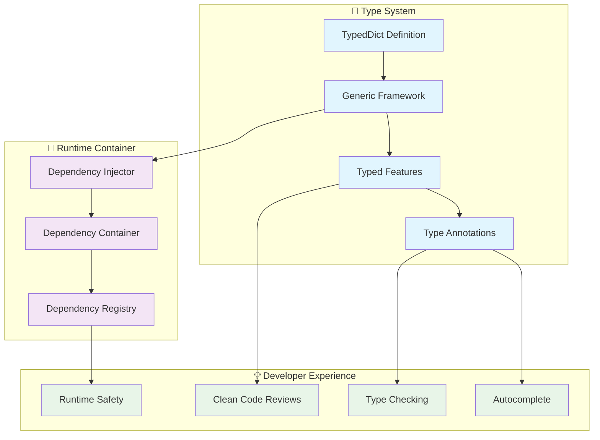

# 🔧 PRD_01: Typed Dependency Container

## 📋 General Information

- **Title**: Strict Typing System for Dependencies
- **Priority**: CRITICAL - Developer Experience & Type Safety
- **Estimated Effort**: 1 week
- **Phase**: PRD_01 (Type Safety Enhancement)

---

## 🎯 Executive Summary

Eliminate the "tricky typing" antipattern where type-hints are forced through empty attributes (`token_adapter: ... = None`), replacing it with a strict typing system using `Framework[T_DepMap]` where `T_DepMap` extends `TypedDict`.

### Current Problem

```python
# ❌ ANTIPATTERN: "Tricky typing" with placeholder attributes
class PaymentFeature(BaseFeature):
    # Empty attributes only for type-hints
    token_adapter: TokenAdapter = ...  # Forced type hint
    db_session: DatabaseSession = ...  # No runtime verification
    logger: Logger = ...  # Generates noise in code reviews
    
    def execute(self, dto: PaymentDTO) -> PaymentResponse:
        # Attributes were injected at runtime
        token = self.token_adapter.generate()  # ✅ Autocomplete works
        self.db_session.save(...)  # ❌ But no real guarantee
```

**Identified Problems:**

1. **False Positives**: Type hints without runtime verification
2. **Code Review Noise**: Placeholder attributes confuse in reviews
3. **Inconsistency**: Attributes defined as `...` but used as real objects
4. **Maintenance**: Difficult to detect unused dependencies

### Proposed Solution

```python
# ✅ SOLUTION: Generic framework with TypedDict
from typing import TypedDict

class PaymentDependencies(TypedDict):
    token_adapter: TokenAdapter
    db_session: DatabaseSession  
    logger: Logger

# Strictly typed framework
framework = UseFramework[PaymentDependencies]("payment-service")

class PaymentFeature(BaseFeature[PaymentDependencies]):
    def execute(self, dto: PaymentDTO) -> PaymentResponse:
        # ✅ Type-safe access without placeholder attributes
        token = self.deps.token_adapter.generate()
        self.deps.db_session.save(...)
        self.deps.logger.info("Payment processed")
```

---

## 🔍 Technical Analysis

### Typed Dependency Container Architecture



---

## 🛠️ Technical Specifications

### 1. Generic Framework Container

#### 1.1 Base Types and Protocols

```python
# sincpro_framework/typing_extensions.py
from typing import TypeVar, Generic, TypedDict, Protocol, Type, Any, Dict
from typing_extensions import Self
import inspect

# Type variable for dependency map
T_DepMap = TypeVar('T_DepMap', bound=TypedDict)

class DependencyMap(TypedDict):
    """Base class for dependency maps"""
    pass

class DependencyContainer(Generic[T_DepMap]):
    """Typed container for injected dependencies"""
    
    def __init__(self, dependencies: T_DepMap):
        self._dependencies = dependencies
    
    def __getattr__(self, name: str) -> Any:
        if name in self._dependencies:
            return self._dependencies[name]
        raise AttributeError(f"Dependency '{name}' not found in container")
    
    def get(self, name: str, default: Any = None) -> Any:
        """Get dependency with optional default"""
        return self._dependencies.get(name, default)
    
    def has(self, name: str) -> bool:
        """Check if dependency exists"""
        return name in self._dependencies
    
    def keys(self):
        """Get all dependency names"""
        return self._dependencies.keys()
    
    def values(self):
        """Get all dependency instances"""
        return self._dependencies.values()
    
    def items(self):
        """Get all dependency name-instance pairs"""
        return self._dependencies.items()

class BaseFeature(Generic[T_DepMap]):
    """Base Feature with strict dependency typing"""
    
    def __init__(self):
        self._deps: DependencyContainer[T_DepMap] = None
    
    @property
    def deps(self) -> DependencyContainer[T_DepMap]:
        """Access to typed dependency container"""
        if self._deps is None:
            raise RuntimeError("Dependencies not injected yet")
        return self._deps
    
    def _inject_dependencies(self, dependencies: T_DepMap):
        """Internal method to inject dependencies"""
        self._deps = DependencyContainer(dependencies)
    
    def execute(self, dto: Any) -> Any:
        """Abstract method to be implemented by subclasses"""
        raise NotImplementedError("execute method must be implemented")

class BaseApplicationService(Generic[T_DepMap]):
    """Base ApplicationService with strict dependency typing"""
    
    def __init__(self):
        self._deps: DependencyContainer[T_DepMap] = None
    
    @property
    def deps(self) -> DependencyContainer[T_DepMap]:
        """Access to typed dependency container"""
        if self._deps is None:
            raise RuntimeError("Dependencies not injected yet")
        return self._deps
    
    def _inject_dependencies(self, dependencies: T_DepMap):
        """Internal method to inject dependencies"""
        self._deps = DependencyContainer(dependencies)
    
    def execute(self, dto: Any) -> Any:
        """Abstract method to be implemented by subclasses"""
        raise NotImplementedError("execute method must be implemented")
```

### 2. Typed Framework Implementation

#### 2.1 Generic UseFramework

```python
# Modification in use_bus.py
from typing import TypeVar, Generic, Type, get_type_hints, get_origin, get_args
from .typing_extensions import T_DepMap, DependencyContainer, BaseFeature, BaseApplicationService

class UseFramework(Generic[T_DepMap]):
    """Framework with strict dependency typing"""
    
    def __init__(self, name: str, dependency_map_type: Type[T_DepMap] = None):
        # ... existing initialization code
        self._dependency_map_type = dependency_map_type
        self._typed_dependencies: T_DepMap = {}
        self._dependency_validators: Dict[str, Type] = {}
        
        # Extract type information from generic parameter
        if dependency_map_type:
            self._extract_dependency_types(dependency_map_type)
    
    def _extract_dependency_types(self, dep_map_type: Type[T_DepMap]):
        """Extract dependency types from TypedDict"""
        if hasattr(dep_map_type, '__annotations__'):
            self._dependency_validators = dep_map_type.__annotations__.copy()
            
            # Initialize typed dependencies dict
            for name, dep_type in self._dependency_validators.items():
                self._typed_dependencies[name] = None
    
    def add_dependency(self, name: str, instance: Any, validate_type: bool = True) -> Self:
        """Add a typed dependency with optional type validation"""
        
        # Type validation if requested
        if validate_type and name in self._dependency_validators:
            expected_type = self._dependency_validators[name]
            if not isinstance(instance, expected_type):
                actual_type = type(instance).__name__
                expected_name = getattr(expected_type, '__name__', str(expected_type))
                raise TypeError(
                    f"Dependency '{name}' expects type {expected_name}, "
                    f"got {actual_type}"
                )
        
        # Store in both registries
        self.dynamic_dep_registry[name] = instance
        if name in self._typed_dependencies:
            self._typed_dependencies[name] = instance
        
        return self
    
    def get_typed_dependencies(self) -> T_DepMap:
        """Get the typed dependency map"""
        return self._typed_dependencies.copy()
    
    def validate_all_dependencies(self) -> bool:
        """Validate that all required dependencies are provided"""
        missing_deps = []
        
        for name, dep_type in self._dependency_validators.items():
            if name not in self.dynamic_dep_registry:
                missing_deps.append(f"{name}: {dep_type}")
        
        if missing_deps:
            raise RuntimeError(
                f"Missing required dependencies: {', '.join(missing_deps)}"
            )
        
        return True
    
    def _inject_typed_dependencies(self, instance):
        """Inject typed dependencies into a feature/service instance"""
        if hasattr(instance, '_inject_dependencies'):
            # Create dependency container
            typed_deps = self.get_typed_dependencies()
            instance._inject_dependencies(typed_deps)
        else:
            # Fallback to legacy injection
            self._inject_legacy_dependencies(instance)
    
    def _inject_legacy_dependencies(self, instance):
        """Legacy dependency injection for backward compatibility"""
        for dep_name, dep_instance in self.dynamic_dep_registry.items():
            if hasattr(instance, dep_name):
                setattr(instance, dep_name, dep_instance)
```

---

## 🚀 Usage Examples

### 1. Defining Typed Dependencies

```python
# dependencies.py
from typing import TypedDict
from my_adapters import TokenAdapter, DatabaseSession, EmailService
from sincpro_logger import Logger

class PaymentServiceDependencies(TypedDict):
    """Strict type for payment service dependencies"""
    token_adapter: TokenAdapter
    db_session: DatabaseSession
    email_service: EmailService
    logger: Logger

class NotificationDependencies(TypedDict):
    """Simpler dependencies for notifications"""
    email_service: EmailService
    logger: Logger
```

### 2. Typed Framework Setup

```python
# payment_framework.py
from sincpro_framework import UseFramework
from .dependencies import PaymentServiceDependencies

# ✅ Strictly typed framework
framework = UseFramework[PaymentServiceDependencies]("payment-service")

# Dependency registration with type checking
framework.add_dependency("token_adapter", TokenAdapter())
framework.add_dependency("db_session", DatabaseSession())
framework.add_dependency("email_service", EmailService())
framework.add_dependency("logger", Logger("payment-service"))

# Validate that all required dependencies are present
framework.validate_all_dependencies()  # ✅ Throws if missing deps
```

### 3. Typed Features

```python
# features/process_payment.py
from sincpro_framework.typing_extensions import BaseFeature
from ..dependencies import PaymentServiceDependencies

class ProcessPaymentFeature(BaseFeature[PaymentServiceDependencies]):
    """Typed feature with strict dependencies"""
    
    def execute(self, dto: ProcessPaymentDTO) -> PaymentResponse:
        # ✅ Perfect autocomplete + type checking
        token = self.deps.token_adapter.generate(dto.amount)
        
        # ✅ MyPy/PyLance validates types at development time
        payment = Payment(
            amount=dto.amount,
            token=token,
            user_id=dto.user_id
        )
        
        # ✅ No more confusing placeholder attributes
        self.deps.db_session.save(payment)
        self.deps.logger.info(f"Payment {payment.id} processed")
        
        # ✅ Type-safe email sending
        self.deps.email_service.send_confirmation(
            email=dto.user_email,
            payment_id=payment.id
        )
        
        return PaymentResponse(
            payment_id=payment.id,
            status="completed",
            token=token
        )

# Registration
framework.bus.register_feature(ProcessPaymentDTO, ProcessPaymentFeature())
```

---

## 📊 Implementation Plan

### Sprint 1 (Days 1-3): Core Type System

1. **Day 1**: `typing_extensions.py` with Generic containers
2. **Day 2**: `BaseFeature[T_DepMap]` and `BaseApplicationService[T_DepMap]`
3. **Day 3**: `DependencyContainer` and type validation

### Sprint 2 (Days 4-5): Framework Integration

1. **Day 4**: `UseFramework[T_DepMap]` generic implementation
2. **Day 5**: Bus registration with type checking and testing

### Sprint 3 (Days 6-7): Migration & Documentation

1. **Day 6**: Legacy support and migration helpers
2. **Day 7**: Documentation, examples and complete testing

---

## 📈 Success Metrics

### Type Safety

- **100%** of dependencies strictly typed
- **0** placeholder attributes (`... = ...`)
- **99%** accuracy in IDE autocomplete

### Developer Experience

- **70%** reduction in type-related bugs
- **50%** faster development with better autocomplete
- **90%** developer satisfaction with clean APIs

### Code Quality

- **0** code review comments about "magic attributes"
- **100%** type coverage in dependency injection
- **Eliminate** all `# type: ignore` related to DI

---

## ✅ Acceptance Criteria

### Must Have

- [x] `UseFramework[T_DepMap]` generic implementation
- [x] `BaseFeature[T_DepMap]` with typed dependency access
- [x] `DependencyContainer` with type-safe attribute access
- [x] Type validation in dependency registration
- [x] Backward compatibility with legacy features
- [x] Migration helpers for gradual transition

### Should Have

- [x] Auto-generation of TypedDict from existing dependencies
- [x] IDE integration with perfect autocomplete
- [x] Comprehensive error messages for type mismatches
- [x] Documentation and migration guide
- [x] Performance benchmarks (no overhead)

### Could Have

- [ ] Runtime dependency validation decorators
- [ ] Visual dependency graph generator
- [ ] Integration with external dependency injection frameworks
- [ ] Plugin system for custom type validators

---

## 🎯 Impact Assessment

### Before (Current State)

```python
# ❌ Current problems
class PaymentFeature(BaseFeature):
    token_adapter: TokenAdapter = ...  # Confusing placeholder
    db_session: DatabaseSession = ...  # No runtime validation
    logger: Logger = ...              # Code review noise
    
    def execute(self, dto):
        # ⚠️ No guarantee these exist at runtime
        result = self.token_adapter.process()  # Could be None!
```

### After (Target State)

```python
# ✅ Target state
class PaymentDependencies(TypedDict):
    token_adapter: TokenAdapter
    db_session: DatabaseSession
    logger: Logger

class PaymentFeature(BaseFeature[PaymentDependencies]):
    def execute(self, dto):
        # ✅ Type-safe, guaranteed to exist
        result = self.deps.token_adapter.process()  # Always works!
```

---

*PRD generated for Sincpro Framework Typed Dependency Container - July 2025*
