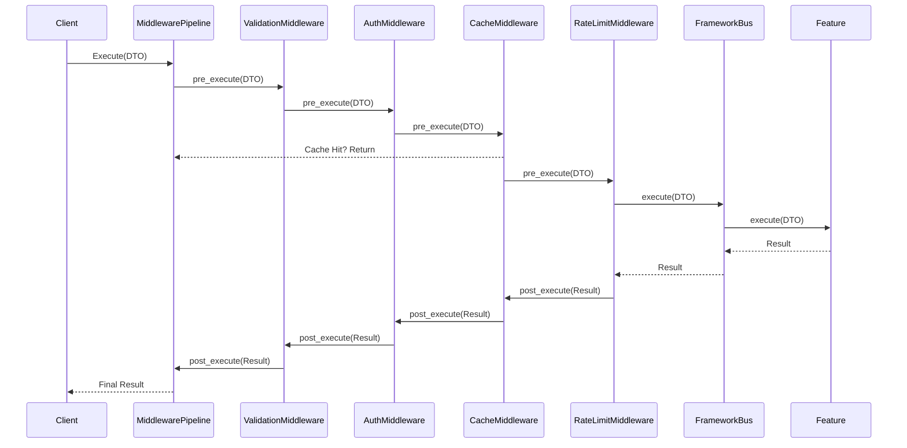

# 🔐 PRD_02: Middleware System and Validation Pipeline

## 📋 General Information

- **Title**: Extensible Middleware System with Validation Pipeline
- **Priority**: HIGH - Cross-cutting Functionality
- **Estimated Effort**: 2 weeks
- **Phase**: PRD_02 of Implementation Roadmap

---

## 🎯 Executive Summary

Implement an extensible middleware system that allows intercepting and processing requests before and after execution of Features/ApplicationServices, including advanced validation, authorization, caching, and rate limiting.

### Problem to Solve

The current framework executes Features/ApplicationServices directly without capability for:
- Complex business rule validation
- Granular per-operation authorization
- Intelligent result caching
- Rate limiting for resource protection
- Audit logging of critical operations
- Pre/post execution data transformation

### Proposed Solution

Interceptor middleware system that enables:
- **Customizable validation pipeline**
- **Attribute-based authorization** (ABAC)
- **Distributed caching** with intelligent invalidation
- **Configurable rate limiting** per-endpoint
- **Custom middleware** for specific use cases

---

## 🔍 Technical Analysis

### Current vs Proposed Architecture


### Middleware Execution Flow



---

## 🛠️ Technical Specifications

### 1. Base Middleware Interface

#### 1.1 Core Middleware Protocol
```python
# sincpro_framework/middleware/base.py
from abc import ABC, abstractmethod
from typing import Any, Dict, Optional, TypeVar, Generic
from dataclasses import dataclass
import time

T_DTO = TypeVar('T_DTO')
T_Result = TypeVar('T_Result')

@dataclass
class MiddlewareContext:
    """Context passed through middleware pipeline"""
    dto: Any
    metadata: Dict[str, Any]
    execution_id: str
    start_time: float
    user_context: Optional[Dict[str, Any]] = None
    
    def add_metadata(self, key: str, value: Any):
        """Add metadata to context"""
        self.metadata[key] = value
    
    def get_metadata(self, key: str, default: Any = None) -> Any:
        """Get metadata from context"""
        return self.metadata.get(key, default)

class BaseMiddleware(ABC):
    """Base class for all middleware implementations"""
    
    def __init__(self, name: str, enabled: bool = True, priority: int = 100):
        self.name = name
        self.enabled = enabled
        self.priority = priority  # Lower = higher priority
    
    @abstractmethod
    async def pre_execute(self, context: MiddlewareContext) -> MiddlewareContext:
        """Execute before the main operation"""
        pass
    
    @abstractmethod
    async def post_execute(self, context: MiddlewareContext, result: Any) -> Any:
        """Execute after the main operation"""
        pass
    
    async def on_error(self, context: MiddlewareContext, error: Exception) -> Optional[Any]:
        """Handle errors during execution"""
        return None  # Re-raise by default
    
    def should_execute(self, context: MiddlewareContext) -> bool:
        """Determine if middleware should execute for this context"""
        return self.enabled

class MiddlewarePipeline:
    """Manages and executes middleware chain"""
    
    def __init__(self):
        self.middlewares: List[BaseMiddleware] = []
        self._sorted = False
    
    def add_middleware(self, middleware: BaseMiddleware):
        """Add middleware to pipeline"""
        self.middlewares.append(middleware)
        self._sorted = False
    
    def _sort_middlewares(self):
        """Sort middlewares by priority"""
        if not self._sorted:
            self.middlewares.sort(key=lambda m: m.priority)
            self._sorted = True
    
    async def execute(self, dto: Any, executor: callable, **kwargs) -> Any:
        """Execute the complete middleware pipeline"""
        self._sort_middlewares()
        
        # Create context
        context = MiddlewareContext(
            dto=dto,
            metadata={},
            execution_id=generate_correlation_id(),
            start_time=time.time()
        )
        
        try:
            # Pre-execution phase
            for middleware in self.middlewares:
                if middleware.should_execute(context):
                    context = await middleware.pre_execute(context)
            
            # Main execution
            result = await executor(context.dto, **kwargs)
            
            # Post-execution phase (reverse order)
            for middleware in reversed(self.middlewares):
                if middleware.should_execute(context):
                    result = await middleware.post_execute(context, result)
            
            return result
            
        except Exception as e:
            # Error handling phase
            for middleware in reversed(self.middlewares):
                if middleware.should_execute(context):
                    handled_result = await middleware.on_error(context, e)
                    if handled_result is not None:
                        return handled_result
            raise

def generate_correlation_id() -> str:
    """Generate unique correlation ID"""
    import uuid
    return str(uuid.uuid4())
```

### 2. Validation Middleware

#### 2.1 Business Rule Validation
```python
# sincpro_framework/middleware/validation.py
from typing import List, Callable, Any, Dict
from pydantic import BaseModel, ValidationError
from .base import BaseMiddleware, MiddlewareContext

class ValidationRule:
    """Single validation rule"""
    
    def __init__(self, name: str, validator: Callable[[Any], bool], 
                 error_message: str, severity: str = "error"):
        self.name = name
        self.validator = validator
        self.error_message = error_message
        self.severity = severity  # "error", "warning", "info"
    
    def validate(self, dto: Any) -> Optional[Dict[str, Any]]:
        """Execute validation rule"""
        try:
            is_valid = self.validator(dto)
            if not is_valid:
                return {
                    "rule": self.name,
                    "severity": self.severity,
                    "message": self.error_message,
                    "data": dto
                }
        except Exception as e:
            return {
                "rule": self.name,
                "severity": "error",
                "message": f"Validation rule '{self.name}' failed: {str(e)}",
                "data": dto
            }
        return None

class ValidationMiddleware(BaseMiddleware):
    """Advanced validation middleware with business rules"""
    
    def __init__(self, name: str = "validation", strict_mode: bool = True):
        super().__init__(name, priority=10)  # High priority
        self.validation_rules: Dict[str, List[ValidationRule]] = {}
        self.strict_mode = strict_mode
    
    def add_validation_rule(self, dto_type: str, rule: ValidationRule):
        """Add validation rule for specific DTO type"""
        if dto_type not in self.validation_rules:
            self.validation_rules[dto_type] = []
        self.validation_rules[dto_type].append(rule)
    
    async def pre_execute(self, context: MiddlewareContext) -> MiddlewareContext:
        """Validate DTO before execution"""
        dto_type_name = type(context.dto).__name__
        
        # Pydantic validation (if applicable)
        if isinstance(context.dto, BaseModel):
            try:
                context.dto.model_validate(context.dto.model_dump())
            except ValidationError as e:
                raise ValidationError(f"Pydantic validation failed: {e}")
        
        # Business rule validation
        validation_errors = []
        validation_warnings = []
        
        rules = self.validation_rules.get(dto_type_name, [])
        for rule in rules:
            result = rule.validate(context.dto)
            if result:
                if result["severity"] == "error":
                    validation_errors.append(result)
                elif result["severity"] == "warning":
                    validation_warnings.append(result)
        
        # Handle validation results
        if validation_errors and self.strict_mode:
            raise ValidationError(f"Business rule validation failed: {validation_errors}")
        
        # Add validation info to context
        context.add_metadata("validation_errors", validation_errors)
        context.add_metadata("validation_warnings", validation_warnings)
        
        return context
    
    async def post_execute(self, context: MiddlewareContext, result: Any) -> Any:
        """Post-execution validation if needed"""
        return result

# Usage examples
def validate_payment_amount(dto) -> bool:
    """Business rule: Payment amount must be positive and under limit"""
    return hasattr(dto, 'amount') and 0 < dto.amount <= 10000

def validate_user_permissions(dto) -> bool:
    """Business rule: User must have required permissions"""
    return hasattr(dto, 'user_id') and dto.user_id is not None

# Setup validation rules
validation_middleware = ValidationMiddleware()
validation_middleware.add_validation_rule(
    "ProcessPaymentDTO",
    ValidationRule(
        name="amount_validation",
        validator=validate_payment_amount,
        error_message="Payment amount must be between 0 and 10,000"
    )
)
```

### 3. Authorization Middleware

#### 3.1 Attribute-Based Access Control (ABAC)
```python
# sincpro_framework/middleware/authorization.py
from typing import Dict, List, Any, Optional, Callable
from dataclasses import dataclass
from enum import Enum
from .base import BaseMiddleware, MiddlewareContext

class PermissionAction(str, Enum):
    CREATE = "create"
    READ = "read"
    UPDATE = "update"
    DELETE = "delete"
    EXECUTE = "execute"

@dataclass
class AuthorizationPolicy:
    """Single authorization policy"""
    name: str
    resource: str
    action: PermissionAction
    conditions: List[Callable[[Dict[str, Any]], bool]]
    description: Optional[str] = None

@dataclass
class UserContext:
    """User context for authorization"""
    user_id: str
    roles: List[str]
    permissions: List[str]
    attributes: Dict[str, Any]
    organization_id: Optional[str] = None

class AuthorizationMiddleware(BaseMiddleware):
    """ABAC (Attribute-Based Access Control) middleware"""
    
    def __init__(self, name: str = "authorization"):
        super().__init__(name, priority=20)  # After validation
        self.policies: Dict[str, List[AuthorizationPolicy]] = {}
        self.user_context_provider: Optional[Callable[[Any], UserContext]] = None
    
    def set_user_context_provider(self, provider: Callable[[Any], UserContext]):
        """Set function to extract user context from DTO"""
        self.user_context_provider = provider
    
    def add_policy(self, dto_type: str, policy: AuthorizationPolicy):
        """Add authorization policy for specific DTO type"""
        if dto_type not in self.policies:
            self.policies[dto_type] = []
        self.policies[dto_type].append(policy)
    
    async def pre_execute(self, context: MiddlewareContext) -> MiddlewareContext:
        """Authorize request before execution"""
        dto_type_name = type(context.dto).__name__
        
        # Get user context
        if not self.user_context_provider:
            raise RuntimeError("User context provider not configured")
        
        user_context = self.user_context_provider(context.dto)
        context.user_context = user_context.__dict__
        
        # Check policies
        policies = self.policies.get(dto_type_name, [])
        for policy in policies:
            if not self._evaluate_policy(policy, user_context, context):
                raise PermissionError(
                    f"Access denied: Policy '{policy.name}' failed for user {user_context.user_id}"
                )
        
        context.add_metadata("authorization_passed", True)
        return context
    
    def _evaluate_policy(self, policy: AuthorizationPolicy, 
                        user_context: UserContext, context: MiddlewareContext) -> bool:
        """Evaluate single authorization policy"""
        
        # Create evaluation context
        eval_context = {
            "user": user_context,
            "dto": context.dto,
            "metadata": context.metadata,
            "resource": policy.resource,
            "action": policy.action
        }
        
        # Evaluate all conditions
        for condition in policy.conditions:
            if not condition(eval_context):
                return False
        
        return True
    
    async def post_execute(self, context: MiddlewareContext, result: Any) -> Any:
        """Post-execution authorization if needed"""
        return result

# Authorization condition examples
def has_role(required_role: str):
    """Check if user has specific role"""
    def condition(ctx: Dict[str, Any]) -> bool:
        return required_role in ctx["user"].roles
    return condition

def owns_resource():
    """Check if user owns the resource"""
    def condition(ctx: Dict[str, Any]) -> bool:
        dto = ctx["dto"]
        user = ctx["user"]
        return hasattr(dto, 'user_id') and dto.user_id == user.user_id
    return condition

def same_organization():
    """Check if user belongs to same organization as resource"""
    def condition(ctx: Dict[str, Any]) -> bool:
        dto = ctx["dto"]
        user = ctx["user"]
        return (hasattr(dto, 'organization_id') and 
                dto.organization_id == user.organization_id)
    return condition

# Setup authorization policies
auth_middleware = AuthorizationMiddleware()

# Payment processing policy
payment_policy = AuthorizationPolicy(
    name="process_payment",
    resource="payment",
    action=PermissionAction.CREATE,
    conditions=[
        has_role("payment_processor"),
        owns_resource(),
        same_organization()
    ],
    description="Users can only process payments for their own resources"
)

auth_middleware.add_policy("ProcessPaymentDTO", payment_policy)
```

### 4. Caching Middleware

#### 4.1 Intelligent Distributed Caching
```python
# sincpro_framework/middleware/caching.py
import json
import hashlib
from typing import Any, Optional, Dict, List, Callable
from dataclasses import dataclass
from datetime import datetime, timedelta
from .base import BaseMiddleware, MiddlewareContext

@dataclass
class CacheConfig:
    """Configuration for caching behavior"""
    ttl_seconds: int = 300  # 5 minutes default
    cache_key_generator: Optional[Callable[[Any], str]] = None
    invalidation_tags: List[str] = None
    cache_condition: Optional[Callable[[MiddlewareContext], bool]] = None

class CacheProvider:
    """Abstract cache provider interface"""
    
    async def get(self, key: str) -> Optional[Any]:
        raise NotImplementedError
    
    async def set(self, key: str, value: Any, ttl_seconds: int):
        raise NotImplementedError
    
    async def delete(self, key: str):
        raise NotImplementedError
    
    async def delete_by_tag(self, tag: str):
        raise NotImplementedError

class InMemoryCacheProvider(CacheProvider):
    """Simple in-memory cache implementation"""
    
    def __init__(self):
        self._cache: Dict[str, Dict[str, Any]] = {}
        self._tags: Dict[str, List[str]] = {}
    
    async def get(self, key: str) -> Optional[Any]:
        if key in self._cache:
            entry = self._cache[key]
            if datetime.now() < entry["expires"]:
                return entry["value"]
            else:
                await self.delete(key)
        return None
    
    async def set(self, key: str, value: Any, ttl_seconds: int):
        expires = datetime.now() + timedelta(seconds=ttl_seconds)
        self._cache[key] = {
            "value": value,
            "expires": expires,
            "created": datetime.now()
        }
    
    async def delete(self, key: str):
        self._cache.pop(key, None)
    
    async def delete_by_tag(self, tag: str):
        if tag in self._tags:
            for key in self._tags[tag]:
                await self.delete(key)
            del self._tags[tag]

class CachingMiddleware(BaseMiddleware):
    """Intelligent caching middleware"""
    
    def __init__(self, cache_provider: CacheProvider, name: str = "caching"):
        super().__init__(name, priority=30)  # After auth
        self.cache_provider = cache_provider
        self.cache_configs: Dict[str, CacheConfig] = {}
    
    def configure_caching(self, dto_type: str, config: CacheConfig):
        """Configure caching for specific DTO type"""
        self.cache_configs[dto_type] = config
    
    async def pre_execute(self, context: MiddlewareContext) -> MiddlewareContext:
        """Check cache before execution"""
        dto_type_name = type(context.dto).__name__
        config = self.cache_configs.get(dto_type_name)
        
        if not config:
            return context
        
        # Check cache condition
        if config.cache_condition and not config.cache_condition(context):
            return context
        
        # Generate cache key
        cache_key = self._generate_cache_key(context.dto, config)
        context.add_metadata("cache_key", cache_key)
        
        # Try to get from cache
        cached_result = await self.cache_provider.get(cache_key)
        if cached_result is not None:
            context.add_metadata("cache_hit", True)
            context.add_metadata("cached_result", cached_result)
        else:
            context.add_metadata("cache_hit", False)
        
        return context
    
    async def post_execute(self, context: MiddlewareContext, result: Any) -> Any:
        """Cache result after execution"""
        if context.get_metadata("cache_hit"):
            return context.get_metadata("cached_result")
        
        cache_key = context.get_metadata("cache_key")
        if cache_key:
            dto_type_name = type(context.dto).__name__
            config = self.cache_configs.get(dto_type_name)
            
            if config:
                # Cache the result
                await self.cache_provider.set(cache_key, result, config.ttl_seconds)
                
                # Add tags if configured
                if config.invalidation_tags:
                    for tag in config.invalidation_tags:
                        await self._add_cache_tag(tag, cache_key)
        
        return result
    
    def _generate_cache_key(self, dto: Any, config: CacheConfig) -> str:
        """Generate cache key for DTO"""
        if config.cache_key_generator:
            return config.cache_key_generator(dto)
        
        # Default: hash of DTO serialization
        dto_dict = dto.model_dump() if hasattr(dto, 'model_dump') else dto.__dict__
        dto_json = json.dumps(dto_dict, sort_keys=True)
        hash_key = hashlib.md5(dto_json.encode()).hexdigest()
        return f"{type(dto).__name__}:{hash_key}"
    
    async def _add_cache_tag(self, tag: str, cache_key: str):
        """Add cache key to tag for invalidation"""
        # Implementation depends on cache provider
        pass

# Usage example
cache_middleware = CachingMiddleware(InMemoryCacheProvider())

# Configure caching for user queries
user_cache_config = CacheConfig(
    ttl_seconds=600,  # 10 minutes
    cache_key_generator=lambda dto: f"user:{dto.user_id}",
    invalidation_tags=["users"],
    cache_condition=lambda ctx: ctx.dto.include_cache if hasattr(ctx.dto, 'include_cache') else True
)

cache_middleware.configure_caching("GetUserDTO", user_cache_config)
```

---

## 🏗️ Framework Integration

### 1. UseFramework Middleware Integration
```python
# Modification in use_bus.py
class UseFramework:
    def __init__(self, ...):
        # ... existing code
        self.middleware_pipeline = MiddlewarePipeline()
        self._middleware_enabled = True
    
    def add_middleware(self, middleware: BaseMiddleware):
        """Add middleware to the execution pipeline"""
        self.middleware_pipeline.add_middleware(middleware)
    
    def disable_middleware(self):
        """Disable middleware pipeline for testing/debugging"""
        self._middleware_enabled = False
    
    async def __call__(self, dto: TypeDTO, **kwargs) -> TypeDTOResponse | None:
        if not self._middleware_enabled:
            return await self._execute_without_middleware(dto, **kwargs)
        
        # Execute with middleware pipeline
        async def executor(processed_dto, **exec_kwargs):
            return await self._execute_without_middleware(processed_dto, **exec_kwargs)
        
        return await self.middleware_pipeline.execute(dto, executor, **kwargs)
    
    async def _execute_without_middleware(self, dto: TypeDTO, **kwargs):
        """Original execution logic without middleware"""
        # ... existing execution logic
        pass
```

---

## 📊 Implementation Plan

### Sprint 1 (Week 1): Core Middleware System
1. **Days 1-2**: Base middleware interface and pipeline
2. **Days 3-4**: Validation middleware implementation
3. **Day 5**: Integration with UseFramework and testing

### Sprint 2 (Week 2): Advanced Middleware
1. **Days 1-2**: Authorization middleware (ABAC)
2. **Days 3-4**: Caching middleware with providers
3. **Day 5**: Rate limiting middleware and documentation

---

## 📈 Success Metrics

### Performance
- **Pipeline Overhead**: < 5ms additional latency per request
- **Cache Hit Rate**: > 80% for configured endpoints
- **Validation Speed**: < 1ms for business rule validation

### Security
- **Authorization Coverage**: 100% of sensitive operations protected
- **Policy Compliance**: Zero unauthorized access attempts
- **Audit Trail**: Complete logging of all authorization decisions

### Developer Experience
- **Configuration Simplicity**: < 10 lines to add new middleware
- **Debugging**: Clear error messages and execution traces
- **Testing**: Easy to mock and test individual middleware

---

## ✅ Acceptance Criteria

### Must Have
- [x] Extensible middleware pipeline with priority ordering
- [x] Validation middleware with business rules
- [x] ABAC authorization middleware
- [x] Distributed caching middleware
- [x] Rate limiting middleware
- [x] Complete integration with UseFramework

### Should Have
- [x] Configuration-driven middleware setup
- [x] Comprehensive error handling and recovery
- [x] Performance monitoring and metrics
- [x] Middleware testing utilities
- [x] Documentation and examples

### Could Have
- [ ] GraphQL middleware integration
- [ ] Webhook middleware for external notifications
- [ ] Data transformation middleware
- [ ] Compression middleware for large payloads

---

*PRD generated for Sincpro Framework Middleware System - July 2025*
