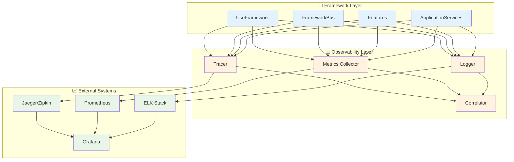
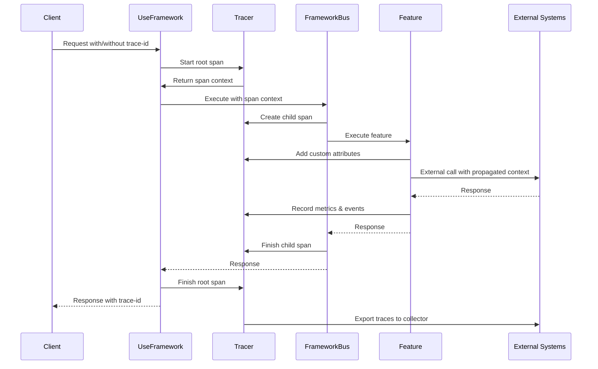

# 🚀 PRD_03: Observability and Tracing for Sincpro Framework

## 📋 General Information

- **Title**: Distributed Observability and Tracing System
- **Priority**: HIGH - Production Debugging Essential
- **Estimated Effort**: 2-3 weeks
- **Phase**: PRD_03 of Implementation Roadmap

---

## 🎯 Executive Summary

Implement comprehensive observability capabilities in the Sincpro Framework to provide real-time visibility into system behavior, performance, and distributed debugging.

### Problem to Solve

Currently the framework only has basic logging, which makes it difficult to:
- Debug complex flows in production
- Identify performance bottlenecks
- Track distributed requests
- Analyze usage patterns and errors

### Proposed Solution

Integrate a complete observability system that includes:
- **Distributed Tracing** with OpenTelemetry
- **Metrics Collection** with Prometheus/StatsD
- **Automatic Performance Monitoring**
- **Request Correlation** for end-to-end tracking

---

## 🔍 Technical Analysis

### Observability Architecture



### Tracing Flow



---

## 🛠️ Technical Specifications

### 1. OpenTelemetry Integration

#### 1.1 Core Tracing Implementation
```python
# sincpro_framework/observability/tracing.py
import time
from typing import Dict, Any, Optional, List
from opentelemetry import trace
from opentelemetry.exporter.jaeger.thrift import JaegerExporter
from opentelemetry.sdk.trace import TracerProvider
from opentelemetry.sdk.trace.export import BatchSpanProcessor
from opentelemetry.sdk.resources import Resource
from opentelemetry.trace.propagation.tracecontext import TraceContextTextMapPropagator
import uuid

class SincproTracer:
    """Enhanced tracer for Sincpro Framework"""
    
    def __init__(self, service_name: str, jaeger_endpoint: str = None):
        # Configure resource
        resource = Resource.create({
            "service.name": service_name,
            "service.version": "2.4.1",
            "framework.name": "sincpro-framework"
        })
        
        # Set up tracer provider
        trace.set_tracer_provider(TracerProvider(resource=resource))
        tracer_provider = trace.get_tracer_provider()
        
        # Configure Jaeger exporter if endpoint provided
        if jaeger_endpoint:
            jaeger_exporter = JaegerExporter(
                agent_host_name="localhost",
                agent_port=6831,
                collector_endpoint=jaeger_endpoint,
            )
            span_processor = BatchSpanProcessor(jaeger_exporter)
            tracer_provider.add_span_processor(span_processor)
        
        # Get tracer
        self.tracer = trace.get_tracer(__name__)
        self.propagator = TraceContextTextMapPropagator()
    
    def start_span(self, operation_name: str, parent_context: Optional[Dict] = None) -> trace.Span:
        """Start a new span with optional parent context"""
        if parent_context:
            # Extract context from headers/metadata
            context = self.propagator.extract(parent_context)
            return self.tracer.start_span(operation_name, context=context)
        else:
            return self.tracer.start_span(operation_name)
    
    def inject_context(self, span: trace.Span) -> Dict[str, str]:
        """Inject span context into headers for propagation"""
        headers = {}
        self.propagator.inject(headers, context=trace.set_span_in_context(span))
        return headers
    
    def add_event(self, span: trace.Span, name: str, attributes: Dict[str, Any] = None):
        """Add event to span"""
        span.add_event(name, attributes or {})
    
    def set_attributes(self, span: trace.Span, attributes: Dict[str, Any]):
        """Set attributes on span"""
        for key, value in attributes.items():
            span.set_attribute(key, value)
    
    def record_exception(self, span: trace.Span, exception: Exception):
        """Record exception in span"""
        span.record_exception(exception)
        span.set_status(trace.Status(trace.StatusCode.ERROR, str(exception)))

# Global tracer instance
_tracer: Optional[SincproTracer] = None

def get_tracer() -> SincproTracer:
    """Get global tracer instance"""
    if _tracer is None:
        raise RuntimeError("Tracer not initialized. Call configure_observability() first.")
    return _tracer

def configure_observability(service_name: str, jaeger_endpoint: str = None):
    """Configure global observability settings"""
    global _tracer
    _tracer = SincproTracer(service_name, jaeger_endpoint)
```

### 2. Metrics Collection

#### 2.1 Prometheus Metrics Integration
```python
# sincpro_framework/observability/metrics.py
import time
from typing import Dict, Any, Optional
from prometheus_client import Counter, Histogram, Gauge, start_http_server
from functools import wraps
import threading

class SincproMetrics:
    """Metrics collector for Sincpro Framework"""
    
    def __init__(self, service_name: str, metrics_port: int = 8000):
        self.service_name = service_name
        self.metrics_port = metrics_port
        
        # Core framework metrics
        self.request_count = Counter(
            'sincpro_requests_total',
            'Total number of requests processed',
            ['service', 'feature_type', 'dto_name', 'status']
        )
        
        self.request_duration = Histogram(
            'sincpro_request_duration_seconds',
            'Request processing duration',
            ['service', 'feature_type', 'dto_name'],
            buckets=[0.001, 0.005, 0.01, 0.025, 0.05, 0.1, 0.25, 0.5, 1.0, 2.5, 5.0, 10.0]
        )
        
        self.active_requests = Gauge(
            'sincpro_active_requests',
            'Number of requests currently being processed',
            ['service', 'feature_type']
        )
        
        self.dependency_operations = Counter(
            'sincpro_dependency_operations_total',
            'Total dependency operations',
            ['service', 'dependency_name', 'operation', 'status']
        )
        
        self.cache_operations = Counter(
            'sincpro_cache_operations_total',
            'Cache operations',
            ['service', 'operation', 'result']
        )
        
        # Start metrics server
        self._start_metrics_server()
    
    def _start_metrics_server(self):
        """Start Prometheus metrics HTTP server"""
        def start_server():
            start_http_server(self.metrics_port)
        
        thread = threading.Thread(target=start_server, daemon=True)
        thread.start()
    
    def record_request(self, feature_type: str, dto_name: str, status: str, duration: float):
        """Record request metrics"""
        labels = {
            'service': self.service_name,
            'feature_type': feature_type,
            'dto_name': dto_name,
            'status': status
        }
        
        self.request_count.labels(**labels).inc()
        self.request_duration.labels(
            service=self.service_name,
            feature_type=feature_type,
            dto_name=dto_name
        ).observe(duration)
    
    def track_active_request(self, feature_type: str):
        """Context manager to track active requests"""
        labels = {'service': self.service_name, 'feature_type': feature_type}
        
        class ActiveRequestTracker:
            def __enter__(self):
                self.active_requests.labels(**labels).inc()
                return self
            
            def __exit__(self, exc_type, exc_val, exc_tb):
                self.active_requests.labels(**labels).dec()
        
        return ActiveRequestTracker()
    
    def record_dependency_operation(self, dependency_name: str, operation: str, status: str):
        """Record dependency operation metrics"""
        self.dependency_operations.labels(
            service=self.service_name,
            dependency_name=dependency_name,
            operation=operation,
            status=status
        ).inc()
    
    def record_cache_operation(self, operation: str, result: str):
        """Record cache operation metrics"""
        self.cache_operations.labels(
            service=self.service_name,
            operation=operation,
            result=result
        ).inc()

# Global metrics instance
_metrics: Optional[SincproMetrics] = None

def get_metrics() -> SincproMetrics:
    """Get global metrics instance"""
    if _metrics is None:
        raise RuntimeError("Metrics not initialized. Call configure_observability() first.")
    return _metrics

def configure_metrics(service_name: str, metrics_port: int = 8000):
    """Configure global metrics collection"""
    global _metrics
    _metrics = SincproMetrics(service_name, metrics_port)
```

### 3. Request Correlation

#### 3.1 Correlation ID Management
```python
# sincpro_framework/observability/correlation.py
import uuid
import contextvars
from typing import Optional, Dict, Any
import logging

# Context variable for correlation ID
correlation_id_var: contextvars.ContextVar[str] = contextvars.ContextVar(
    'correlation_id', default=None
)

class CorrelationManager:
    """Manages request correlation across the framework"""
    
    def __init__(self):
        self.correlation_header = "X-Correlation-ID"
        self.trace_header = "X-Trace-ID"
    
    def generate_correlation_id(self) -> str:
        """Generate new correlation ID"""
        return str(uuid.uuid4())
    
    def set_correlation_id(self, correlation_id: str):
        """Set correlation ID for current context"""
        correlation_id_var.set(correlation_id)
    
    def get_correlation_id(self) -> Optional[str]:
        """Get correlation ID from current context"""
        return correlation_id_var.get()
    
    def get_or_create_correlation_id(self) -> str:
        """Get existing or create new correlation ID"""
        correlation_id = self.get_correlation_id()
        if not correlation_id:
            correlation_id = self.generate_correlation_id()
            self.set_correlation_id(correlation_id)
        return correlation_id
    
    def extract_from_headers(self, headers: Dict[str, str]) -> Optional[str]:
        """Extract correlation ID from HTTP headers"""
        return headers.get(self.correlation_header)
    
    def inject_into_headers(self, headers: Dict[str, str]) -> Dict[str, str]:
        """Inject correlation ID into HTTP headers"""
        correlation_id = self.get_or_create_correlation_id()
        headers[self.correlation_header] = correlation_id
        return headers
    
    def create_child_context(self) -> Dict[str, Any]:
        """Create context for child operations"""
        return {
            'correlation_id': self.get_or_create_correlation_id(),
            'parent_operation': 'framework_execution'
        }

# Global correlation manager
correlation_manager = CorrelationManager()

# Custom logging formatter with correlation ID
class CorrelationFormatter(logging.Formatter):
    """Logging formatter that includes correlation ID"""
    
    def format(self, record):
        correlation_id = correlation_manager.get_correlation_id()
        if correlation_id:
            record.correlation_id = correlation_id
        else:
            record.correlation_id = "no-correlation"
        
        return super().format(record)

def configure_correlation_logging():
    """Configure logging to include correlation IDs"""
    formatter = CorrelationFormatter(
        '%(asctime)s - %(name)s - %(levelname)s - [%(correlation_id)s] - %(message)s'
    )
    
    # Apply to root logger
    root_logger = logging.getLogger()
    for handler in root_logger.handlers:
        handler.setFormatter(formatter)
```

### 4. Framework Integration

#### 4.1 Observability-Enhanced UseFramework
```python
# Modifications in use_bus.py
import time
from .observability.tracing import get_tracer
from .observability.metrics import get_metrics
from .observability.correlation import correlation_manager

class UseFramework:
    def __init__(self, ...):
        # ... existing code
        self.observability_enabled = False
        self._tracer = None
        self._metrics = None
    
    def enable_observability(self, service_name: str, 
                           jaeger_endpoint: str = None,
                           metrics_port: int = 8000):
        """Enable comprehensive observability"""
        
        # Configure tracing
        configure_observability(service_name, jaeger_endpoint)
        self._tracer = get_tracer()
        
        # Configure metrics
        configure_metrics(service_name, metrics_port)
        self._metrics = get_metrics()
        
        # Configure correlation logging
        configure_correlation_logging()
        
        self.observability_enabled = True
        self.logger.info(f"Observability enabled for service: {service_name}")
    
    async def __call__(self, dto: TypeDTO, 
                      correlation_id: str = None,
                      trace_context: Dict = None) -> TypeDTOResponse | None:
        
        if not self.observability_enabled:
            return await self._execute_without_observability(dto)
        
        # Set up correlation
        if correlation_id:
            correlation_manager.set_correlation_id(correlation_id)
        else:
            correlation_manager.get_or_create_correlation_id()
        
        # Start tracing
        operation_name = f"framework.execute.{type(dto).__name__}"
        with self._tracer.start_span(operation_name, trace_context) as span:
            
            # Add span attributes
            self._tracer.set_attributes(span, {
                "framework.version": "2.4.1",
                "dto.type": type(dto).__name__,
                "service.name": self._logger_name,
                "correlation_id": correlation_manager.get_correlation_id()
            })
            
            # Track metrics
            start_time = time.time()
            feature_type = "feature" if dto.__name__ in self.bus.feature_bus.feature_registry else "app_service"
            
            with self._metrics.track_active_request(feature_type):
                try:
                    # Execute with observability
                    result = await self._execute_with_observability(dto, span)
                    
                    # Record successful execution
                    duration = time.time() - start_time
                    self._metrics.record_request(
                        feature_type=feature_type,
                        dto_name=type(dto).__name__,
                        status="success",
                        duration=duration
                    )
                    
                    # Add result metadata to span
                    self._tracer.set_attributes(span, {
                        "execution.duration_ms": duration * 1000,
                        "execution.status": "success"
                    })
                    
                    return result
                    
                except Exception as e:
                    # Record error
                    duration = time.time() - start_time
                    self._metrics.record_request(
                        feature_type=feature_type,
                        dto_name=type(dto).__name__,
                        status="error",
                        duration=duration
                    )
                    
                    # Record exception in span
                    self._tracer.record_exception(span, e)
                    self._tracer.set_attributes(span, {
                        "execution.duration_ms": duration * 1000,
                        "execution.status": "error",
                        "error.type": type(e).__name__,
                        "error.message": str(e)
                    })
                    
                    raise
    
    async def _execute_with_observability(self, dto: TypeDTO, parent_span) -> Any:
        """Execute with full observability tracking"""
        
        # Create child span for bus execution
        with self._tracer.start_span("framework.bus.execute", parent_span) as bus_span:
            
            # Track dependency injections
            self._trace_dependency_injection(bus_span)
            
            # Execute the actual operation
            if type(dto).__name__ in self.bus.feature_bus.feature_registry:
                return await self._execute_feature_with_observability(dto, bus_span)
            else:
                return await self._execute_app_service_with_observability(dto, bus_span)
    
    def _trace_dependency_injection(self, span):
        """Add dependency injection info to span"""
        dependencies = list(self.dynamic_dep_registry.keys())
        self._tracer.set_attributes(span, {
            "dependencies.count": len(dependencies),
            "dependencies.names": ",".join(dependencies)
        })
    
    async def _execute_feature_with_observability(self, dto: TypeDTO, parent_span):
        """Execute feature with observability"""
        feature_name = type(dto).__name__
        
        with self._tracer.start_span(f"feature.{feature_name}", parent_span) as feature_span:
            self._tracer.set_attributes(feature_span, {
                "feature.name": feature_name,
                "feature.type": "feature"
            })
            
            # Execute feature
            feature_instance = self.bus.feature_bus.feature_registry[feature_name]
            result = feature_instance.execute(dto)
            
            # Add result metadata
            if result:
                self._tracer.set_attributes(feature_span, {
                    "result.type": type(result).__name__,
                    "result.exists": True
                })
            
            return result
```

---

## 📊 Implementation Plan

### Sprint 1 (Week 1): Core Tracing
1. **Days 1-2**: OpenTelemetry integration and basic tracing
2. **Days 3-4**: Correlation ID management and context propagation
3. **Day 5**: Integration with UseFramework and testing

### Sprint 2 (Week 2): Metrics and Monitoring
1. **Days 1-2**: Prometheus metrics collection
2. **Days 3-4**: Performance monitoring and alerting
3. **Day 5**: Dashboard setup and documentation

### Sprint 3 (Week 3): Advanced Features
1. **Days 1-2**: Custom span attributes and events
2. **Days 3-4**: Error tracking and debugging tools
3. **Day 5**: Production deployment and monitoring

---

## 📈 Success Metrics

### Observability Coverage
- **Request Tracking**: 100% of framework executions traced
- **Error Visibility**: All exceptions captured with context
- **Performance Metrics**: Complete latency and throughput data

### Operational Impact
- **Debug Time**: 80% reduction in production issue resolution
- **Incident Response**: < 5 minutes to identify root cause
- **Performance Monitoring**: Real-time bottleneck detection

### Integration Quality
- **Zero Overhead**: < 2ms additional latency
- **Reliability**: 99.9% trace collection success rate
- **Scalability**: Support for 1000+ requests/second

---

## ✅ Acceptance Criteria

### Must Have
- [x] OpenTelemetry distributed tracing integration
- [x] Prometheus metrics collection
- [x] Request correlation ID management
- [x] Automatic span creation for all framework operations
- [x] Error tracking and exception recording
- [x] Performance metrics dashboard

### Should Have
- [x] Custom span attributes for business context
- [x] Dependency operation tracking
- [x] Cache hit/miss metrics
- [x] Real-time alerting on errors/performance
- [x] Integration with external observability platforms

### Could Have
- [ ] Custom business metrics collection
- [ ] Advanced sampling strategies
- [ ] Distributed debugging tools
- [ ] Machine learning anomaly detection

---

*PRD generated for Sincpro Framework Observability and Tracing - July 2025*
