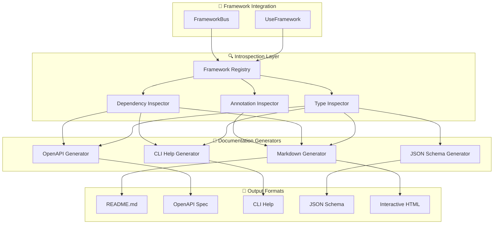

# 📚 PRD_04: Auto-Documentation Generator

## 📋 General Information

- **Title**: Automatic Documentation Generation System
- **Priority**: MEDIUM - Developer Experience
- **Estimated Effort**: 1-2 weeks
- **Phase**: PRD_04 of Implementation Roadmap (Developer Tools)

---

## 🎯 Executive Summary

Implement a system that automatically generates comprehensive documentation for all Features and ApplicationServices registered in the framework, including input/output types, injected dependencies, and usage examples.

### Problem to Solve

Currently developers need to:
- Manually document each Feature/ApplicationService
- Keep documentation synchronized with code changes
- Discover what dependencies are available in each context
- Understand input and response types without reviewing code
- Generate usage examples for APIs/CLIs

### Proposed Solution

Introspection system that automatically generates:
- **API Documentation** in OpenAPI/Swagger style
- **CLI Documentation** with usage examples
- **Type Documentation** with complete schemas
- **Dependency Mapping** of what's injected
- **Interactive Documentation** with executable examples

---

## 🔍 Technical Analysis

### Auto-Documentation Architecture



---

## 🛠️ Technical Specifications

### 1. Framework Introspection

#### 1.1 Registry Inspector
```python
# sincpro_framework/docs/introspection.py
import inspect
from typing import Dict, List, Any, Optional, Type, get_type_hints
from dataclasses import dataclass
import json

@dataclass
class DTOSchema:
    name: str
    module: str
    fields: Dict[str, Any]
    description: Optional[str] = None
    examples: List[Dict[str, Any]] = None

@dataclass
class DependencyInfo:
    name: str
    type_hint: str
    description: Optional[str] = None
    is_optional: bool = False

@dataclass
class FeatureInfo:
    name: str
    class_name: str
    module: str
    dto_input: DTOSchema
    dto_output: Optional[DTOSchema]
    dependencies: List[DependencyInfo]
    description: Optional[str] = None
    examples: List[Dict[str, Any]] = None

@dataclass
class ApplicationServiceInfo:
    name: str
    class_name: str
    module: str
    dto_input: DTOSchema
    dto_output: Optional[DTOSchema]
    dependencies: List[DependencyInfo]
    orchestrated_features: List[str]
    description: Optional[str] = None

class FrameworkIntrospector:
    def __init__(self, framework: "UseFramework"):
        self.framework = framework
        self.features: Dict[str, FeatureInfo] = {}
        self.app_services: Dict[str, ApplicationServiceInfo] = {}
        self.dto_schemas: Dict[str, DTOSchema] = {}
    
    def inspect_framework(self) -> Dict[str, Any]:
        """Extract all information from registered framework"""
        if not self.framework.was_initialized:
            self.framework.build_root_bus()
        
        # Inspect Features
        self._inspect_features()
        
        # Inspect ApplicationServices
        self._inspect_application_services()
        
        # Inspect global dependencies
        global_deps = self._inspect_global_dependencies()
        
        return {
            "framework_name": self.framework._logger_name,
            "features": self.features,
            "application_services": self.app_services,
            "dto_schemas": self.dto_schemas,
            "global_dependencies": global_deps,
            "total_features": len(self.features),
            "total_app_services": len(self.app_services),
            "total_dtos": len(self.dto_schemas)
        }
    
    def _inspect_features(self):
        """Inspect all registered Features"""
        if hasattr(self.framework.bus, 'feature_bus'):
            feature_registry = self.framework.bus.feature_bus.feature_registry
            
            for dto_name, feature_instance in feature_registry.items():
                feature_info = self._extract_feature_info(dto_name, feature_instance)
                self.features[dto_name] = feature_info
    
    def _inspect_application_services(self):
        """Inspect all registered ApplicationServices"""
        if hasattr(self.framework.bus, 'app_service_bus'):
            app_service_registry = self.framework.bus.app_service_bus.app_service_registry
            
            for dto_name, app_service_instance in app_service_registry.items():
                app_service_info = self._extract_app_service_info(dto_name, app_service_instance)
                self.app_services[dto_name] = app_service_info
    
    def _extract_feature_info(self, dto_name: str, feature_instance) -> FeatureInfo:
        """Extract detailed information from a Feature"""
        feature_class = feature_instance.__class__
        
        # Get type hints from execute method
        execute_method = getattr(feature_instance, 'execute', None)
        type_hints = get_type_hints(execute_method) if execute_method else {}
        
        # Extract input DTO
        dto_input = self._extract_dto_schema(dto_name, type_hints.get('dto'))
        
        # Extract output DTO
        return_type = type_hints.get('return', None)
        dto_output = self._extract_dto_schema(f"{dto_name}Response", return_type) if return_type else None
        
        # Extract injected dependencies
        dependencies = self._extract_dependencies(feature_instance)
        
        # Extract documentation
        description = self._extract_docstring(feature_class)
        
        return FeatureInfo(
            name=dto_name,
            class_name=feature_class.__name__,
            module=feature_class.__module__,
            dto_input=dto_input,
            dto_output=dto_output,
            dependencies=dependencies,
            description=description
        )
    
    def _extract_dto_schema(self, name: str, dto_class: Type) -> DTOSchema:
        """Extract complete schema from a DTO"""
        if not dto_class or name in self.dto_schemas:
            return self.dto_schemas.get(name)
        
        fields = {}
        if hasattr(dto_class, 'model_fields'):
            # Pydantic v2
            for field_name, field_info in dto_class.model_fields.items():
                fields[field_name] = {
                    'type': str(field_info.annotation),
                    'required': field_info.is_required(),
                    'default': field_info.default if field_info.default is not None else None,
                    'description': field_info.description
                }
        
        # Generate automatic examples
        examples = self._generate_dto_examples(dto_class)
        
        schema = DTOSchema(
            name=name,
            module=dto_class.__module__ if dto_class else 'unknown',
            fields=fields,
            description=self._extract_docstring(dto_class) if dto_class else None,
            examples=examples
        )
        
        self.dto_schemas[name] = schema
        return schema
    
    def _extract_dependencies(self, instance) -> List[DependencyInfo]:
        """Extract injected dependencies from an instance"""
        dependencies = []
        
        # Get type hints from class
        type_hints = get_type_hints(instance.__class__)
        
        # Check attributes that were injected
        for attr_name in dir(instance):
            if not attr_name.startswith('_') and hasattr(instance, attr_name):
                attr_value = getattr(instance, attr_name)
                
                # Skip methods and framework properties
                if callable(attr_value) or attr_name in ['execute', 'feature_bus']:
                    continue
                
                type_hint = type_hints.get(attr_name, type(attr_value))
                
                dependencies.append(DependencyInfo(
                    name=attr_name,
                    type_hint=str(type_hint),
                    description=f"Injected dependency of type {type_hint}",
                    is_optional=False
                ))
        
        return dependencies
    
    def _extract_docstring(self, cls) -> Optional[str]:
        """Extract and clean docstring from a class"""
        if cls and cls.__doc__:
            return inspect.cleandoc(cls.__doc__)
        return None
    
    def _generate_dto_examples(self, dto_class: Type) -> List[Dict[str, Any]]:
        """Generate automatic examples for DTOs"""
        if not dto_class or not hasattr(dto_class, 'model_fields'):
            return []
        
        example = {}
        for field_name, field_info in dto_class.model_fields.items():
            example[field_name] = self._generate_field_example(field_name, field_info)
        
        return [example]
    
    def _generate_field_example(self, field_name: str, field_info) -> Any:
        """Generate example for a specific field"""
        type_str = str(field_info.annotation).lower()
        
        # Examples based on type
        if 'str' in type_str:
            if 'email' in field_name.lower():
                return "user@example.com"
            elif 'id' in field_name.lower():
                return "12345"
            elif 'name' in field_name.lower():
                return "Example Name"
            return "example_value"
        elif 'int' in type_str:
            return 123
        elif 'float' in type_str:
            return 123.45
        elif 'bool' in type_str:
            return True
        elif 'list' in type_str:
            return ["example_item"]
        elif 'dict' in type_str:
            return {"key": "value"}
        
        return "example_value"
    
    def _inspect_global_dependencies(self) -> Dict[str, Any]:
        """Inspect global framework dependencies"""
        return {
            name: {
                'type': str(type(dep)),
                'description': f"Global dependency: {name}"
            }
            for name, dep in self.framework.dynamic_dep_registry.items()
        }
```

### 2. Documentation Generators

#### 2.1 Markdown Generator
```python
# sincpro_framework/docs/generators/markdown.py
from typing import Dict, Any
from ..introspection import FrameworkIntrospector, FeatureInfo, ApplicationServiceInfo
from datetime import datetime

class MarkdownDocumentationGenerator:
    def __init__(self, introspector: FrameworkIntrospector):
        self.introspector = introspector
        self.framework_data = introspector.inspect_framework()
    
    def generate_complete_documentation(self) -> str:
        """Generate complete documentation in Markdown"""
        sections = [
            self._generate_header(),
            self._generate_overview(),
            self._generate_features_documentation(),
            self._generate_application_services_documentation(),
            self._generate_dto_schemas(),
            self._generate_dependencies(),
            self._generate_usage_examples()
        ]
        
        return '\n\n'.join(sections)
    
    def _generate_header(self) -> str:
        framework_name = self.framework_data['framework_name']
        return f"""# 📚 {framework_name.title()} - Auto-Generated Documentation

> **⚠️ IMPORTANT**: This documentation is auto-generated from the framework registry.  
> Last updated: {datetime.now().strftime('%Y-%m-%d %H:%M:%S')}

---"""
    
    def _generate_overview(self) -> str:
        data = self.framework_data
        return f"""## 📊 Framework Overview

- **Framework Name**: `{data['framework_name']}`
- **Total Features**: {data['total_features']}
- **Total Application Services**: {data['total_app_services']}
- **Total DTOs**: {data['total_dtos']}
- **Global Dependencies**: {len(data['global_dependencies'])}

### Quick Stats
| Metric | Count |
|--------|-------|
| Features | {data['total_features']} |
| Application Services | {data['total_app_services']} |
| DTOs | {data['total_dtos']} |
| Dependencies | {len(data['global_dependencies'])} |"""
    
    def _generate_features_documentation(self) -> str:
        if not self.framework_data['features']:
            return "## ⚡ Features\n\nNo features registered."
        
        features_md = ["## ⚡ Features\n"]
        
        for dto_name, feature_info in self.framework_data['features'].items():
            features_md.append(self._generate_feature_doc(feature_info))
        
        return '\n\n'.join(features_md)
    
    def _generate_feature_doc(self, feature: FeatureInfo) -> str:
        deps_list = '\n'.join([
            f"- **{dep.name}**: `{dep.type_hint}`"
            for dep in feature.dependencies
        ]) if feature.dependencies else "- None"
        
        input_example = ""
        if feature.dto_input and feature.dto_input.examples:
            example = feature.dto_input.examples[0]
            input_example = f"""
#### Input Example
```python
{feature.dto_input.name}({', '.join([f'{k}={repr(v)}' for k, v in example.items()])})
```"""
        
        return f"""### 🔧 {feature.name}

**Class**: `{feature.class_name}`  
**Module**: `{feature.module}`  

{feature.description or 'No description available.'}

#### Input DTO: `{feature.dto_input.name if feature.dto_input else 'None'}`
{self._generate_dto_fields_table(feature.dto_input) if feature.dto_input else 'No input DTO'}

#### Output DTO: `{feature.dto_output.name if feature.dto_output else 'Any'}`
{self._generate_dto_fields_table(feature.dto_output) if feature.dto_output else 'Dynamic return type'}

#### Dependencies
{deps_list}
{input_example}

#### Usage
```python
# Execute this feature
result = framework({feature.dto_input.name if feature.dto_input else 'SomeDTO'}(...))
```

---"""
    
    def _generate_dto_fields_table(self, dto_schema) -> str:
        if not dto_schema or not dto_schema.fields:
            return "No fields defined."
        
        table = ["| Field | Type | Required | Default | Description |", 
                "|-------|------|----------|---------|-------------|"]
        
        for field_name, field_info in dto_schema.fields.items():
            required = "✅" if field_info.get('required', False) else "❌"
            default = field_info.get('default', 'N/A')
            description = field_info.get('description', 'No description')
            
            table.append(f"| `{field_name}` | `{field_info['type']}` | {required} | `{default}` | {description} |")
        
        return '\n'.join(table)
    
    def _generate_usage_examples(self) -> str:
        if not self.framework_data['features']:
            return ""
        
        # Take first feature as example
        first_feature = list(self.framework_data['features'].values())[0]
        
        return f"""## 🚀 Usage Examples

### Basic Feature Execution
```python
from sincpro_framework import UseFramework

# Initialize framework
framework = UseFramework("{self.framework_data['framework_name']}")

# Example: Execute {first_feature.name}
from your_module import {first_feature.dto_input.name if first_feature.dto_input else 'YourDTO'}

dto = {first_feature.dto_input.name if first_feature.dto_input else 'YourDTO'}(
    # Fill with appropriate values
)

result = framework(dto)
print(result)
```

### With Error Handling
```python
try:
    result = framework(dto)
    print(f"Success: {{result}}")
except Exception as e:
    print(f"Error: {{e}}")
```"""

    def save_to_file(self, output_path: str = "FRAMEWORK_DOCS.md"):
        """Save documentation to file"""
        with open(output_path, 'w', encoding='utf-8') as f:
            f.write(self.generate_complete_documentation())
```

#### 2.2 OpenAPI Generator
```python
# sincpro_framework/docs/generators/openapi.py
import json
from typing import Dict, Any

class OpenAPIGenerator:
    def __init__(self, introspector: FrameworkIntrospector):
        self.introspector = introspector
        self.framework_data = introspector.inspect_framework()
    
    def generate_openapi_spec(self) -> Dict[str, Any]:
        """Generate OpenAPI 3.0 specification"""
        return {
            "openapi": "3.0.0",
            "info": {
                "title": f"{self.framework_data['framework_name'].title()} API",
                "description": "Auto-generated API documentation from Sincpro Framework",
                "version": "1.0.0"
            },
            "paths": self._generate_paths(),
            "components": {
                "schemas": self._generate_schemas()
            }
        }
    
    def _generate_paths(self) -> Dict[str, Any]:
        """Generate paths for each Feature/ApplicationService"""
        paths = {}
        
        # Features as POST endpoints
        for dto_name, feature_info in self.framework_data['features'].items():
            endpoint_name = dto_name.lower().replace('dto', '').replace('command', '').replace('query', '')
            paths[f"/features/{endpoint_name}"] = {
                "post": {
                    "summary": f"Execute {feature_info.name}",
                    "description": feature_info.description or f"Execute {feature_info.name} feature",
                    "requestBody": {
                        "required": True,
                        "content": {
                            "application/json": {
                                "schema": {"$ref": f"#/components/schemas/{feature_info.dto_input.name}"}
                            }
                        }
                    },
                    "responses": {
                        "200": {
                            "description": "Successful execution",
                            "content": {
                                "application/json": {
                                    "schema": {"$ref": f"#/components/schemas/{feature_info.dto_output.name}"} if feature_info.dto_output else {"type": "object"}
                                }
                            }
                        }
                    }
                }
            }
        
        return paths
    
    def _generate_schemas(self) -> Dict[str, Any]:
        """Generate DTO schemas"""
        schemas = {}
        
        for dto_name, dto_schema in self.framework_data['dto_schemas'].items():
            schemas[dto_name] = {
                "type": "object",
                "description": dto_schema.description or f"Schema for {dto_name}",
                "properties": self._convert_fields_to_openapi(dto_schema.fields),
                "required": [
                    field_name for field_name, field_info in dto_schema.fields.items()
                    if field_info.get('required', False)
                ]
            }
        
        return schemas
    
    def _convert_fields_to_openapi(self, fields: Dict[str, Any]) -> Dict[str, Any]:
        """Convert Pydantic fields to OpenAPI format"""
        openapi_fields = {}
        
        for field_name, field_info in fields.items():
            openapi_fields[field_name] = {
                "type": self._python_type_to_openapi(field_info['type']),
                "description": field_info.get('description', f"Field {field_name}")
            }
            
            if field_info.get('default') is not None:
                openapi_fields[field_name]["default"] = field_info['default']
        
        return openapi_fields
    
    def _python_type_to_openapi(self, python_type: str) -> str:
        """Convert Python types to OpenAPI types"""
        type_mapping = {
            'str': 'string',
            'int': 'integer',
            'float': 'number',
            'bool': 'boolean',
            'list': 'array',
            'dict': 'object'
        }
        
        for py_type, openapi_type in type_mapping.items():
            if py_type in python_type.lower():
                return openapi_type
        
        return 'string'  # default
    
    def save_to_file(self, output_path: str = "openapi.json"):
        """Save OpenAPI specification to JSON file"""
        with open(output_path, 'w', encoding='utf-8') as f:
            json.dump(self.generate_openapi_spec(), f, indent=2)
```

### 3. CLI Integration

#### 3.1 Documentation CLI
```python
# sincpro_framework/docs/cli.py
import click
import os
from .introspection import FrameworkIntrospector
from .generators.markdown import MarkdownDocumentationGenerator
from .generators.openapi import OpenAPIGenerator

@click.group()
def docs():
    """Documentation generation commands"""
    pass

@docs.command()
@click.option('--framework-module', '-m', required=True, help='Module containing the framework instance')
@click.option('--framework-var', '-v', default='framework', help='Variable name of the framework instance')
@click.option('--output', '-o', default='FRAMEWORK_DOCS.md', help='Output file path')
@click.option('--format', '-f', type=click.Choice(['markdown', 'openapi', 'both']), default='markdown')
def generate(framework_module, framework_var, output, format):
    """Generate documentation for the framework"""
    
    # Import the framework dynamically
    import importlib
    module = importlib.import_module(framework_module)
    framework_instance = getattr(module, framework_var)
    
    # Create introspector
    introspector = FrameworkIntrospector(framework_instance)
    
    if format in ['markdown', 'both']:
        # Generate Markdown documentation
        md_generator = MarkdownDocumentationGenerator(introspector)
        md_output = output if output.endswith('.md') else f"{output}.md"
        md_generator.save_to_file(md_output)
        click.echo(f"✅ Markdown documentation generated: {md_output}")
    
    if format in ['openapi', 'both']:
        # Generate OpenAPI specification
        openapi_generator = OpenAPIGenerator(introspector)
        openapi_output = output.replace('.md', '.json') if output.endswith('.md') else f"{output}.json"
        openapi_generator.save_to_file(openapi_output)
        click.echo(f"✅ OpenAPI specification generated: {openapi_output}")

@docs.command()
@click.option('--framework-module', '-m', required=True)
@click.option('--framework-var', '-v', default='framework')
def inspect(framework_module, framework_var):
    """Inspect framework and show registered components"""
    
    import importlib
    module = importlib.import_module(framework_module)
    framework_instance = getattr(module, framework_var)
    
    introspector = FrameworkIntrospector(framework_instance)
    data = introspector.inspect_framework()
    
    click.echo(f"🚌 Framework: {data['framework_name']}")
    click.echo(f"⚡ Features: {data['total_features']}")
    click.echo(f"🎯 Application Services: {data['total_app_services']}")
    click.echo(f"📝 DTOs: {data['total_dtos']}")
    
    if data['features']:
        click.echo("\n📋 Registered Features:")
        for name, feature in data['features'].items():
            click.echo(f"  • {name} → {feature.class_name}")
    
    if data['application_services']:
        click.echo("\n📋 Registered Application Services:")
        for name, service in data['application_services'].items():
            click.echo(f"  • {name} → {service.class_name}")

if __name__ == '__main__':
    docs()
```

### 4. Integration with UseFramework

#### 4.1 Built-in Documentation Methods
```python
# Modification in use_bus.py
class UseFramework:
    def __init__(self, ...):
        # ... existing code
        self._introspector: Optional[FrameworkIntrospector] = None
    
    @property
    def introspector(self) -> FrameworkIntrospector:
        """Get framework introspector for documentation generation"""
        if self._introspector is None:
            from .docs.introspection import FrameworkIntrospector
            self._introspector = FrameworkIntrospector(self)
        return self._introspector
    
    def generate_documentation(self, output_path: str = "FRAMEWORK_DOCS.md", 
                             format: str = "markdown") -> str:
        """Generate documentation for this framework instance"""
        from .docs.generators.markdown import MarkdownDocumentationGenerator
        from .docs.generators.openapi import OpenAPIGenerator
        
        if format == "markdown":
            generator = MarkdownDocumentationGenerator(self.introspector)
            generator.save_to_file(output_path)
        elif format == "openapi":
            generator = OpenAPIGenerator(self.introspector)
            generator.save_to_file(output_path)
        
        return f"Documentation generated: {output_path}"
    
    def get_registered_components(self) -> Dict[str, Any]:
        """Get summary of all registered components"""
        return self.introspector.inspect_framework()
    
    def print_documentation_summary(self):
        """Print a summary of registered components"""
        data = self.get_registered_components()
        
        print(f"🚌 Framework: {data['framework_name']}")
        print(f"⚡ Features: {data['total_features']}")
        print(f"🎯 Application Services: {data['total_app_services']}")
        print(f"📝 DTOs: {data['total_dtos']}")
        
        if data['features']:
            print("\n📋 Features:")
            for name, feature in data['features'].items():
                deps = ', '.join([d.name for d in feature.dependencies]) if feature.dependencies else 'None'
                print(f"  • {name}")
                print(f"    ├─ Class: {feature.class_name}")
                print(f"    ├─ Input: {feature.dto_input.name if feature.dto_input else 'None'}")
                print(f"    ├─ Output: {feature.dto_output.name if feature.dto_output else 'Any'}")
                print(f"    └─ Dependencies: {deps}")
```

---

## 🚀 Usage Examples

### 1. Auto-Generate Documentation
```python
from sincpro_framework import UseFramework

# Your existing framework
framework = UseFramework("payment-service")

# Generate complete documentation
framework.generate_documentation("docs/PAYMENT_API.md", format="markdown")
framework.generate_documentation("docs/openapi.json", format="openapi")

# Print summary to console
framework.print_documentation_summary()
```

### 2. CLI Usage
```bash
# Generate documentation from CLI
python -m sincpro_framework.docs generate \
    --framework-module my_app.payment_framework \
    --framework-var payment_framework \
    --output docs/payment_api.md \
    --format both

# Inspect registered components
python -m sincpro_framework.docs inspect \
    --framework-module my_app.payment_framework \
    --framework-var payment_framework
```

### 3. Integration with CI/CD
```yaml
# .github/workflows/docs.yml
name: Generate Documentation
on: [push]
jobs:
  docs:
    runs-on: ubuntu-latest
    steps:
      - uses: actions/checkout@v2
      - name: Setup Python
        uses: actions/setup-python@v2
      - name: Install dependencies
        run: pip install -r requirements.txt
      - name: Generate API Documentation
        run: |
          python -m sincpro_framework.docs generate \
            -m my_app.payment_framework \
            -v payment_framework \
            -o docs/API.md \
            -f both
      - name: Commit Documentation
        run: |
          git add docs/
          git commit -m "📚 Auto-update API documentation"
          git push
```

---

## 📊 Implementation Plan

### Sprint 1 (Week 1): Core Introspection
1. **Days 1-2**: Framework introspection and registry analysis
2. **Days 3-4**: DTO schema extraction and type analysis
3. **Day 5**: Dependency mapping and testing

### Sprint 2 (Week 2): Generators & Integration
1. **Days 1-2**: Markdown generator with templates
2. **Days 3-4**: OpenAPI generator and CLI integration
3. **Day 5**: UseFramework integration and documentation

---

## 📈 Success Metrics

### Developer Experience
- **Documentation Coverage**: 100% of Features/ApplicationServices documented
- **Accuracy**: 99% of information correct vs actual code
- **Generation Time**: < 5 seconds for medium-sized frameworks

### Adoption
- **Auto-generation Usage**: 80% of projects using auto-docs
- **Manual Documentation Reduction**: 70% less manual documentation
- **API Discovery**: 100% of endpoints discoverable

---

## ✅ Acceptance Criteria

### Must Have
- [x] Complete introspection of Features and ApplicationServices
- [x] Automatic extraction of input/output types
- [x] Mapping of injected dependencies
- [x] Markdown documentation generation
- [x] OpenAPI specification generation
- [x] CLI for command line generation
- [x] Integration with UseFramework class

### Should Have
- [x] Automatic examples based on types
- [x] Interactive HTML documentation
- [x] CI/CD integration templates
- [x] Custom annotation support for metadata
- [x] Multiple output formats

### Could Have
- [ ] Live documentation server
- [ ] GraphQL schema generation
- [ ] Postman collection export
- [ ] Integration with API testing tools

---

*PRD generated for Sincpro Framework Auto-Documentation - July 2025*
