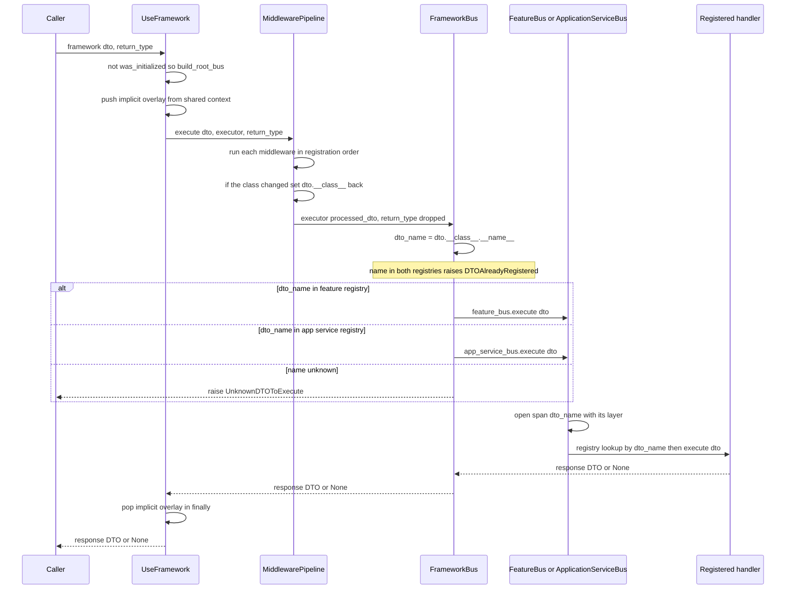
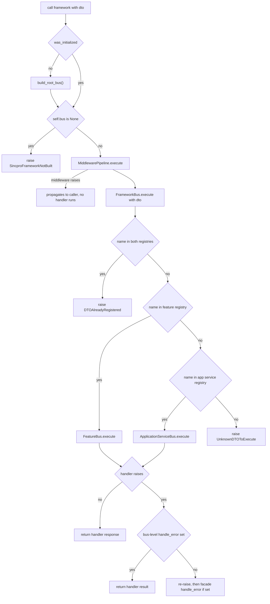

# Executing a DTO: the end-to-end bus flow

`framework(dto)` is the single execution entry point of a bounded context. One call does five
things in a fixed order: it builds the bus lazily if it was never built, publishes a copy of the
shared context for the duration of the call, runs the middleware chain, routes the DTO by its
class **name** into exactly one of the two sub-buses, and finally returns whatever the registered
`Feature.execute` / `ApplicationService.execute` produced. Only the sub-bus that runs the handler
opens a span.

This page documents the control flow as implemented. For why the bus is a facade over two
registries (and the pattern vocabulary around it), read
[docs/architecture/ARCHITECTURE.md](../../docs/architecture/ARCHITECTURE.md) — the authoritative
design document; this page does not restate its rationale. Structural context lives in
[Architecture overview](/openwiki/architecture/overview.md); how DTO names get into the registries
is on [registration and IoC](/openwiki/architecture/registration-and-ioc.md).

## The entry point: `UseFramework.__call__`

`UseFramework` (`sincpro_framework/use_bus.py:19`) is callable. Its `__call__`
(`sincpro_framework/use_bus.py:373-404`) accepts `dto` and an optional `return_type`, and its body is
only four statements wide:

1. **Lazy build.** `if not self.was_initialized: self.build_root_bus()`
   (`sincpro_framework/use_bus.py:377-378`). Nothing has to call `build_root_bus()` explicitly: the
   first `framework(dto)` bootstraps the bus. The same lazy build is repeated by
   `with_trace()` (`sincpro_framework/use_bus.py:316-317`), `with_parent_trace()`
   (`sincpro_framework/use_bus.py:355-356`), `get_async_bus()`
   (`sincpro_framework/use_bus.py:368-369`) and by the entrypoint `Catalog`
   (`sincpro_framework/entrypoints/catalog.py:49-50`). `was_initialized` is a plain instance flag
   set inside `build_root_bus()` (`sincpro_framework/use_bus.py:87`, `127`).
2. **Defensive not-built guard.** If `self.bus is None` after that step, `__call__` raises
   `SincproFrameworkNotBuilt` (`sincpro_framework/use_bus.py:380-386`). This is reachable, not
   decorative: `build_root_bus()` sets `was_initialized = True`
   (`sincpro_framework/use_bus.py:127`) *before* it assigns `self.bus = …framework_bus()`
   (`sincpro_framework/use_bus.py:130`). A first build whose `FrameworkBus` materialisation raises
   therefore propagates that original error to the *first* caller while leaving the flag `True` and
   `self.bus` at `None`; every *subsequent* `framework(dto)` then stops here. The error is recorded
   with `kind="framework"` (`sincpro_framework/use_bus.py:385`), and this guard is the only place
   `SincproFrameworkNotBuilt` is raised
   (`sincpro_framework/exceptions.py:17-18`). `get_async_bus()` hits the same post-build state but
   guards it with a bare `assert self.bus is not None` (`sincpro_framework/use_bus.py:370`), so the
   only entry point that turns it into a catchable, reported framework error is `__call__`.
3. **Implicit context overlay.** If no overlay is active on the current task/thread and no
   global-scope block is in effect — `self._overlay_var.get() is None and not
   self._in_global_var.get()` (`sincpro_framework/use_bus.py:390`) — `__call__` pushes an isolated
   overlay initialised with a copy of the shared context
   (`sincpro_framework/use_bus.py:391`). Handlers therefore read the shared context's entries, while
   anything written to the context during the call goes to the throwaway overlay, which is popped
   in a `finally` (`sincpro_framework/use_bus.py:402-404`). When a `framework.context(...)` block or
   `with_trace()` block is already active, no second overlay is pushed and the caller's overlay is
   left untouched. See [context propagation](/openwiki/concepts/context-propagation.md) for the
   overlay/global-scope model itself.
4. **Middleware, then the bus.** The DTO is handed to the middleware pipeline together with an
   `executor` closure that calls `self.bus.execute(processed_dto)`
   (`sincpro_framework/use_bus.py:393-401`).

`__call__` is the only caller of `MiddlewarePipeline.execute` (`sincpro_framework/use_bus.py:401`).
The two thread/async handles — `framework.bus.thread_context()` and
`framework.get_async_bus()` → `AsyncBus` — call `Bus.execute` directly, so a DTO handed to one of them
skips the middleware chain and the implicit overlay described below. Those handles and their reuse
rules belong to [concurrency and context handoff](/openwiki/architecture/concurrency-and-context-handoff.md).

Every host entrypoint converges on this method instead: `entrypoints/scalar_executor.py` binds each
DTO to a Scalar-callable with `framework_instance(dto_type.model_validate(payload))`
(`sincpro_framework/entrypoints/scalar_executor.py:57-74`), the catalog projection stores that closure
as each entry's `run` (`sincpro_framework/entrypoints/catalog.py:83-85`), and the MCP and JSON-RPC
hosts call it (`sincpro_framework/entrypoints/mcp/mcp.py:28`,
`sincpro_framework/entrypoints/rpc/jrpc.py:91`). Whatever a wire host does with its payload, the
execution path is the one on this page.

### Sequence of one call

*One `framework(dto)` call: lazy build, implicit overlay, middleware, facade routing, one span at the layer that executes, and the response returned unchanged. The failure branches off this path are the flowchart below.*

## The middleware stage

`MiddlewarePipeline.execute` (`sincpro_framework/middleware.py:34-53`) does three things:

- captures the original class — `original_dto_class = dto.__class__`
  (`sincpro_framework/middleware.py:42`);
- runs each registered middleware in registration order, feeding each one the previous one's return
  value (`sincpro_framework/middleware.py:45-46`); `add_middleware` simply appends
  (`sincpro_framework/middleware.py:30-32`, called from `sincpro_framework/use_bus.py:183-185`);
- **monkey-patches the DTO class back** when a middleware replaced the object with a different
  DTO type: `if processed_dto.__class__ != original_dto_class: processed_dto.__class__ =
  original_dto_class` (`sincpro_framework/middleware.py:49-50`), then calls
  `executor(processed_dto, **kwargs)` (`sincpro_framework/middleware.py:53`).

That patch is what keeps routing intact: the registry key is derived from `dto.__class__.__name__`
inside the buses (`sincpro_framework/bus.py:45`, `173`), so a middleware that returns an *enriched*
DTO would otherwise miss the registry. Because only `__class__` is reassigned, the enriched
attributes travel with the instance while the handler still sees the original type — the behaviour
asserted in `tests/test_middleware.py:163-204`. A second integration test repeats it with a
differently-typed enriched DTO (`tests/test_middleware.py:206-279`), and a framework with no
middleware registered returns the original DTO untouched, with no attribute the middleware would have
added (`tests/test_middleware.py:302-319`).

Middleware is not part of the buses' `try` block: an exception raised by a middleware propagates
straight out of `__call__` to the caller (`sincpro_framework/middleware.py:45-46`,
`sincpro_framework/use_bus.py:400-404` — the `finally` still pops the implicit overlay) and no error
handler — feature, app-service or global — is consulted. That includes validation failures a
middleware raises on purpose, which surface as the middleware's own exception type
(`tests/test_middleware.py:281-300`).

## What each bus does with the DTO

Both sub-buses share the same five-step shape; only the registry, the registry attribute and the
span's `layer` string differ.

| | `FeatureBus` | `ApplicationServiceBus` |
| --- | --- | --- |
| registry attribute | `feature_registry` (`sincpro_framework/bus.py:25`) | `app_service_registry` (`sincpro_framework/bus.py:77`) |
| registration method | `register_feature` (`sincpro_framework/bus.py:30-39`) | `register_app_service` (`sincpro_framework/bus.py:82-95`) |
| span layer | `"feature"` (`sincpro_framework/bus.py:47`) | `"application_service"` (`sincpro_framework/bus.py:103`) |
| lookup key | `dto.__class__.__name__` (`sincpro_framework/bus.py:53`) | `dto.__class__.__name__` (`sincpro_framework/bus.py:109`) |

Execution in `FeatureBus.execute` (`sincpro_framework/bus.py:41-64`):

1. `dto_name = dto.__class__.__name__` (`sincpro_framework/bus.py:45`).
2. One span named after the DTO, opened with the layer string
   (`sincpro_framework/bus.py:47`; `Observability.span` at
   `sincpro_framework/observability/api.py:97-99`, implementation in
   `sincpro_framework/observability/tracing/span_execution.py:70-76`). When OpenTelemetry is absent
   the span degrades to `nullcontext()` and the call is unaffected
   (`sincpro_framework/observability/tracing/span_execution.py:40-52`). Details on
   [tracing](/openwiki/integrations/observability-tracing.md).
3. Pre-execution logging gated by `is_logger_in_debug() or self.log_after_execution`
   (`sincpro_framework/bus.py:48-50`); those flags are copied onto the buses by
   `build_root_bus()` (`sincpro_framework/use_bus.py:134-140`), with the per-layer
   `log_features` / `log_app_services` toggles ANDed in.
4. `response = self.<registry>[dto.__class__.__name__].execute(dto)`
   (`sincpro_framework/bus.py:53`) — a direct dict lookup followed by the handler's own `execute`.
5. The handler's return value is logged (only when truthy) and returned as-is
   (`sincpro_framework/bus.py:54-58`). There is no coercion, no wrapping and no type check.

`ApplicationServiceBus.execute` (`sincpro_framework/bus.py:97-120`) is the same flow with
`app_service_registry` (`sincpro_framework/bus.py:109`) and the `"application_service"` span layer
(`sincpro_framework/bus.py:103`). The `feature_bus` an `ApplicationService` receives is the *same*
`FeatureBus` object the facade holds — the container builds app services with
`framework_container.feature_bus` (`sincpro_framework/ioc.py:141-143`), and
`tests/observability/test_bus_wiring.py:54-63` pins that identity. A delegated call from an
`ApplicationService` therefore re-enters `FeatureBus.execute` and opens its own `"feature"` span.

### The facade decides, the registries answer

`FrameworkBus.execute` (`sincpro_framework/bus.py:164-205`) is pure routing; it never executes a
handler itself:

- `dto_name = dto.__class__.__name__` (`sincpro_framework/bus.py:173`).
- **Conflict re-check first**: if the name is in *both* registries it raises `DTOAlreadyRegistered`
  (`sincpro_framework/bus.py:175-182`). The constructor performs the same check once, at build time
  (`sincpro_framework/bus.py:150-162`, raising `DTOAlreadyRegistered` and logging the colliding
  names); the call-time check repeats it on **every** execution, so the invariant is re-asserted
  immediately before routing.
- **Membership decides the layer**: `dto_name in self.feature_bus.feature_registry` →
  `feature_bus.execute(dto)` (`sincpro_framework/bus.py:183-185`); otherwise
  `dto_name in self.app_service_bus.app_service_registry` → `app_service_bus.execute(dto)`
  (`sincpro_framework/bus.py:187-189`).
- **Otherwise** it raises `UnknownDTOToExecute` naming the DTO, pointing at the decorators
  (`sincpro_framework/bus.py:191-194`).

The registry keys are the input DTO class `__name__`, both at registration time
(`sincpro_framework/ioc.py:96`, `119-121`; `sincpro_framework/bus.py:38`, `94`) and at lookup time
(`sincpro_framework/bus.py:53`, `109`, `173`). Two consequences worth stating plainly:

- Names, not classes, are the key. Two distinct DTO classes with the same `__name__` collide; the
  decorator raises `DTOAlreadyRegistered` within a layer
  (`sincpro_framework/ioc.py:103-105`, `111-113`).
- Because a name cannot legally live in both registries, the *order* in which the facade tests the
  two registries has no observable effect. It is worth knowing that the docstring of
  `FrameworkBus.execute` describes the opposite order — "execute the DTO in the app service bus …
  otherwise … the feature bus" (`sincpro_framework/bus.py:167-172`) — while the implementation
  checks the feature registry first (`sincpro_framework/bus.py:183-189`). The disjointness invariant
  (`sincpro_framework/bus.py:154-162`, `175-182`) is what makes the discrepancy harmless.

The facade opens **no span of its own**: a call is spanned exactly once, by the sub-bus that
executes it. `FrameworkBus` reaches observability only to report framework-level errors
(`sincpro_framework/bus.py:197-200`).

### `return_type` is accepted but not used

`return_type` appears in the signature of `UseFramework.__call__`
(`sincpro_framework/use_bus.py:373-374`), of all three buses
(`sincpro_framework/bus.py:41-43`, `97-99`, `164-166`) and of the `Bus` ABC
(`sincpro_framework/sincpro_abstractions.py:35-43`), and in the async/thread wrappers
(`sincpro_framework/aio/bus.py:69-70`, `sincpro_framework/context/thread_context_bus.py:52`). No
bus body ever reads it: the argument is passed down through the middleware pipeline
(`sincpro_framework/use_bus.py:401`) into the executor closure, which accepts `**exec_kwargs` and
ignores them before calling `self.bus.execute(processed_dto)`
(`sincpro_framework/use_bus.py:393-398`). The returned value is always whatever the handler's
`execute` returned.

The abstract `Bus.execute` docstring claims "If `return_type` is provided, returns an instance of
`return_type`. Otherwise, returns `None`." (`sincpro_framework/sincpro_abstractions.py:39-43`) — treat
that as documentation of intent, not behaviour. `return_type` is a **static-typing** device: the
stub overloads narrow the return type for the IDE and the type checker
(`sincpro_framework/use_bus.pyi:79-106`, `sincpro_framework/bus.pyi:36-44`, `69-77`, `105-123`), and
`TypeDTOResponse` is a public export from `sincpro_framework/__init__.py:2-8`. Passing an unrelated
class changes nothing at runtime.

## Failure paths

*Every branch out of the execution path, in the order the code tests them.*

| Failure | Raised / produced at | Handler visible? |
| --- | --- | --- |
| `SincproFrameworkNotBuilt` | `sincpro_framework/use_bus.py:380-386` (the only path where `bus` is `None` after a lazy build) | no — `__call__` has no handler for it |
| middleware exception | `sincpro_framework/middleware.py:45-46`, outside the buses | no |
| `UnknownDTOToExecute` | `sincpro_framework/bus.py:191-194` | yes — through the facade `except` at `sincpro_framework/bus.py:196-205` |
| `DTOAlreadyRegistered` (present in both registries) | `sincpro_framework/bus.py:175-182` at call time; `sincpro_framework/bus.py:154-162` at construction | yes, same facade `except` |
| `DTOAlreadyRegistered` (same layer twice) | decoration time: `sincpro_framework/ioc.py:103-105`, `111-113`; registration API: `sincpro_framework/bus.py:33-35`, `89-91` | no — raised before any execution |
| handler exception, no handler registered | `sincpro_framework/bus.py:60-64` (feature) or `116-120` (app service), then `sincpro_framework/bus.py:196-205` (facade) | yes, at both levels |
| unregistered DTO passed to a sub-bus directly | the `KeyError` from `sincpro_framework/bus.py:53` or `109` | yes (the sub-bus `except`) — but this is *not* `UnknownDTOToExecute`; only the facade raises that |

Two consequences of the layout:

- **The sub-bus handler runs first.** A handler attached at the feature or app-service level returns
  a value that becomes the bus response and travels back through the facade untouched
  (`sincpro_framework/bus.py:60-64`, `183-189`). The facade's own `handle_error` only sees an
  exception that the sub-bus re-raised (or that the facade itself raised)
  (`sincpro_framework/bus.py:196-205`). `tests/error_handler/test_application_layer.py:19-73`
  exercises exactly this hand-off between the two layers, and
  `tests/error_handler/test_framework_layer.py:82-135` the re-raise case where the feature-level
  handler converts one exception type into another for the layer above.
- **Framework-level failures are reported, not spanned.** Only `UnknownDTOToExecute` and
  `DTOAlreadyRegistered` are sent to observability from the facade, and with `kind="framework"`
  (`sincpro_framework/bus.py:197-200`), which switches the reported release to the framework's own
  distribution (`sincpro_framework/observability/errors/record_error.py:35-36`). Because no span is
  passed, nothing is recorded on a span (`sincpro_framework/observability/tracing/span_error.py:8-16`).
  See [observability errors](/openwiki/integrations/observability-errors.md).

Three further properties of this layout matter when reading the table:

- **Only `Exception` is caught.** Every one of those `except` clauses is `except Exception`
  (`sincpro_framework/bus.py:60`, `116`, `196`), so anything derived from `BaseException` rather than
  `Exception` — `KeyboardInterrupt`, `SystemExit`, `asyncio.CancelledError` — skips both reporting
  and the error handlers and simply propagates.
- **A handled failure is indistinguishable from a success at the call site.** The sub-bus's `return
  self.handle_error(error)` and the facade's equivalent hand the handler's return value back as the
  bus response (`sincpro_framework/bus.py:62-63`, `118-119`, `201-202`), so a handler is free to
  return a non-DTO: `tests/error_handler/test_framework_layer.py:22-79` asserts a handled error
  produces the plain string `"Error handled"`. Callers that expect a response DTO must account for
  this.
- **`__call__` has no `except`.** Nothing above `FrameworkBus.execute` catches anything, so whatever
  the facade re-raises — or raises itself — reaches the caller unchanged
  (`sincpro_framework/use_bus.py:400-404`); only the implicit overlay pop still runs.

When neither handler exists, the facade logs with `logger.exception` and re-raises the original
exception object (`sincpro_framework/bus.py:204-205`).

The three exceptions this path can raise are defined in `sincpro_framework/exceptions.py:1-18`
(`DTOAlreadyRegistered`, `UnknownDTOToExecute`, `SincproFrameworkNotBuilt`), and none of them is
re-exported by `sincpro_framework/__init__.py:12-21`. A caller that wants to catch a routing or
build failure imports from `sincpro_framework.exceptions`, which is what the bus tests do
(`tests/bus/test_framework_bus.py:6`) and the Sentry error tests as well
(`tests/observability/errors/test_sentry.py:7`).

### Handler delegation

`handle_error` is a single composed callable per bus (`sincpro_framework/error_handler.py:44-57`):
`build_error_handler_chain` folds the registered handlers in reverse so that **first registered is
first executed**, and a handler that re-raises is automatically delegated to the next one, the last
one re-raising to the caller (`sincpro_framework/error_handler.py:19-41`). `UseFramework` maintains
three independent chains and pushes each onto the matching bus
(`sincpro_framework/use_bus.py:187-238`): global → `bus.handle_error`, feature →
`bus.feature_bus.handle_error`, app service → `bus.app_service_bus.handle_error`. All three can be
registered before or after `build_root_bus()`; registrations made after the build are assigned
straight onto the live buses (`sincpro_framework/use_bus.py:211-212`, `223-224`, `237-238`).
`tests/error_handler/test_use_framework_error_handlers.py:25-57` pins the h1 → h2 → h3 ordering.
The full handler contract belongs to [error handling](/openwiki/workflows/error-handling.md).

## Lifecycle, state and invariants

- **Build once, reuse.** `build_root_bus()` (`sincpro_framework/use_bus.py:123-150`) pushes dynamic
  dependencies onto already-registered handlers (`sincpro_framework/use_bus.py:90-105`), attaches the
  three error handlers (`sincpro_framework/use_bus.py:107-121`), materialises `self.bus` from the
  container (`sincpro_framework/use_bus.py:130`), binds every registered handler instance to the
  framework so `self.context` resolves to the live overlay
  (`sincpro_framework/context/mixin.py:65-71`,
  `sincpro_framework/context/framework_context_consumer.py:15-23`), copies log flags
  (`sincpro_framework/use_bus.py:134-140`), publishes the DTO-name → DTO-class registry used by
  introspection (`sincpro_framework/use_bus.py:142-143`, read at
  `sincpro_framework/introspection/inspector.py:101`, `109`), and starts observability
  (`sincpro_framework/use_bus.py:150`). `FeatureBus` and `ApplicationServiceBus` are container
  **singletons** while `FrameworkBus` is a **factory** (`sincpro_framework/ioc.py:49-66`), so a
  second `build_root_bus()` produces a new facade over the same sub-buses and the same registries.
- **Per-instance isolation.** Each `UseFramework` owns its containers, registries, overlay
  `ContextVar`s and observability object; two instances in one process do not share buses
  (`tests/use_container/test_multiple_instances.py:30-41`,
  `tests/observability/test_bus_wiring.py:66-83`).
- **One call, one implicit overlay.** Nested/`with` blocks are never shadowed by `__call__`
  (`sincpro_framework/use_bus.py:390`), and the overlay is always popped in `finally`, including on
  failure (`sincpro_framework/use_bus.py:402-404`).
- **The registry is the router.** Nothing else — no priority field, no `isinstance` dispatch, no
  `return_type` — influences which layer runs a DTO
  (`sincpro_framework/bus.py:173-194`).
- **`sincpro_framework.bus` is internal.** The public surface is what
  `sincpro_framework/__init__.py:12-20` exports (`UseFramework`, `Feature`, `ApplicationService`,
  `DataTransferObject`, `Middleware`, `logger`, `TypeDTO`, `TypeDTOResponse`); the concrete buses are
  reachable through `framework.bus` and by importing `sincpro_framework.bus` directly (as the
  fixtures under `tests/` do), which is also how a caller can bypass the middleware pipeline, the
  implicit overlay and `UnknownDTOToExecute` entirely.

### What pins this behaviour

`tests/bus/test_framework_bus.py:16-33` routes one feature DTO and one application-service DTO
through `FrameworkBus.execute`; `:36-47` asserts `UnknownDTOToExecute` for an unregistered DTO;
`:50-63` asserts `DTOAlreadyRegistered` when the same name is registered in both layers — that case is
reached at construction, so it pins the build-time check rather than the per-call re-check.
`tests/test_middleware.py:163-204` proves the `__class__` monkey-patch keeps a transformed DTO
routable. `tests/error_handler/test_framework_layer.py:22-79` proves a layer's `handle_error` result
becomes the bus response. `tests/observability/errors/test_sentry.py:303-321` checks that an unknown
DTO is reported with `sincpro.kind == "framework"`; `:324-340` that it still reports when
`ignore_sentry_exceptions` covers `Exception`, because framework-kind errors bypass the ignore list
(`sincpro_framework/observability/errors/record_error.py:32-36`).
