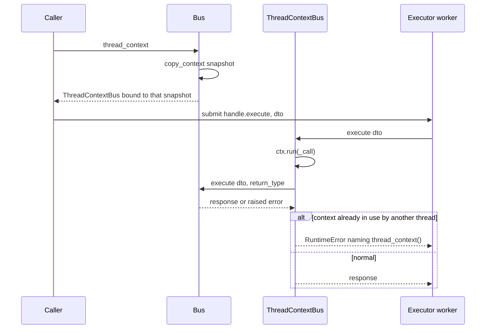
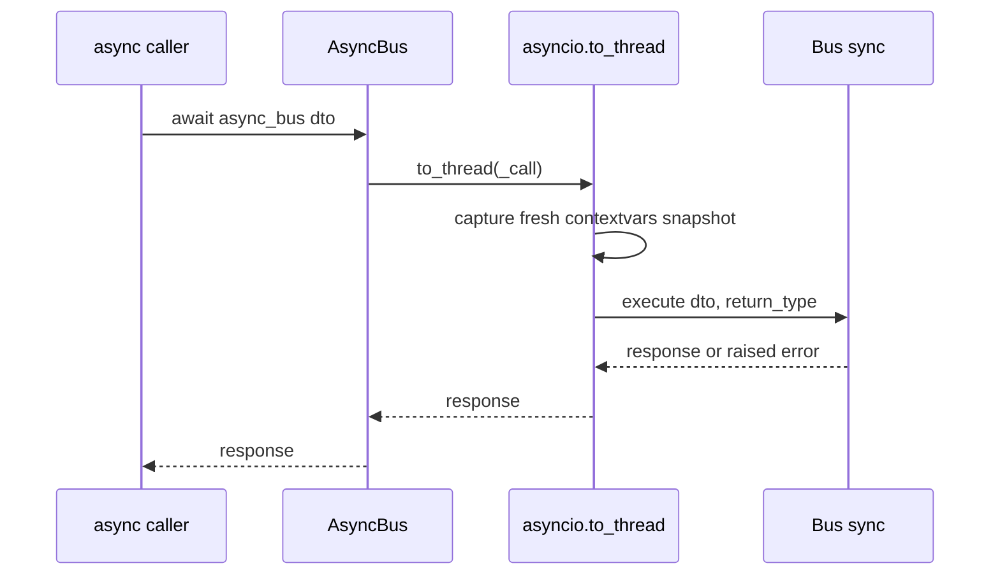

# Concurrency: thread handoff, async facade and free-threading status

`Bus.execute` is synchronous end to end, and the framework's per-call context is stored in a
`ContextVar` — which Python isolates **per OS thread**. The moment a `Feature` or
`ApplicationService` hands work to another thread, that thread has never run the overlay's `set()`
and `self.context` silently falls back to the instance's shared dict. The framework offers exactly
two handles for that crossing: `Bus.thread_context()` for sync code managing its own executor, and
`Bus.get_async_bus()` for callers that are themselves `async def`. They solve the same problem and
have **opposite reuse rules** — a `ThreadContextBus` is single-use per captured snapshot, an
`AsyncBus` is stateless and reusable. Getting those two backwards is the common bug, so this page
states each rule next to its source.

For how a DTO travels once it reaches a bus (routing, registries, spans, error handlers), see
[executing a DTO](/openwiki/architecture/bus-execution.md). For the overlay/global-scope model
itself, see [context propagation](/openwiki/concepts/context-propagation.md).

## Why a plain `executor.submit(bus.execute, dto)` loses `self.context`

- The overlay lives in a per-instance `ContextVar` — `ContextVar(f"sincpro_ctx_overlay_{id(self)}",
  default=None)` (`sincpro_framework/context/mixin.py:29-31`) — and `_get_context()` returns the
  overlay when one is active, otherwise the instance's `_shared_context`
  (`sincpro_framework/context/mixin.py:38-42`).
- `ContextVar` values are isolated per OS thread by design. A new thread created by
  `executor.submit(...)` never saw the overlay's `.set()`, so `_get_context()` in that thread
  returns the (usually empty) shared dict (`sincpro_framework/context/thread_context_bus.py:1-6`).
- `Bus.thread_context()`'s own docstring names the exact symptom: a plain
  `executor.submit(bus.execute, dto)` makes "every Feature's `self.context` there silently fall
  back to the (usually empty) shared context"
  (`sincpro_framework/sincpro_abstractions.py:45-54`).
- The loss is total rather than intermittent, which is what made the original bug hard to read as
  a bug: every worker lost the context
  (`sincpro_framework/context/thread_context_bus.py:1-6`,
  `tests/test_thread_context_bus.py:165-175`).

The fix in both cases is the same shape: capture or re-establish the context **in the thread that
still has it active**, and hand the *handle* — not the raw bus — to the new thread.

**The one case that survives a bare `submit`: `global_scope=True`.** `_get_context()` returns the
overlay if one is active on the *calling thread*, otherwise `_shared_context`
(`sincpro_framework/context/mixin.py:38-42`). A `framework.context(..., global_scope=True)` block
writes into `_shared_context` (and into every live overlay) rather than a thread-local overlay
(`sincpro_framework/context/framework_context.py:61-73`), so a worker thread with no overlay of its
own reads those keys anyway — no handle needed. That is not a substitute for the handles: it only
covers the keys published globally, and `UseFramework.context(..., global_scope=True)` is documented
as a deliberate opt-in that lets concurrent executions of one instance see each other's keys, not as
a thread-propagation mechanism (`sincpro_framework/use_bus.py:249-257`). The isolated default is
what loses context, and that is what the two handles fix.

## The two handles

| | `Bus.thread_context()` | `Bus.get_async_bus()` |
| --- | --- | --- |
| returns | `ThreadContextBus` (`sincpro_framework/sincpro_abstractions.py:45-70`) | `AsyncBus` (`sincpro_framework/sincpro_abstractions.py:72-82`) |
| for callers that | are sync and manage a `ThreadPoolExecutor` themselves | are `async def` and must not block their event loop |
| context mechanism | snapshot captured up front, replayed with `Context.run` (`sincpro_framework/context/thread_context_bus.py:61-62`) | `asyncio.to_thread` captures a fresh snapshot per call (`sincpro_framework/aio/bus.py:9-13`) |
| **reuse rule** | **one per submitted task** — never share across concurrent workers (`sincpro_framework/context/thread_context_bus.py:42-44`) | **create once, reuse for every call** (`sincpro_framework/aio/bus.py:30-35`) |
| on misuse | guided `RuntimeError` naming `thread_context()` (`sincpro_framework/context/thread_context_bus.py:61-70`) | nothing to misuse — stateless |
| callable sugar | none, only `.execute` | `await async_bus(dto)` via `__call__` (`sincpro_framework/aio/bus.py:88-91`) |
| exposed on `UseFramework` | no | yes, `UseFramework.get_async_bus()` (`sincpro_framework/use_bus.py:359-371`) |

`AsyncBus` is reachable as `sincpro_framework.aio.AsyncBus` (`sincpro_framework/aio/__init__.py:8`);
it is **not** part of the `sincpro_framework/__init__.py` export list
(`sincpro_framework/__init__.py:12-21`). The `aio` package docstring states the intent that future
async-only additions belong there as well, "so this stays the one place to look"
(`sincpro_framework/aio/__init__.py:1-6`).

### Sync fan-out: `thread_context()` once per submitted task



*One `thread_context()` capture handed to one executor task; the snapshot is replayed inside the worker by `Context.run`.*

### Async fan-out: one `AsyncBus`, many concurrent calls



*Every `await` of the same `AsyncBus` goes through `asyncio.to_thread`, which captures its own snapshot at the call site.*

## `thread_context()` / `ThreadContextBus`

**Capture.** `Bus.thread_context()` is a concrete method on the ABC — not abstract — and returns
`ThreadContextBus(self, copy_context())` (`sincpro_framework/sincpro_abstractions.py:70`). The
snapshot is taken **at the moment of the call**, in the calling thread, which is precisely why the
call has to happen while the overlay is still active (`sincpro_framework/sincpro_abstractions.py:45-54`).

**Replay.** `ThreadContextBus.execute` wraps the call in `self._ctx.run(_call)`
(`sincpro_framework/context/thread_context_bus.py:61-62`). `Context.run(...)` replays the snapshot
for the duration of the call regardless of which thread calls it, "which is what lets `.execute`
see the original context after being handed off to a `ThreadPoolExecutor` worker"
(`sincpro_framework/context/thread_context_bus.py:34-40`). `_call` simply forwards to
`self._bus.execute(dto, return_type)` (`sincpro_framework/context/thread_context_bus.py:54-59`).

**Single use per snapshot — the rule most people get wrong.** A `contextvars.Context` can only be
entered by one thread at a time, so one `ThreadContextBus` must not be shared across concurrent
workers; call `Bus.thread_context()` again for each task
(`sincpro_framework/context/thread_context_bus.py:42-44`). The documented shape puts the call
*inside* the comprehension, one per DTO
(`sincpro_framework/sincpro_abstractions.py:55-65`, `README.md:172-197`):

```python
with ThreadPoolExecutor(max_workers=3) as executor:
    futures = [
        # captured here, in this thread, once per task
        executor.submit(self.feature_bus.thread_context().execute, item_dto)
        for item_dto in dto.items
    ]
    results = [f.result() for f in futures]
```

**The guard.** `ThreadContextBus.execute` catches `RuntimeError` and re-raises a new one whose
message tells the developer to call `bus.thread_context()` again inside the loop, right before
`executor.submit`, instead of reusing one instance across the whole batch
(`sincpro_framework/context/thread_context_bus.py:61-70`). It is a `raise ... from error`, so the
original stdlib error is preserved as `__cause__`. The guidance contract is pinned by
`tests/test_thread_context_bus.py:221-261`
(`test_reusing_same_thread_context_bus_concurrently_raises_clear_error`, which asserts
`"thread_context()" in str(raised)` while the first worker's own call still returns the captured
context).

**The documented limitation: the guard cannot tell a business `RuntimeError` from misuse.** The
`except RuntimeError` clause has no way to know where the exception came from, so a `RuntimeError`
raised by a `Feature`'s business logic inside a snapshot-replaying call is re-reported as the
concurrent-reuse error instead of propagating as-is. The code says so explicitly: the raising
exception in the async test suite is deliberately *not* a `RuntimeError` subclass, with the comment
that `ThreadContextBus.execute()` "catches RuntimeError to detect concurrent reuse of one captured
snapshot, so a RuntimeError from the Feature's own business logic would be misreported as that
error instead of propagating as-is" (`tests/test_async_bus.py:40-45`). `AsyncBus`'s module
docstring states the same fact from the other side — calling `self._bus.execute` directly means
"no risk of tripping its single-use-snapshot `RuntimeError` guard on a business exception that
happens to subclass `RuntimeError`" (`sincpro_framework/aio/bus.py:14-16`). Practical consequence:
treat a `RuntimeError` surfaced through a `ThreadContextBus` as *possibly* a business error, keep
business errors off `RuntimeError` where you control the exception type, and prefer `AsyncBus` when
the handlers you dispatch legitimately raise `RuntimeError` subclasses.

## `get_async_bus()` / `AsyncBus`

**Dispatch.** `Bus.get_async_bus()` returns `AsyncBus(self)`
(`sincpro_framework/sincpro_abstractions.py:82`); `AsyncBus.execute` awaits
`asyncio.to_thread(_call)`, and `_call` forwards to `self._bus.execute(dto, return_type)`
(`sincpro_framework/aio/bus.py:69-86`). `__call__` is pure sugar over `execute`
(`sincpro_framework/aio/bus.py:88-91`). `return_type` is forwarded unchanged; for why no bus body
reads it, see [executing a DTO](/openwiki/architecture/bus-execution.md).

**No `ThreadContextBus` involved, on purpose.** `asyncio.to_thread` already captures
`contextvars.copy_context()` at the call site and runs the target inside it (stdlib
`asyncio/threads.py`) — the module docstring calls that "the documented behavior, not an
implementation detail we depend on accidentally"
(`sincpro_framework/aio/bus.py:9-16`). This is also why the guard caveat above does not apply here.

**Reuse rule: stateless, one instance for many calls.** Because `to_thread` captures a fresh
snapshot per call, there is nothing shared to race on between calls, so a single `AsyncBus` is safe
inside `asyncio.gather` (`sincpro_framework/aio/bus.py:30-35`), and
`Bus.get_async_bus()`'s docstring makes the contrast explicit: unlike `thread_context()`, this
handle is reusable across concurrent calls — call it once, then `await`/`gather` many
`.execute()`/`__call__` calls, each capturing its own snapshot
(`sincpro_framework/sincpro_abstractions.py:72-82`, `README.md:199-222`). The shortcut
`UseFramework.get_async_bus()` builds the root bus lazily if it was never built, the same lazy
behaviour as `__call__` (`sincpro_framework/use_bus.py:359-371`); the snapshot independence of two
concurrent calls issued from two different `context()` scopes is pinned by
`tests/test_async_bus.py:143-162`.

**Cancellation does not stop in-flight work.** If the awaiting coroutine is cancelled — e.g.
`asyncio.wait_for(async_bus(dto), timeout=...)` expiring — the `Feature`/`ApplicationService`
already running in its worker thread keeps running to completion, because Python cannot forcibly
kill a thread. The docstring's advice is to design for that (idempotency; no assumption that a
timeout actually stopped the work) rather than relying on cancellation as an abort mechanism
(`sincpro_framework/aio/bus.py:43-48`, `README.md:226-229`).

**Fan-out reliability: prefer `asyncio.TaskGroup` over `asyncio.gather`.** `TaskGroup` (3.11+)
cancels sibling tasks on the first failure and raises an `ExceptionGroup`, instead of `gather`'s
default of leaving siblings running and swallowing all-but-the-first exception unless
`return_exceptions=True` is passed (`sincpro_framework/aio/bus.py:50-54`, `README.md:230-233`).

**Which thread pool runs the work.** `AsyncBus` runs on the calling event loop's default executor
via `asyncio.to_thread`. If the host process also runs an anyio-based server — FastMCP dispatching
sync tools through `anyio.to_thread` is the cited example — that is a second, independent thread
pool: worth knowing when tuning pool sizes, "not a correctness concern"
(`sincpro_framework/aio/bus.py:36-41`).

## Both handles call `Bus.execute` directly

Neither handle passes through `UseFramework.__call__`. The middleware pipeline call and the implicit
overlay push — the one that copies `_shared_context` when no overlay is active — live only in
`__call__` (`sincpro_framework/use_bus.py:388-404`); `MiddlewarePipeline.execute` has exactly one
caller, that same line (`sincpro_framework/use_bus.py:401`). Through
`framework.get_async_bus()` or `framework.bus.thread_context()`, the DTO therefore goes straight to
`Bus.execute`: no middleware, and the only context visible is the snapshot the handle carries.

Which bus you capture also decides the routing surface, because both methods are inherited from
`Bus` by `FeatureBus`, `ApplicationServiceBus` and `FrameworkBus`
(`sincpro_framework/bus.py:17`, `67`, `126`). `framework.bus.thread_context()` gets facade routing
(feature vs application service, plus `UnknownDTOToExecute`); a handle taken from the bus you
already want — `self.feature_bus.get_async_bus()`, as the README example does — goes straight to
that layer's registry lookup. There is no `UseFramework.thread_context()`: the sync handle is
reached through `framework.bus` or through the bus a handler already holds.

## How the two handles are wired (maintainer notes)

Both handles are concrete, non-abstract methods on the `Bus` ABC next to the `execute` abstract
method (`sincpro_framework/sincpro_abstractions.py:35-82`), which is what makes them available on
every bus without each subclass implementing them. `sincpro_abstractions` imports the two
implementation modules at runtime — `from .aio import AsyncBus` and
`from .context.thread_context_bus import ThreadContextBus`
(`sincpro_framework/sincpro_abstractions.py:8-10`) — so both implementation modules keep their
back-reference to `Bus` behind `if TYPE_CHECKING:` and use quoted forward references, explicitly to
break the circular import (`sincpro_framework/context/thread_context_bus.py:27-31`,
`sincpro_framework/aio/bus.py:22-27`).

The consequence a maintainer will meet when touching these files: because `Bus` is only resolvable
under `TYPE_CHECKING`, pyright cannot reconcile the per-call generic signature of `execute` with the
`self._bus.execute(dto, return_type)` call, and the `ThreadContextBus(self, copy_context())` /
`AsyncBus(self)` returns. Each site carries a `# pyright: ignore[reportArgumentType]` with a comment
saying it is correct at runtime and covered by the corresponding test file
(`sincpro_framework/sincpro_abstractions.py:66-70`, `sincpro_framework/context/thread_context_bus.py:54-59`,
`sincpro_framework/aio/bus.py:78-84`). Changing the import shape or the generics here is therefore a
typing-risk change, not just a refactor.

Because the package ships `py.typed` with hand-written stubs, each new surface also needs its stub
counterpart: `sincpro_framework/aio/bus.pyi` declares `AsyncBus` with `execute`/`__call__` overloads
for the with- and without-`return_type` forms (`sincpro_framework/aio/bus.pyi:6-40`), and
`sincpro_framework/sincpro_abstractions.pyi:32-59` declares `thread_context()` and `get_async_bus()`
on `Bus`. A third handle would follow that same three-place pattern: a concrete method on `Bus`, an
implementation module (the `aio` package docstring states async-only additions belong in
`sincpro_framework/aio/`), and a stub entry.

## Python 3.14 and free-threading: current status

Everything in this section is **current-status documentation** taken from code comments, the
README and the CI configuration. The repository states plainly that free-threading is "not
implemented or targeted yet" and that the section exists "so the challenges are visible before
anyone attempts it" (`README.md:1296-1298`) — do not read it as a roadmap.

### What is supported today

- The installed interpreter range is `python = "^3.12"` (`pyproject.toml:25`), and CI runs `"3.12"`,
  `"3.13"`, `"3.14"` (`README.md:1293-1294`, `.github/workflows/02-check_code.yaml:13-14`).
- Regular (GIL) 3.14 is described as fully supported, no breaking changes: verified end-to-end on
  3.14.7 with every core and extra dependency installing from prebuilt wheels, `pyright` at 0
  issues and the full suite passing (`README.md:1290-1294`). The `pyproject.toml` comment records
  the same conclusion for the dependency set (`pyproject.toml:15-23`).

### Dependency gap on a free-threaded build

`dependency-injector` 4.49.1 (core, required) ships an abi3 wheel that works on regular 3.14 but
has **not declared free-threading support**. Importing it on a `python3.14t` interpreter makes
CPython print `RuntimeWarning "The global interpreter lock (GIL) has been enabled to load module
'dependency_injector.containers'..."` and silently re-enable the GIL for the whole process; the
comment is explicit that this is "Not a bug in this codebase" and nothing to fix here until
`dependency-injector` declares `Py_mod_gil`/free-threading support
(`sincpro_framework/ioc.py:7-14`). `grpcio`, pulled in by the optional
`opentelemetry-exporter-otlp-proto-grpc` extra, behaves the same way; `pydantic-core` already
ships a `cp314t` wheel (`pyproject.toml:15-23`, `README.md:1300-1306`).

### Context propagation to a bare `submit` differs by build

Verified with a minimal repro **outside** this framework: on 3.12.11 and 3.14.7 (GIL builds) a bare
`executor.submit(fn)` loses the caller's `contextvars.Context`, exactly the bug this module exists
to fix; on 3.14.7t (free-threaded) it is already propagated with no `thread_context()` involved
(`sincpro_framework/context/thread_context_bus.py:8-16`, `README.md:1307-1317`). The code states
why the module stays anyway: most users run a GIL build, and code must not silently depend on a
free-threaded-only propagation behaviour "that isn't guaranteed long-term"
(`sincpro_framework/context/thread_context_bus.py:14-16`).

The recorded side effect is that two named tests encode the GIL-build assumption and would
legitimately fail on a free-threaded interpreter — which would mean the assumption stopped holding
for that build, **not** that `ThreadContextBus` regressed:
`tests/test_thread_context_bus.py::test_bare_submit_loses_context_in_new_thread` and
`::test_fan_out_without_thread_context_loses_context_for_every_worker`
(`sincpro_framework/context/thread_context_bus.py:16-21`, `README.md:1314-1317`).

One unresolved discrepancy worth knowing when reading these notes: `AsyncBus`'s docstring records
that the framework was "Verified end-to-end on both 3.14.7 and 3.14.7t here (full test suite green
on both)" (`sincpro_framework/aio/bus.py:59-63`), while the module above and the README say those
two tests would legitimately fail on a free-threaded interpreter. Those free-threaded runs happen
in a process where `dependency-injector` re-enables the GIL at import (`sincpro_framework/ioc.py:7-14`);
the repository does not draw that connection, and the two statements are not reconciled anywhere in
the sources.

### `asyncio` on free-threaded builds

`asyncio` itself only gained first-class support for free-threaded Python as of 3.14, so if the
`AsyncBus` path is ever exercised on a free-threaded interpreter, prefer 3.14+ over 3.13t (still the
experimental phase for `asyncio` there)
(`sincpro_framework/aio/bus.py:56-63`, `README.md:1318-1319`).

### Shared state that is safe today, but not enforced

- Registries built once at startup — `feature_registry`, `app_service_registry`,
  `dynamic_dep_registry`, the middleware list — are safe as long as nothing mutates them
  concurrently with in-flight executions: "true today, not enforced" (`README.md:1320-1323`).
- `UseFramework.add_dependency` carries the sharpest version of that comment: `dynamic_dep_registry`
  is a plain dict with no lock, so under the GIL a late/concurrent call is at worst "last write
  wins", while without it "it becomes a genuine data race". It is not enforced, to avoid a breaking
  change, and is documented "so it isn't a surprise later"
  (`sincpro_framework/use_bus.py:152-165`). Call it during startup, before the first execution.
- `_live_overlays` is also a plain, unlocked list, appended and removed per execution
  (`sincpro_framework/context/mixin.py:52-63`). The one place it is iterated —
  `global_scope` propagation — takes `list(self.framework._live_overlays)` before looping
  (`sincpro_framework/context/framework_context.py:67-70`), which the comment justifies by
  CPython's per-operation thread-safety guarantees for `list.append`/`.remove`/copy, described as
  "current-implementation behavior, not a permanent guarantee"
  (`sincpro_framework/context/mixin.py:13-23`).
- Every one of these spots is marked in the source with a `# PYTHON 3.14 FREE-THREADING:` comment;
  `grep -rn "PYTHON 3.14 FREE-THREADING" sincpro_framework/ tests/` finds all of them
  (`README.md:1325-1326`).

## Invariants and safe-change notes

- **One `ThreadContextBus` per submitted task.** Capture inside the loop, immediately before
  `executor.submit` (`sincpro_framework/sincpro_abstractions.py:55-65`). One per *batch* is the
  mistake the guard exists to catch, and the wrong pattern for a *single* worker that finishes
  before the next one starts is not detectably wrong — the guard only fires when two threads
  actually overlap (`tests/test_thread_context_bus.py:221-241`).
- **One `AsyncBus` for everything.** Creating a new one per call is harmless but pointless; the
  snapshot is per call, not per handle (`sincpro_framework/aio/bus.py:30-35`).
- **The handles cover the two documented handoff shapes only.** A `Feature` that starts its own
  thread or executor without `thread_context()` still loses the context — the framework has no
  interception point for thread creation inside a handler.
- **Never let a `RuntimeError` subclass escape a `Feature` you dispatch through
  `ThreadContextBus`** if you want it reported as itself; the guard will relabel it
  (`sincpro_framework/context/thread_context_bus.py:61-70`, `tests/test_async_bus.py:40-45`).
- **Do not assume cancellation aborted the work** on the async path
  (`sincpro_framework/aio/bus.py:43-48`).
- **Mutating registries or dependencies concurrently with executions is out of contract**, and on a
  free-threaded build the failure mode changes from "last write wins" to a data race
  (`sincpro_framework/use_bus.py:152-165`, `README.md:1320-1323`).

## Evidence and harness

| Behaviour | Pinned by |
| --- | --- |
| `thread_context()` returns a `ThreadContextBus` | `tests/test_thread_context_bus.py:100-105` |
| Context preserved through `thread_context().execute` in a new thread | `tests/test_thread_context_bus.py:107-120` |
| Every worker in a fan-out sees the captured context | `tests/test_thread_context_bus.py:146-163` |
| Bare `submit` loses context on GIL builds (the bug being fixed) | `tests/test_thread_context_bus.py:122-144` |
| Fan-out without `thread_context()` loses context for every worker | `tests/test_thread_context_bus.py:165-188` |
| Snapshots are independent per capture | `tests/test_thread_context_bus.py:190-219` |
| Concurrent reuse of one captured snapshot raises the guided `RuntimeError` | `tests/test_thread_context_bus.py:221-261` |
| `AsyncBus` type, lazy build and await/`__call__` sugar | `tests/test_async_bus.py:68-102` |
| Context preserved in the `asyncio.to_thread` worker | `tests/test_async_bus.py:104-119` |
| One `AsyncBus` reusable across concurrent calls, snapshots independent | `tests/test_async_bus.py:121-162` |
| A business exception propagates through `AsyncBus` as itself | `tests/test_async_bus.py:164-174` |

Run a single file with `make test_one t=tests/test_thread_context_bus.py` or
`make test_one t=tests/test_async_bus.py` (`README.md:1268-1274`, `Makefile:152-153`); the wider
build, coverage and release flow is on [build and release](/openwiki/operations/build-and-release.md).

## Related pages

- [Executing a DTO: the end-to-end bus flow](/openwiki/architecture/bus-execution.md) — middleware,
  routing and error handlers, all of which live on the `__call__` path these handles bypass.
- [Context propagation](/openwiki/concepts/context-propagation.md) — overlay vs `global_scope`,
  and the `ContextVar` storage this page assumes.
- [Dependency injection and typing](/openwiki/concepts/dependency-injection-and-typing.md) — the
  container and stubs, including the `get_async_bus`/`thread_context` stub signatures.
- [Build and release](/openwiki/operations/build-and-release.md) — interpreter matrix, CI and
  packaging.
