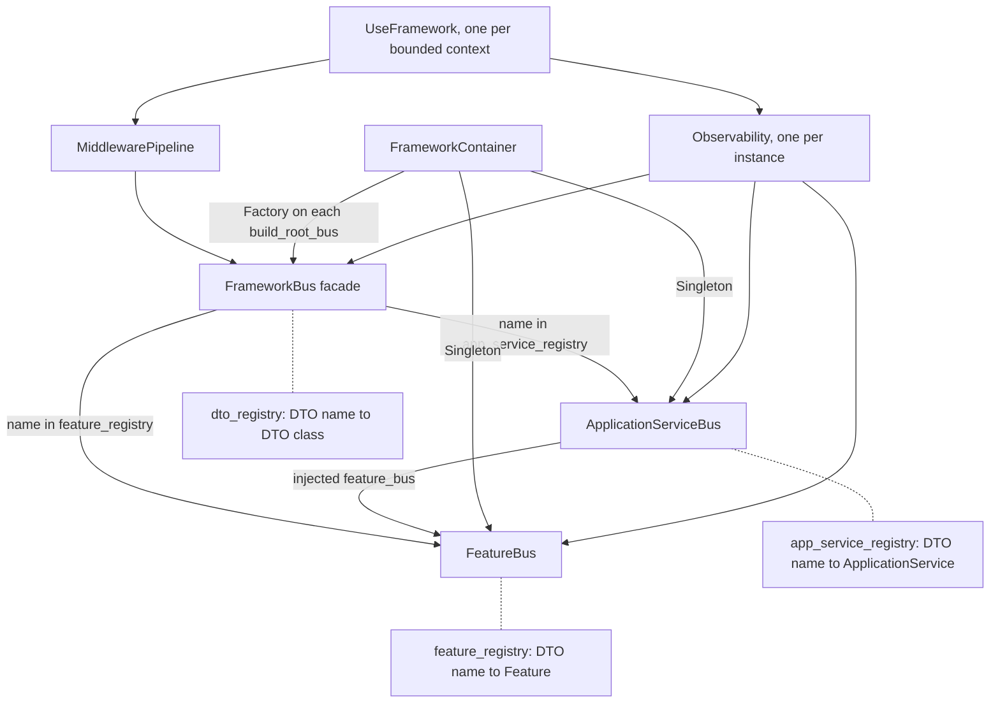

# Architecture overview: buses, bounded contexts and module map

`sincpro-framework` is a library, not an application: it ships as one importable package
(`pyproject.toml:1-8`) and has no executable of its own. Structurally the whole system is one object
graph repeated once per **bounded context**. A `UseFramework` instance
(`sincpro_framework/use_bus.py:19`) owns a container, two registries, one context store, one
observability object, one middleware pipeline and three error-handler chains; a call on that instance
routes a DTO into exactly one registry (`sincpro_framework/bus.py:164-194`).

This page is the map you need to navigate the code. The **authoritative design document** is
[`docs/architecture/ARCHITECTURE.md`](../../docs/architecture/ARCHITECTURE.md) — it owns the pattern
vocabulary (Hexagonal, DDD, CQRS, Facade, Registry), the component matrix and the diagrams
(`docs/architecture/ARCHITECTURE.md:20`, `:45-61`). This page states structure and points at the file
that owns each behaviour; it does not restate that rationale.

For the deeper behaviour of a single call, read
[executing a DTO](/openwiki/architecture/bus-execution.md); for how classes enter the registries,
[registration and IoC](/openwiki/architecture/registration-and-ioc.md).

## One instance = one bounded context

`docs/README.md:100` states the rule: "**Bounded Context**: Each UseFramework instance = bounded
context". The code implements it by making everything stateful an instance attribute rather than a
module global:

- the logger name / observability identity is the first constructor argument
  (`bundled_context_name`, `sincpro_framework/use_bus.py:32-55`), and it becomes both the logger
  context name (`sincpro_framework/use_bus.py:53`, `:406-412`) and the observability `bus` segment
  (`sincpro_framework/use_bus.py:58`);
- the container is built **per instance** — `self._sp_container = ioc.FrameworkContainer(...)`
  (`sincpro_framework/use_bus.py:63-66`) — and `FrameworkContainer` is a
  `containers.DeclarativeContainer` (`sincpro_framework/ioc.py:35`);
- the context storage, dependency registry, middleware pipeline and error-handler lists are all
  created in `__init__` (`sincpro_framework/use_bus.py:60`, `:72-85`).

Two consequences the tests pin: `feature_bus` and `app_service_bus` are per-framework singletons, not
process singletons (`tests/observability/test_bus_wiring.py:76-83`), and two instances never share a
registry (`tests/use_container/test_multiple_instances.py:30-41`).

## The three bus layers and who owns which registry

Three concrete classes implement the abstract `Bus`
(`sincpro_framework/sincpro_abstractions.py:32`):

| Layer | Class | Registry it owns | Span layer string |
| --- | --- | --- | --- |
| atomic | `FeatureBus` (`sincpro_framework/bus.py:17`) | `feature_registry` (`sincpro_framework/bus.py:25`) | `"feature"` (`sincpro_framework/bus.py:47`) |
| orchestration | `ApplicationServiceBus` (`sincpro_framework/bus.py:67`) | `app_service_registry` (`sincpro_framework/bus.py:77`) | `"application_service"` (`sincpro_framework/bus.py:103`) |
| facade | `FrameworkBus` (`sincpro_framework/bus.py:126`) | none of its own: it holds `feature_bus` and `app_service_bus` (`sincpro_framework/bus.py:134-135`) plus the `dto_registry` copied in at build time (`sincpro_framework/bus.pyi:95`) | none — it never executes a handler |

Both registries are plain `Dict[str, …]` keyed by the **input DTO class name**, populated through
`register_feature` / `register_app_service` (`sincpro_framework/bus.py:30-39`, `:82-95`). The facade
is pure routing: it re-checks that a name is not in both registries and then delegates to whichever
registry contains the name (`sincpro_framework/bus.py:175-194`). An `ApplicationService` receives the
*same* `FeatureBus` object the facade holds, because the container builds app services with
`framework_container.feature_bus` (`sincpro_framework/ioc.py:137-147`); that identity is asserted in
`tests/observability/test_bus_wiring.py:54-63`.

*The three bus layers, the registry each one owns, the container providers that materialise them, and the single observability object shared by all three.*

Beyond `execute`, the abstract `Bus` also defines the two cross-thread handles every layer inherits —
`thread_context()` and `get_async_bus()` (`sincpro_framework/sincpro_abstractions.py:45-82`) — so
*which* bus you take a handle from decides which layer the handed-off execution runs through. Their
mechanics belong to
[concurrency and context handoff](/openwiki/architecture/concurrency-and-context-handoff.md).

### Container provider scoping

`FrameworkContainer` (`sincpro_framework/ioc.py:35-66`) is where the two sub-buses and the facade are
declared:

| Provider | Kind | Declared at |
| --- | --- | --- |
| `feature_bus` | `providers.Singleton(FeatureBus, logger_bus, observability)` | `sincpro_framework/ioc.py:49-51` |
| `app_service_bus` | `providers.Singleton(ApplicationServiceBus, logger_bus, observability)` | `sincpro_framework/ioc.py:55-57` |
| `framework_bus` | `providers.Factory(FrameworkBus, feature_bus=…, app_service_bus=…)` | `sincpro_framework/ioc.py:60-66` |
| `feature_registry` / `app_service_registry` | `providers.Dict({})`, accumulated by the registration decorators | `sincpro_framework/ioc.py:48`, `:54`, `:124-150` |
| `dto_registry` | `providers.Dict({})`, accumulated by the same decorators | `sincpro_framework/ioc.py:45`, `:119-121` |

Because the sub-buses are singletons and the facade is a factory, a second `build_root_bus()` yields a
new facade over the same registries and the same handler instances
([executing a DTO](/openwiki/architecture/bus-execution.md) documents that lifecycle). The container
also declares `logger_bus`, `observability` and `injected_dependencies` as `providers.Object()` /
`providers.Dict()` (`sincpro_framework/ioc.py:42-44`); the first two are supplied by the instance
(`sincpro_framework/use_bus.py:63-66`). `injected_dependencies` is declared but never read anywhere in
the package: the real dependency path is `add_attributes(**self.dynamic_dep_registry)` pushed onto
every already-registered handler (`sincpro_framework/use_bus.py:90-105`) and the `DependencyLocator`
behind `framework.deps` (`sincpro_framework/deps.py:12-19`, `sincpro_framework/use_bus.py:172-181`).
That path has two failure semantics worth knowing at the structural level: `add_dependency` refuses a
name that is already there with `DependencyAlreadyRegistered` rather than overwriting
(`sincpro_framework/use_bus.py:166-170`), and the locator is deliberately read-only — a missing name
raises `DependencyNotRegistered` (an `AttributeError` subclass) and `__setattr__`/`__delattr__` are
blocked (`sincpro_framework/deps.py:26-36`, `:54-62`, `sincpro_framework/exceptions.py:5-10`).

`Layer` in `sincpro_framework/entrypoints/const.py:5-11` mirrors that same two-registry vocabulary
(`"features"` / `"app_services"`) for the JSON-speaking driving adapters, so the bus's own words are
reused on the wire.

## What attaches to one instance

`build_root_bus()` (`sincpro_framework/use_bus.py:123-150`) is where the per-instance parts are
connected to the container-built buses:

| Attached thing | Where it lives | Wired at |
| --- | --- | --- |
| dynamic dependencies | `dynamic_dep_registry` + `DependencyLocator` | `sincpro_framework/use_bus.py:72-74`, pushed at `:90-105` |
| error handlers (3 chains) | `_global_error_handlers` / `_feature_error_handlers` / `_app_service_error_handlers` | `sincpro_framework/use_bus.py:76-82`, `:107-121`, `:187-238` |
| middleware pipeline | `self.middleware_pipeline` | `sincpro_framework/use_bus.py:84-85`, `:183-185` |
| context store | `ContextMixin` on the instance; handlers read it through `ContextConsumer` | `sincpro_framework/use_bus.py:60`, `sincpro_framework/context/mixin.py:28-36`, `:65-71`, `sincpro_framework/context/framework_context_consumer.py:15-23` |
| observability | one `Observability` per instance, injected into all three buses | `sincpro_framework/use_bus.py:58`, `:63-66`, `:145-150` |
| DTO registry for introspection | copied onto the facade after the build | `sincpro_framework/use_bus.py:128`, `:142-143` |
| log flags | copied onto the facade and both sub-buses | `sincpro_framework/use_bus.py:134-140` |

Two of these are worth calling out because they are *the* cross-cutting ownership boundaries:

- **Error handling** is three independent chains, each folded by `build_error_handler_chain`
  (`sincpro_framework/error_handler.py:44-57`) so the first registered handler executes first, and each
  pushed onto the matching bus (`sincpro_framework/use_bus.py:187-238`). The bus classes themselves
  know only one `handle_error` callable per bus (`sincpro_framework/bus.py:26`, `:78`, `:146`).
- **Observability** is one object per instance, and the *same* object must reach all three buses:
  `tests/observability/test_bus_wiring.py:46-51` asserts every bus's `.observability` is
  `framework.observability`. `Observability` is documented as the only object the buses talk to, so
  nothing else in the package imports `opentelemetry` or `sentry_sdk`
  (`sincpro_framework/observability/__init__.py:1-14`); per-bus backend state lives outside the buses
  in `observability/registry.py` (`sincpro_framework/observability/registry.py:1-13`), which is what
  lets a second `build_root_bus()` reuse what the first one created.

## Structural invariants

The registry layout imposes three rules, and where each is enforced tells you when a violation
surfaces (`sincpro_framework/exceptions.py:1-18`):

| Invariant | Enforced at |
| --- | --- |
| a DTO name has at most one handler per registry | decoration time (`sincpro_framework/ioc.py:99-113`) and again in `register_feature` / `register_app_service` (`sincpro_framework/bus.py:32-35`, `:88-91`) |
| a DTO name never appears in both registries | facade construction (`sincpro_framework/bus.py:154-162`) and re-checked on every call (`sincpro_framework/bus.py:175-182`) |
| a DTO reaching the facade is registered somewhere | per-call only: `UnknownDTOToExecute` (`sincpro_framework/bus.py:191-194`) |

A fourth exception covers the build itself: `SincproFrameworkNotBuilt` is raised only when `bus` is
still `None` after the lazy build in `__call__` (`sincpro_framework/use_bus.py:377-386`) — the
situation its message attributes to decorators that never ran because the module defining the handlers
was never imported. Which handler sees which failure, and the ordering of the three handler chains, is
owned by [executing a DTO](/openwiki/architecture/bus-execution.md); the registration-time races
between decoration and the first build are owned by
[registration and IoC](/openwiki/architecture/registration-and-ioc.md).

## Public surface versus internals

The runtime public API is exactly what `sincpro_framework/__init__.py` re-exports
(`sincpro_framework/__init__.py:1-21`):

| Export | Comes from | Kind |
| --- | --- | --- |
| `UseFramework` | `use_bus.py` | class |
| `Feature`, `ApplicationService`, `DataTransferObject` | `sincpro_abstractions.py` | base classes |
| `TypeDTO`, `TypeDTOResponse` | `sincpro_abstractions.py` | `TypeVar`s |
| `Middleware` | `middleware.py` | `Protocol` |
| `logger` | `sincpro_logger.py` | framework logger instance |

Everything else is an internal you reach deliberately:

- `sincpro_framework.ioc` (`FrameworkContainer`, `inject_feature_to_bus`,
  `inject_app_service_to_bus`) is the registration machinery the `framework.feature` /
  `framework.app_service` attributes wrap (`sincpro_framework/use_bus.py:69-70`).
- `sincpro_framework.bus` holds the concrete `FeatureBus` / `ApplicationServiceBus` / `FrameworkBus`,
  reachable through `framework.bus`. The test suite imports it directly
  (`tests/bus/test_framework_bus.py:5`), which is also how a caller bypasses the middleware pipeline
  and `UnknownDTOToExecute`.
- `sincpro_framework.deps` (the locator behind `framework.deps`), plus `exceptions.py`,
  `error_handler.py`, `sincpro_conf.py`, `sincpro_logger.py` and `conf/sincpro_framework_conf.yml`.
- The cross-cutting packages: `context/`, `observability/`, `introspection/`, `entrypoints/`, `aio/`
  and `ddd/`.
- The host dependencies stay optional: FastMCP, Starlette, uvicorn, the OTel SDK and `sentry-sdk` are
  declared as extras (`pyproject.toml:39-48`), and the hosts raise a message naming the extra instead
  of failing at import (`sincpro_framework/entrypoints/rpc/entrypoint.py:21-23`,
  `sincpro_framework/entrypoints/mcp/entrypoint.py:49-52`).

## Typing contract

The distribution ships `sincpro_framework/py.typed` (an empty marker file) plus hand-written `.pyi`
stubs, so they are part of the public contract, not generated leftovers:

| Stub | Covers |
| --- | --- |
| `sincpro_framework/use_bus.pyi` | `UseFramework`: attribute declarations (`:29-58`), `__call__` overloads with and without `return_type` (`:79-106`), `deps`, error-handler and tracing signatures |
| `sincpro_framework/bus.pyi` | the three bus classes with their registries and `execute` overloads (`:15-123`) |
| `sincpro_framework/sincpro_abstractions.pyi` | `DataTransferObject`, `Bus`, `Feature`, `ApplicationService` and the `TypeVar`s (`:11-117`) |
| `sincpro_framework/aio/bus.pyi` | `AsyncBus` (`:6-40`) |
| `sincpro_framework/context/framework_context.pyi` | `FrameworkContext` (`:6-50`) |

The stubs are what make `UseFramework[DependencyContextType]` and the `return_type` argument useful to
a type checker (`sincpro_framework/use_bus.pyi:79-106`), and they are enforced in the test suite by
running `pyright` over the static examples in `tests/typing_and_linter/typing_cases`
(`tests/typing_and_linter/test_typing_and_linter.py:31-41`). `make lint` runs `pyright` over both
`sincpro_framework` and `tests` (`Makefile:105-115`).

## Module map

| Owned system | Paths | Role |
| --- | --- | --- |
| Core runtime | `use_bus.py`, `bus.py`, `sincpro_abstractions.py`, `middleware.py`, `error_handler.py`, `exceptions.py` | the instance, the three buses, the base contracts, the middleware chain and the handler chain |
| Composition / IoC | `ioc.py`, `deps.py` | `FrameworkContainer` providers and the two registration decorators; the read-only dependency locator |
| Configuration and logging | `sincpro_conf.py`, `sincpro_logger.py`, `conf/sincpro_framework_conf.yml` | `settings` built at import time from YAML with `$ENV:` indirection (`sincpro_conf.py:10-13`, `:90-101`, `:124`); global logging configured on import (`sincpro_logger.py:7-19`) |
| Context | `context/mixin.py`, `context/framework_context.py`, `context/framework_context_consumer.py`, `context/thread_context_bus.py` | per-instance shared dict plus `ContextVar` overlay, the `with framework.context(...)` manager, and the thread-handoff handle |
| Observability | `observability/api.py`, `domain.py`, `registry.py`, `tracing/`, `errors/` | the two doors — `Observability` per bus and `process` for the transport (`observability/__init__.py:1-14`) — plus identity resolution and the per-bus registry of providers and clients |
| Introspection | `introspection/inspector.py` | the single reader of `feature_registry`, `app_service_registry` and `dto_registry` (`introspection/inspector.py:1-8`, `:72-117`); raises `ValueError` on an unbuilt framework (`:21`, `:72-75`) |
| Driving adapters | `entrypoints/catalog.py`, `const.py`, `json_utils.py`, `scalar_executor.py`, `entrypoints/mcp/`, `entrypoints/rpc/` | `Catalog` projects a built instance to `PackedFeatureOrAppService` (`entrypoints/catalog.py:38-55`); MCP (`build_mcp_server`, `entrypoints/mcp/__init__.py:1-3`) and JSON-RPC (`RpcGateway`, `entrypoints/rpc/__init__.py:1-3`) are hosts over that one shared catalog |
| Async | `aio/bus.py` | `AsyncBus`, the stateless async facade over a sync `Bus` (`aio/__init__.py:1-10`, `aio/bus.py:30-91`) |
| DDD | `ddd/value_object.py` | the `ValueObject(...)` factory for validated primitive subtypes (`ddd/__init__.py:1`) |
| Type contract | `py.typed`, `*.pyi` | see the typing section above |
| Docs and examples | `docs/`, `examples/`, `README.md` | hand-written design docs, PRDs and usage examples |

Two navigation caveats about the hand-written `docs/`:

- The design documents are the authoritative source for *patterns*, but they carry a stale version
  footer: `docs/README.md:268` and `docs/architecture/ARCHITECTURE.md:889-890` are stamped v2.4.1
  while `pyproject.toml:2-3` declares version `4.0.0`. The dependency table is stale the same way —
  `docs/architecture/ARCHITECTURE.md:759-764` lists `dependency-injector ^4.46.0`, `pydantic ^2.9.2`
  and `sincpro-log ^1.0.1`, while `pyproject.toml:26-29` requires `^4.49.1`, `^2.13.5` and `^1.2.1`.
  Treat their API prose as intent and the code as current.
- `docs/README.md:87` and `:222` link to `docs/architecture/README.md`, which is not present in the
  repository; the reachable architecture documents are `ARCHITECTURE.md`, `entrypoint_mcp.md` and
  `entrypoint_rpc.md`.

One operational caveat the hand-written docs do not carry at all: on a free-threaded
(`python3.14t`) interpreter, importing `dependency_injector` forces CPython to re-enable the GIL for
the whole process, and `grpcio` — a transitive dependency of the OTLP gRPC exporter — does the same
once that exporter is used. The rationale and the verification notes live next to the import in
`sincpro_framework/ioc.py:7-14` and in the `pyproject.toml:15-23` comment block; free-threading is
explicitly not implemented or targeted in this codebase yet, and regular (GIL) 3.12/3.13/3.14 are
unaffected.

## Where to go next

- [Executing a DTO](/openwiki/architecture/bus-execution.md) — one call end to end: lazy build,
  middleware, facade routing, spans, failure paths.
- [Registration and IoC](/openwiki/architecture/registration-and-ioc.md) — decorators, container
  registries, duplicate and cross-layer collisions.
- [Concurrency and context handoff](/openwiki/architecture/concurrency-and-context-handoff.md) — the
  `thread_context()` / `get_async_bus()` handles every bus inherits
  (`sincpro_framework/sincpro_abstractions.py:45-82`), and what happens to `self.context` when work
  crosses a thread.
- [Feature vs ApplicationService](/openwiki/concepts/feature-vs-application-service.md) — which layer
  a use case belongs to.
- [Quickstart](/openwiki/quickstart.md) — the smallest working bounded context.
- `docs/architecture/ARCHITECTURE.md` — the authoritative component matrix, pattern matrix and
  diagrams.
