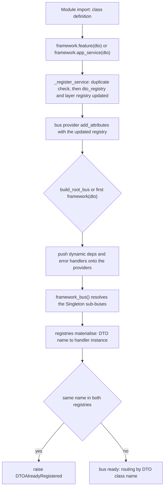

# Registration and the IoC container: from decorated class to executable handler

A `Feature` / `ApplicationService` class becomes executable through **two distinct moments**
(`sincpro_framework/ioc.py:84-150`, `sincpro_framework/use_bus.py:123-150`):

- **Registration time** — when the module defining the class is imported. The
  `@framework.feature(...)` / `@framework.app_service(...)` decorator stores a *provider* in the
  container of one `UseFramework` instance. No handler is instantiated yet, and nothing is validated
  between the two layers.
- **Build time** — `build_root_bus()` (or the lazy build inside the first `framework(dto)` call,
  `sincpro_framework/use_bus.py:377-378`) pushes dependencies and error handlers onto those providers,
  then materialises them: the facade and both sub-buses are created, and each registry becomes a
  `{DTO name: handler instance}` dict.

Execution time reads only the materialised dicts
(`sincpro_framework/bus.py:53`, `109`, `173`). Structure and registry ownership per bus are mapped on
[Architecture overview](/openwiki/architecture/overview.md); this page owns how entries get into the
registries, when they turn into objects, and which failures each step raises.



*Registration accumulates providers on one container; the build materialises them into the instances the buses route over.*

| | Registration time | Build time | Execution time |
| --- | --- | --- | --- |
| Trigger | class definition / module import | `build_root_bus()`, or the first `framework(dto)` | `framework(dto)` |
| State touched | container provider dicts, bus provider attributes | handler instances, facade, log flags, bound context | the materialised registries and the bound instances (read-only) |
| Failure that first becomes reachable | `DTOAlreadyRegistered` within a layer | `DTOAlreadyRegistered` across layers | `UnknownDTOToExecute`, plus the facade's per-call re-check of the cross-layer collision |

## Registration time

### The decorator is a container-bound `partial`

`UseFramework.__init__` creates the container for that instance and then binds the two decorators to
it (`sincpro_framework/use_bus.py:63-70`):

```python
self._sp_container = ioc.FrameworkContainer(logger_bus=self.logger, observability=self.observability)
self.feature = partial(ioc.inject_feature_to_bus, self._sp_container)
self.app_service = partial(ioc.inject_app_service_to_bus, self._sp_container)
```

So `framework.feature(SomeDTO)` *is* `inject_feature_to_bus(container, SomeDTO)`
(`sincpro_framework/ioc.py:153-171`), and `framework.app_service(SomeDTO)` is its application-service
twin (`sincpro_framework/ioc.py:174-191`). Both return a decorator that calls `_register_service(...)`
and **returns the decorated class unchanged** (`sincpro_framework/ioc.py:168-169`, `:189-190`) — the
class is not wrapped, proxied or replaced; the container owns instantiation. `framework.feature` and
`framework.app_service` are the framework's public registration surface
(`sincpro_framework/use_bus.pyi:44-46`); `ioc.py` itself is internal and is not re-exported by
`sincpro_framework/__init__.py:1-21`.

One line after the container is created is worth knowing before touching `ioc.py`: `__init__` assigns
`self._sp_container.logger_bus = self.logger` (`sincpro_framework/use_bus.py:66`), shadowing the
container's declared `logger_bus` provider (`sincpro_framework/ioc.py:42`) with the concrete logger
object on that container instance. Registration then calls
`framework_container.logger_bus.debug(...)` (`sincpro_framework/ioc.py:116`) and the build passes the
same name to the three bus providers (`sincpro_framework/ioc.py:49-66`). That the assignment is what
makes those uses resolve to the logger object rather than to the `providers.Object()` declaration is
dependency-injector's container-attribute behaviour, which this repository does not assert in a test —
treat it as the reason the code is shaped this way, not as a verified contract.

Because each instance has its own container, a decoration registers into exactly one bounded context.
`tests/use_container/test_multiple_instances.py:30-41` registers one DTO on each of two instances and
asserts the two `feature_registry` key sets differ.

### `_register_service`: single DTO or list of DTOs

`_register_service` (`sincpro_framework/ioc.py:84-150`) is the only writer. It normalises the
argument first — `dto_list = dto if isinstance(dto, list) else [dto]`
(`sincpro_framework/ioc.py:93`) — then loops over the elements, so one decorator application can bind
the same class to several DTOs (the `ServiceType` enum selects the layer,
`sincpro_framework/ioc.py:74-76`).
`tests/typing_and_linter/typing_cases/list_dto_registration_case.py:15` is the checked example of the
list form. One caveat on the accepted type: the internal alias admits `str`
(`DTORegistration = DTOClass | str | list[DTOClass | str]`, `sincpro_framework/ioc.py:28`), but the
loop reads `__name__` off every element unconditionally (`sincpro_framework/ioc.py:96`) and nothing
resolves a string to a class — a `str` element would fail on that attribute access, not register a
name. The public stub narrows the decorator argument to classes or lists of classes
(`sincpro_framework/use_bus.pyi:27`, `:45-46`); treat the stub as the accurate contract.

The list form is **not atomic**. The loop registers DTO names one at a time
(`sincpro_framework/ioc.py:95-150`), so if the third element of `[A, B, C]` collides with an existing
registration, `A` and `B` are already in both the layer registry and `dto_registry` when
`DTOAlreadyRegistered` is raised — the container is left partially updated. Nothing is instantiated at
that point (the entries are providers), but a build after the failure will route `A` and `B`, and the
exception escapes the decorator before it returns the class, so the class statement itself fails and
the name is never bound in the defining module.

Per DTO name, one iteration does five things (`sincpro_framework/ioc.py:95-150`):

1. **Duplicate check within the layer.** For `FEATURE` it evaluates
   `dto_name in framework_container.feature_bus.kwargs`; for `APP_SERVICE`, the same against
   `framework_container.app_service_bus.kwargs` (`sincpro_framework/ioc.py:99-113`). A hit raises
   `DTOAlreadyRegistered` (`sincpro_framework/exceptions.py:1-2`) with the DTO name and its
   `__module__` in the message (`sincpro_framework/ioc.py:103-105`, `:111-113`).
2. **Debug log** through the container's logger (`sincpro_framework/ioc.py:116`).
3. **`dto_registry` update** — `providers.Dict({**{dto_name: data_transfer_object}, **existing.kwargs})`
   (`sincpro_framework/ioc.py:119-121`). The shared DTO registry therefore keys every registered input
   DTO name (from either layer) to its class.
4. **Layer registry update** — `providers.Factory(decorated_class)` for a feature
   (`sincpro_framework/ioc.py:126-131`) and `providers.Factory(decorated_class, framework_container.feature_bus)`
   for an application service (`sincpro_framework/ioc.py:137-147`). That second positional argument is
   how an `ApplicationService` receives its `feature_bus` (`sincpro_framework/sincpro_abstractions.py:187-194`),
   and it is the *container's* `feature_bus` provider — the same object the facade receives
   (`sincpro_framework/ioc.py:60-66`), pinned by `tests/observability/test_bus_wiring.py:54-63`.
5. **Attach the registry to the bus provider** — `feature_bus.add_attributes(feature_registry=...)`
   (`sincpro_framework/ioc.py:133-135`) or `app_service_bus.add_attributes(app_service_registry=...)`
   (`sincpro_framework/ioc.py:148-150`). The receiver is the container's provider
   (`framework_container.feature_bus` / `...app_service_bus`), which is what the build resolves
   (`framework_container.framework_bus()`, `sincpro_framework/use_bus.py:130`) and what the build reads
   the entries back from (`sincpro_framework/use_bus.py:91-105`).

Composition-wise every name gets its **own** `providers.Factory` entry, so the list form
`@framework.feature([A, B])` stores two independent providers rather than one shared object
(`sincpro_framework/ioc.py:126-131`, `:137-147`). By dependency-injector's `Factory` semantics each
entry is evaluated separately when the sub-bus materialises its registry, so a handler class
registered for two DTOs is instantiated twice and the two names do not share a handler object — which
matters for any per-instance state a handler keeps (caches, counters, and the `self.context` binding
the build performs once per registry value, `sincpro_framework/context/mixin.py:65-71`). Flag as
**unverified by this repository**: no test asserts the identity or the count of handler instances, so
the per-name provider is what the code shows and the double instantiation is a deduction from the
library's `Factory` contract rather than a pinned behaviour.

Both registries are keyed by the **input DTO class `__name__`**, never by the class object
(`sincpro_framework/ioc.py:96`), which is also how execution looks them up
(`sincpro_framework/bus.py:53`, `109`, `173`). Two distinct DTO classes that happen to share a
`__name__` therefore collide in the same layer and are rejected by step 1 above, with the module of
the second one in the message.

One detail a maintainer will meet when touching this function: **the check and the write use different
provider accessors.** The duplicate check reads `framework_container.feature_bus.kwargs` /
`...app_service_bus.kwargs` (`sincpro_framework/ioc.py:101`, `:109`), while the accumulation is
attached with `add_attributes(...)` on those same bus providers
(`sincpro_framework/ioc.py:133-135`, `:148-150`) and is read back from `.attributes` at build time
(`sincpro_framework/use_bus.py:91-94`, `:99-102`). How `add_attributes` surfaces on the provider's
`kwargs` is dependency-injector's behaviour and is not asserted anywhere in this repository: no test
in the suite exercises the decorator-side raise paths, and the only `DTOAlreadyRegistered` assertions
go through the bus registration API or the cross-layer check
(`tests/bus/test_framework_bus.py:50-63`). If the check ever misses, the write is a dict literal with
the new name first and the existing entries second (`sincpro_framework/ioc.py:119-121`, `:126-131`,
`:137-147`), so the earlier entry is the one that survives. Verify both reads against the installed
library before changing how entries are attached.

### The second entry point: `register_feature` / `register_app_service`

The buses expose their own registration methods — `FeatureBus.register_feature`
(`sincpro_framework/bus.py:30-39`) and `ApplicationServiceBus.register_app_service`
(`sincpro_framework/bus.py:82-95`), both typed in `sincpro_framework/bus.pyi:32`, `:63`. They mutate
the *materialised* `{name: instance}` dict with the same name-collision guard
(`sincpro_framework/bus.py:32-35`, `:88-91`), but they bypass the container entirely: they do **not**
update `dto_registry`, and the docstring states the decorator is the intended path
("This method is not used directly", `sincpro_framework/bus.py:85-86`). The test suite uses it to wire
fixture buses by hand (`tests/fixtures.py:25-28`, `:52-58`,
`tests/bus/test_framework_bus.py:59-60`; also `tests/error_handler/test_framework_layer.py:51`,
`:66-68`).

Two consequences separate the two entry points, and both are observable:

- The DTO registry is what describes a handler. `_describe_all` looks every registry key up in
  `dto_registry` and `continue`s past the ones it cannot find
  (`sincpro_framework/introspection/inspector.py:83-86`), so a handler registered through the bus API
  is invisible to `features()` / `app_services()` (`sincpro_framework/introspection/inspector.py:98-109`)
  and to `dtos()` (`:112-118`).
- Everything built on introspection inherits that gap. The entrypoint catalog fills its use-case list
  from `inspector.features(...)` / `inspector.app_services(...)`
  (`sincpro_framework/entrypoints/catalog.py:134-140`), so a handler wired with `register_feature` /
  `register_app_service` is callable in process but never published over MCP or JSON-RPC.

## Build time

### What `build_root_bus()` does, in order

`build_root_bus()` is `sincpro_framework/use_bus.py:123-150` and runs these steps in this order:

1. **Push dynamic dependencies** — `_add_dependencies_provided_by_user()`
   (`sincpro_framework/use_bus.py:125`). It looks for `"feature_registry"` in
   `self._sp_container.feature_bus.attributes` (`sincpro_framework/use_bus.py:91`), reads
   `...attributes["feature_registry"].kwargs` (`sincpro_framework/use_bus.py:92-94`) and calls
   `feature.add_attributes(**self.dynamic_dep_registry)` on every registered entry
   (`sincpro_framework/use_bus.py:96-97`), then does the same for `app_service_registry`
   (`sincpro_framework/use_bus.py:99-105`). The push therefore targets the *registration entries*
   (`providers.Factory` objects), not the container and not a bus instance — the docstring's intent is
   that the dependency becomes an attribute of the Feature / ApplicationService
   (`sincpro_framework/use_bus.py:152-164`). `tests/use_container/test_use_framework.py` is the
   end-to-end exercise of that path: it registers `proxy_services` (`:36-37`), a Feature then calls
   `self.any_client("client_name")` (`:64-71`), and the framework is invoked (`:99-102`). Note the
   timing: the call happens only from the build (`sincpro_framework/use_bus.py:125`), so it covers the
   registrations and the dependencies present at that moment, and every rebuild repeats it.
2. **Push error handlers** — `_add_error_handlers_provided_by_user()`
   (`sincpro_framework/use_bus.py:126`, body at `:107-121`) attaches the global handler to the
   `framework_bus` provider and the feature / app-service handlers to their bus providers.
3. **Flip the built flag** — `self.was_initialized = True` (`sincpro_framework/use_bus.py:127`),
   *before* the facade exists. That ordering is why a build that raises leaves `was_initialized`
   `True` with `self.bus` still `None`, and every later `framework(dto)` then raises
   `SincproFrameworkNotBuilt` (`sincpro_framework/use_bus.py:380-386`,
   `sincpro_framework/exceptions.py:17-18`); the first caller sees the original exception instead.
4. **Materialise the DTO registry** — `dto_registry = self._sp_container.dto_registry()`
   (`sincpro_framework/use_bus.py:128`), a plain `{name: DTO class}` dict resolved from the provider.
5. **Materialise the facade** — `self.bus = self._sp_container.framework_bus()`
   (`sincpro_framework/use_bus.py:130`). Calling the `Factory` resolves its arguments, i.e. the two
   `Singleton` sub-buses (`sincpro_framework/ioc.py:60-66`), and the registry providers attached to
   those buses are resolved into `{DTO name: handler instance}` dicts — the state every test then reads
   off `framework.bus.feature_bus.feature_registry` / `...app_service_bus.app_service_registry`
   (e.g. `tests/observability/test_bus_wiring.py:61-64`). Handlers are created **here**, by the
   container, from the `Factory` providers registration stored (`sincpro_framework/ioc.py:128`,
   `:141`); the decorator itself only ever appended providers.
6. **Bind the context and set flags** — `_bind_context_to_handlers()`
   (`sincpro_framework/use_bus.py:131`; `sincpro_framework/context/mixin.py:65-71` calls
   `bind_to_framework(self)` on every instance in both registries, which is what makes `self.context`
   resolve to the live overlay, `sincpro_framework/context/framework_context_consumer.py:15-23`), then
   the three log flags (`sincpro_framework/use_bus.py:134-140`).
7. **Publish the DTO registry on the facade** — `self.bus.dto_registry = dto_registry`
   (`sincpro_framework/use_bus.py:142-143`), the snapshot introspection reads
   (`sincpro_framework/introspection/inspector.py:101`, `:109`, `:117`). It is taken once per build, so
   a rebuild refreshes it.
8. **Guarantee the observability object and start it** (`sincpro_framework/use_bus.py:145-150`).

Step 5 is the only place a handler is instantiated: registration stores `Factory` providers
(`sincpro_framework/ioc.py:128`, `:141`), and a provider only produces an object when it is evaluated.

### Provider scoping: Singleton sub-buses, Factory facade

`FrameworkContainer` (`sincpro_framework/ioc.py:35-66`) declares:

| Provider | Kind | Declared at | Consequence |
| --- | --- | --- | --- |
| `feature_bus` | `Singleton(FeatureBus, logger_bus, observability)` | `sincpro_framework/ioc.py:49-51` | one `FeatureBus` per container, i.e. per `UseFramework` instance |
| `app_service_bus` | `Singleton(ApplicationServiceBus, logger_bus, observability)` | `sincpro_framework/ioc.py:55-57` | one `ApplicationServiceBus` per instance |
| `framework_bus` | `Factory(FrameworkBus, feature_bus=…, app_service_bus=…)` | `sincpro_framework/ioc.py:60-66` | a **new** facade on every `framework_bus()` call |
| `feature_registry` / `app_service_registry` | `providers.Dict(...)`, accumulated at registration | `sincpro_framework/ioc.py:48`, `:54`, `:119-150` | dicts of `Factory` providers until a sub-bus resolves them |
| `dto_registry` | `providers.Dict(...)` | `sincpro_framework/ioc.py:45`, `:119-121` | accumulated the same way, but its values are the DTO **classes** — introspection reads them directly (`sincpro_framework/introspection/inspector.py:116-118`, pinned by `tests/test_introspection.py:67-73`) |
| `logger_bus` / `observability` / `injected_dependencies` | `providers.Object()` / `providers.Dict()` | `sincpro_framework/ioc.py:42-44` | the first two are supplied by the instance (`sincpro_framework/use_bus.py:63-66`) |

Two consequences follow directly:

- **Per-instance, not per-process.** Because the container is created in `__init__`
  (`sincpro_framework/use_bus.py:63-66`), the Singletons are scoped to that container:
  `tests/observability/test_bus_wiring.py:76-83` asserts two frameworks in one process share neither
  `feature_bus` nor `app_service_bus`, and that they do not share an `Observability` either
  (`tests/observability/test_bus_wiring.py:66-73`).
- **Rebuild reuses the sub-buses.** A second `build_root_bus()` yields a fresh `FrameworkBus` over the
  *same* sub-bus singletons, and a Singleton sub-bus keeps the registry dict it already materialised,
  so the handler instances survive the rebuild too. Only the observability identity has a direct test
  (`tests/observability/test_bus_wiring.py:113-121`); the handler identity follows from Singleton
  semantics rather than from an assertion.

`injected_dependencies` (`sincpro_framework/ioc.py:44`) is declared on the container but never read by
any code in the package; the live dependency path is `dynamic_dep_registry`
(`sincpro_framework/use_bus.py:72-74`, pushed at `:96-105`) plus the `DependencyLocator` behind
`framework.deps` (`sincpro_framework/deps.py:12-53`, `sincpro_framework/use_bus.py:172-181`). Details
belong to [dependency injection and typing](/openwiki/concepts/dependency-injection-and-typing.md).

## The ordering constraint: instance first, imports second

The decorator is a `partial` over a container that only exists after `UseFramework(...)` has run, and
registration happens only where a decorator (or `register_feature` / `register_app_service`) is
evaluated — nothing else in the package walks modules looking for decorated classes. A service module
must therefore be imported **after** the instance it registers against exists; that is the documented
bootstrap shape — create the framework, then `from .services import feature_a`
(`README.md:478-479`, `:481-494`). Two further consequences follow from the decorator being bound to
one specific instance:

- A decorated module registers into the container of the instance it imported. If it imports a
  different bounded context's instance (or is imported while only another one exists, as in a
  cross-context import), the entries land in that other container.
- A module that is never imported contributes nothing; its DTOs never reach any registry, which is the
  situation `SincproFrameworkNotBuilt`'s message points at ("check the imports of each feature and app
  service", `sincpro_framework/use_bus.py:381-384`).

The same constraint explains the error-handler asymmetry: handlers may be added before *or* after the
build, because `add_*_error_handler` assigns straight onto the live buses when
`was_initialized and self.bus is not None` (`sincpro_framework/use_bus.py:211-212`, `:223-224`,
`:237-238`), whereas the decorators write into the container and depend on the build to reach a bus.

## Failure modes

| Failure | Raised at | Where the code is |
| --- | --- | --- |
| `DTOAlreadyRegistered` — same name, same layer | registration time | `sincpro_framework/ioc.py:99-113` (decorators); `sincpro_framework/bus.py:32-35`, `:88-91` (bus API) |
| `DTOAlreadyRegistered` — same name in a feature *and* an application service | build time, in `FrameworkBus.__init__` | `sincpro_framework/bus.py:150-162` (intersects the two registry key sets, logs the colliding names, then raises) |
| `DTOAlreadyRegistered` — the same, re-checked on every call | execution time | `sincpro_framework/bus.py:175-182` |
| `UnknownDTOToExecute` — no registry has the DTO name | execution time, facade only | `sincpro_framework/bus.py:191-194` (`sincpro_framework/exceptions.py:13-14`) |
| `SincproFrameworkNotBuilt` — build never completed | execution time | `sincpro_framework/use_bus.py:380-386` |
| `DependencyAlreadyRegistered` — duplicate `add_dependency` name | before the build | `sincpro_framework/use_bus.py:166-169` (`sincpro_framework/exceptions.py:5-6`) |

The row above about the registration-time same-layer check is the decorator path as written; as noted
under `_register_service`, no test in this repository drives it, so the bus-API branches
(`sincpro_framework/bus.py:32-35`, `:88-91`) are the only ones with direct evidence.

The cross-layer check is the one that spans both moments: at registration time a name may legally be
registered in each layer (each layer's check only looks at its own registry,
`sincpro_framework/ioc.py:99-113`), and the collision is detected when the facade is constructed
(`sincpro_framework/bus.py:150-162`). `tests/bus/test_framework_bus.py:50-63` builds that situation
through the bus API and asserts `DTOAlreadyRegistered`; `tests/bus/test_framework_bus.py:36-47` asserts
`UnknownDTOToExecute` for a DTO that was never registered. Both are also re-checked and reported from
the facade's `except` at call time (`sincpro_framework/bus.py:196-205`). Routing rules and the full
execution path live on [executing a DTO](/openwiki/architecture/bus-execution.md).

## Free-threading caveat recorded in `ioc.py`

`ioc.py` imports `dependency_injector` as a **required** runtime dependency
(`sincpro_framework/ioc.py:15-16`, `pyproject.toml:26`) and records a verified limitation above that
import: dependency-injector 4.49.1 ships an abi3 wheel that works on regular 3.14 but does not declare
free-threading support, so importing it on a `python3.14t` interpreter prints a `RuntimeWarning` about
the GIL being enabled to load `dependency_injector.containers` and **silently re-enables the GIL for
the whole process** (`sincpro_framework/ioc.py:7-14`). The note is explicit that this is not a bug in
this codebase and that there is nothing to fix here until the dependency declares `Py_mod_gil`
support; regular GIL builds are unaffected. `pyproject.toml:15-23` repeats the same constraint for the
dependency set as a whole. This page records the caveat as written in the sources; it makes no claim
about behaviour beyond it.

## What pins this behaviour

| Behaviour | Pinned by |
| --- | --- |
| Two instances never share a registry | `tests/use_container/test_multiple_instances.py:30-41` |
| The `FeatureBus` injected into an `ApplicationService` is the facade's own | `tests/observability/test_bus_wiring.py:54-63` |
| Container singletons are per framework, not per process | `tests/observability/test_bus_wiring.py:76-83` |
| A rebuild keeps the same observability identity | `tests/observability/test_bus_wiring.py:113-121` |
| `DTOAlreadyRegistered` across layers; `UnknownDTOToExecute` for an unregistered DTO | `tests/bus/test_framework_bus.py:50-63`, `:36-47` |
| Registrations reach introspection as `features` / `app_services` / `dtos`, and an unbuilt framework raises `ValueError` | `tests/test_introspection.py:43-48`, `:76-80` |
| Dependencies survive the build and are isolated per instance | `tests/use_container/test_deps.py:70-93` |
| The list form `@framework.feature([A, B])` type-checks | `tests/typing_and_linter/typing_cases/list_dto_registration_case.py:15`, checked by `tests/typing_and_linter/test_typing_and_linter.py:31-41` |
| A hand-wired bus via `register_feature` / `register_app_service` still executes and honours `handle_error` | `tests/error_handler/test_framework_layer.py:50-79` |

## Where to go next

- [Executing a DTO](/openwiki/architecture/bus-execution.md) — what happens after the build, once the
  registries the decorators filled are the routing table.
- [Building a bounded context](/openwiki/workflows/building-a-bounded-context.md) — the module layout
  that keeps the instance-exists-before-imports ordering satisfied.
- [Introspection](/openwiki/concepts/introspection.md) — reading `feature_registry`,
  `app_service_registry` and `dto_registry` off a built instance.
- [Dependency injection and typing](/openwiki/concepts/dependency-injection-and-typing.md) — the
  `add_dependency` path the build pushes onto the registration entries.
- [Maintaining and extending](/openwiki/operations/maintaining-and-extending.md) — where a new provider
  or registry belongs.
- `docs/architecture/ARCHITECTURE.md:147-253` — the hand-written design document for the Registry/IoC
  pattern and its rationale (its code snippets are illustrative; the implementation above is current).
