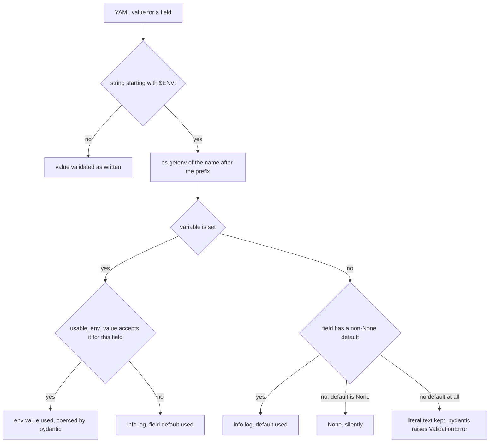

# Configuration and settings: SincproConfig, $ENV: and the framework defaults

`config.py` is not a separate layer in this framework: it is one module,
`sincpro_framework/sincpro_conf.py`, used from two directions.

- **Application authors** subclass `SincproConfig` for their own settings and load them with
  `build_config_obj` (`sincpro_framework/sincpro_conf.py:41`, `:104-121`). This is the walkthrough
  the README owns; start at `README.md:1166-1242`.
- **The framework itself** has exactly one settings object, `settings`, built at import time from
  the packaged `conf/sincpro_framework_conf.yml` and typed by `DefaultFrameworkConfig`
  (`sincpro_framework/sincpro_conf.py:90-101`, `:124`). Everything the framework does because of
  configuration — the logger, the OTLP exporter, the sampling ratio, the GlitchTip client, the
  deployment identity — reads that single object.

Both directions share the same mechanism: a YAML file whose string values may be `$ENV:` references,
and a Pydantic model whose field defaults are the fallback when the variable is absent or unusable.



*One `$ENV:` reference, four outcomes: environment value, typed fallback, silent `None`, or a validation error only for a genuinely required field.*

## The shipped conf file and the override

`DEFAULT_CONFIG_FILE_PATH` is computed once, when `sincpro_conf` is first imported
(`sincpro_framework/sincpro_conf.py:10-13`):

- `SINCPRO_FRAMEWORK_CONFIG_FILE` if it is set and non-empty;
- otherwise the file shipped with the package, `<package dir>/conf/sincpro_framework_conf.yml`.

Because the path is resolved at module import, the environment variable must be present **before**
anything imports `sincpro_framework` — and importing the package at all is enough, since
`sincpro_framework/__init__.py:9-10` pulls in `sincpro_logger` and `use_bus`, which reach
`sincpro_conf` through `observability/domain.py:16`. Setting the variable after import changes
nothing. The override env var is documented for operators at `README.md:1258-1262`.

The shipped file contains no literal values at all — every field is a `$ENV:` reference, so every
default lives in the Python model (`sincpro_framework/conf/sincpro_framework_conf.yml:1-9`):

```yaml
sincpro_framework_log_level: $ENV:SINCPRO_FRAMEWORK_LOG_LEVEL
sincpro_framework_log_backend: $ENV:SINCPRO_FRAMEWORK_LOG_BACKEND
sincpro_framework_log_file_path: $ENV:SINCPRO_FRAMEWORK_LOG_FILE_PATH
otlp_endpoint: $ENV:OTEL_EXPORTER_OTLP_ENDPOINT
otlp_traces_sample_rate: $ENV:OTEL_TRACES_SAMPLER_ARG
sentry_dsn: $ENV:SENTRY_PYTHON_DSN
app_release: $ENV:APP_RELEASE
otel_service_name: $ENV:OTEL_SERVICE_NAME
tenant: $ENV:TENANT
```

A deployment that overrides the file replaces this mapping wholesale: `DefaultFrameworkConfig` is
still the model, but the fields the new file omits fall back to their Python defaults.

## How `$ENV:` resolves

The whole mechanism is one Pydantic `model_validator(mode="before")` on `SincproConfig`
(`sincpro_framework/sincpro_conf.py:46-84`). It runs before field validation, iterates the raw
mapping, and rewrites only values that are `str` and start with the literal prefix `$ENV:` (`:51-53`).
The name after the prefix is passed straight to `os.getenv` (`:53-54`); a YAML value that is not a
string, or a nested mapping, is left alone and resolved later, when the nested `SincproConfig`
submodel validates its own dict.

The four branches, all anchored to `sincpro_framework/sincpro_conf.py`:

| Branch | Condition | Result |
| --- | --- | --- |
| Value used | variable set, and the string is acceptable for the field | `values[field_name] = env_value`, then Pydantic coerces it (`:58-60`) |
| Typed fallback | variable set, but the string is not acceptable | info log naming both the variable and the field, then `field_info.default` (`:61-67`) |
| Default | variable unset, field has a non-`None` default | info log, then the default (`:69-75`) |
| Optional | variable unset, field default is `None` | `None`, **silently** — no log (`:76-78`) |
| Required | variable unset, field has no default | only an info log; the literal `$ENV:...` text survives into validation and Pydantic raises `ValidationError` (`:80-83`) |

"Acceptable" is decided by `usable_env_value` (`sincpro_framework/sincpro_conf.py:24-38`): it wraps
the field annotation together with its `metadata` in `Annotated[...]` so constraints like
`Field(ge=..., le=...)` are enforced, runs `TypeAdapter(annotation).validate_python(value)`, and
returns `False` on any exception. That is why `OTEL_TRACES_SAMPLER_ARG=0.1` lands as a float while
`2.0`, `-1`, `10%`, `abc` and `""` all fall back to `1.0` with an info log — the field is
`Annotated[float, Field(ge=0.0, le=1.0)]` (`:97`), and the out-of-range values fail the adapter.

Two log-level details matter when reading a deployment's output:

- Every fallback and every optional-`None` decision is logged at **info** on the
  `sincpro_framework` logger (`sincpro_framework/sincpro_conf.py:15`, `:62-83`). The README describes
  the missing-variable case as a "warning" (`README.md:1209`); the code does not warn.
- The optional branch is deliberately silent because it is not a misconfiguration: an unset
  `OTEL_EXPORTER_OTLP_ENDPOINT` or `SENTRY_PYTHON_DSN` is how a deployment says "no collector, no
  DSN", not a typo.

### Why the fallback exists at all

`settings` is built while the module is being imported (`sincpro_framework/sincpro_conf.py:124`), so
a raising validator would make the package unimportable. The docstring on `usable_env_value` states
the invariant directly: without the type check, "a typo in one deployment variable would take down
the whole process" (`sincpro_framework/sincpro_conf.py:26-30`). The trade-off is deliberate — a
malformed *optional* setting degrades to its default and logs; only a field with no default still
raises, because there is nothing to fall back to.

`SincproConfig` itself only sets `model_config = ConfigDict(arbitrary_types_allowed=True,
use_enum_values=True)` (`:44`) plus the validator, so subclasses are ordinary Pydantic models with
defaults, nested models and `Optional` fields.

## Loading an application's own config: `build_config_obj`

```python
def build_config_obj(class_config_obj, config_path, sub_key=None):  # sincpro_conf.py:104-108
```

Three steps, in order (`sincpro_framework/sincpro_conf.py:112-121`):

1. `load_yaml_file(config_path)` — a plain `yaml.safe_load` (`:18-21`).
2. If `sub_key` is given, the returned dict is replaced by that section, and a missing section
   raises `ValueError(f"Config section {sub_key} not found in {config_path}")` (`:114-118`). The
   intent is that a bounded context maps only its own section of a shared conf file and a typo in
   the section name fails loudly instead of silently booting on defaults.
3. `print(f"read yaml file {config_path} for config {class_config_obj.__name__}")`, then
   `class_config_obj(**config_dict)` — the `$ENV:` resolution described above happens inside that
   constructor call (`:120-121`).

Note the diagnostic goes to **stdout via `print`**, not through the framework logger (`:120`).

`TypeSincproConfigModel` is a `TypeVar` bound to `SincproConfig` (`:87`), so the return type is the
subclass you passed in. `use_enum_values=True` means enum fields arrive as their values. The
user-facing example — a `PostgresConf` nested inside a `MyConfig`, loaded from a YAML file with
`$ENV:MY_SECRET_TOKEN` — is in the README at `README.md:1170-1241`.

## The framework's own settings

`DefaultFrameworkConfig` declares nine fields (`sincpro_framework/sincpro_conf.py:90-101`); the env
var for each is the one the shipped conf file resolves it from.

| Field | Default | Env var (conf yml line) | What reads it |
| --- | --- | --- | --- |
| `sincpro_framework_log_level` | `"DEBUG"` (`Literal["INFO", "DEBUG"]`) | `SINCPRO_FRAMEWORK_LOG_LEVEL` (`:1`) | global logging configured at import; `is_logger_in_debug()` |
| `sincpro_framework_log_backend` | `"print"` (`Literal["print", "stdlib", "file"]`) | `SINCPRO_FRAMEWORK_LOG_BACKEND` (`:2`) | `configure_global_logging(..., backend=...)` |
| `sincpro_framework_log_file_path` | `None` | `SINCPRO_FRAMEWORK_LOG_FILE_PATH` (`:3`) | `configure_global_logging(..., file_path=...)` |
| `otlp_endpoint` | `None` | `OTEL_EXPORTER_OTLP_ENDPOINT` (`:4`) | OTLP exporter destination; absent means tracing is not started |
| `otlp_traces_sample_rate` | `1.0`, bounded `0.0`-`1.0` | `OTEL_TRACES_SAMPLER_ARG` (`:5`) | root sampler, wrapped in `ParentBased` |
| `sentry_dsn` | `None` | `SENTRY_PYTHON_DSN` (`:6`) | isolated GlitchTip/Sentry client; absent means error reporting is off |
| `app_release` | `None` | `APP_RELEASE` (`:7`) | deployment identity: OTel `service.name` and GlitchTip `release` |
| `otel_service_name` | `None` | `OTEL_SERVICE_NAME` (`:8`) | names the deployment only when `APP_RELEASE` is absent |
| `tenant` | `None` | `TENANT` (`:9`) | GlitchTip `environment` and the `tenant` tag |

Only four modules import `settings`, and the table above is exhaustive of what they read
(`sincpro_framework/sincpro_logger.py:5`, `observability/domain.py:16`,
`observability/errors/setup.py:19`, `observability/tracing/setup.py:21`). Nothing else in the
framework consults configuration.

### The logger is configured at import time

`sincpro_logger.py` calls `configure_global_logging(...)` at module scope with the three log fields
(`sincpro_framework/sincpro_logger.py:7-11`), immediately after importing `settings`. The
consequences are the important part of this page:

- Importing `sincpro_framework` configures logging for the process, before any application code
  runs — the package `__init__` imports the logger (`sincpro_framework/__init__.py:9`).
- `is_logger_in_debug()` compares against the *settings field*, not the logger's current effective
  level (`sincpro_framework/sincpro_logger.py:14-16`), and the buses use it to decide whether to
  emit an extra info line before each execution (`sincpro_framework/bus.py:48`, `:104`). At the
  default `DEBUG` those lines are on.
- Assigning into `settings` later does not reconfigure the already-configured global logging. A
  service changes behaviour through the environment — the README states this as a rule at
  `README.md:1251`, and the reason is this import-time ordering, not a preference.

Observability consumers behave slightly differently from the logger, and the difference is
operational: they read `settings` attributes when the component is set up, which happens in
`build_root_bus()` via `self.observability.start(self.logger)`
(`sincpro_framework/use_bus.py:150`, `observability/api.py:69-75`). Because they read live attribute
values off the same module-level object, a late assignment would be visible to a *later* bus build
while logging stays at the imported level. That is why the supported configuration surface is the
environment, and why tests `monkeypatch.setattr(settings, ...)` to fake deployments
(`tests/observability/test_api.py:22-25`, `tests/observability/tracing/test_provider_contract.py:109-129`).

### What each observability field changes

**`otlp_endpoint`** is the exporter destination, not a boolean gate
(`sincpro_framework/observability/tracing/setup.py:142-149`): with no endpoint the setup either
returns `on("host")` when a real (non-no-op) global provider already exists — the embedded-in-Odoo
case — or `off("no_endpoint")`. When it is set, the value is passed **explicitly** as
`OTLPSpanExporter(endpoint=endpoint)` (`:94`), because without that argument the OTel SDK ignores
this conf and falls back to its own environment variable or `localhost:4317` (comment at `:92-93`).

**`otlp_traces_sample_rate`** feeds `_root_sampler` (`sincpro_framework/observability/tracing/setup.py:59-72`):
`>= 1.0` becomes `ALWAYS_ON`, `<= 0.0` becomes `ALWAYS_OFF`, anything between becomes
`TraceIdRatioBased(ratio)`. The provider wraps it in `ParentBased(root=...)` (`:90`), so a sampling
decision already taken upstream — by the host or by an incoming `traceparent` — always wins over
this ratio. The README documents the operator-facing behaviour at `README.md:1158-1164`.

**`sentry_dsn`** is validated beyond being present: `dsn()` returns the value only when it starts
with `http://` or `https://` **and** contains `@`, and returns `""` otherwise, including on any
exception while reading the setting (`sincpro_framework/observability/errors/setup.py:33-41`). With
no usable DSN, `setup()` reports `off("dsn_missing")` and the bus keeps running (`:77-78`).

**`tenant`** is read and stripped (`errors/setup.py:29-31`), then used twice: as the Sentry client's
`environment` when non-empty (`:64-66`), and as the `tenant` tag on every event
(`sincpro_framework/observability/errors/record_error.py:59-61`).

**`app_release` / `otel_service_name`** are the deployment half of identity resolution. `_from_deployment()`
takes `APP_RELEASE` verbatim when non-empty and only falls back to `OTEL_SERVICE_NAME` otherwise
(`sincpro_framework/observability/domain.py:173-183`); the resolved artifact then feeds both the OTel
`service.name` (`artifact:version:bus`, `:36-49`) and the GlitchTip release (`artifact:version`, bus
excluded, `:51-60`). Resolving them from one place is what keeps the Tempo service name and the
GlitchTip release from drifting apart (`sincpro_framework/observability/domain.py:1-7`).

## Boundaries: what is not a setting

- The per-context log switches — `log_after_execution`, `log_app_services`, `log_features` — are
  `UseFramework` constructor arguments, not settings fields (`sincpro_framework/use_bus.py:32-57`),
  and they are pushed onto the buses at build time (`:134-140`).
- The identity's `bus` segment, the DSN's tags and the exporter's destination come from settings,
  but the *identity* of a bounded context comes from the `bundled_context_name` constructor argument
  (`sincpro_framework/use_bus.py:32-58`).
- The optional extras are packaging, not configuration: `opentelemetry` and `sentry` are extras in
  `pyproject.toml:39-48`, and the framework degrades to a status when one is missing — see
  [observability errors](/openwiki/integrations/observability-errors.md) and
  [observability tracing](/openwiki/integrations/observability-tracing.md).

## Where to go next

- [Quickstart](/openwiki/quickstart.md) — the smallest working bounded context, with no
  configuration required.
- [Building a bounded context](/openwiki/workflows/building-a-bounded-context.md) — what belongs to
  one instance, and therefore what belongs in an application's own `SincproConfig` subclass.
- [Observability: error reporting](/openwiki/integrations/observability-errors.md) — what
  `sentry_dsn` and `tenant` produce once configured.
- [Observability: tracing](/openwiki/integrations/observability-tracing.md) — what
  `otlp_endpoint` and `otlp_traces_sample_rate` produce, and the status values that tell you which
  branch was taken.
- [Build and release](/openwiki/operations/build-and-release.md) — the extras that make the
  observability settings mean anything.
- `README.md:1166-1262` — the user-facing configuration and variables reference.
