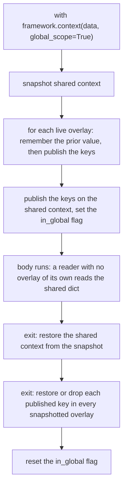
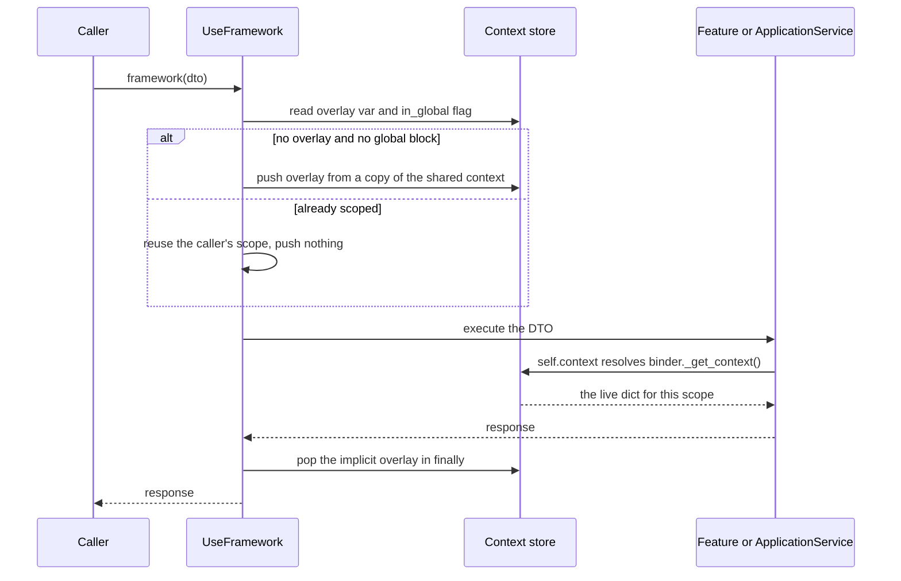

# Context propagation: overlay, `global_scope` and `self.context`

Short context — a correlation id, a tenant, a user, a token, the trace ids — is passed to Features and
ApplicationServices through one object: the context dict a handler reads as `self.context`. There is no
parameter and no per-call argument. The dict is owned by the `UseFramework` instance
(`ContextMixin`), looked up by the handler on every read, and swapped for the duration of a
`with framework.context(...)` block or of one `framework(dto)` call.

Two storage layers exist, and the difference between them is the whole page:

| | isolated overlay (default) | `global_scope=True` |
| --- | --- | --- |
| Where the keys live | a fresh dict held in a per-instance `ContextVar`, visible only to the task/thread that entered the block | written into the instance's `_shared_context`, **and** merged into every overlay live at enter time |
| Who sees them | the entering task/thread only | every reader on that instance without its own overlay, including other threads |
| On exit | the `ContextVar` token is reset, restoring the previous overlay | the shared dict and each snapshotted overlay are restored to their pre-block values |
| Enter / exit path | `FrameworkContext._enter_isolated` / `_pop_overlay` | `FrameworkContext._enter_global` / `_exit_global` |

The design rationale lives in `docs/design/context_manager.md`, which this page does not restate. For
the thread-boundary consequences of `ContextVar` isolation — `bus.thread_context()`, `AsyncBus`, the
`global_scope` exception to that rule — see
[concurrency and context handoff](/openwiki/architecture/concurrency-and-context-handoff.md). For the
`framework(dto)` path this overlay is pushed on, see
[executing a DTO](/openwiki/architecture/bus-execution.md).

## The store: `ContextMixin`

`UseFramework` mixes in `ContextMixin` (`sincpro_framework/use_bus.py:19`) and initialises the store in
its constructor, before anything else is wired (`sincpro_framework/use_bus.py:60`). Four pieces of
state are created per instance (`sincpro_framework/context/mixin.py:28-36`):

- `_overlay_var` — a `ContextVar[Optional[Dict[str, Any]]]` named
  `f"sincpro_ctx_overlay_{id(self)}"`, `default=None`. The `id(self)` in the name is what keeps two
  `UseFramework` instances from sharing an overlay *namespace*; the isolation itself is `ContextVar`
  semantics.
- `_in_global_var` — a `ContextVar[bool]`, `default=False`, set while a `global_scope=True` block is
  active on this task/thread.
- `_shared_context` — a plain `Dict[str, Any]`, the instance-level fallback and the publication target
  of `global_scope=True`.
- `_live_overlays` — a plain `List[Dict[str, Any]]`, one entry per overlay currently pushed on this
  instance, across threads. It exists so a global-scope block can reach into overlays it does not own.

Reads go through `_get_context()` (`sincpro_framework/context/mixin.py:38-42`): the active overlay if
there is one, otherwise `_shared_context`. Writes go through `_set_context()`
(`sincpro_framework/context/mixin.py:44-47`), which does **not** rebind anything — it clears the current
target dict and updates it in place, so the object identity of the live overlay survives a whole-dict
assignment. `_clean_context()` is the `_set_context({})` shorthand
(`sincpro_framework/context/mixin.py:49-50`); only tests call it.

Two instances in one process share none of this: separate containers, separate `_overlay_var`s,
separate shared dicts (`tests/test_context_manager.py:253-287`).

## Reading it: `self.context` is the live dict

`Feature` and `ApplicationService` both inherit `ContextConsumer`
(`sincpro_framework/sincpro_abstractions.py:85`, `:141`), whose only job is to resolve the live dict at
read time (`sincpro_framework/context/framework_context_consumer.py:15-23`):

```python
@property
def context(self) -> Any:
    binder = self._context_binder
    if binder is not None:
        return binder._get_context()
    return self._context_fallback
```

Three consequences a handler author should hold on to:

1. **It is the store, not a copy.** The returned object is the same dict the framework holds as overlay
   or shared context, so `self.context["k"] = v` is visible to every other handler running in the same
   scope — a write in a Feature is read by a sibling Feature of the same call
   (`tests/test_context_manager.py:579-599`).
2. **It is resolved per access, not bound once.** `bind_to_framework` records the owner
   (`sincpro_framework/context/framework_context_consumer.py:15-16`); the lookup happens on every
   `self.context`, so the value follows whichever overlay is active in the *calling* task/thread. That
   is also why the binding has to happen after the build — see below.
3. **Assignment is in-place.** `self.context = {...}` routes to the setter
   (`sincpro_framework/context/framework_context_consumer.py:25-31`) and then to `_set_context`, so the
   live overlay keeps its identity, dependencies injected as attributes are unaffected, and a sibling
   sees the replacement (`tests/test_context_manager.py:601-622`). Only when there is no binder does the
   setter replace `_context_fallback` with a new dict.

A read is ordinary dict access, so the whole `dict` surface works in a handler:

```python
class PaymentFeature(Feature):
    def execute(self, dto: PaymentDTO) -> PaymentResponse:
        correlation_id = self.context.get("correlation_id")   # None when no context is set
        user_id = self.context.get("user.id")
        self.context["charged_by"] = "payment-service"        # in-place, same scope sees it
        return PaymentResponse(...)
```

The stub for IDE support declares the attribute, not the method:
`context: ContextT` on both `Feature` and `ApplicationService`
(`sincpro_framework/sincpro_abstractions.pyi:77`, `:107`), with `ContextT` a free `TypeVar`
(`sincpro_framework/sincpro_abstractions.py:14`). SDKs parameterise it with a `TypedDict` so
`self.context.get("TOKEN")` is typed (`tests/typing_and_linter/typing_cases/typed_context_case.py:14-59`).

### When the binding does not exist

`bind_to_framework` is called by the framework, not by the author. `build_root_bus()` calls
`_bind_context_to_handlers()` (`sincpro_framework/use_bus.py:131`), which walks both registries and
binds each materialised handler to the `UseFramework` instance
(`sincpro_framework/context/mixin.py:65-71`). Any path that materialises handlers *without* a build —
the hand-wired `FeatureBus.register_feature` / `ApplicationServiceBus.register_app_service` entry points
used by the test fixtures (`tests/fixtures.py:24-28`, `:52-58`) — leaves `_context_binder` at `None`, and
`self.context` then reads and writes that handler's own `_context_fallback` dict, initialised to `{}` in
`Feature.__init__` / `ApplicationService.__init__`
(`sincpro_framework/sincpro_abstractions.py:121-126`, `:187-194`). It is per-handler, never shared, and
never populated by a `framework.context(...)` block. And on a handler whose own `__init__` never called
`super().__init__()`, neither `_context_binder` nor `_context_fallback` exists, so any access to
`self.context` fails with `AttributeError` from inside the property — the two attribute declarations at
`sincpro_framework/context/framework_context_consumer.py:12-13` are annotations, not defaults.

## The `with` block: `FrameworkContext`

`UseFramework.context(context_to_set, global_scope=False)` is a factory that returns a `FrameworkContext`
(`sincpro_framework/use_bus.py:249-270`); the class is not exported from
`sincpro_framework/__init__.py:12-20`, so tests and callers import it from
`sincpro_framework.context.framework_context`. Entering yields the **same** `UseFramework` instance, not
a wrapper (`sincpro_framework/context/framework_context.py:42-55`).

Construction copies the caller's mapping once (`self.context: Dict[str, Any] = dict(context)`,
`sincpro_framework/context/framework_context.py:32`), so mutating the dict you passed afterwards does not
change the block. `parent_context` is a second copy — of `_get_context()` **at construction time**
(`sincpro_framework/context/framework_context.py:34`), i.e. at `framework.context(...)` call time, not at
`__enter__`. It is typed in the stub (`sincpro_framework/context/framework_context.pyi:17`) but no enter
or exit path reads it; the merge below re-reads `_get_context()`. Treat it as an unused snapshot rather
than as the restore source.

### Isolated (the default)

`_enter_isolated` (`sincpro_framework/context/framework_context.py:57-59`) merges the *current* context
with the block's keys — `{**self.framework._get_context(), **self.context}` — and pushes the result:

```python
def _push_overlay(self, data: Dict[str, Any]) -> tuple[Token, Dict[str, Any]]:
    overlay = dict(data)
    token = self._overlay_var.set(overlay)
    self._live_overlays.append(overlay)
    return token, overlay
```

(`sincpro_framework/context/mixin.py:52-56`.) So inheritance works in both directions at once: an inner
block inherits the outer block's keys and may override them, while keys only it defines disappear when
it exits (`tests/test_context_manager.py:198-229`, `:404-443`, `:460-478`). The push is a *copy*, so the
overlay never aliases the mapping passed by the caller. `__exit__` returns the token to
`_pop_overlay`, which removes the overlay from `_live_overlays` (tolerating a `ValueError` if it was
already gone) and then resets the `ContextVar` token
(`sincpro_framework/context/mixin.py:58-63`, `sincpro_framework/context/framework_context.py:75-81`).

`FrameworkContext` is **single-use**: `__enter__` raises
`RuntimeError("Context manager is already entered")` on the second entry
(`sincpro_framework/context/framework_context.py:44-45`, pinned by
`tests/test_context_manager.py:105-114`). `__exit__` always returns `False`, so a block never swallows an
exception (`sincpro_framework/context/framework_context.py:81`), and it still restores state on the
exception path (`tests/test_context_manager.py:317-333`).

Every `__enter__` also emits the whole block's data to the instance debug log:
`self.framework.logger.debug(f"with context: {self.context}")`
(`sincpro_framework/context/framework_context.py:54`). Contexts carry tokens and correlation ids in
practice (`tests/test_thread_context_bus.py:114` uses `{"TOKEN": "abc123"}`), so debug logging is the
level at which those values leave the process.

### `global_scope=True`

A global-scope block pushes no overlay of its own. `_enter_global`
(`sincpro_framework/context/framework_context.py:61-73`) does three things:

1. snapshots `_shared_context` into `_shared_snapshot`;
2. walks `list(self.framework._live_overlays)` — the copy is deliberate — and for each live overlay
   records the previous value of every key it is about to publish (or an `_MISSING` sentinel when the
   key was absent), then updates the overlay with those keys;
3. updates `_shared_context` with the same keys and sets `_in_global_var` to `True`.

`_exit_global` (`sincpro_framework/context/framework_context.py:83-96`) reverses all three: `clear()` +
`update(snapshot)` on the shared dict, then per overlay either restores the remembered value or pops the
key that was not there before, then resets the global flag.



*What `global_scope=True` publishes and un-publishes — instance-wide on the way in, exact-restore on the way out.*

The mechanism is documented as a deliberate opt-in that "publishes keys on this instance so concurrent
executions can read them", not as a thread-propagation mechanism
(`sincpro_framework/use_bus.py:249-257`). Practical consequences:

- A reader in **another thread** that has no overlay of its own reads those keys, because
  `_get_context()` falls back to `_shared_context`. That is the one case a bare
  `executor.submit(bus.execute, dto)` still sees the caller's context
  ([details](/openwiki/architecture/concurrency-and-context-handoff.md)).
- An overlay pushed **after** the global block entered is not in `_overlay_snapshots`, so it is never
  updated with the published keys and never restored — it simply does not participate. Symmetrically, an
  overlay that exited before the block exits is restored into a dict nobody reads any more.
- Overlays live at enter time are snapshotted **by reference**; the restore mutates their contents, not
  their identity.
- Anything a handler writes into the context while a global block is active — in the overlay case
  `_set_context` would target the snapshotted overlay and be rolled back; in the shared case it is
  discarded by the snapshot restore — does not survive the block.
- `_shared_context` and `_live_overlays` are plain containers with no lock
  (`sincpro_framework/context/mixin.py:35-36`); the free-threading note next to them records that the
  iteration copies the list first and that this is current-CPython behaviour, not a permanent guarantee
  (`sincpro_framework/context/mixin.py:13-23`).

The pinned behaviours are: a concurrent execution on the same instance sees a globally published key
(`tests/test_context_manager.py:525-557`) and the key is gone afterwards
(`tests/test_context_manager.py:559-577`).

## The implicit overlay: one per `framework(dto)` call

Outside any block there is still a context during a call. `UseFramework.__call__` pushes one, and only
when it needs to (`sincpro_framework/use_bus.py:388-404`):

```python
implicit_token = None
implicit_overlay = None
if self._overlay_var.get() is None and not self._in_global_var.get():
    implicit_token, implicit_overlay = self._push_overlay(dict(self._shared_context))

try:
    return self.middleware_pipeline.execute(dto, executor, return_type=return_type)
finally:
    if implicit_token is not None and implicit_overlay is not None:
        self._pop_overlay(implicit_token, implicit_overlay)
```

The guard is the clause the reader has to internalise: **if an overlay is already active, or a
global-scope block is in effect, `__call__` pushes nothing.** The caller's scope is left untouched, and
the call reads and writes the overlay (or shared dict) the caller installed. The overlay is seeded from
a copy of `_shared_context`, so shared entries are readable inside a bare call, and it is always popped
in a `finally`, including when the DTO raises.



*One `framework(dto)` call: at most one implicit overlay, and none at all when a scope is already active.*

That gives three distinct write lifetimes, all pinned:

| Where the handler runs | Write via `self.context` lands in | Survives until |
| --- | --- | --- |
| bare `framework(dto)`, no block | a throwaway overlay seeded from the shared context | the end of that call (`tests/test_context_manager.py:624-646`) |
| inside `with framework.context({...})` | the block's overlay | the end of the block, and readable by later calls in the same block (`tests/test_context_manager.py:579-599`) |
| inside `with framework.context({...}, True)` | the instance shared dict (or the snapshotted overlay) | the end of the global block, then restored |

Because the implicit overlay is pushed by `__call__` only, the two thread/async handles — which call
`Bus.execute` directly — never create one
([concurrency page](/openwiki/architecture/concurrency-and-context-handoff.md)).

## Trace ids, logs and error paths

**`with_trace()` / `with_parent_trace()` are a context block.** `FrameworkSpanContext.__enter__` binds
the resolved ids to the shared logger, then composes a `FrameworkContext` with exactly
`{"trace_id": ..., "span_id": ...}` and enters it
(`sincpro_framework/observability/tracing/span_context.py:61-80`), exiting it last
(`sincpro_framework/observability/tracing/span_context.py:133-134`). `with_trace` and
`with_parent_trace` build the root bus lazily and hand the work to
`Observability.trace_context` (`sincpro_framework/use_bus.py:272-320`, `:322-357`,
`sincpro_framework/observability/api.py:120-136`). The block is **isolated**, not global — and it merges
with whatever is already active, so `with app.with_trace(...)` then `with traced.context(...)` works as
one composed scope (`tests/observability/tracing/test_tracing.py:138-156`). That block is the framework's
own route to `self.context.get("trace_id")`
(`tests/observability/tracing/test_tracing.py:80-107`); nothing else puts those keys there unless the
caller does it explicitly, and a bare `framework(dto)` call does not — the ids still reach the log lines
because each DTO execution binds them to the logger from the span
(`sincpro_framework/observability/tracing/span_execution.py:55-76`,
`sincpro_framework/bus.py:47`, `:103`). The README's "trace_id … always present" comment at the handler is
accurate only inside a trace block (`README.md:918-925`).

**Entrypoints compose the same two blocks.** A wire host that carries a context map splits the tracing
keys out of it (`TRACE_KEYS = ("trace_id", "span_id", "carrier")`,
`sincpro_framework/entrypoints/const.py:18`) and wraps the run in `framework.context(extra)` and/or
`framework.with_trace(**trace_kwargs)` depending on what is left
(`sincpro_framework/entrypoints/scalar_executor.py:77-109`). The JSON-RPC gateway folds
`X-Correlation-Id` and `traceparent` headers into that map first, with the request body's own `context`
object overriding the header values (`sincpro_framework/entrypoints/rpc/entrypoint.py:34-48`,
`sincpro_framework/entrypoints/rpc/jrpc.py:112-122`), which is why a Feature sees a request's
`correlation_id` in `self.context` (`tests/entrypoint/test_entrypoint_rpc.py:189-220`). See
[entrypoint rpc](/openwiki/integrations/entrypoint-rpc.md).

**Errors are not enriched with the context dict.** Nothing in the package attaches context data to a
raised exception. On the failure path the bus records the exception on the current span and reports it to
GlitchTip with tags derived from the observability identity — `sincpro.kind`, `sincpro.layer`,
`sincpro.dto`, `sincpro.instance`, `sincpro.package`, `tenant` — and from the caller's
`ignore_sentry_exceptions` list (`sincpro_framework/observability/tracing/span_error.py:8-16`,
`sincpro_framework/observability/errors/record_error.py:29-62`,
`sincpro_framework/observability/api.py:101-118`). Correlation between an error and its request comes
from the `trace_id`/`span_id` on the log lines of that execution, not from attributes on the exception.

## Documented API that is not implemented

The shipped documentation and example disagree with the code in three places, and the discrepancy is
worth stating rather than smoothing over — `docs/design/context_manager.md` and
`examples/context_manager_demo.py` are the design note and the demo, not the contract.

| Documented | Reality |
| --- | --- |
| `self.get_context_value("correlation_id", "unknown")` as the read API in handlers (`docs/design/context_manager.md:49-75`, `:195`, `examples/context_manager_demo.py:49-51`, `:74-75`) | No such method exists anywhere in the package. `grep` for `get_context_value` finds only those two files. The implemented read surface is the `.context` property (`sincpro_framework/context/framework_context_consumer.py:18-23`) — write `self.context.get("correlation_id", "unknown")` |
| `from sincpro_framework import get_current_context` "from anywhere" (`docs/design/context_manager.md:104-112`) | Not exported (`sincpro_framework/__init__.py:12-20`) and not defined anywhere. There is no process-wide current context; the store is per `UseFramework` instance |
| Exceptions "automatically enriched with context information" through `e.context_info["context_data"]` / `["timestamp"]` (`docs/design/context_manager.md:22-25`, `:89-102`, `README.md:152`) | Nothing sets `context_info` on exceptions. The demo's own `hasattr(e, "context_info")` guard and its "not enriched with context" branch are the honest outcome (`examples/context_manager_demo.py:184-191`) |

The same caveat applies to the design note's `ThreadPoolExecutor` snippet
(`docs/design/context_manager.md:114-131`): it has each worker construct its own `UseFramework`, which
sidesteps the cross-thread overlay question entirely. The supported crossing is
`bus.thread_context()` — see
[concurrency and context handoff](/openwiki/architecture/concurrency-and-context-handoff.md).

## Invariants and safe-change notes

- **`__call__` never shadows a scope.** The `self._overlay_var.get() is None and not
  self._in_global_var.get()` guard (`sincpro_framework/use_bus.py:390`) is what makes a `with` block
  cover a sequence of calls. Removing or inverting it would silently re-isolate every call and break
  `global_scope` visibility.
- **Every push is matched by a pop.** A `Token` reset restores the *previous* overlay; `_pop_overlay`
  also drops the overlay from `_live_overlays`, which is what keeps a later `global_scope=True` block
  from writing into a dead overlay.
- **`_get_context()` returns a live reference, never a copy.** Anywhere that hands the context to a
  caller must decide whether it wants the live dict or a snapshot; `FrameworkContext.__init__` copies,
  `_enter_isolated` copies, the property does not.
- **A global-scope block publishes only to overlays that exist when it enters.** Adding a new way to
  push an overlay means deciding whether it should be visible to such a block.
- **`_shared_context` is not a long-lived store.** It is written only by `global_scope=True` enter (and by
  a `_set_context` that happens to resolve to it, i.e. a write with no overlay active), and a bare
  `framework(dto)` call reads a *copy* of it — writes made during that call are thrown away with the
  implicit overlay.
- **A handler instantiated outside a build has no live context.** `_context_binder` is only ever set by
  `_bind_context_to_handlers()` (`sincpro_framework/context/mixin.py:65-71`); without a build,
  `self.context` is that instance's own `_context_fallback` dict and no `context()` block reaches it.
- **Do not read `parent_context` as the restore source.** Restore is token- or snapshot-based; the
  attribute is captured at construction and unused.
- **The context value is logged at debug on every `__enter__`.** Keep secrets out of context dicts, or
  keep the instance logger above `DEBUG`.

## Evidence and harness

| Behaviour | Pinned by |
| --- | --- |
| Enter yields the same framework; context equal to the block's data; cleaned on exit | `tests/test_context_manager.py:88-103` |
| Double `__enter__` raises `RuntimeError` | `tests/test_context_manager.py:105-114` |
| Handlers bound after the build see the block's dict | `tests/test_context_manager.py:136-153` |
| Nested override + inheritance, and parent restore after inner exit | `tests/test_context_manager.py:198-229`, `:404-443` |
| Two instances keep isolated contexts | `tests/test_context_manager.py:253-287` |
| Context restored when the body raises | `tests/test_context_manager.py:317-333` |
| Per-thread isolation across a `ThreadPoolExecutor` | `tests/test_context_manager.py:365-402` |
| Concurrent isolated blocks on one instance do not collide | `tests/test_context_manager.py:492-523` |
| `global_scope=True` visible to a concurrent execution, and restored after exit | `tests/test_context_manager.py:525-577` |
| A write inside a block is visible to the next call in that block | `tests/test_context_manager.py:579-599` |
| Whole-dict assignment keeps injected dependencies intact | `tests/test_context_manager.py:601-622` |
| Writes outside a block do not leak into the next call | `tests/test_context_manager.py:624-646` |
| `trace_id`/`span_id` readable via `self.context` inside `with_trace()` | `tests/observability/tracing/test_tracing.py:80-107` |
| `with_trace()` and `context()` compose; nested exit restores the parent | `tests/observability/tracing/test_tracing.py:138-156` |
| Framework context cleared after `with_trace()` exits | `tests/observability/tracing/test_tracing.py:128-135` |
| A wire `context` object (and header inheritance) reaches `self.context` | `tests/entrypoint/test_entrypoint_rpc.py:189-220` |
| `self.context` typing via a `TypedDict` `ContextT` | `tests/typing_and_linter/typing_cases/typed_context_case.py:14-82` |

Run the focused files with `make test_one t=tests/test_context_manager.py`,
`make test_one t=tests/observability/tracing/test_tracing.py` or
`make test_one t=tests/entrypoint/test_entrypoint_rpc.py` (`README.md:1268-1274`, `Makefile:152-153`).

## Related pages

- [Executing a DTO: the end-to-end bus flow](/openwiki/architecture/bus-execution.md) — where the
  implicit overlay sits in a call, and what else the call does.
- [Concurrency: thread handoff, async facade and free-threading status](/openwiki/architecture/concurrency-and-context-handoff.md)
  — why `ContextVar` isolation loses context in a bare `executor.submit`, and the two handles that fix it.
- [Entrypoints over JSON-RPC](/openwiki/integrations/entrypoint-rpc.md) — header/body context merging
  into `framework.context(...)`.
- [Tracing and observability](/openwiki/integrations/observability-tracing.md) — spans, log correlation
  and the `with_trace()` block that publishes `trace_id`/`span_id` here.
- [Error handling](/openwiki/workflows/error-handling.md) — what happens to an exception after it leaves
  a handler.
- Design note: `docs/design/context_manager.md` (authoritative for intent; see the discrepancy table
  above before copying its snippets).
