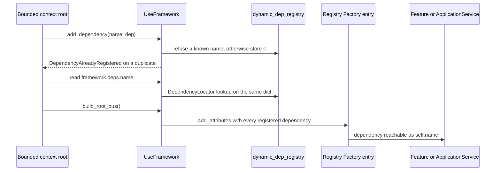

# Dependency injection and typing: `add_dependency`, `deps` and `DependencyContextType`

A dependency enters the framework through exactly one call — `framework.add_dependency(name, dep)`
(`sincpro_framework/use_bus.py:152-170`) — and is afterwards reachable through **two different
surfaces**, depending on where you are:

| Who reads it | Surface | Runtime object |
| --- | --- | --- |
| inside a handler | `self.<name>` | the instance attribute injected at build time |
| from the bounded-context root (SDK caller, test, entrypoint) | `framework.deps.<name>` | the `DependencyLocator` view over the same registry |

Underneath both is one plain dict, `dynamic_dep_registry`, created per `UseFramework` instance
(`sincpro_framework/use_bus.py:72-74`). The `deps` half is *read-only*: registration goes through
`add_dependency`, never through the locator. The second half of this page is the typing story —
`UseFramework[DependencyContextType]`, the hand-written `.pyi` stubs shipped next to
`sincpro_framework/py.typed`, and the project convention of declaring the types once on a
non-instantiated class.



*One dict feeds both surfaces: the locator reads it directly, the build pushes it onto the registration entries.*

## The registry: `dynamic_dep_registry`

`__init__` creates the dict and the locator that wraps it, one pair per instance
(`sincpro_framework/use_bus.py:72-74`):

```python
# Registry for dynamic dep injection
self.dynamic_dep_registry: Dict[str, Any] = dict()
self._deps_locator = DependencyLocator(self.dynamic_dep_registry)
```

Because both are instance attributes and the container is per instance too
(`sincpro_framework/use_bus.py:63-66`), two bounded contexts in one process never share dependencies:
`tests/use_container/test_deps.py:84-93` registers the same name on two frameworks and asserts each
one keeps its own object.

### `add_dependency`: duplicate guard and the recorded timing contract

```python
def add_dependency(self, name, dep: Any):
    """
    Add a dependency to the framework where
    The Feature and App Service have as attribute
    ...
    """
    if name in self.dynamic_dep_registry:
        error = DependencyAlreadyRegistered(f"The dependency {name} is already injected")
        self.observability.record_error(error, "", "framework", kind="framework")
        raise error
    self.dynamic_dep_registry[name] = dep
```

(`sincpro_framework/use_bus.py:152-170`; the exception class is
`sincpro_framework/exceptions.py:5-6`.) Three things are worth separating:

- **A duplicate is refused, not overwritten.** There is no "replace" path and no return value —
  the method stores or raises. The `name` is the attribute name the handlers will see, so it is the
  caller's choice, not the class name: the README registers `"ECardType"` for an enum class, not for
  an instance (`README.md:361-364`).
- **The duplicate is also reported to observability** before it is raised
  (`sincpro_framework/use_bus.py:168`). That call passes an empty DTO name and `layer="framework"`
  with `kind="framework"` (`sincpro_framework/observability/api.py:101-118`), and `kind="framework"`
  is what makes the reporter swap in the framework identity instead of the instance one
  (`sincpro_framework/observability/errors/record_error.py:35-36`).
- **The docstring records a timing and safety contract** (`sincpro_framework/use_bus.py:152-165`):
  call this "during startup, before the first execution — not concurrently with in-flight requests";
  `dynamic_dep_registry` is "a plain dict with no lock", so under the GIL a late or concurrent call is
  at worst "last write wins", while without it (a free-threaded build) "it becomes a genuine data
  race". The docstring states the constraint is deliberately *not enforced*, "to avoid a breaking
  change — documented so it isn't a surprise later". Treat it as the contract the code documents, not
  as something the code checks: nothing in `add_dependency` inspects whether the bus has been built.
  `README.md:1320-1323` restates the same rule for the startup-built registries as a whole.

### The build is what pushes deps onto handlers

`add_dependency` only writes the dict. The dependency reaches handlers through `build_root_bus()`,
whose first step is `_add_dependencies_provided_by_user()` (`sincpro_framework/use_bus.py:125`):

```python
def _add_dependencies_provided_by_user(self):
    if "feature_registry" in self._sp_container.feature_bus.attributes:
        feature_registry = self._sp_container.feature_bus.attributes["feature_registry"].kwargs
        for _, feature in feature_registry.items():
            feature.add_attributes(**self.dynamic_dep_registry)
    # ... the same for app_service_registry
```

(`sincpro_framework/use_bus.py:90-105`.) The receiver of `add_attributes` is the **registration
entry** — the `providers.Factory` the decorator stored (`sincpro_framework/ioc.py:126-131`, `:137-147`)
— not a bus and not the container, which is why the push is the step that makes a dependency an
attribute of the Feature / ApplicationService rather than of the framework object. Four consequences:

- **The push happens only from the build.** `_add_dependencies_provided_by_user()` has exactly one
  call site (`sincpro_framework/use_bus.py:125`). The build itself runs from `build_root_bus()` or
  lazily inside the first `framework(dto)` call (`sincpro_framework/use_bus.py:377-378`), so a
  dependency registered before that first execution is picked up, and one registered after it is not
  pushed anywhere by the framework.
- **It covers the registrations present at that moment**, because it iterates the registry entries
  that exist when the build runs. Both halves must therefore be in place before the build: the
  `@framework.feature(...)` / `@framework.app_service(...)` decoration *and* the `add_dependency`
  call. `tests/use_container/test_use_framework.py` is the end-to-end shape — it registers
  `proxy_services` (`:36-37`), decorates a Feature and an ApplicationService (`:64-71`, `:84-93`) and
  the handlers read `self.any_client(...)`, which resolves through `self.proxy_services`
  (`:28-33`); the invocation happens last (`:99-102`).
- **Handler-side reads are attribute reads.** `Feature` / `ApplicationService` have no dependency
  lookup of their own: they are plain objects with the names set on them
  (`sincpro_framework/sincpro_abstractions.py:121-138`, `:185-197`), and the stubs say so
  ("Injected dependencies become available as attributes at runtime … added dynamically by the
  framework", `sincpro_framework/sincpro_abstractions.pyi:84-87`, `:114-117`). A handler that never
  got the attribute raises the ordinary `AttributeError` on `self.<name>`; the friendlier
  `DependencyNotRegistered` belongs to `framework.deps` only.
- **The deps survive a rebuild by living outside the container.** `framework.deps` reads the
  instance's own dict, so it is unaffected by how many times the bus is built — pinned by
  `tests/use_container/test_deps.py:70-81`.

### `injected_dependencies` is not part of this path

`FrameworkContainer` declares `injected_dependencies: Dict = providers.Dict()`
(`sincpro_framework/ioc.py:44`), which reads like the container-side half of the feature. It is not:
no code in the package reads it, and nothing writes to it. The live path is
`dynamic_dep_registry` (`sincpro_framework/use_bus.py:72-74`, pushed at `:90-105`) plus the locator
below. Keep that in mind when the container is the file being changed — adding the deps there would
not reach any handler.

## `framework.deps`: the read-only locator

```python
@property
def deps(self) -> TDeps:
    """Read-only locator of dependencies registered with ``add_dependency``. ..."""
    return cast(TDeps, self._deps_locator)
```

(`sincpro_framework/use_bus.py:172-181`.) At runtime `cast` is a no-op, so the property hands back
the single `DependencyLocator` created in `__init__` — the same object on every access, and one that
reads the very dict `add_dependency` writes (`sincpro_framework/deps.py:21-24`). Reading it does
**not** require a built bus; nothing in the property touches `self.bus`
(pinned by `tests/use_container/test_deps.py:16-22`, which never builds).

`DependencyLocator` (`sincpro_framework/deps.py:12-66`) is deliberately a thin view, not a second
container:

| Operation | Behaviour |
| --- | --- |
| `.name` / `["name"]` | the registered object; both spellings are the same lookup (`sincpro_framework/deps.py:26-36`, pinned as identical in `tests/use_container/test_deps.py:25-30`) |
| miss | `DependencyNotRegistered` with `Dependency 'name' is not registered. Available: a, b` (`sincpro_framework/deps.py:64-66`), i.e. the sorted names, or `(none)` when the registry is empty |
| `in`, `len()`, `iter()` | membership, count and iteration over the registered *names* (`sincpro_framework/deps.py:38-45`, pinned by `tests/use_container/test_deps.py:61-67`) |
| `dir()` | the ordinary object attributes **plus** every dependency name, so tab-completion lists them (`sincpro_framework/deps.py:47-48`) |
| `repr()` | `DependencyLocator(a, b)` with sorted names, or `DependencyLocator(empty)` (`sincpro_framework/deps.py:50-52`) |
| `x.name = v`, `del x.name` | `AttributeError("Dependencies are read-only. Register them with add_dependency().")` (`sincpro_framework/deps.py:54-62`, pinned by `tests/use_container/test_deps.py:50-58`) |

Two details of that class matter for anyone changing it:

- **`DependencyNotRegistered` is an `AttributeError` subclass** (`sincpro_framework/exceptions.py:9-10`).
  That is deliberate enough to be pinned: `getattr(framework.deps, "missing_adapter", None)` returns
  `None` and `hasattr` is `False`, so optional-dependency probing via `getattr(..., default)` works
  even though direct access raises, and the message is still specific
  (`tests/use_container/test_deps.py:33-47`).
- **Read-only is enforced by overriding the attribute protocol, and the constructor steps around
  it.** The instance is `__slots__ = ("_registry",)` and `__init__` installs the dict with
  `object.__setattr__` (`sincpro_framework/deps.py:21-24`) precisely because the class's own
  `__setattr__` refuses everything. Note the asymmetry that remains: `__getattr__` is a *fallback*
  only, so `_registry` is reachable as a normal slot attribute and it *is*
  `framework.dynamic_dep_registry` — the same dict by identity. Assigning
  `framework.dynamic_dep_registry[name] = dep` therefore bypasses the duplicate guard and the
  locator reflects it immediately. The read-only guard protects the locator surface, not the dict.

## Two audiences, one registry

The README states the split explicitly: use `self.<name>` inside a Feature / ApplicationService, and
`.deps` from SDK callers, tests and entrypoints (`README.md:472-474`), where "the same names Features
receive as `self.token_adapter` are available on the root as `my_framework.deps.token_adapter`"
(`README.md:261`). The code backs that up structurally: the only writer is
`dynamic_dep_registry` (`sincpro_framework/use_bus.py:170`), the locator reads that dict verbatim
(`sincpro_framework/deps.py:26-30`), and the build pushes the same values
(`sincpro_framework/use_bus.py:97`, `:105`), so both surfaces resolve to the object the caller passed
to `add_dependency` — which the test asserts for the root surface
(`tests/use_container/test_deps.py:16-22`). No test asserts the cross-surface identity (one object
being both `framework.deps.x` and a handler's `self.x`), so treat that as the design's intent plus
the README's statement rather than as a pinned contract.

Where the root surface is genuinely needed is anything outside a handler: the README's consistency
test walks the declared names and asserts each one is present (`README.md:496-518`), which cannot be
done from inside a Feature.

## Typing path: `UseFramework[DependencyContextType]`

`UseFramework` is generic over the dependency context — `class UseFramework(ContextMixin,
Generic[TDeps])` (`sincpro_framework/use_bus.py:19`) — and `TDeps` is declared with a default of
`Any` (`sincpro_framework/deps.py:9`):

```python
TDeps = TypeVar("TDeps", default=Any)
```

The docstring of the class and of `deps` spell out the intended usage
(`sincpro_framework/use_bus.py:20-28`, `:174-181`):

```python
framework = UseFramework[DependencyContextType]("my-context")
framework.add_dependency("my_adapter", MyAdapter())
framework.deps.my_adapter  # MyAdapter, same name Features get as self.my_adapter
```

Three properties of this mechanism are worth being precise about:

1. **The generic parameter is purely static.** `UseFramework[DependencyContextType](...)` creates an
   ordinary instance; `add_dependency` never looks at the annotations, and nothing validates that the
   object registered under `token_adapter` is in fact a `TokenAdapter`. The guard in `add_dependency`
   is the name duplicate only (`sincpro_framework/use_bus.py:166-169`). Typing buys autocomplete and
   checker errors at development time, not runtime safety.
2. **`Any` is the default, so an unparameterized framework degrades quietly.** `UseFramework("x")`
   has `framework.deps: Any`; parameterizing is what turns `framework.deps.token_adapter` into
   `TokenAdapter` for a checker. `tests/typing_and_linter/typing_cases/typed_deps_case.py:11-22` is
   the checked example: `assert_type(adapter, TokenAdapter)`, `assert_type(adapter.generate(), str)`
   and `assert_type(framework, UseFramework[DependencyContextType])`.
3. **The checker sees the stub, not `deps.py`.** The distribution ships the empty marker
   `sincpro_framework/py.typed` plus hand-written `.pyi` files; `sincpro_framework/use_bus.pyi`
   re-imports `TDeps` (`:15`) and declares both halves of the surface — `add_dependency(name: str,
   dep: Any) -> None` with its `Raises: DependencyAlreadyRegistered` note (`:123-136`) and
   `deps -> TDeps` (`:138-145`) — while `dynamic_dep_registry: Dict[str, Any]` is declared as a plain
   mutable attribute (`:49`). The docstring in `sincpro_framework/deps.py:12-19` states the same
   split from the runtime side: "Type checkers see `TDeps` (typically `DependencyContextType`)
   instead of this class".

That contract is enforced in CI-like fashion rather than asserted at runtime: `pyright` is run over
`tests/typing_and_linter/typing_cases` (`tests/typing_and_linter/test_typing_and_linter.py:31-41`)
and `make lint` runs `pyright` over `sincpro_framework` and `tests` (`Makefile:103-113`), configured
in `pyproject.toml:76-80`. `sincpro_framework.deps` itself — the module with `DependencyLocator` and
`TDeps` — is *not* re-exported by `sincpro_framework/__init__.py:1-21`, so it is an internal reached
through `UseFramework.deps`.

### What the shipped design is not

`docs/prd/PRD_01_typed-dependency-container.md` is the design proposal for this area and describes
something different: a `TypedDict`-based `T_DepMap`, `BaseFeature[T_DepMap]`, a `DependencyContainer`
with a `self.deps` property *inside* handlers, and a `validate_all_dependencies()` that raises on
missing names (`docs/prd/PRD_01_typed-dependency-container.md:41-59`, `:237-275`). None of those
names exist in the package; the shipped design keeps `self.<name>` in handlers, exposes `deps` only
on the root, and performs no type validation. Read the PRD as intent for what was considered, and
`deps.py` / `use_bus.pyi` as the current contract.

## The `DependencyContextType` convention

Since the annotations are never read at runtime, the typing story lives entirely in how you declare
the class. The README's recommended layout (`README.md:392-518`) splits framework wiring into
`apps/<domain>/infrastructure/dependencies.py`, `framework.py` and `__init__.py`, with the types
declared once:

```python
# apps/my_domain/infrastructure/dependencies.py
class DependencyContextType:
    """Typing helper — gives Features/AppServices IDE autocomplete for injected deps."""

    token_adapter: TokenizationAdapter
    payment_adapter: PaymentAdapter


def register_dependencies(framework: UseFramework[DependencyContextType]) -> UseFramework[DependencyContextType]:
    framework.add_dependency("token_adapter", TokenizationAdapter())
    framework.add_dependency("payment_adapter", PaymentAdapter())
    return framework
```

(`README.md:412-435`.) Two rules are stated with it: the class "is **not** instantiated — it is used
only as a mixin" (`README.md:412-414`), and the local base classes mix it in so that every handler in
the bounded context inherits the annotated names (`README.md:437-470`):

```python
class Feature(_Feature, DependencyContextType):
    pass


class ApplicationService(_ApplicationService, DependencyContextType):
    pass


def config_framework(name: str) -> UseFramework[DependencyContextType]:
    instance = UseFramework[DependencyContextType](name)
    register_dependencies(instance)
    return instance
```

`tests/typing_and_linter/typing_cases/typed_context_case.py:29-52` is the type-checked version of
that idiom — the same `DependencyContextType` mixed into `Feature` and `ApplicationService`, with
`context` re-annotated on the local bases because a handler's `self.context` type comes from the
handler class, not from the dependency map. `tests/use_container/test_use_framework.py:28-44` shows
the same class used slightly more ambitiously, carrying a helper method (`any_client`) that handlers
call on `self`; nothing in the framework distinguishes that method from the typed attributes, and the
file is the end-to-end usage example for the whole path.

The README documents an earlier, narrower spelling of the same idea too: annotate the injected
attributes directly on the local `Feature` / `ApplicationService` subclasses
(`README.md:341-390`). Both forms work for the same reason — the annotations exist only for the
checker, while the runtime attribute is the one the build pushes.

Finally, because the annotations are the only place all dependency names are written down, the README
recommends a test that iterates them and asserts presence against the live locator
(`README.md:496-518`):

```python
def test_declared_deps_are_registered():
    for dep_name in DependencyContextType.__annotations__:
        assert dep_name in my_framework.deps, f"Missing dep: {dep_name}"
```

That is exactly what the locator's `__contains__` is for (`sincpro_framework/deps.py:38-39`), and it
catches the one mismatch the framework itself cannot: a name declared for the checker but never
passed to `add_dependency`.

## What pins this behaviour

| Behaviour | Pinned by |
| --- | --- |
| `framework.deps.name` returns the registered object and is the same as `["name"]` | `tests/use_container/test_deps.py:16-30` |
| A miss raises `DependencyNotRegistered` naming the available deps | `tests/use_container/test_deps.py:33-41` |
| `getattr(..., default)` still works, because the error is an `AttributeError` | `tests/use_container/test_deps.py:44-47` |
| Assignment and deletion through the locator are refused | `tests/use_container/test_deps.py:50-58` |
| `in`, `len()` over the locator | `tests/use_container/test_deps.py:61-67` |
| Dependencies survive the bus build | `tests/use_container/test_deps.py:70-81` |
| Dependencies are per instance, never shared | `tests/use_container/test_deps.py:84-93` |
| A dependency is readable as `self.<name>` in a Feature and an ApplicationService end to end | `tests/use_container/test_use_framework.py:28-44`, `:64-71`, `:84-93`, `:99-102` |
| `UseFramework[X]` types `framework.deps` as `X` | `tests/typing_and_linter/typing_cases/typed_deps_case.py:11-22` |
| The typing examples are checked by `pyright` | `tests/typing_and_linter/test_typing_and_linter.py:31-41` |

No test drives `DependencyAlreadyRegistered` (the duplicate guard) or the
`record_error(..., kind="framework")` side effect of `add_dependency`; both are read off the source at
`sincpro_framework/use_bus.py:166-169`.

## Where to go next

- [Registration and IoC](/openwiki/architecture/registration-and-ioc.md) — the registration entries
  `add_dependencies_provided_by_user` pushes onto, and what the build materialises from them.
- [Building a bounded context](/openwiki/workflows/building-a-bounded-context.md) — the
  `dependencies.py` / `framework.py` layout this page's convention belongs to.
- [Feature vs ApplicationService](/openwiki/concepts/feature-vs-application-service.md) — which of
  the two handler kinds reads the injected attributes.
- [Maintaining and extending](/openwiki/operations/maintaining-and-extending.md) — where a new
  provider or registry belongs when the container is the file being touched.
- [Concurrency and context handoff](/openwiki/architecture/concurrency-and-context-handoff.md) — the
  free-threaded reading of `add_dependency`'s "plain dict with no lock" caveat.
