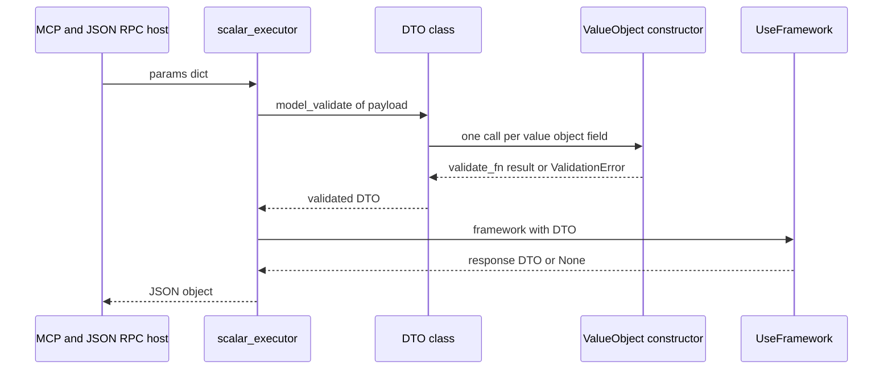

# DTOs and Value Objects: pydantic contracts and validation

Two separate objects own the data contract. `DataTransferObject` is the **envelope**: a
pydantic model whose class name is the key the whole framework registers and dispatches on.
`ValueObject` is the **field type**: a factory in `sincpro_framework.ddd` that produces a
subclass of a primitive (`int`, `str`, `float`, …) whose `validate_fn` runs every time a value is
constructed — including each time pydantic hydrates that field of a DTO.

They are independent: a DTO does not need value objects, and a value object is usable in any
pydantic model, not only in a `DataTransferObject`. What ties them together is that pydantic
validation, not the Feature, is where invalid input stops.

```python
from sincpro_framework import DataTransferObject
from sincpro_framework.ddd import ValueObject

NIT = ValueObject(int, lambda v: abs(v), name="NIT")
Email = ValueObject(str, lambda v: v.strip().lower(), name="Email")


class ChargePayment(DataTransferObject):
    nit: NIT
    email: Email
    amount: float


ChargePayment(nit=-99001, email="  A@B.COM ", amount=10.5)   # nit=99001, email="a@b.com"
```

(The declarations above mirror the checked usage in
`tests/entrypoint/test_entrypoints.py:16-17` and `tests/entrypoint/test_entrypoints.py:33-36`.)

## `DataTransferObject`: a pydantic model with two flags

`DataTransferObject` is declared once, in `sincpro_framework/sincpro_abstractions.py:21-29`, and
re-exported from the package root (`sincpro_framework/__init__.py:2-8`) so applications never
import `sincpro_abstractions` directly. Pydantic is pinned to the v2 line
(`pyproject.toml:27`), and every hook discussed here is a v2 hook.

```python
class DataTransferObject(BaseModel):
    """
    Abstraction that represent a object that will travel through to any layer
    """

    model_config = ConfigDict(
        arbitrary_types_allowed=True,
        use_attribute_docstrings=True,
    )
```

Every DTO in every bounded context is a plain pydantic v2 model that inherits those two
configuration flags unless a subclass overrides `model_config`. `TypeDTO` and `TypeDTOResponse`
are `TypeVar`s bound to it (`sincpro_framework/sincpro_abstractions.py:12-13`), which is how
`Feature` and `ApplicationService` are parameterized.

**`use_attribute_docstrings=True`** turns a bare string literal after a field into the JSON
Schema `description` of that field, so the documentation an agent reads comes from the DTO
class body rather than from a duplicated `Field(...)` argument:

```python
class ValidateCard(DataTransferObject):
    card_number: str
    """PAN to validate."""
    cvv: str = Field(description="Card verification value")
```

Both forms reach the schema: pydantic merges them into the property definitions of
`model_json_schema()`, which `dto_json_schema`
(`sincpro_framework/entrypoints/json_utils.py:19-23`) is the single wrapper over — that is the
schema the MCP and JSON-RPC hosts publish for the input DTO.

**`arbitrary_types_allowed=True`** is what lets the framework's own models *be* DTOs while carrying
non-pydantic field types. Two examples ship in this repository:

- `PackedFeatureOrAppService` (`sincpro_framework/entrypoints/catalog.py:20-35`) declares
  `run: RunFn` — a bound callable — and its docstring states the rationale directly: "`run` is a
  bound callable, not JSON; DataTransferObject allows arbitrary types so it can travel alongside
  the JSON-safe fields" (`sincpro_framework/entrypoints/catalog.py:26-27`);
- `FeatureOrAppServiceMetadata` (`sincpro_framework/introspection/inspector.py:26-33`) declares
  `instance: Feature | ApplicationService` — the live handler object, not a model pydantic can
  otherwise generate a schema for.

So the flag is not decoration: it is what makes "a pydantic model that also carries runtime
objects" the standard shape here, which in turn is why the JSON-facing code filters schemas
explicitly instead of assuming every DTO is serializable.

### Construction is validation

Both construction paths are pydantic v2 paths and behave identically:

| Path | Typical caller |
| --- | --- |
| `ChargePayment(nit=-1, email=" A@B.COM ", amount=1.0)` | Python code, tests, an ApplicationService building a nested DTO |
| `ChargePayment.model_validate({"nit": -1, "email": " A@B.COM ", "amount": 1.0})` | the wire boundary (`sincpro_framework/entrypoints/scalar_executor.py:70-72`) |

`model_validate` is what every JSON host uses to turn a payload into a DTO, so the Feature
never sees an unvalidated dict. Validation of the input DTO happens *before* the bus is called.

### A DTO is identified by its class name

Nothing keeps a numeric id or a registry object for a DTO. The name of the class is the identity,
in three separate places:

- registration — `dto_name = data_transfer_object.__name__` and then
  `dto_registry = {**{dto_name: data_transfer_object}, ...}`
  (`sincpro_framework/ioc.py:96`, `sincpro_framework/ioc.py:119-121`), which is also where the
  layer registry is keyed (`sincpro_framework/ioc.py:126-147`);
- bus registration — `self.feature_registry[dto.__name__] = feature`
  (`sincpro_framework/bus.py:30-39`), likewise for `app_service_registry`
  (`sincpro_framework/bus.py:82-95`);
- dispatch — `self.feature_registry[dto.__class__.__name__].execute(dto)`
  (`sincpro_framework/bus.py:45-53`), likewise for the ApplicationService bus
  (`sincpro_framework/bus.py:101-109`).

Three consequences follow directly:

1. **Two DTO classes with the same name are the same key.** Registering the second one in the
   same layer raises `DTOAlreadyRegistered` (`sincpro_framework/ioc.py:99-113`,
   `sincpro_framework/bus.py:32-35`).
2. **A name may not exist in both layers.** `FrameworkBus.__init__` intersects the two registries
   and raises `DTOAlreadyRegistered` (`sincpro_framework/bus.py:150-162`), and `execute` re-checks
   the same condition before every call (`sincpro_framework/bus.py:175-182`).
3. **An unregistered DTO cannot be executed.** The facade raises `UnknownDTOToExecute`
   (`sincpro_framework/bus.py:191-194`) — see
   [Feature versus ApplicationService](/openwiki/concepts/feature-vs-application-service.md) for
   the routing decision and [Introspection](/openwiki/concepts/introspection.md) for the
   `dto_registry` view that reports names back out.

## `ValueObject`: a primitive subtype with a validation middleware

`ValueObject` is a factory, not a base class to inherit from
(`sincpro_framework/ddd/value_object.py:50-74`), exported from `sincpro_framework.ddd`
(`sincpro_framework/ddd/__init__.py:1`):

```python
def ValueObject(
    base: type[T],
    validate_fn: Callable[[Any], Any] | None = None,
    name: str | None = None,
) -> type[T]:
```

It calls the internal builder (`sincpro_framework/ddd/value_object.py:8-47`), which subclasses
`base` at runtime and stamps the resulting class:

- `__name__` and `__qualname__` become `name or base.__name__`
  (`sincpro_framework/ddd/value_object.py:43-44`, `sincpro_framework/ddd/value_object.py:73`);
- `__module__` becomes the base type's module (`sincpro_framework/ddd/value_object.py:45`,
  `sincpro_framework/ddd/value_object.py:74`) — `"builtins"` for an `int` or `str` base, so the
  generated class reports itself as living in `builtins.<Name>`;
- `__repr__` becomes `f"{name}({super().__repr__()})"`
  (`sincpro_framework/ddd/value_object.py:21-22`), so a `UserId(5)` prints as such while still
  being an `int` in arithmetic, comparison and dict keys.

`base` is only annotated `type[T]` and the builder literally does `class _ValueObjectType(base)`
(`sincpro_framework/ddd/value_object.py:13`), so nothing restricts it to numbers or strings — the
docstring's own guidance is "the primitive type to subclass (int, str, float, etc.)"
(`sincpro_framework/ddd/value_object.py:61`). Because the transformation happens in `__new__` and
the transformed value is forwarded to `base.__new__`, the contract is the same for any base whose
constructor accepts that value; `int`, `str` and `float` are the documented cases, and the shared
test fixtures also build `list`, `dict`, `set` and `tuple` bases the same way
(`tests/ddd/conftest.py:27-32`).

### `validate_fn` is middleware on construction

The only place user code runs is `__new__` (`sincpro_framework/ddd/value_object.py:14-19`):

```python
def __new__(cls, value: Any) -> Any:
    if validate_fn:
        result = validate_fn(value)
        if result is not None:
            value = result
    return super().__new__(cls, value)
```

Two distinct contracts live in those four lines, and the docstring spells them out
(`sincpro_framework/ddd/value_object.py:55-72`):

- **return a value** → it *replaces* the input (normalize: `abs`, `strip().lower()`, `round(v, 2)`,
  `sorted(set(v))`);
- **return `None`** → the input is kept and the function acted as a validator only
  (raise `ValueError` to reject).

A rejecting `validate_fn` therefore raises at construction time, meaning the invalid object never
exists — there is no "constructed but invalid" state to check downstream.

### The two pydantic hooks

The generated class declares the two pydantic v2 protocol hooks itself, so a user never has to write
`Annotated[..., AfterValidator(...)]` to make a value object work as a field type
(`sincpro_framework/ddd/value_object.py:24-41`):

```python
@classmethod
def __get_pydantic_core_schema__(cls, source_type, handler):
    from pydantic_core import core_schema as cs
    return cs.chain_schema([
        handler.generate_schema(base),
        cs.no_info_plain_validator_function(cls),
    ])

@classmethod
def __get_pydantic_json_schema__(cls, core_schema, handler):
    json_schema = handler(core_schema)
    json_schema["title"] = name
    return json_schema
```

The core schema is a **chain, in that order**: first the base primitive's own schema coerces the
raw input (`"42"` → `42` for an `int` base, a bare `3` → `3.0` for a `float` base), then the plain
validator calls the class itself, which is the `__new__` above. Three properties follow:

1. A type error is reported by pydantic's coercion step *before* `validate_fn` runs, with the
   usual pydantic error shape.
2. `validate_fn` receives the output of step 1, not the raw wire value — so it can assume the base
   type and skip re-parsing.
3. The value stored in the DTO field is the *value object instance* — the class the plain validator
   returned — but since that class subclasses the primitive, `model_dump(mode="json")` emits a
   plain primitive on the wire and comparisons against the raw value still hold.

The JSON Schema hook rewrites only `title`; the `type` stays primitive (`"integer"`, `"string"`,
`"number"`). A JSON wire therefore publishes a value object as the primitive it is, labelled with
its domain name — the exact shape `sincpro_framework/entrypoints/rpc/jrpc.py:162-182` turns into
OpenRPC content descriptors (reading the schema's `properties`) and `fastmcp_callable`
(`sincpro_framework/entrypoints/mcp/mcp.py:30-53`) stamps onto the tool's keyword-only signature
(reading the DTO's own `model_fields`) — including `Annotated[...]` metadata for a
`default_factory`, so a default is never frozen into the signature at import time.

## What the two halves do together



*The wire path: pydantic hydrates the DTO, value objects validate while hydrating, and only a valid DTO reaches the bus.*

### Validation runs twice

A value object validates on construction, and again whenever a DTO field of that type is hydrated
— the chain validator is the constructor. So:

- **raw scalar on the field** → `validate_fn` runs once (during hydration);
- **already-built instance passed to the field** → `validate_fn` runs at construction *and* again
  when pydantic re-validates the instance by calling the class
  (`sincpro_framework/ddd/value_object.py:28-33`).

`validate_fn` must therefore be idempotent: `strip().lower()` and `abs()` are, an incrementing or
appending `validate_fn` is not. Tests demonstrate the second execution with a counter
(`tests/ddd/test_value_object_pydantic.py:211-227`).

### Rejection surfaces as a pydantic `ValidationError`

A `validate_fn` that raises `ValueError` does not propagate as `ValueError`. It is raised inside
a pydantic validator, so pydantic wraps it in `ValidationError` like any other field error — all
failing fields are reported together, not just the first. On the JSON-RPC wire this is the
difference between a client mistake and a server crash
(`sincpro_framework/entrypoints/rpc/jrpc.py:63-93`, `sincpro_framework/entrypoints/rpc/jrpc.py:119-132`):

| Outcome | Wire reply |
| --- | --- |
| `ValidationError` from `model_validate` (missing field, wrong type, `validate_fn` rejection) | code `-32602` `InvalidParams`, with `error.data` = the serialized field errors |
| any other exception raised by the Feature / ApplicationService | code `-32603` `Internal error` |

`json_safe_validation_errors` (`sincpro_framework/entrypoints/rpc/jrpc.py:42-47`) exists precisely
because of value objects: for a `value_error`, pydantic stores the raw exception object itself in
`ctx.error`, and `json.dumps` on `ValidationError.errors()` would raise and crash the host instead
of returning `-32602`. Re-dumping with `default=str` keeps the envelope serializable.

### A non-JSON field makes the DTO unpublishable

The catalog decides publishability from the DTO's *built schema* plus its own field annotations
(`sincpro_framework/entrypoints/json_utils.py:67-90`):

- `is_binary_free` walks the *whole* schema tree — `properties`, `$defs`/`definitions`, `items`,
  `additionalProperties`, `anyOf`/`oneOf`/`allOf`, with a `seen` set for cyclic `$defs`
  (`sincpro_framework/entrypoints/json_utils.py:35-64`) — so a `bytes` field hidden in a nested
  submodel, a list, a dict value or an `Optional` is still found. It then separately checks the
  DTO's own field annotations against `BINARY_TYPES` (`bytes`, `bytearray`, `memoryview`),
  treating a `format: binary|byte` schema node as binary
  (`sincpro_framework/entrypoints/const.py:16-17`);
- `dto_is_json_serializable` is the same decision built from scratch; `Catalog` reuses the
  already-computed schema to avoid building it twice
  (`sincpro_framework/entrypoints/catalog.py:147-156`).

`Catalog.get_scalar_use_cases(filter_binaries_schema=True)` drops such entries and logs
`Skipping non-JSON Feature/ApplicationService [...]`. Both *publishing* paths pass `True`: the
JSON-RPC method index (`sincpro_framework/entrypoints/rpc/entrypoint.py:56`) and the MCP
`server()` (`sincpro_framework/entrypoints/mcp/entrypoint.py:55`). The in-process
`Entrypoint.tools()` / `to_callables()` (`sincpro_framework/entrypoints/mcp/entrypoint.py:33-39`)
do not, because they never serialize. A dropped DTO is not broken: it remains callable in-process
through `framework(dto)`; it is simply absent from the JSON surface. See
[Entrypoints catalog](/openwiki/integrations/entrypoints-catalog.md).

One more consequence of `arbitrary_types_allowed=True` shows up here: a DTO holding a type pydantic
cannot express in JSON Schema can make `model_json_schema()` raise, and `dto_json_schema` catches
broadly and publishes a generic object schema titled with the class name
(`sincpro_framework/entrypoints/json_utils.py:19-23`). The operation is still published, with a
schema that says nothing about its fields — so declaring such a DTO as *input* to a published
Feature/ApplicationService degrades discovery rather than failing loudly. The annotation check in
`is_binary_free` still runs against `dto_type.model_fields`
(`sincpro_framework/entrypoints/json_utils.py:76-78`), so a `bytes` annotation is caught even when
the schema fell back to the generic object.

The response half mirrors this: `dump_scalar_result`
(`sincpro_framework/entrypoints/scalar_executor.py:21-54`) dumps a pydantic response with
`model_dump(mode="json")` and, when even that is not JSON-serializable, stringifies the offending
leaves and warns instead of raising after the side effect already ran.

## Deprecated: `new_value_object`

`new_value_object(new_type, validate_fn)` (`sincpro_framework/ddd/value_object.py:77-120`) is the
legacy entry point. It is **deprecated and will be removed in the next major release**: it emits a
`DeprecationWarning` on every call (`sincpro_framework/ddd/value_object.py:101-108`) and its own
docstring shows the replacement (`sincpro_framework/ddd/value_object.py:83-92`).

```python
# Before — deprecated
from typing import NewType

UserId = NewType("UserId", int)
UserIdVO = new_value_object(UserId, lambda v: abs(v))

# After — use this
UserIdVO = ValueObject(int, lambda v: abs(v), name="UserId")
```

It exists only for retro-compatibility with the `NewType` era: it accepts either a `NewType`
instance (reading `__supertype__` / `__name__` / `__module__`,
`sincpro_framework/ddd/value_object.py:109-113`) or a plain primitive type (delegating to the same
builder, `sincpro_framework/ddd/value_object.py:114-118`), and produces the same class as
`ValueObject`. The `NewType` itself was never a runtime type — this shim is what made it carry a
validator. Do not start new code on it. Note that `docs/architecture/ARCHITECTURE.md:225-237` and
`docs/architecture/ARCHITECTURE.md:661-677` still document only the deprecated path; the
implemented surface is `ValueObject`.

## Related

- [Feature versus ApplicationService](/openwiki/concepts/feature-vs-application-service.md) — the
  handlers that receive these DTOs, and the cross-layer name rule that DTO identity imposes.
- [Introspection](/openwiki/concepts/introspection.md) — how `dto_registry` and the layer
  registries are read back out, keyed by DTO name.
- [Entrypoints catalog](/openwiki/integrations/entrypoints-catalog.md) — the JSON projection of a
  DTO, including the binary filter.
- [Building a bounded context](/openwiki/workflows/building-a-bounded-context.md) — where DTOs and
  value objects are declared and registered.
