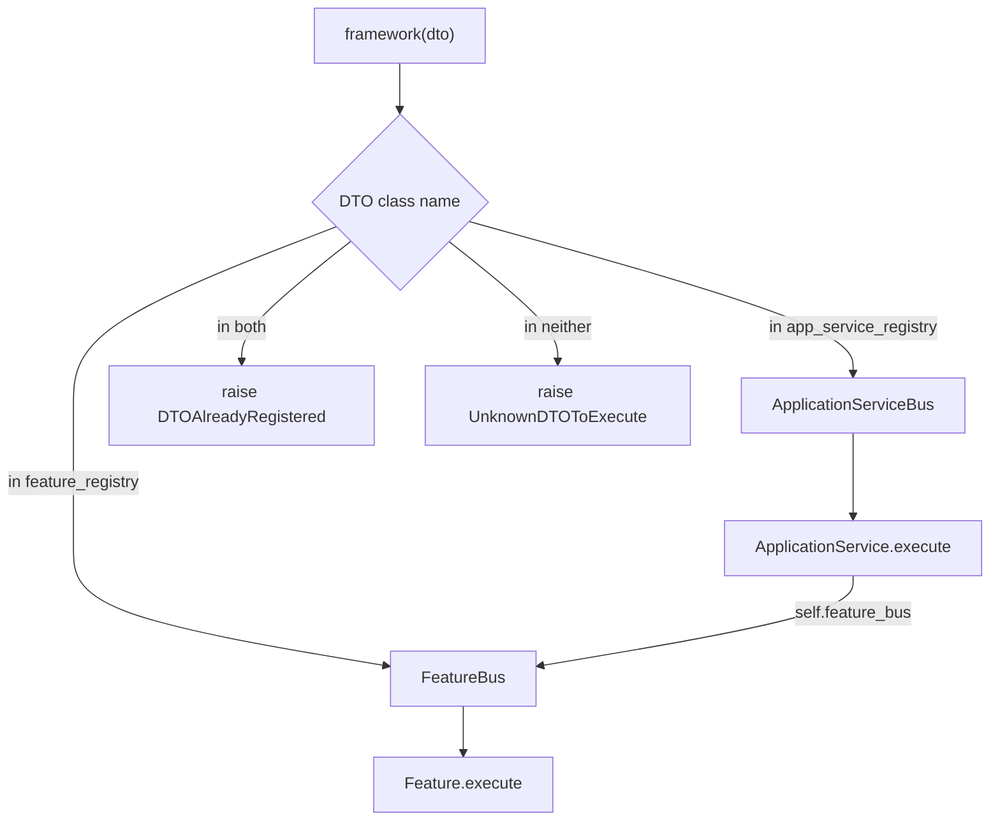

# Feature versus `ApplicationService`: choosing the atomic or orchestration layer

`Feature` and `ApplicationService` are the two handler abstractions the framework exposes
(`sincpro_framework/__init__.py:12-21`). They are not two spellings of one thing: they differ in
**what they are allowed to reach**. A `Feature` is an atomic use case that receives one DTO and
returns one response. An `ApplicationService` can do everything a `Feature` can, and is
additionally constructed with a `feature_bus` — the execution handle it uses to run other DTOs
(`sincpro_framework/sincpro_abstractions.py:141-206`).

That difference is the whole decision, and the framework enforces it structurally: the class name of
the input DTO decides which layer executes it, and a name that appears in **both** layers is rejected
both at build and on every call (`sincpro_framework/bus.py:150-162`, `:175-182`).

*One DTO's class name picks the layer; only an `ApplicationService` is handed a bus, and the bus it is handed is the `FeatureBus`, so delegation stays inside the atomic layer.*

For the pattern vocabulary behind the split (Hexagonal, CQRS, Facade, Registry), read
[docs/architecture/ARCHITECTURE.md](../../docs/architecture/ARCHITECTURE.md) — the authoritative
design document (`docs/architecture/ARCHITECTURE.md:20-24` states the principles, `:104-126` the
three-layer registry rationale) — rather than a restatement here. Structural context lives in
[Architecture overview](/openwiki/architecture/overview.md); the full execution path in
[executing a DTO](/openwiki/architecture/bus-execution.md).

## The two abstractions side by side

Both are `ABC`s and both inherit `ContextConsumer`
(`sincpro_framework/sincpro_abstractions.py:85`, `:141`), so each declares exactly one abstract
method — `execute` — plus the machinery it gets from that base:

| | `Feature` | `ApplicationService` |
| --- | --- | --- |
| declared at | `sincpro_framework/sincpro_abstractions.py:85-138` | `sincpro_framework/sincpro_abstractions.py:141-206` |
| abstract method | `execute(self, dto: TypeDTO) -> TypeDTOResponse \| None` (`:128-138`) | same signature (`:196-206`) |
| extra declared attribute | — | `feature_bus: Bus` (`:185`) |
| `__init__` | `(self, *args, **kwargs)`, only prepares the context binder (`:121-126`) | `(self, feature_bus: Bus, *args, **kwargs)`, stores it as `self.feature_bus` (`:187-194`) |
| what the container passes at construction | nothing positional | `providers.Factory(decorated_class, framework_container.feature_bus)` (`sincpro_framework/ioc.py:137-147`) |
| registration decorator | `@framework.feature(dto)` (`sincpro_framework/use_bus.py:69`) | `@framework.app_service(dto)` (`sincpro_framework/use_bus.py:70`) |
| registry it lands in | `feature_registry` (`sincpro_framework/bus.py:25`) | `app_service_registry` (`sincpro_framework/bus.py:77`) |
| span layer string | `"feature"` (`sincpro_framework/bus.py:47`) | `"application_service"` (`sincpro_framework/bus.py:103`) |

Two consequences of the constructor shape are worth internalising before writing a handler:

- **A `Feature`'s `__init__` swallows its arguments.** It accepts `*args, **kwargs` and only sets
  `_context_binder` / `_context_fallback` (`sincpro_framework/sincpro_abstractions.py:121-126`).
  Dependencies never arrive through the constructor — see the injection section below.
- **An `ApplicationService` cannot be built without a bus.** `feature_bus` is the first positional
  parameter, so an override that changes `__init__` must keep accepting it; the container always
  supplies the `feature_bus` provider (`sincpro_framework/ioc.py:141-143`). Direct instantiation is
  possible (tests do it, `tests/fixtures.py:46-49`), but in production the container is the only
  caller.

## The decision: atomic use case or orchestration

The framework's own one-line statement of the split is in `README.md:285-290`: a `Feature`
"represents a discrete, self-contained use case focused on specific functionality", while an
`ApplicationService` "orchestrates multiple features for broader business objectives". The class
docstrings repeat it with the operational detail — `ApplicationService` is for "non-atomic
operations requiring multiple steps", "coordinating between different Features", "complex business
workflows with multiple decision points" and "aggregating data from multiple sources"
(`sincpro_framework/sincpro_abstractions.py:143-153`).

Ask the question in terms of the DTO, not the code volume:

- **Does this DTO's handling consist of work that belongs to this DTO alone?** → `Feature`. It has
  no bus, so it cannot (and should not) call other use cases.
- **Does handling this DTO mean running other DTOs and combining their results?** → `ApplicationService`.
  It is the only abstraction that is handed a way to execute another DTO.

The README's payment example is the canonical shape: `PaymentOrchestrationService.execute` builds a
`TokenizationParams` DTO, calls `self.feature_bus.execute(tokenization_command)` and then returns its
own response (`README.md:591-607`).

### Delegation from an `ApplicationService` reaches Features, not other `ApplicationService`s

`self.feature_bus` is the **`FeatureBus`**, so the only registry behind it is `feature_registry`
(`sincpro_framework/bus.py:53`). An `ApplicationService` that tries to execute a DTO registered in
the application-service layer therefore misses that dict; the lookup is a bare `self.feature_registry[...]`,
so the failure surfaces as the ordinary `KeyError` from the registry lookup, caught and re-raised (or
handed to the feature-level error handler) by `FeatureBus.execute`
(`sincpro_framework/bus.py:52-64`). Two rules follow:

- Orchestration composes **Features**; it does not chain application services.
- The only component that routes to both layers is the facade reached through `framework(dto)` —
  [executing a DTO](/openwiki/architecture/bus-execution.md) covers that path. A handler has no
  injected reference to the `UseFramework` instance.

The same handle mismatch applies to the concurrency entry points: `Bus.thread_context()` and
`Bus.get_async_bus()` are inherited by every bus (`sincpro_framework/sincpro_abstractions.py:45-82`),
so a handle taken from `self.feature_bus` hands off feature-layer executions only; see
[concurrency and context handoff](/openwiki/architecture/concurrency-and-context-handoff.md).

### The `feature_bus` an `ApplicationService` gets is the facade's own

This is not "a" feature bus — it is *the* one. `FrameworkContainer` declares `feature_bus` as a
`Singleton` and feeds the same provider to the `framework_bus` `Factory`
(`sincpro_framework/ioc.py:49-66`), while the application-service registration entry is created with
that same provider as its first positional argument (`sincpro_framework/ioc.py:137-147`). Identity is
pinned by `tests/observability/test_bus_wiring.py:54-63`, which asserts
`app_service.feature_bus is framework.bus.feature_bus` — the test exists because a second bus would
carry a default `Observability` and label spans with the wrong instance
(`tests/observability/test_bus_wiring.py:2-8`).

A delegated call therefore re-enters the real `FeatureBus.execute`: it opens its own `"feature"`
span inside the `ApplicationService`'s `"application_service"` span, and it runs the feature-level
error handler rather than the app-service one (`sincpro_framework/bus.py:41-64`).

## What both layers share

Anything below is true of a `Feature` and an `ApplicationService` alike, so it is never a reason to
pick one:

- **The input contract.** Both are registered against a `DataTransferObject` subclass and the
  registry key is that class's `__name__` (`sincpro_framework/bus.py:38`, `:94`, `:53`).
- **The response contract.** `execute` returns a response DTO **or `None`**; nothing in the buses
  coerces, wraps or type-checks it (`sincpro_framework/bus.py:53-58`). The framework's pydantic
  validation covers the input DTO only — see [DTOs and value objects](/openwiki/concepts/dto-and-value-objects.md).
- **Injected dependencies** arrive as instance attributes, pushed onto the registration entry at
  build time (`sincpro_framework/use_bus.py:90-105`). The same names are readable from the
  bounded-context root as `framework.deps.<name>` (`sincpro_framework/use_bus.py:172-181`).
- **`self.context`** resolves through `ContextConsumer.bind_to_framework`, called on every instance in
  both registries by the build (`sincpro_framework/context/mixin.py:65-71`,
  `sincpro_framework/context/framework_context_consumer.py:15-23`). Details on
  [context propagation](/openwiki/concepts/context-propagation.md).
- **Error handling** exists at both layers, as two separate handler chains
  (`sincpro_framework/use_bus.py:214-238`).
- **Instantiation happens once, in the build.** `@framework.feature` / `@framework.app_service` only
  store a `providers.Factory`; the handler object is created when the sub-bus resolves its registry
  (`sincpro_framework/ioc.py:126-147`, `sincpro_framework/use_bus.py:130`). Registration mechanics are
  owned by [registration and IoC](/openwiki/architecture/registration-and-ioc.md).

## Getting the layer wrong: the failures you actually see

The layer is not a label — it is a registry membership that is validated twice.

| Mistake | What happens | Where |
| --- | --- | --- |
| Same DTO class decorated with both `@framework.feature(D)` and `@framework.app_service(D)` on one instance | The **build** raises `DTOAlreadyRegistered` naming the colliding DTOs and telling you to rename the feature or use another framework instance | `sincpro_framework/bus.py:150-162` |
| … and the same condition re-appears later (e.g. a registry mutated after the build) | **Every** `framework(dto)` call re-checks the intersection before routing and raises `DTOAlreadyRegistered` | `sincpro_framework/bus.py:175-182` |
| Same DTO name registered twice *within* one layer | `DTOAlreadyRegistered` at decoration time, with the DTO name and its `__module__` | `sincpro_framework/ioc.py:99-113` |
| Same DTO name registered twice through the bus API instead of the decorator | `DTOAlreadyRegistered` from `register_feature` / `register_app_service` | `sincpro_framework/bus.py:30-39`, `:82-95` |
| Two distinct DTO classes that happen to share a `__name__` inside one layer | `DTOAlreadyRegistered`, because the key is the name and never the class object | `sincpro_framework/ioc.py:96`, `sincpro_framework/bus.py:53` |
| A `Feature` that tries to orchestrate | Nothing injects a bus into it: the container builds feature entries as `providers.Factory(decorated_class)` with no positional argument, so `self.feature_bus` is an ordinary missing attribute unless a dependency happens to be registered under that exact name | `sincpro_framework/ioc.py:126-131` |

The cross-layer check runs once per build even though `FrameworkBus` is a `Factory` — a new facade is
materialised on each `build_root_bus()`, so the constructor check is re-evaluated then
(`sincpro_framework/ioc.py:60-66`, `sincpro_framework/use_bus.py:130`). The per-call check is what
makes the invariant hold at the moment it matters: immediately before the routing decision
(`sincpro_framework/bus.py:175-182`). Both `DTOAlreadyRegistered` and `UnknownDTOToExecute` are
defined in `sincpro_framework/exceptions.py:1-14` and are **not** re-exported by the package root
(`sincpro_framework/__init__.py:12-21`) — catching them means importing
`sincpro_framework.exceptions`, which is what the bus tests do
(`tests/bus/test_framework_bus.py:6`). Both are reported to observability with `kind="framework"`
when they reach the facade's `except` clause (`sincpro_framework/bus.py:196-205`).

`tests/bus/test_framework_bus.py:50-63` registers one DTO in both fixtures' buses and asserts the
construction-time `DTOAlreadyRegistered` — so the test pins the build-time half of the check; the
per-call half is the same comparison repeated on the facade.

The fix is a naming decision, not a configuration one: give the orchestration its own input DTO (its
own class name), or split the bounded context into two framework instances.

### The layer is visible outside the process

Choosing a layer is not purely internal: the entrypoints publish it. `Layer` has exactly two members,
`features` and `app_services` (`sincpro_framework/entrypoints/const.py:5-11`), each catalog entry
carries it (`sincpro_framework/entrypoints/catalog.py:20-35`, `:134-145`), the JSON-RPC method name is
built from it (`{instance}.{layer}.{dto_name}`, `sincpro_framework/entrypoints/rpc/jrpc.py:38-39`) and
MCP tools are tagged with it (`sincpro_framework/entrypoints/mcp/entrypoint.py:55-61`). Both layers
are published by default — the documented rule is "do not skip ApplicationServices"
(`docs/architecture/entrypoint_mcp.md:204`).

## Typing: what the stub carries and what it does not

`Feature` and `ApplicationService` are declared twice in the package: the runnable classes in
`sincpro_framework/sincpro_abstractions.py` and a hand-written stub
`sincpro_framework/sincpro_abstractions.pyi` shipped next to the `py.typed` marker
(`sincpro_framework/py.typed`). The stub is what pyright and mypy read; the `.py` file is what runs.
They agree on names and signatures, and the stub adds what the runtime file cannot express:

| Stub addition | Purpose | Where |
| --- | --- | --- |
| `Feature(ABC, Generic[TypeDTO, TypeDTOResponse, ContextT])` | parameterize the handler over its input DTO, response DTO and context mapping | `sincpro_framework/sincpro_abstractions.pyi:61` |
| `context: ContextT` | `self.context` gets a real type instead of `Any` — the pattern is a `TypedDict` context mixed into a local base class | `sincpro_framework/sincpro_abstractions.pyi:77`, `:107`; usage in `tests/typing_and_linter/typing_cases/typed_context_case.py:14-52` |
| `def __getattr__(self, name: str) -> Any` | the declared "dependencies appear as attributes at runtime" contract, so an unknown attribute is not a type error | `sincpro_framework/sincpro_abstractions.pyi:84-87`, `:114-117` |
| `bind_to_framework(self, binder: Any)` | the context binding the build performs | `sincpro_framework/sincpro_abstractions.pyi:80`, `:110` |

The `__getattr__ -> Any` entry is exactly why **autocomplete for injected dependencies comes from your
own base classes, not from the framework**: a bare `Feature` types `self.any_adapter` as `Any`. The
documented convention is to declare the dependency types once on a non-instantiated class and mix it
into the bounded context's local `Feature` / `ApplicationService` bases, which is what gives both
halves of the code the same names and the same types
(`README.md:410-470`; `tests/use_container/test_use_framework.py:28-45` is the checked shape). The
typed-deps case asserts the root side of the same convention
(`tests/typing_and_linter/typing_cases/typed_deps_case.py:11-22`), and pyright is run over that whole
folder as a test (`tests/typing_and_linter/test_typing_and_linter.py:31-41`).

Two typing facts about the layer boundary specifically:

- **`return_type` is a static-typing device only.** The `Bus.execute` overloads in the stub narrow
  the result to `TypeDTOResponse` when a `return_type` is passed and to `TypeDTOResponse | None`
  otherwise (`sincpro_framework/sincpro_abstractions.pyi:24-31`; same pattern for
  `FeatureBus` / `ApplicationServiceBus` / `FrameworkBus` in `sincpro_framework/bus.pyi:36-44`,
  `:69-77`, `:105-123`, and for `UseFramework.__call__` in `sincpro_framework/use_bus.pyi:79-106`).
  At runtime the argument is accepted and ignored: it travels through the middleware pipeline into an
  executor closure that drops it (`sincpro_framework/use_bus.py:393-401`) and never reaches a
  handler. So `framework(dto, MyResponse)` does **not** convert or validate the result.
- **`TFeature` and `TApplicationService` are declared but unused.** Both TypeVars exist in the runtime
  module and the stub (`sincpro_framework/sincpro_abstractions.py:16-18`,
  `sincpro_framework/sincpro_abstractions.pyi:17-19`) and are referenced nowhere else in the package,
  so they are not part of any public signature today.

Parameterizing as `Feature[MyInputDTO, MyResponseDTO]` is therefore a documentation-plus-editor
benefit, not a runtime contract: the bus dispatches on `dto.__class__.__name__` regardless of the
generics you declared (`sincpro_framework/bus.py:53`, `:109`, `:173`).

## What is public here, and what is not

The public surface is what the package root exports — `UseFramework`, `Feature`, `ApplicationService`,
`DataTransferObject`, `Middleware`, `logger`, `TypeDTO`, `TypeDTOResponse`
(`sincpro_framework/__init__.py:12-21`). The concrete buses
(`FeatureBus`, `ApplicationServiceBus`, `FrameworkBus`), the container in `sincpro_framework/ioc.py`
and the registry dicts are internals: they are reachable through `framework.bus` or by importing
`sincpro_framework.bus` directly, which is fine for tests and for
[introspection](/openwiki/concepts/introspection.md), but the documented configuration surface for a
bounded context is `framework.feature`, `framework.app_service`, `add_dependency` and the handler base
classes. When reading the sections above, `feature_bus`, `feature_registry`, `register_feature` and
the `DTOAlreadyRegistered` checks are the *mechanism*; the decision they encode — atomic or
orchestration — is the API.

## Keep reading

- [Executing a DTO: the end-to-end bus flow](/openwiki/architecture/bus-execution.md) — what happens
  after the layer decision: middleware, routing, spans, failure branches.
- [Registration and the IoC container](/openwiki/architecture/registration-and-ioc.md) — how a
  decorated class becomes a handler instance, and when `feature_bus` is injected.
- [Dependency injection and typing](/openwiki/concepts/dependency-injection-and-typing.md) — the
  attribute-injection path and the `DependencyContextType` convention in full.
- [Building a bounded context](/openwiki/workflows/building-a-bounded-context.md) — the module layout
  in which these two base classes are re-declared per context.
- [docs/architecture/ARCHITECTURE.md](../../docs/architecture/ARCHITECTURE.md) — the authoritative
  pattern rationale (Hexagonal, DDD, CQRS, Facade) for the two-layer bus.
