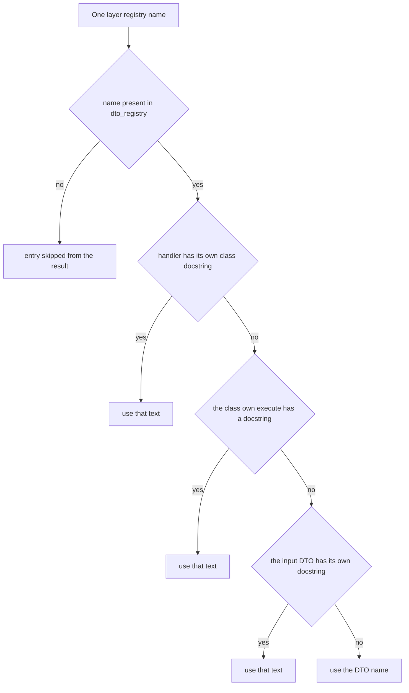

# Introspection: reading a built bus

A built `UseFramework` holds three dictionaries that describe what it can do, and
`sincpro_framework/introspection/` is the single place allowed to know their shape. Its module
docstring states the contract: "Single place that knows the bus's internal shape
(`feature_bus.feature_registry`, `app_service_bus.app_service_registry`, `dto_registry`)"
(`sincpro_framework/introspection/inspector.py:1-8`). Entrypoints build on it; nothing else reaches
into `FrameworkBus`.

That position matters for two audiences:

- If you are **publishing** an instance — over MCP, JSON-RPC, or a future REST/CLI host — you read
  this module (usually through the shared catalog, which imports it as `inspector`,
  `sincpro_framework/entrypoints/catalog.py:14`, and calls
  `inspector.features(...)` / `inspector.app_services(...)` at `:134-140`).
- If you are **maintaining** the buses, this is the payoff of keeping registration state where it is:
  adding a field to `FeatureBus`/`FrameworkBus` state that a host needs means changing one reader.

`introspection` is not in the public export list (`sincpro_framework/__init__.py:12-21` exports
`UseFramework`, `Feature`, `ApplicationService`, `DataTransferObject`, `logger`, `Middleware`,
`TypeDTO`, `TypeDTOResponse`). It is an internal module with an explicit package surface:
`sincpro_framework/introspection/__init__.py:7-25` re-exports `DtoMetadata`, `DtoName`,
`FeatureOrAppServiceMetadata`, `app_services`, `built_bus`, `dtos`, `features`.

## The three registries, and the one that describes the others

The reader touches exactly three dicts, and they are not symmetric:

| Registry | Lives on | Values | Read by |
| --- | --- | --- | --- |
| `feature_bus.feature_registry` | `FeatureBus` (`sincpro_framework/bus.py:25`) | the live `Feature` instance, keyed by input-DTO class name | `features()` (`sincpro_framework/introspection/inspector.py:101`) |
| `app_service_bus.app_service_registry` | `ApplicationServiceBus` (`sincpro_framework/bus.py:77`) | the live `ApplicationService` instance, same key | `app_services()` (`sincpro_framework/introspection/inspector.py:109`) |
| `dto_registry` | published onto the **facade** after the build | the DTO **classes** | all three readers (`sincpro_framework/introspection/inspector.py:101`, `:109`, `:117`) |

`dto_registry` is the asymmetric one. It does not belong to a sub-bus: `build_root_bus()` resolves the
container provider once (`dto_registry = self._sp_container.dto_registry()`,
`sincpro_framework/use_bus.py:128`) and then assigns the resolved dict onto the facade
(`self.bus.dto_registry = dto_registry`, `sincpro_framework/use_bus.py:142-143`). So the snapshot
introspection reads is **taken at build time**, and a rebuild refreshes it. The container accumulates
it at every registration, keyed by class name, with the DTO class as the value
(`sincpro_framework/ioc.py:45`, `:119-121`) — which is why the same dict covers both layers and can
describe a handler without instantiating anything.

`features()` and `app_services()` are joins: they walk a layer registry and look every name up in
`dto_registry`. `dtos()` is not a join — it enumerates `dto_registry` alone, so it lists the DTOs of
both layers in one dict (`sincpro_framework/introspection/inspector.py:112-118`).

## `built_bus()` and the `NOT_BUILT` guard

Every reader goes through the same three-line gate:

```python
def built_bus(framework_instance: UseFramework) -> FrameworkBus:
    if not framework_instance.was_initialized or framework_instance.bus is None:
        raise ValueError(NOT_BUILT)
    return framework_instance.bus
```

(`sincpro_framework/introspection/inspector.py:72-75`, message constant at `:21`:
`NOT_BUILT = "Framework must be built before introspection"`.)

Three consequences are worth holding onto:

- **Introspection never builds for you.** Unlike the entrypoint catalog, whose constructor calls
  `framework_instance.build_root_bus()` when `was_initialized` is false
  (`sincpro_framework/entrypoints/catalog.py:49-50`), this module is a pure reader. Both flags are
  plain instance attributes set in `UseFramework.__init__` (`self.was_initialized: bool = False`,
  `self.bus: FrameworkBus | None = None`, `sincpro_framework/use_bus.py:87-88`). Call
  `build_root_bus()` first, or go through a host that does.
- **The failure is a `ValueError`, not a framework exception.** It is not `SincproFrameworkNotBuilt`
  (`sincpro_framework/exceptions.py`, raised only by `UseFramework.__call__` when the lazy build left
  `bus` unset, `sincpro_framework/use_bus.py:380-386`). A caller reading registries cannot confuse the
  two: one says "you asked too early", the other says "the build found nothing to register".
- **Both halves of the guard are load-bearing.** `build_root_bus()` flips `was_initialized = True`
  *before* the facade exists (`sincpro_framework/use_bus.py:127`, `:130`), so a build that raised
  leaves `was_initialized` true with `bus is None` — a state the second half of the condition catches.
  `tests/test_introspection.py:76-80` pins the plain case: a fresh `UseFramework` raises on
  `features(framework)`.

`built_bus()` is exported (`sincpro_framework/introspection/__init__.py:12`, `:22`) for a consumer that
wants the facade itself; the three describe functions are what the catalog uses.

## `FeatureOrAppServiceMetadata` and `DtoMetadata`

Both results are `DataTransferObject` subclasses — pydantic models, not dicts or tuples
(`sincpro_framework/introspection/inspector.py:26-41`) — and neither carries a field the source does
not declare:

| `FeatureOrAppServiceMetadata` (`:26-33`) | `DtoMetadata` (`:36-41`) |
| --- | --- |
| `name: DtoName` — the registry key | `name: DtoName` |
| `type: type` — the handler class | `type: type[DataTransferObject]` — the DTO class |
| `instance: Feature \| ApplicationService` — the **live** handler object | — |
| `dto: type[DataTransferObject]` — the input DTO class | — |
| `description: str` — always populated | `description: str \| None` — `None` when there is no own docstring |

`DtoName` is a type alias for `str` (`sincpro_framework/introspection/inspector.py:23`).

Carrying `instance` is why this module hands the host a usable object and not just a name: the catalog
binds a `run` callable from the DTO (`sincpro_framework/entrypoints/catalog.py:83-85`) and keeps the
metadata's description and DTO class. That `instance` field is also one of the two examples the wiki
uses for the framework's `arbitrary_types_allowed=True` DTO configuration — a pydantic model that also
holds a runtime object; see [DTOs and value objects](/openwiki/concepts/dto-and-value-objects.md).

## Describing a handler: the resolution order

`_resolve_description` (`sincpro_framework/introspection/inspector.py:52-69`) picks one string per
handler, in this order:



*How one registry entry becomes the `description` on `FeatureOrAppServiceMetadata`; a name absent from `dto_registry` never reaches the ladder.*

Two implementation details make the ladder behave the way it does:

- **"Own" is literal.** `_own_docstring` reads `cls.__dict__.get("__doc__")` and passes it through
  `inspect.cleandoc` (`sincpro_framework/introspection/inspector.py:44-49`), and the `execute` step
  reads `feature_or_app_type.__dict__.get("execute")` before touching `execute.__doc__` (`:60-63`).
  Both lookups are `__dict__` lookups on the class itself, so a docstring **inherited** from
  `Feature`, `ApplicationService` or an intermediate base never contributes. This is deliberate: the
  base classes carry long explanatory docstrings ("Second layer of the framework, orchestration of
  features", `sincpro_framework/sincpro_abstractions.py:142-153`) that would be useless as a tool
  description. The point of step 1 is *not* inheriting the base essay.
- **The name is a real fallback, never `None`.** `description` is typed `str`, and the last rung is the
  registry key, i.e. the DTO class name (`sincpro_framework/ioc.py:96`). So a Feature with no
  docstrings anywhere is still described — as `"Ping"`, not as an empty string.

The effect in practice: a handler with no class docstring but a documented `execute` gets the
`execute` text. `tests/test_introspection.py` pins exactly that — `PingFeature` declares only
`execute` with `"""Say hi back."""` and the metadata's description is `"Say hi back."` (`:27-30`,
`:59`) — while `OrchestrateService`, which declares a class docstring, keeps it (`:33-37`, `:64`).

`dtos()` uses a different rule on purpose: `_own_docstring(dto_type)` only, with no ladder
(`sincpro_framework/introspection/inspector.py:116`). A DTO is a schema, not a handler, so there is no
`execute` to fall back to and the class name is not a substitute for a description — hence the
`str | None` type. `tests/test_introspection.py:67-73` pins both ends: `"Ping a name."` for a
documented DTO and `None` for an undocumented one.

## The skip that the `register_*` bus methods leave behind

`_describe_all` is the shared loop behind `features()` and `app_services()`
(`sincpro_framework/introspection/inspector.py:78-95`). Its one branch decides visibility:

```python
dto_type = dto_registry.get(name)
if dto_type is None:
    continue
```

A name present in a layer registry but absent from `dto_registry` is **silently dropped** — no
warning, no partial entry. That is not defensive coding; it is the invariant that only container
registration produces a describable handler:

- The decorators (`@framework.feature(...)` / `@framework.app_service(...)`) route through
  `_register_service`, which writes the DTO into the container's `dto_registry` provider
  (`sincpro_framework/ioc.py:119-121`) *and* appends a `providers.Factory` to the layer registry
  (`:126-147`). The DTO entry always exists.
- `FeatureBus.register_feature` and `ApplicationServiceBus.register_app_service`
  (`sincpro_framework/bus.py:30-39`, `:82-95`) mutate the **materialised** `{name: instance}` dict
  directly. They keep the same duplicate-name guard, but they touch neither the container nor
  `dto_registry` — and the second one's docstring says as much ("This method is not used directly, the
  decorator inject_app_service_to_bus is used", `sincpro_framework/bus.py:85-86`). A handler wired
  this way is callable in process and invisible here.

Everything downstream inherits the gap, because the skip happens upstream of the wire: the entrypoint
catalog fills its use-case list from `inspector.features(...)` / `inspector.app_services(...)`
(`sincpro_framework/entrypoints/catalog.py:134-140`), so such a handler is never published over MCP or
JSON-RPC either. The registration/IoC page owns both entry points and the collision guarantees; see
[registration and IoC](/openwiki/architecture/registration-and-ioc.md). The test suite uses the
bus API only to wire fixture buses by hand (`tests/fixtures.py:25-28`, `:52-58`).

Note the symmetry: `dtos()` has no skip because it is derived from `dto_registry` itself, so a
bus-registered DTO does not appear there either — not as a `None` description, but as a missing key.

## Who consumes the description

The description resolved here is the text a caller of a published instance actually reads, so the
resolution rules above are user-visible:

- `Catalog._convert_to_scalar_use_case` copies `metadata.description` onto
  `PackedFeatureOrAppService` (`sincpro_framework/entrypoints/catalog.py:91-100`), alongside
  `metadata.dto` and a JSON schema computed from it.
- The MCP host passes it as the FastMCP tool description
  (`description=operation.description`, `sincpro_framework/entrypoints/mcp/entrypoint.py:55-61`).
- The JSON-RPC host puts it in the OpenRPC document as both `summary` (first line) and `description`
  (`sincpro_framework/entrypoints/rpc/jrpc.py:190-191`).

`tests/entrypoint/test_entrypoints.py:157-162` is the end-to-end proof that the ladder survives the
whole path: the published `ValidateCard` description contains "atomic", while the orchestration tool's
description is *not* the `ApplicationService` base docstring. The projection step itself — layer
vocabulary, `include`/`exclude`/`wrap`, the JSON filter — belongs to
[the entrypoint catalog](/openwiki/integrations/entrypoints-catalog.md), and the two hosts to
[entrypoint MCP](/openwiki/integrations/entrypoint-mcp.md) and
[entrypoint RPC](/openwiki/integrations/entrypoint-rpc.md).

## Invariants and failure semantics

- **Read-only.** `built_bus()` and the three describe functions only read; nothing in the module
  mutates a registry, an instance or the framework. There is no cache either — each call re-reads the
  live dicts and returns a fresh `dict[name, metadata]`, so two calls after a rebuild can differ.
- **Unbuilt framework → `ValueError(NOT_BUILT)`** from all four entry points
  (`sincpro_framework/introspection/inspector.py:21`, `:72-75`), not from a lazy build.
- **Unknown DTO name → omission, not an error** (`sincpro_framework/introspection/inspector.py:83-86`).
- **Layer keys are disjoint by construction.** A name may not appear in both layer registries —
  `FrameworkBus.__init__` rejects that with `DTOAlreadyRegistered`
  (`sincpro_framework/bus.py:150-162`), so the same DTO name cannot be described twice across
  `features()` and `app_services()`.
- **Nothing is invented.** The module derives only name, class, instance, DTO class and description.
  Handler behaviour, error handlers, middleware, context and dependencies are not part of the
  metadata; a host that needs them reaches the bus through `UseFramework`, not through introspection.

## Evidence

- `tests/test_introspection.py:43-48` — registration is reflected: `features()` is keyed by `"Ping"`,
  `app_services()` by `"Orchestrate"`, and `dtos()` covers both.
- `tests/test_introspection.py:51-64` — described metadata rather than a bare instance: `type`,
  `instance`, `dto` are the real objects, and the description follows the ladder in both directions.
- `tests/test_introspection.py:67-73` — `dtos()` carries the DTO's own docstring only, `None`
  otherwise.
- `tests/test_introspection.py:76-80` — an unbuilt framework raises `ValueError`.
- `tests/entrypoint/test_entrypoints.py:157-162` — the resolved description is what the MCP tool
  advertises, base docstrings excluded.

Hand-written design context lives in `docs/architecture/ARCHITECTURE.md:57` (the component-matrix row
for `introspection/`) and `docs/architecture/entrypoint_mcp.md:179`, `docs/architecture/entrypoint_rpc.md:18`;
this page does not restate them.

## Related

- [Architecture overview](/openwiki/architecture/overview.md) — where `introspection/` sits in the
  module map, and how `dto_registry` is attached to the facade at build time.
- [Registration and IoC](/openwiki/architecture/registration-and-ioc.md) — the decorator path versus
  `register_feature` / `register_app_service`, and the collision rules behind the disjoint-key
  invariant.
- [Entrypoints catalog](/openwiki/integrations/entrypoints-catalog.md) — the first consumer, which
  turns this metadata into a JSON-publishable use case.
- [Entrypoint MCP](/openwiki/integrations/entrypoint-mcp.md) and
  [entrypoint RPC](/openwiki/integrations/entrypoint-rpc.md) — the wires that publish the description.
- [DTOs and value objects](/openwiki/concepts/dto-and-value-objects.md) — DTO identity by class name,
  which is why every key here is a DTO name.
