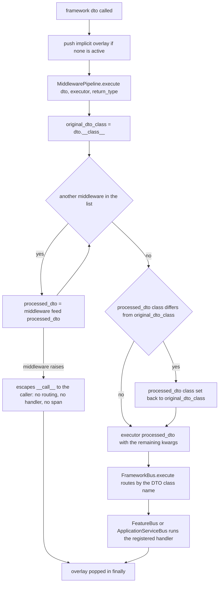

# Middleware pipeline: DTO processing before execution

Middleware is the framework's single extension point **in front of** execution. Every
`framework(dto)` call runs its DTO through a chain of plain callables first, and only the DTO
that comes out of the chain reaches the buses. There is no registration API other than
`framework.add_middleware(...)`, no base class to inherit, no per-layer or per-DTO targeting,
no post-execution phase and no async variant: what the chain does is exactly what a callable
does to one object (`sincpro_framework/middleware.py:4-21`).

The design rationale and the user-facing recipe live in `docs/design/middleware.md` and the
README (`docs/design/middleware.md:5-18`, `README.md:658-774`); this page documents the
mechanism as implemented and the consequences a caller has to plan around.

## Where the pipeline sits

`MiddlewarePipeline` is created once per `UseFramework` instance in its constructor
(`sincpro_framework/use_bus.py:84-85`) and invoked in exactly one place: the body of
`UseFramework.__call__`, after the lazy build and the implicit context overlay, and before
`self.bus.execute` (`sincpro_framework/use_bus.py:373-404`):

```python
def executor(processed_dto, **exec_kwargs) -> TypeDTOResponse | None:
    return self.bus.execute(processed_dto)

try:
    return self.middleware_pipeline.execute(dto, executor, return_type=return_type)
finally:
    if implicit_token is not None and implicit_overlay is not None:
        self._pop_overlay(implicit_token, implicit_overlay)
```

(`sincpro_framework/use_bus.py:393-404`.) Four things follow from that position:

- **It is reached only through `__call__`.** No bus mentions middleware — `sincpro_framework/bus.py`
  imports nothing from `middleware.py` — so `framework(dto)` is the only route that applies the
  chain. `framework.bus.thread_context().execute(...)` and `framework.get_async_bus()` call
  `Bus.execute` directly (`sincpro_framework/context/thread_context_bus.py:51-62`,
  `sincpro_framework/aio/bus.py:78-86`) and skip the pipeline, as does any direct call on
  `framework.bus`. See
  [concurrency and context handoff](/openwiki/architecture/concurrency-and-context-handoff.md).
- **It runs once per call, for both layers.** The facade has not routed yet, so the chain does
  not know — and cannot be asked — whether the DTO will be handled by a `Feature` or an
  `ApplicationService`. One chain covers both
  (`sincpro_framework/use_bus.py:401` → `sincpro_framework/bus.py:164-205`).
- **It runs after the build guard.** A failed lazy build raises `SincproFrameworkNotBuilt` before
  the pipeline is reached (`sincpro_framework/use_bus.py:377-386`), so middleware never sees an
  unbuilt framework.
- **It runs inside the implicit overlay.** `__call__` pushes the overlay
  (`sincpro_framework/use_bus.py:388-391`) before calling the pipeline and pops it in the
  `finally` (`:402-404`). Middleware still gets no context argument — it can only read
  `self.context` by closing over the framework instance. See
  [context propagation](/openwiki/concepts/context-propagation.md).

Middleware is **not** re-entered by nested calls: an `ApplicationService` executing Features
through `self.feature_bus.execute(...)` goes straight to `FeatureBus.execute` and bypasses the
chain, because the chain lives on `UseFramework`, not on the bus
(`sincpro_framework/sincpro_abstractions.py:169-170`, `sincpro_framework/ioc.py:141-143`). Order
of the whole call, with middleware in its slot, is on
[executing a DTO](/openwiki/architecture/bus-execution.md).

## What counts as middleware

`Middleware` is a `typing.Protocol` with a single method — no `base`, no `inspect`, no `before`
or `after` (`sincpro_framework/middleware.py:4-21`):

```python
class Middleware(Protocol):
    def __call__(self, dto: Any) -> Any: ...
```

The protocol is structural and **not** `runtime_checkable`, so anything the pipeline can call
with one positional argument is a valid middleware: a plain function, a lambda, or an instance
with `__call__` (`examples/middleware_examples.ipynb:410-432` shows all three). Two
consequences:

- `add_middleware` performs **no validation** — it appends whatever it is given
  (`sincpro_framework/middleware.py:30-32`, `sincpro_framework/use_bus.py:183-185`), unlike
  `add_global_error_handler`, which raises `TypeError` for a non-callable
  (`sincpro_framework/use_bus.py:207-208`). A non-callable entry fails later, at call time,
  inside the loop (`sincpro_framework/middleware.py:46`).
- The DTO is the middleware's **only** input. It never receives `return_type`, the target layer,
  the buses, or a span, and the pipeline never inspects what a middleware returned before
  handing it on (`sincpro_framework/middleware.py:34-53`).

`add_middleware` appends, and `execute` iterates forward, so **execution order is registration
order** — the first middleware added is the first to run and its return value feeds the second
(`sincpro_framework/middleware.py:28-32`, `:45-46`; `docs/design/middleware.md:58-64`). There is
no priority field, no de-duplication and no way to remove or replace an entry once added. This
differs from error handlers, whose "first registered, first executed" order comes from folding
the list in reverse into one callable (`sincpro_framework/error_handler.py:44-57`).

## `MiddlewarePipeline.execute`, step by step

`MiddlewarePipeline.execute(dto, executor, **kwargs)`
(`sincpro_framework/middleware.py:34-53`):

1. captures the caller's class — `original_dto_class = dto.__class__` (`:42`);
2. runs the chain, replacing `processed_dto` with each middleware's return value (`:44-46`);
3. **restores the class** if a middleware produced a different type:
   `if processed_dto.__class__ != original_dto_class: processed_dto.__class__ = original_dto_class`
   (`:48-50`);
4. calls the executor: `executor(processed_dto, **kwargs)` (`:52-53`).

There is no `try`/`except` and no response phase anywhere in the file.



*One call through the pipeline: the chain runs first, the class restore happens before the executor, and a middleware exception leaves the pipeline without ever reaching a bus.*

### Why the `__class__` restore exists

The registries are keyed by the DTO's class **name**, and every lookup derives that name from the
object at lookup time: `dto_name = dto.__class__.__name__` in the facade
(`sincpro_framework/bus.py:173`), in `FeatureBus.execute` (`:45`, `:53`) and in
`ApplicationServiceBus.execute` (`:101`, `:109`). Without the restore, a middleware that returns
an *enriched* DTO type would present the wrong name and the facade would raise
`UnknownDTOToExecute` (`sincpro_framework/bus.py:191-194`).

Reassigning `__class__` — rather than copying fields into a new instance — is what lets the two
goals coexist: the instance keeps the attributes the middleware added, while
`isinstance(dto, OriginalDTO)` and `dto.__class__.__name__` again report the caller's type.
`tests/test_middleware.py:163-204` asserts exactly that pair (a handler registered for
`OriginalDTO` receives the object, sees `isinstance` true, and can still read the fields the
middleware added), `:206-279` repeats it with a differently shaped enriched DTO, and `:302-319`
is the control case: with no middleware added, the DTO reaches the handler untouched and carries
none of the extra attributes.

Two properties of that restore are worth holding on to:

- **The class is restored, not the data.** A middleware that adds fields to the *original* type
  is unaffected; a middleware that replaces the object has its replacement's fields kept on the
  instance. Whatever the handler returns travels back to the caller unchanged — if the handler
  returns the same object, the caller receives an instance whose `__class__` is the caller's
  class but which still exposes the middleware's fields
  (`tests/test_middleware.py:196-204`).
- **The assignment is unguarded.** There is no check that a middleware returned a DTO, and the
  restore is a plain `__class__` reassignment (`sincpro_framework/middleware.py:46-50`), so a
  middleware returning an object with an incompatible instance layout fails at the restore rather
  than being ignored or reported as a bad middleware.

### What the restore means for registration

Because the restore happens *before* the executor runs, the name the registries see is always the
name of the class **the caller passed**, never the type a middleware produced. A transforming
middleware therefore works when the handler is registered against the caller's class — the
arrangement `tests/test_middleware.py:174-177` and `:239-240` use — and registering the produced
type instead leaves the facade with a name it cannot route
(`sincpro_framework/bus.py:191-194`).

The examples notebook takes the other arrangement: its advanced sections register the transformed
DTO while passing the original one (`examples/middleware_examples.ipynb:100-117`, `:281-304`).
Those cells ship with `execution_count: null` and empty `outputs`, so they are illustrative code,
not a verified run — read them as a sketch of the transformation idea, and follow the
registration rule the pipeline actually enforces.

## What a middleware exception does

Nothing in the pipeline catches, so an exception from any middleware stops the chain immediately:
the remaining middleware never run and the executor is never called. `tests/test_middleware.py:145-157`
pins that ordering (the middleware registered second does not execute), and `:132-143` pins plain
propagation.

The exception then travels out of `MiddlewarePipeline.execute`, through `UseFramework.__call__` —
whose `try` has only a `finally` that pops the implicit overlay
(`sincpro_framework/use_bus.py:400-404`) — and reaches the caller as the middleware's own
exception type. Three things a reader usually wants to know follow directly:

- **No error handler sees it.** The three `handle_error` chains live inside the buses
  (`sincpro_framework/bus.py:60-64`, `:116-120`, `:196-205`), and `self.bus.execute` was never
  reached, so neither the feature-level, the app-service-level nor the global handler is
  consulted. A middleware validation failure surfaces as, for example, the `ValueError` the
  middleware raised (`tests/test_middleware.py:281-300`).
- **No span and no error report.** The DTO span is opened by whichever sub-bus executes
  (`sincpro_framework/bus.py:47`, `:103`) and `observability.record_error` is called only from
  those buses and from the facade's routing failures
  (`sincpro_framework/bus.py:61`, `:117`, `:198`, `sincpro_framework/use_bus.py:385`), so a
  failing middleware is invisible to tracing and to Sentry/GlitchTip reporting; only the host
  application sees the traceback. See
  [observability errors](/openwiki/integrations/observability-errors.md).
- **Routing never happened.** `UnknownDTOToExecute`, the cross-registry `DTOAlreadyRegistered`
  re-check and the handler itself are all downstream of the pipeline
  (`sincpro_framework/bus.py:173-205`), so none of them runs for a call that a middleware
  rejects.

This is the intended contract of the design doc, not an oversight: "If any middleware raises an
exception, the entire pipeline stops and the exception is propagated to the caller"
(`docs/design/middleware.md:109-122`, `README.md:145`). A caller that wants a failing middleware
converted into a response must therefore catch it above `framework(dto)` itself; the harness on
[error handling](/openwiki/workflows/error-handling.md) covers what happens once an exception is
raised *inside* a handler instead.

## What the pipeline is not

| Not present | Why it matters |
| --- | --- |
| post-/response-phase middleware | `execute` returns `executor(...)` directly (`sincpro_framework/middleware.py:53`); the handler's response is never passed back through the chain |
| priority or reordering | the list is append-only and iterated in order (`sincpro_framework/middleware.py:30-32`, `:45`) |
| per-middleware applicability (`should_execute`) or per-layer/DTO filtering | a middleware decides for itself, by inspecting the DTO, whether it acts — as the examples do with `hasattr`/`isinstance` guards (`docs/design/middleware.md:66-99`) |
| async middleware | the chain is a synchronous `for` loop called from the synchronous `__call__`; the notebook's async-free examples only use plain callables |
| a `MiddlewarePipeline` export | see below |

The richer interceptor design (a `BaseMiddleware`, priority sorting, per-middleware
`should_execute`, a response pipeline) sketched in `docs/prd/PRD_02_middleware-system.md:100-192`
is **not** what ships; the shipped implementation is the minimal protocol plus a forward loop
(`sincpro_framework/middleware.py:4-53`).

## Public surface versus internals

`Middleware` is the only middleware name in the package's public export list; the concrete
`MiddlewarePipeline` is deliberately not exported (`sincpro_framework/__init__.py:1-21`). The
pipeline object is still reachable from an instance, because `UseFramework.middleware_pipeline`
is declared in the stub (`sincpro_framework/use_bus.pyi:19`, `:48`) and assigned in the
constructor (`sincpro_framework/use_bus.py:85`), which is how the unit tests drive it directly
(`tests/test_middleware.py:122-157`). Treat `framework.add_middleware(...)` — documented at
`sincpro_framework/use_bus.pyi:147-154` — as the supported entry point, and
`framework.middleware_pipeline.middlewares` as inspectable-but-internal state.

## Lifecycle and operational notes

- **Per instance, and independent of the bus build.** The pipeline belongs to one `UseFramework`;
  two instances in one process share no middleware. `build_root_bus()` neither creates nor resets
  it (`sincpro_framework/use_bus.py:84-85`, `:123-150`), so `add_middleware` may be called before
  or after the first execution and both take effect immediately.
- **The list is plain mutable state.** `self.middlewares` is a `List` that `execute` iterates
  live (`sincpro_framework/middleware.py:28`, `:45`), so appending during an in-flight call would
  extend that call's loop. The README records the general position for this and the other
  startup-built collections: safe "as long as nothing mutates them concurrently with in-flight
  executions — true today, not enforced" (`README.md:1320-1323`).
- **Failure modes to expect in production:** a transform that changes the routing name without the
  matching registration (`UnknownDTOToExecute`), a transform whose result has an incompatible
  layout (failure at the class restore), a middleware that raises (exception escapes the pipeline
  with no framework reporting), and the common shape mistake of a middleware that mutates its
  input instead of returning a value — the next link in the chain then receives `None` because the
  loop feeds forward each return value (`sincpro_framework/middleware.py:45-46`).

## Related pages

- [Executing a DTO: the end-to-end bus flow](/openwiki/architecture/bus-execution.md) — the whole
  call, with the pipeline in its slot and every routing failure it sits in front of.
- [Context propagation](/openwiki/concepts/context-propagation.md) — the overlay middleware runs
  inside and how a handler reads it.
- [Error handling](/openwiki/workflows/error-handling.md) — the three handler chains that a
  middleware exception never reaches.
- [Quickstart](/openwiki/quickstart.md) — the shortest path from a DTO to a registered Feature.
