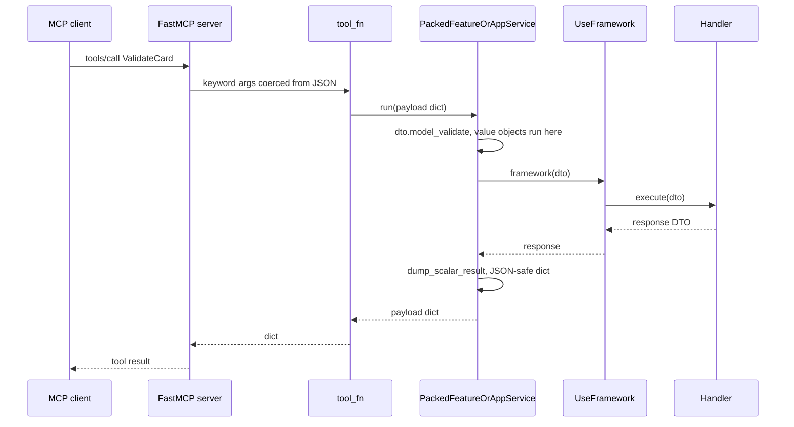

# MCP entrypoint: publishing the bus as FastMCP tools

`entrypoint_mcp` is the driving adapter that turns a built `UseFramework` instance into an MCP
server. The bus is already the catalog: every registered Feature and ApplicationService is one MCP
tool, its input DTO is the tool's arguments, and `tools/call` ends in the same
`framework(dto)` a Python caller would make. The package is
`sincpro_framework.entrypoints.mcp`; the product name used in docs and SDKs is `entrypoint_mcp`
(`sincpro_framework/entrypoints/mcp/__init__.py:1-3`).

The hand-written design document is [`docs/architecture/entrypoint_mcp.md`](../../docs/architecture/entrypoint_mcp.md)
— authoritative for why the host exists, how it fits hexagonal architecture, and the constraints
that must not regress. This page covers the implemented surface and is anchored to file and line;
it does not restate that document's rationale. The end-to-end SDK evaluation (SIAT SOAP, catalog
policy for destructive tools, response DTO hygiene) lives in
[`docs/architecture/entrypoint_mcp_use_case.md`](../../docs/architecture/entrypoint_mcp_use_case.md).

Two things the host deliberately does **not** own:

- **The projection.** `Entrypoint` builds a shared `Catalog` and asks it for
  `PackedFeatureOrAppService` entries (`sincpro_framework/entrypoints/mcp/entrypoint.py:14-15`,
  `:55`). Layer vocabulary, `include`/`exclude`/`wrap`, the DTO JSON Schema and the binary-DTO
  filter all belong to [the entrypoint catalog](/openwiki/integrations/entrypoints-catalog.md).
- **The call semantics.** A tool call ends in `scalar_executor`, not in this module: dict → DTO →
  `framework(dto)` → dict. Middleware, context, tracing and error handlers are unchanged by being
  reached over MCP.

## The extra is optional, and its absence is loud

`fastmcp` is declared as an optional dependency (`fastmcp = {version = ">=3.0,<4", optional = true}`,
`pyproject.toml:35`) behind its own extra (`mcp = ["fastmcp"]`, `pyproject.toml:47`). Nothing else in
the framework imports it, and neither does this package at import time: `mcp.py` imports only
`pydantic` and the shared catalog (`sincpro_framework/entrypoints/mcp/mcp.py:3-8`), so

```bash
pip install sincpro-framework[mcp]
```

is what buys the server, while `Entrypoint(instance).tools()` and `.to_callables()` keep working
without it.

The import happens late, inside `Entrypoint.server()`
(`sincpro_framework/entrypoints/mcp/entrypoint.py:49-52`):

```python
try:
    from fastmcp import FastMCP  # pyright: ignore[reportMissingImports]
except ImportError as error:
    raise ImportError(FASTMCP_MISSING) from error
```

`FASTMCP_MISSING` is a single module constant naming the fix
(`sincpro_framework/entrypoints/mcp/mcp.py:10`):

```text
FastMCP is not installed. Install with: pip install sincpro-framework[mcp]
```

So a missing extra is a named `ImportError` raised at the moment a host is actually built — by
`server()`, `run()` or `build_mcp_server()` — chained from the original import error rather than
swallowed into an empty tool list. A host that catches `ImportError` can match on the extra name
`README.md`/the design document advertise. `tests/entrypoint/test_entrypoints.py:253-258` exercises
exactly that contract: either a server object comes back, or the message contains
`sincpro-framework[mcp]`.

## Public surface

| Symbol | Anchor | Role |
| --- | --- | --- |
| `Entrypoint(instance)` | `sincpro_framework/entrypoints/mcp/entrypoint.py:11-15` | Facade over one `UseFramework`; builds a `Catalog` (which builds the bus if it was never built). |
| `build_mcp_server(instance, name=None)` | `:74-75` | One-liner composition root: `Entrypoint(instance).server(name=name)`. |
| `Entrypoint.include(*dtos)` / `exclude(*dtos)` / `wrap(dto, wrapper)` | `:21-31` | Delegate to the catalog and return `self`, so policies chain before the server is built. |
| `Entrypoint.tools()` | `:33-34` | The in-process `list[PackedFeatureOrAppService]`, unfiltered. |
| `Entrypoint.to_callables()` | `:36-39` | `name → (payload dict → result dict)`. No FastMCP involved. |
| `Entrypoint.server(name=None)` | `:41-62` | Builds and returns a FastMCP 3 instance with every JSON-safe operation registered. |
| `Entrypoint.run(name=None, **kwargs)` | `:64-71` | `self.server(name=name).run(**kwargs)` — starts the host and blocks. |

```python
from sincpro_framework.entrypoints.mcp import Entrypoint, build_mcp_server

build_mcp_server(siat_soap_sdk).run()                       # stdio, full JSON-safe catalog
Entrypoint(siat_soap_sdk).exclude(CommandRevokeCerts).run()  # same host, narrower catalog
```

Two details worth knowing before you rely on either entry point:

- **Constructing `Entrypoint` touches the bus.** `Catalog.__init__` calls
  `framework_instance.build_root_bus()` when `was_initialized` is false
  (`sincpro_framework/entrypoints/catalog.py:47-50`), so `Entrypoint(instance)` is enough to
  materialise the registries.
- **`tools()` and `server()` answer different questions.** `tools()` calls
  `self.catalog.get_scalar_use_cases()` with no argument
  (`sincpro_framework/entrypoints/mcp/entrypoint.py:33-34`), and so does `to_callables()` (`:36-39`),
  so both include DTOs that cannot travel as JSON. Only `server()` asks for
  `filter_binaries_schema=True` (`:55`), which is where binary-carrying operations are dropped with a
  warning. See [the entrypoint catalog](/openwiki/integrations/entrypoints-catalog.md) for that
  filter and for why a `bytes` DTO is not publishable on an MCP wire.

## `server()`: from the packed catalog to registered tools

`server()` is four statements of real work
(`sincpro_framework/entrypoints/mcp/entrypoint.py:41-62`):

1. Import `FastMCP`, or raise the named `ImportError` above.
2. `mcp = FastMCP(name or self.name)` — the server's own name defaults to the bounded context:
   the `name` property is `self.catalog.framework_instance._logger_name`
   (`:17-19`), i.e. the name passed to `UseFramework(...)`.
3. Iterate `get_scalar_use_cases(filter_binaries_schema=True)` and register each entry with the
   FastMCP 3 direct-function form:

   ```python
   mcp.tool(
       fastmcp_callable(operation),
       name=operation.name,
       description=operation.description,
       tags={operation.layer},
   )
   ```

   (`:55-61`.) `operation.name` is the DTO class name — the bus key — so the MCP tool name and the
   Python DTO name agree. `operation.description` is the description the catalog resolved through
   introspection, so it is the string an agent reads on `tools/list`
   ([introspection](/openwiki/concepts/introspection.md) owns that resolution order). `tags` carries
   the layer, `"features"` or `"app_services"` (`sincpro_framework/entrypoints/const.py:5-11`), which
   FastMCP can filter on with its own `include_tags`/`exclude_tags`; the framework sets no such filter
   by default.
4. Return the FastMCP instance, typed `Any` so this module never takes a hard dependency on FastMCP
   types.

Note what is *not* passed to `mcp.tool`: the `json_schema` field the packed entry carries
(`sincpro_framework/entrypoints/catalog.py:97`). The advertised input schema is the one FastMCP
derives from the stamped function signature, and the precomputed schema is what the catalog's binary
filter inspects. `tests/entrypoint/test_entrypoints.py:239-250` states that expectation directly
("FastMCP 3 builds JSON Schema from the function signature, not from `Tool.json_schema`").

`build_mcp_server(instance, name=None)` is the whole composition root — no policy, no transport
configuration, just the default full JSON-safe catalog (`sincpro_framework/entrypoints/mcp/entrypoint.py:74-75`).

## The FastMCP wire: `fastmcp_callable`

`fastmcp_callable(operation)` (`sincpro_framework/entrypoints/mcp/mcp.py:13-54`) is the only
FastMCP-specific code in the feature. It returns a plain function that FastMCP can introspect:

```python
def tool_fn(**kwargs: Any) -> dict[str, Any]:
    return operation.run(kwargs)
```

(`:27-28`.) Every call is forwarded as a **payload dict** to the packed `run` callable, which is the
`scalar_executor` boundary — `dto.model_validate(payload)`, `framework(dto)`, `dump_scalar_result`
(`sincpro_framework/entrypoints/scalar_executor.py:57-74`, bound in the catalog at
`sincpro_framework/entrypoints/catalog.py:83-85`).

The interesting half is the signature it stamps from `operation.dto.model_fields` (`:30-49`):

- Every DTO field becomes a `KEYWORD_ONLY` parameter of the same name (`:42-49`). **Fields are
  flattened on purpose**: a single parameter typed as the DTO would make MCP clients nest their
  arguments under a wrapper object, while `nit`, `email`, `amount` at the top level is the same shape
  a Python caller uses.
- The declared type is the pydantic field annotation (`:33`, `:41`), so FastMCP sees the real types —
  `ValueObject` field types, `Field` descriptions, unions, enums — instead of `Any`. The same
  annotations land on `tool_fn.__annotations__` (`:52`), and `__signature__` is overridden
  (`:53`) because FastMCP reads the signature, not the source.
- A **required** field gets `inspect.Parameter.empty` as its default, so it is required in the
  published schema (`:34`, `:39-40`).
- A field with a `default_factory` is the case that needs care (`:35-38`):

  ```python
  annotation = Annotated[annotation, Field(default_factory=field_info.default_factory)]
  ```

  A `default_factory` is carried as `Annotated` **metadata**, never as a concrete default value, and
  the parameter's own default stays empty. That is what keeps `uuid4().hex` or `datetime.now()`
  from being frozen at import time into a single value shared by every later call: the factory stays
  a callable that runs per request, while the field is still not required in the published schema.
  `tests/entrypoint/test_entrypoints.py:272-282` pins the runtime half (two calls to a `ScheduleTask`
  tool return different `token`s, with `tags == []` and `retries == 3` from the DTO defaults) and
  `:284-307` pins the schema half (`required == ["name"]`, all four properties present).
- Any other optional field keeps the pydantic default *value* (`:39-40`), which is safe precisely
  because it is immutable: `tests/entrypoint/test_entrypoints.py:289` asserts
  `parameters["retries"].default == 3`.
- Finally the function's identity is set from the packed entry: `__name__` from `operation.name` and
  `__doc__` from `operation.description` (`:50-51`), so FastMCP's own inference of tool name and
  description agrees with the explicit `name=`/`description=` passed at registration. `operation`
  must be a `PackedFeatureOrAppService` (typed `:13`), which is why the catalog and this module meet
  in that DTO rather than in raw metadata.

Nothing here reads FastMCP: `fastmcp_callable` is testable and reusable on its own — the entrypoint
test imports it directly (`tests/entrypoint/test_entrypoints.py:14`) and asserts the resulting
signature without a server.

## What one `tools/call` does



*One MCP tool call: FastMCP coerces the arguments, the packed `run` validates them into the DTO and calls the bus, and the response is dumped back to a JSON-safe dict.*

The middle three steps are the shared boundary, not this host: `fastmcp_callable`'s `tool_fn`
(`sincpro_framework/entrypoints/mcp/mcp.py:27-28`) hands a dict to
`scalar_executor.extract_executor_fn`'s `run` (`sincpro_framework/entrypoints/scalar_executor.py:70-74`),
which validates the payload as the DTO — this is where `ValueObject.validate_fn` runs on wire input —
executes it through `UseFramework.__call__`, and dumps the result. Because that path is identical for
every JSON-speaking host, invalid input surfaces as a pydantic `ValidationError` inside the bus call
and a non-JSON response value is coerced with a warning rather than crashing after the Feature has
already produced its side effect (`sincpro_framework/entrypoints/scalar_executor.py:21-54`). The
[entrypoint catalog](/openwiki/integrations/entrypoints-catalog.md) page owns those semantics;
[DTOs and value objects](/openwiki/concepts/dto-and-value-objects.md) owns the validation model.

## Transports: stdio by default, Streamable HTTP on request

`run()` adds no transport logic of its own. It builds the server and forwards everything to
`FastMCP.run` (`sincpro_framework/entrypoints/mcp/entrypoint.py:64-71`):

```python
def run(self, name: str | None = None, **kwargs: Any) -> None:
    self.server(name=name).run(**kwargs)
```

| Call | What you get |
| --- | --- |
| `run()` | stdio — the local-process transport MCP clients such as Cursor and Claude Desktop launch with a command. |
| `run(transport="http", port=8000)` | MCP Streamable HTTP on `http://127.0.0.1:8000/mcp`. It speaks MCP (`tools/list`, `tools/call`), **not** REST/OpenAPI. |
| `run(transport="sse")` | The legacy SSE transport, still accepted for old clients. |

`host`, `port`, `path` and the rest are FastMCP's own keywords, passed through untouched; the
framework documents only the two transports it recommends. The HTTP form exposes every published tool
on whatever interface you bind, and the extra kwargs are the only place authentication or binding
decisions live — the use-case document is explicit that stdio is the default for a desktop client and
that HTTP belongs behind a locked process.

## Failure modes and operational notes

| Symptom | Cause | Where |
| --- | --- | --- |
| `ImportError: FastMCP is not installed. Install with: pip install sincpro-framework[mcp]` | The extra is not installed; raised when a server is built, not at import of the package. | `sincpro_framework/entrypoints/mcp/mcp.py:10`, `entrypoint.py:49-52` |
| A DTO carrying `bytes` is absent from `tools/list` | Expected: `server()` asks the catalog for the binary-filtered list and the skip is warned, not raised. It stays callable via `framework(dto)` and visible in `tools()`/`to_callables()`. | `entrypoint.py:55`, [entrypoints catalog](/openwiki/integrations/entrypoints-catalog.md) |
| A tool appears with a useless description (bare DTO name) | The handler has no own class docstring, no documented `execute`, and the DTO has no docstring. Fix the docstring, not the host. | [introspection](/openwiki/concepts/introspection.md) |
| A tool result carries stringified leaves | The response DTO held a non-JSON value (a SOAP object on an `Any` field); the dump coerced it and logged a warning. DTO hygiene, not MCP. | `sincpro_framework/entrypoints/scalar_executor.py:47-54` |

There is **no runtime flag** on the MCP side of the bus: publishing is a process decision
(`pip install …[mcp]` plus a `run()` call), and the host keeps no FastMCP type in the shared layer —
`sincpro_framework/entrypoints/__init__.py:1-5` re-exports only `Catalog` and
`PackedFeatureOrAppService`, and `fastmcp_callable`/`Entrypoint` live under `mcp/`. Authorization,
audit, or a NIT allow-list therefore belong in a `wrap` or in the hosting process, never on a Feature
or ApplicationService (see the SDK-side discussion in
[`docs/architecture/entrypoint_mcp_use_case.md`](../../docs/architecture/entrypoint_mcp_use_case.md)).

## Related

- [`docs/architecture/entrypoint_mcp.md`](../../docs/architecture/entrypoint_mcp.md) — authoritative design document: why the host exists, the module map, the FastMCP 3 binding rationale, and the constraints that must not regress.
- [The shared entrypoint layer](/openwiki/integrations/entrypoints-catalog.md) — `Catalog`, `PackedFeatureOrAppService`, `include`/`exclude`/`wrap`, and the binary filter this host requests.
- [Introspection](/openwiki/concepts/introspection.md) — where a tool's `description` comes from and why the base-class docstring never reaches it.
- [DTOs and value objects](/openwiki/concepts/dto-and-value-objects.md) — the field types FastMCP turns into the tool schema, and the `validate_fn` that runs on `tools/call`.
- [JSON-RPC entrypoint](/openwiki/integrations/entrypoint-rpc.md) — the other host of the same catalog, over JSON-RPC 2.0 instead of MCP.
- [Executing a DTO](/openwiki/architecture/bus-execution.md) — the bus call the tool ultimately performs.
