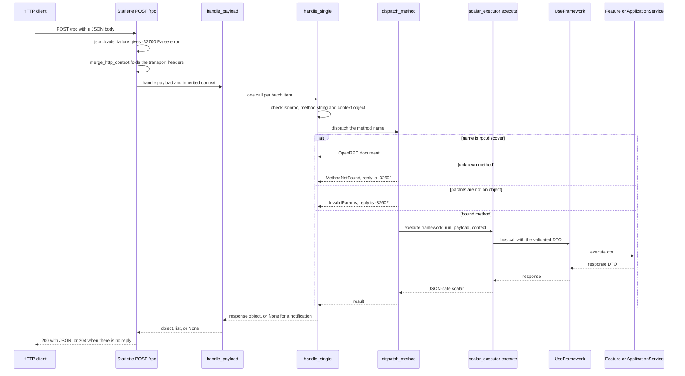

# JSON-RPC entrypoint: gateway, method names and OpenRPC discovery

`entrypoint_rpc` is the driving adapter that publishes one or more `UseFramework` instances as
JSON-RPC 2.0 methods, with OpenRPC 1.4 as the discovery document. The package is
`sincpro_framework.entrypoints.rpc` and it re-exports exactly two names,
`RpcGateway` and `build_rpc_app` (`sincpro_framework/entrypoints/rpc/__init__.py:1-3`).

The hand-written design document is
[`docs/architecture/entrypoint_rpc.md`](../../docs/architecture/entrypoint_rpc.md) — authoritative for
why the host exists, why it is Starlette + OpenRPC instead of FastAPI-jsonrpc, and the constraints that
must not regress. This page covers the implemented surface, anchored to file and line, and does not
restate that rationale.

The package keeps the same two-file split as `entrypoint_mcp`: `entrypoint.py` is the orchestration
facade (composition root, catalog wiring, HTTP app) and `jrpc.py` holds everything specific to the
JSON-RPC wire (dispatch, error envelopes, the OpenRPC document). Nothing in either file imports
Starlette, uvicorn or FastMCP at module level.

Two things this host deliberately does **not** own:

- **The projection.** Methods come from the shared
  [entrypoint catalog](/openwiki/integrations/entrypoints-catalog.md): one `Catalog` per alias, asked for
  `get_scalar_use_cases(filter_binaries_schema=True)` (`sincpro_framework/entrypoints/rpc/entrypoint.py:51-61`).
  Layer vocabulary, `include`/`exclude`/`wrap`, the DTO JSON Schema and the binary-DTO filter belong
  there.
- **The call semantics.** A method call ends in `sincpro_framework/entrypoints/scalar_executor.py`, not
  in this package: dict → DTO → `framework(dto)` → dict. Middleware, context, tracing and the layer
  error handlers are unchanged by being reached over JSON-RPC
  (`sincpro_framework/entrypoints/rpc/jrpc.py:89-93`).

## The composition root: aliases, not logger names

`RpcGateway({"qr": qr, "cybersource": cybersource})` mounts several bounded contexts in one process.
The mapping key is the **alias**, and it is the composition-root key for the method namespace — not
`UseFramework._logger_name`, which is the name `UseFramework(...)` was constructed with and what MCP
uses as a server name (`sincpro_framework/entrypoints/mcp/entrypoint.py:17-19`).

The prefix exists because DTO names collide across bounded contexts: the bus keys handlers by bare DTO
class name (`docs/architecture/entrypoint_rpc.md:44-45`), so two instances that both register
`ChargePayment` are only distinguishable on the wire because the alias is part of the method name.

```python
from sincpro_framework.entrypoints.rpc import RpcGateway

RpcGateway({"qr": qr, "cybersource": cybersource, "bank_account": bank_account}).run()
```

What `__init__` and `add()` actually do (`sincpro_framework/entrypoints/rpc/entrypoint.py:64-97`):

- `__init__(instances=None, layers=DEFAULT_LAYERS, title="sincpro-rpc", version="1.0.0")` stores the
  layers, title and version and then calls `add()` for each entry, so
  `RpcGateway().add("qr", qr).add("cs", cs)` is an equivalent fluent form (`add` returns `Self`).
- `add()` wraps the instance in a `Catalog`, which builds the root bus when the instance was never
  initialized (`sincpro_framework/entrypoints/catalog.py:47-50`). Constructing the gateway therefore
  materialises the registries.
- Per-alias policy is available at mount time: `include`, `exclude` and `wrap` are forwarded to that
  alias's catalog only (`entrypoint.py:89-95`), which is where authentication, audit or a DTO allow-list
  belongs — never on a Feature.
- The alias is validated before it is stored, so `self._catalogs[validate_alias(alias)] = catalog`
  means re-adding the same alias **replaces** that alias's catalog rather than duplicating it.

`validate_alias` enforces `^[A-Za-z][A-Za-z0-9_-]*$` (`entrypoint.py:24-31`). Two consequences worth
knowing: the alias must start with a letter, and a **dot is rejected** — `"qr.prod"` raises
`ValueError` because the `.` is the separator of `{alias}.{layer}.{DtoName}` and an alias containing one
would make the split ambiguous (`docs/architecture/entrypoint_rpc.md:165-172`).

`layers` selects which bus registries are published. `DEFAULT_LAYERS` is
`(Layer.APP_SERVICES, Layer.FEATURES)` (`entrypoint.py:25`), so the default surface is both layers;
`layers=("app_services",)` narrows it. `Layer` is a `StrEnum` with exactly two members,
`"features"` and `"app_services"` (`sincpro_framework/entrypoints/const.py:5-11`), so plain strings work
as well as the enum members.

## Method names and the method index

`method_name(instance, layer, dto_name)` produces `f"{instance}.{layer}.{dto_name}"`
(`jrpc.py:38-39`). `index_methods` builds the whole lookup as
`name -> (alias, UseFramework, PackedFeatureOrAppService)` (`entrypoint.py:51-61`, `jrpc.py:23`):

1. For each alias, ask the catalog for
   `get_scalar_use_cases(filter_binaries_schema=True)`.
2. Drop every operation whose `layer` is not in the gateway's configured layers.
3. Key what is left by the composed method name.

A DTO carrying `bytes` is therefore never addressable over this wire — it is skipped with a warning at
catalog time and stays callable in-process through `framework(dto)`
(`sincpro_framework/entrypoints/catalog.py:147-156`). See
[the shared entrypoint layer](/openwiki/integrations/entrypoints-catalog.md).

`RpcGateway.methods()` recomputes the index on every call, and both `handle()` and `discover()` call it
(`entrypoint.py:99-114`) — the method index and the DTO JSON Schemas behind it are **not cached**. Each
request, and each discovery read, rewalks the registries. That is the price of a dynamic catalog; a host
that needs the index per-connection can call `methods()` once itself and use `jrpc.handle_payload`
directly.

This namespace is reserved for the framework: a JSON-RPC host must not share an HTTP port with
FastMCP, because MCP already speaks JSON-RPC with its own methods (`tools/list`, `tools/call`) and the
framework's own names must not collide with them (`docs/architecture/entrypoint_rpc.md:20`,
`:165-172`). The only method the host adds on its own is `rpc.discover`
(`sincpro_framework/entrypoints/rpc/jrpc.py:20`).

## What one request does



*One JSON-RPC call: the envelope is validated, the method name is resolved against the alias-keyed index, and the call itself is the shared Scalar path into the bus.*

The layering is deliberately three-deep, and the boundaries are where the failure codes come from:

- `handle_payload(methods, discover, payload, inherited_context)` (`jrpc.py:138-159`) owns the shape of
  the *payload*: a list is a batch, an object is a single request, anything else is an invalid request.
- `handle_single(...)` (`jrpc.py:96-135`) owns the shape of the *request object* and turns raised
  exceptions into an envelope.
- `dispatch_method(...)` (`jrpc.py:63-93`) owns the *method*: discovery short-circuit, index lookup,
  params shape, and the one exception type (`ValidationError`) it re-labels as a client error.

## The wire contract

These are the rules a host developer must not get wrong.

**`params` is a by-name object.** Absent or `null` params become an empty payload; a `dict` is passed
through unchanged; anything else — **arrays included** — raises `InvalidParams`, answered as `-32602`
Invalid params with `data` = `"params must be a JSON object (by-name)"`
(`jrpc.py:83-88`, `:126-128`). There is no positional form, matching the `paramStructure: "by-name"`
the discovery document advertises.

**DTO validation maps to Invalid params.** `dispatch_method` wraps the execution in a
`try`/`except ValidationError` and converts it with `json_safe_validation_errors`
(`jrpc.py:90-93`). That helper exists for one specific failure: pydantic puts the raw exception in
`ctx.error` for `value_error` types, and a rejecting `ValueObject` `validate_fn` is exactly that case.
`json.dumps(error.errors(), default=str)` makes the error list JSON-safe, so a bad value object returns
`-32602` instead of crashing `json.dumps` inside the host (`jrpc.py:42-47`). See
[DTOs and value objects](/openwiki/concepts/dto-and-value-objects.md).

**Everything else maps to Internal error.** Any other exception escapes `dispatch_method`, is logged
with `logger.exception("JSON-RPC method [%s] failed", method)` and is answered as `-32603` Internal
error whose `data` is `str(error)` — the traceback stays in the log, not on the wire
(`jrpc.py:129-132`). `MethodNotFound` and `InvalidParams` are the only two exception types given their
own codes (`jrpc.py:123-128`).

**Notifications produce no reply.** The presence of an `id` member is what decides: no `id` means the
method still executes, but `handle_single` returns `None` for **every** outcome, including
`-32601`/`-32602`/`-32603` (`jrpc.py:110-115`, `:123-135`).

**A batch is a list, and an empty one is invalid.** `handle_payload` answers an empty list with a single
`-32600` "Batch must not be empty" object (there is no batch array to fill), filters the `None` replies
of the batch's notifications out of the result, and returns `None` when every item was a notification
(`jrpc.py:151-159`).

| Situation | Reply | Code |
| --- | --- | --- |
| Body is not decodable UTF-8 JSON | `error` | `-32700` Parse error |
| Request is not an object, `jsonrpc != "2.0"`, `method` is not a non-empty string, or `context` is present but not an object | `error` | `-32600` Invalid request |
| Empty batch | `error` | `-32600` Invalid request |
| Method not in the index | `error`, `data` = method name | `-32601` Method not found |
| `params` is not an object, or the DTO raised `ValidationError` | `error`, `data` = message or pydantic errors | `-32602` Invalid params |
| Anything else raised | `error`, `data` = `str(error)` | `-32603` Internal error |
| Success | `result` = the response DTO dumped JSON-safe | — |
| Notification | no reply at all | — |

The JSON-RPC request-envelope rules are checked in one place (`jrpc.py:103-115`): a non-dict request, a
missing or wrong `jsonrpc` member, a `method` that is not a non-empty string, and a `context` member
that is present but not an object all return `-32600` Invalid request.

## Context and tracing: a sibling member, never a DTO field

JSON-RPC 2.0 permits extra members on the request object. `context` is one of them, and being a
**sibling** of `params` is precisely what makes it impossible for a context key to collide with a DTO
field (`docs/architecture/entrypoint_rpc.md:87-111`). The domain never learns JSON-RPC exists: no
Feature or ApplicationService carries JSON-RPC types, and `context` is never merged into `params`.

Two sources feed it, and the body wins:

| Source | Becomes |
| --- | --- |
| `context` member in the request body | `framework.context({...})` — a Feature reads `self.context` |
| `trace_id` / `span_id` / `carrier` **inside** that body `context` | also `framework.with_trace(...)` |
| HTTP `X-Correlation-Id` header | `correlation_id`, only if the body omitted it |
| HTTP `traceparent` header | `carrier.traceparent`, for OpenTelemetry parent adoption |

`merge_http_context(headers)` (`entrypoint.py:34-48`) builds the inherited half: `x-correlation-id`
becomes `correlation_id`, `traceparent` becomes `{"carrier": {"traceparent": ...}}`, and neither is
copied into the DTO params. With no relevant header it returns `{}`, so a caller without headers does
not get a fabricated context (`tests/entrypoint/test_entrypoint_rpc.py:394-397`). The helper is a pure
function over a `Mapping[str, str]` and looks up lowercase keys, so the HTTP endpoint hands it
Starlette's request headers and any other transport can hand it an equivalent mapping.

`handle_single` merges the inherited dict first and then the body's `context`, so **explicit body
context overrides headers** (`jrpc.py:112-121`); the merged dict is passed down as
`merged or None`, so an empty merge stays empty rather than becoming a truthy `{}`.
`scalar_executor.execute` then splits `TRACE_KEYS = ("trace_id", "span_id", "carrier")`
(`sincpro_framework/entrypoints/const.py:18`) out of the context: tracing keys go to
`framework.with_trace(**trace_kwargs)` and the remainder to `framework.context(extra)`, each entered
only when it has content (`sincpro_framework/entrypoints/scalar_executor.py:77-109`). That means a
request with only `X-Correlation-Id` enters a context block and no trace block, while a request with
`traceparent` enters a trace block and adopts the remote parent.

The headers are the transport's contribution and nothing more: middleware, error handlers and bus
tracing are untouched by arriving over JSON-RPC. For the context store and the tracing resolution
order, see [context propagation](/openwiki/concepts/context-propagation.md) and
[tracing](/openwiki/integrations/observability-tracing.md).

## Discovery: `rpc.discover` and `GET /openrpc.json`

`rpc.discover` is a real method on the same dispatch path: `dispatch_method` returns the OpenRPC
document **before** it validates params or looks the method up in the index
(`jrpc.py:78-79`), which means a `params` array sent to `rpc.discover` is ignored rather than rejected.
`RpcGateway.handle()` binds `self.discover` as the discovery callable (`entrypoint.py:110-114`), so
in-process callers, `POST /rpc` and `GET /openrpc.json` all return the same document.

`openrpc_document(title, methods, version)` produces
`{"openrpc": "1.4.0", "info": {"title": ..., "version": ...}, "methods": [discover_method_object(), *methods]}`
(`jrpc.py:20-21`, `:205-227`). Both `title` and `version` default to `"sincpro-rpc"` / `"1.0.0"` and are
constructor arguments of `RpcGateway` and of `build_rpc_app`.

Each published method object (`jrpc.py:185-202`) carries:

- `name` — the `{alias}.{layer}.{DtoName}` string.
- `summary` — the first line of the description; `description` — the whole thing. The description is the
  one introspection resolved from docstrings, so the same text an MCP client reads on `tools/list`
  ([introspection](/openwiki/concepts/introspection.md)).
- `tags` — the alias and the layer, as two tag objects, which is what a client filters on when it only
  wants one bounded context.
- `paramStructure: "by-name"` and `params` — content descriptors built by `content_descriptors` from the
  DTO's JSON Schema: every `properties` entry becomes `{name, required, schema}` in the order pydantic
  emitted it, with `required` from the schema's own `required` list (`jrpc.py:162-182`).
- `result` — a loose `{"name": "result", "schema": {"type": "object"}}`; the response DTO is not
  re-described.
- `x-sincpro-instance`, `x-sincpro-layer`, `x-sincpro-dto` — vendor extensions carrying the parts of the
  name separately, so a client can group methods without parsing the dotted string.

Method order is insertion order: aliases in the order they were added, and within an alias the features
before the application services, because that is how the catalog builds its list
(`sincpro_framework/entrypoints/catalog.py:142-145`). The discovery method itself is always first.

## The HTTP host

`RpcGateway.app()` returns a Starlette application with exactly two routes
(`entrypoint.py:116-153`):

| Route | Behaviour |
| --- | --- |
| `POST /rpc` | Read the raw body, `json.loads(raw.decode("utf-8") or "null")`, fold headers, dispatch, reply. |
| `GET /openrpc.json` | `JSONResponse(gateway.discover())`. |

`rpc_endpoint` is an `async def` that awaits the body and then calls the **synchronous**
`gateway.handle(...)` in the same coroutine (`entrypoint.py:131-143`) — dispatch runs on the event loop
without being offloaded to a threadpool, so a slow Feature occupies the worker. There is no async bus
path in this host.

Status codes are deliberately narrow:

- A body that is not valid UTF-8 JSON returns `-32700` Parse error with **HTTP 200** — the error travels
  inside the JSON-RPC envelope, not in the HTTP status (`entrypoint.py:132-138`).
- An empty body decodes to `null`, which is not an object, so it is answered as `-32600`
  "Request must be an object" (`entrypoint.py:134`, `jrpc.py:103-104`).
- When dispatch returns `None` — a single notification, or a batch in which every item was one — the
  endpoint returns `Response(status_code=204)` with no body (`entrypoint.py:140-143`).
- Every other reply is a `JSONResponse` with the default `200`.

There is no authentication, CORS, body-size limit or compression on these routes: the app is two routes
and the ASGI server. Authorization belongs in a `wrap` at mount time or in the hosting process.

The extra is optional and its absence is loud. `starlette` and `uvicorn` are declared as an extra
(`rpc = ["starlette", "uvicorn"]`, `pyproject.toml:36-48`) and imported lazily **inside** `app()` and
`run()`, never at module import (`entrypoint.py:118-127`, `:156-160`). Without them the caller gets

```text
Starlette/uvicorn is not installed. Install with: pip install sincpro-framework[rpc]
```

raised as an `ImportError` chained from the original one (`entrypoint.py:21-23`). `RpcGateway.methods()`,
`discover()` and `handle()` keep working without the extra, which is what makes the in-process
entrypoint usable from tests and workers.

`run(host="127.0.0.1", port=8080, **kwargs)` builds the app and forwards everything to
`uvicorn.run(self.app(), host=host, port=port, **kwargs)` (`entrypoint.py:155-161`); extra kwargs are
uvicorn's own, and that is the only place the bind address is chosen.
`build_rpc_app(instances, layers=..., title=..., version=...)` is the one-liner
`RpcGateway(...).app()` (`entrypoint.py:164-170`).

## Operating it

| Symptom | Cause | Where |
| --- | --- | --- |
| `ImportError: Starlette/uvicorn is not installed. Install with: pip install sincpro-framework[rpc]` | The extra is missing; raised when `app()`/`run()`/`build_rpc_app()` is called, not at import | `entrypoint.py:21-23`, `:116-127`, `:155-161` |
| `ValueError: RPC instance alias [...] must match ...` | An alias with a dot, a leading digit, or any character outside `[A-Za-z0-9_-]` | `entrypoint.py:24-31` |
| A DTO carrying `bytes` is absent from both `/openrpc.json` and dispatch | Expected: the binary filter drops it with a warning; it stays callable via `framework(dto)` | `entrypoint.py:56`, [entrypoints catalog](/openwiki/integrations/entrypoints-catalog.md) |
| Two bounded contexts publish the same DTO name | Intended: the alias prefixes keep them apart; the bus itself would have rejected the collision inside one instance | `docs/architecture/entrypoint_rpc.md:44-45`, `sincpro_framework/bus.py:150-162` |
| A 200 response whose body is `-32603` Internal error | The Feature raised; `data` is only `str(error)`, the traceback is in the log | `jrpc.py:129-132` |
| Requests slow under load | The index is rebuilt per request and dispatch is synchronous on the event loop | `entrypoint.py:99-114`, `:131-143` |
| `RpcGateway({"pay": pay})` also needs `pay`'s handlers materialised | Expected: `Catalog` builds the root bus when the instance was never initialized | `sincpro_framework/entrypoints/catalog.py:47-50` |

`handle(payload, context=None)` is the escape hatch that makes all of this testable and reusable
without an HTTP server: it is the same dispatch core with an inherited context injected by the caller
(`entrypoint.py:110-114`), which is how the header-folding behaviour is exercised
(`tests/entrypoint/test_entrypoint_rpc.py:206-220`, `:344-392`).

## Related

- [`docs/architecture/entrypoint_rpc.md`](../../docs/architecture/entrypoint_rpc.md) — authoritative design document: JSON-RPC 2.0 + OpenRPC 1.4, why Starlette and not FastAPI-jsonrpc, the module map, and the constraints that must not regress.
- [The shared entrypoint layer](/openwiki/integrations/entrypoints-catalog.md) — `Catalog`, `PackedFeatureOrAppService`, `include`/`exclude`/`wrap`, the binary filter, and the Scalar execution path every method call ends in.
- [MCP entrypoint](/openwiki/integrations/entrypoint-mcp.md) — the other host of the same catalog, and the JSON-RPC methods this host must not share a port with.
- [Context propagation](/openwiki/concepts/context-propagation.md) — the store the request `context` member is merged into, and what a Feature reads as `self.context`.
- [DTOs and value objects](/openwiki/concepts/dto-and-value-objects.md) — the validation that turns a bad payload into `-32602`.
- [Tracing](/openwiki/integrations/observability-tracing.md) — `with_trace`, the W3C carrier, and the OTel parent the `traceparent` header adopts.
- [Introspection](/openwiki/concepts/introspection.md) — where each method's `summary` and `description` come from.
