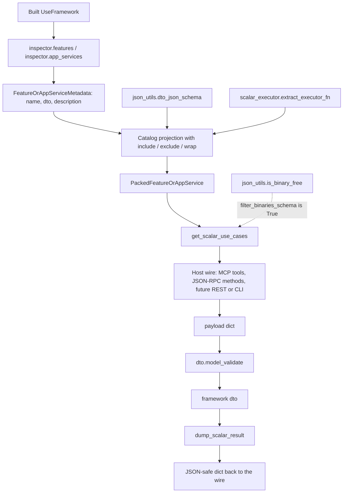
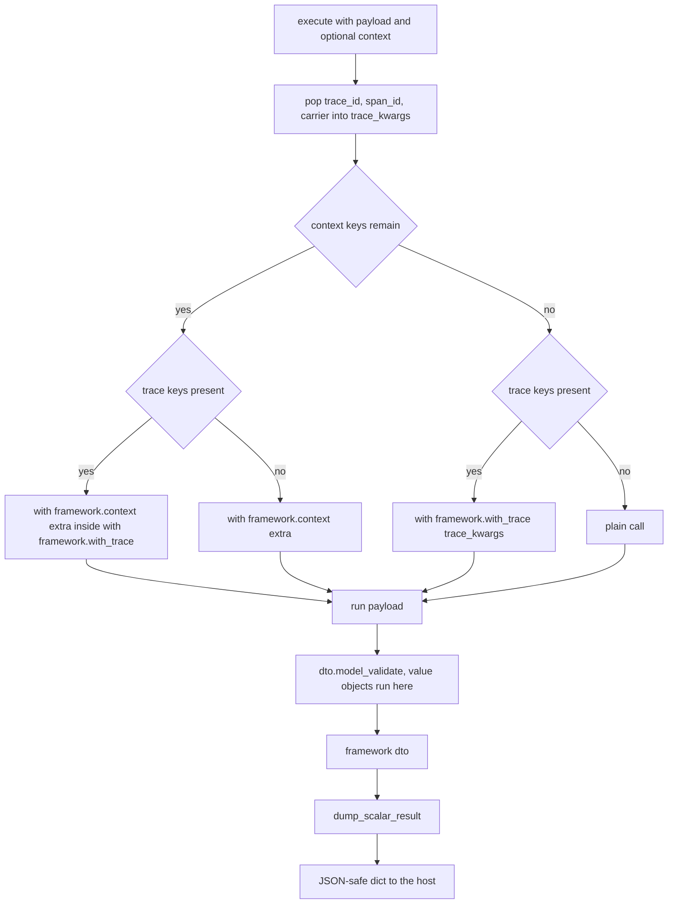

# The shared entrypoint layer: catalog projection, Scalar execution and the JSON-safety decision

`sincpro_framework/entrypoints/` is not a host. It is the layer every driving adapter stands on:
the code that turns a built `UseFramework` into something a JSON wire can describe, calls a
Feature/ApplicationService from a plain `dict`, and answers whether a DTO is publishable at all.
Its own module docstring states the rule it exists to enforce — "Hosts only add a wire: FastMCP
tools, JSON-RPC methods, FastAPI routes, CLI commands. Do not put FastMCP, Starlette, or argparse
types here" (`sincpro_framework/entrypoints/catalog.py:1-7`).

Two hosts consume it today. Both hand-written design documents are authoritative for their own
host and are not restated here:

- [`docs/architecture/entrypoint_mcp.md`](../../docs/architecture/entrypoint_mcp.md) — the MCP host
  (`entrypoint_mcp`), implemented surface on [MCP entrypoint](/openwiki/integrations/entrypoint-mcp.md).
- [`docs/architecture/entrypoint_rpc.md`](../../docs/architecture/entrypoint_rpc.md) — the JSON-RPC
  2.0 host (`entrypoint_rpc`), implemented surface on
  [JSON-RPC entrypoint](/openwiki/integrations/entrypoint-rpc.md).

The package surface is deliberately two names and nothing else:

```python
from sincpro_framework.entrypoints.catalog import Catalog, PackedFeatureOrAppService

__all__ = ["Catalog", "PackedFeatureOrAppService"]
```

(`sincpro_framework/entrypoints/__init__.py:1-5`.) No implementation lives in that `__init__.py`,
and no host type reaches it — `fastmcp`, `starlette` and `uvicorn` are optional extras
(`pyproject.toml:35-37`, `:47-48`), and the shared modules import none of them
(`sincpro_framework/entrypoints/catalog.py:9-17`).

## The responsibility split: four questions, four owners

| Question | Owner | Anchor |
| --- | --- | --- |
| What exists on this bus? | `sincpro_framework.introspection` — `FeatureOrAppServiceMetadata`, own-docstring description | [`introspection`](/openwiki/concepts/introspection.md) |
| How is that packaged for JSON? | `Catalog` → `PackedFeatureOrAppService` | `catalog.py:38-156` |
| How does a plain payload become a bus call? | `scalar_executor.extract_executor_fn` / `execute` | `scalar_executor.py:57-109` |
| Can this DTO travel as JSON at all? | `json_utils` | `json_utils.py:19-91` |

`catalog.py` imports exactly those two helpers and nothing else of its own kind
(`sincpro_framework/entrypoints/catalog.py:12`), which is the structural expression of the split:
the catalog does **no reflection on classes** and **no JSON Schema walking** itself
(`docs/architecture/entrypoint_mcp.md:192`).



*The whole shared layer in one pass: introspection describes, the catalog packages, the Scalar path executes, and the binary filter decides what the wire may publish.*

## `PackedFeatureOrAppService`: the one DTO hosts meet in

```python
class PackedFeatureOrAppService(DataTransferObject):
    name: str
    layer: Layer
    description: str
    dto: type[DataTransferObject]
    json_schema: dict[str, Any]
    run: RunFn
```

(`sincpro_framework/entrypoints/catalog.py:20-35`.) It is a `DataTransferObject` — a pydantic model —
precisely so it can carry a live callable alongside JSON-safe fields: `arbitrary_types_allowed=True`
on `DataTransferObject` (`sincpro_framework/sincpro_abstractions.py:26-29`,
see [DTOs and value objects](/openwiki/concepts/dto-and-value-objects.md)), and `run` is typed
`RunFn = Callable[[Scalar], Scalar]` (`sincpro_framework/entrypoints/const.py:19`).

Three field-level rules matter to anyone writing a host:

- **`json_schema` is computed once, here.** The class docstring is explicit: "`json_schema` is the
  input DTO's schema, computed once here — hosts must not recompute it"
  (`sincpro_framework/entrypoints/catalog.py:25-27`). The value comes from
  `json_utils.dto_json_schema(metadata.dto)` at build time (`:97`), and it is consumed by the JSON-RPC
  host's OpenRPC content descriptors (`sincpro_framework/entrypoints/rpc/jrpc.py:162-182`, `:194`).
  The MCP host is the documented exception in *advertising*: FastMCP derives the tool schema from the
  stamped function signature, not from this field ([MCP entrypoint](/openwiki/integrations/entrypoint-mcp.md)).
- **`layer` is the bus's own vocabulary**, `"features"` or `"app_services"`, and it doubles as the RPC
  method namespace component and the MCP/OpenRPC tag (`sincpro_framework/entrypoints/const.py:5-11`).
- **`run` is not JSON.** It is a bound Python callable; the DTO field exists to make it travel
  alongside the describable fields.

## `Catalog`: policies and the projection

`Catalog(instance)` owns one `UseFramework` instance as a filtered list of Features and
ApplicationServices (`sincpro_framework/entrypoints/catalog.py:38-45`). Its constructor builds the
bus when the instance was never initialized, then stores three pieces of policy state — an
allow-list, a deny-list and a per-DTO-name wrapper map (`:47-55`):

```python
if not framework_instance.was_initialized:
    framework_instance.build_root_bus()
```

Policy is fluent and keyed by DTO **class name**, accepting either the class or a string
(`Catalog._names`, `:57-59`):

| Method | Effect | Anchor |
| --- | --- | --- |
| `include(*dtos)` | Replaces the allow-list (`self._include = ...`); `None` means "no allow-list" | `:103-105` |
| `exclude(*dtos)` | Replaces the deny-list; the two filters combine as include **and** not excluded | `:107-109`, `:77-81` |
| `wrap(dto, wrapper)` | Stores one `Wrapper` per DTO name, accumulating across calls | `:111-114` |

`include` and `exclude` **assign** rather than accumulate, so calling either twice keeps only the
last call's names — and `include()` with no arguments assigns an empty set, which publishes nothing
(`:103-105`). `wrap` accumulates in `self._wrappers`, one entry per DTO name, and a later `wrap` for
the same name overwrites the earlier one (`:111-114`).

The projection itself is `_convert_to_scalar_use_case` (`:61-101`) — a per-layer loop that:

1. skips a name outside `_include`, then skips a name in `_exclude` (`:77-81`);
2. binds `run` with `scalar_executor.extract_executor_fn(self.framework_instance, metadata.dto)`
   (`:83-85`), and, when a wrapper exists for that name, replaces it with `wrapper(run)` (`:86-89`);
3. appends a `PackedFeatureOrAppService` carrying `metadata.description`, `metadata.dto`, the
   pre-built `json_utils.dto_json_schema(metadata.dto)` and that `run` (`:91-100`).

**Nothing is cached.** `_convert_to_scalar_use_case` runs on every `get_scalar_use_cases()` call, so
each projection builds fresh `PackedFeatureOrAppService` entries, fresh `run` closures and fresh
schemas. That is also why `extract_executor_fn` is a factory rather than a closure written inline in
the loop: each entry needs its own `dto_type` bound at closure-creation time, not the loop
variable's final value (`sincpro_framework/entrypoints/scalar_executor.py:62-64`). A consequence
worth knowing: policy set *after* a first projection still takes effect on the next one.

### `get_scalar_use_cases(filter_binaries_schema=False)`

This is the single entry point both hosts call (`:116-156`). It re-checks the build guard
(`:131-132`), converts the features registry and then the app-services registry
(`inspector.features(...)` / `inspector.app_services(...)`, `:134-140`), and returns them in that
order — features before application services (`:142-145`). Both layers are published by default; a
host narrows them itself, as JSON-RPC does with its `layers` filter
(`sincpro_framework/entrypoints/rpc/entrypoint.py:25`, `:51-61`).

The parameter is the publishability switch, and its default is *permissive*:

- `filter_binaries_schema=False` (the default) returns every entry, including DTOs that cannot travel
  as JSON (`:147-148`). This is what `Entrypoint.tools()` and `.to_callables()` get
  (`sincpro_framework/entrypoints/mcp/entrypoint.py:33-39`).
- `filter_binaries_schema=True` keeps an entry only if `json_utils.is_binary_free(entry.json_schema,
  entry.dto)` is true, and logs `logger.warning("Skipping non-JSON Feature/ApplicationService [%s]",
  entry.name)` for each one dropped (`:150-156`). Both hosts ask for exactly this: MCP at
  `sincpro_framework/entrypoints/mcp/entrypoint.py:55`, JSON-RPC at
  `sincpro_framework/entrypoints/rpc/entrypoint.py:56`.

The drop is a **publication** decision, not a capability removal: a binary-carrying
Feature/ApplicationService is still registered, still executes, and is still callable in process via
`framework(dto)` — it simply never appears on a JSON wire
(`docs/architecture/entrypoint_mcp.md:124-126`, `docs/architecture/entrypoint_rpc.md:125`). The
filter is a warning, never an exception, so a new DTO with a `bytes` field degrades to "absent from
`tools/list`, present in the log" rather than a failed host startup.

Note which schema the filter inspects: the one already stored on the entry (`entry.json_schema`).
`is_binary_free` exists as a separate function taking both the schema and the DTO class exactly so
the catalog can avoid building the schema a second time
(`sincpro_framework/entrypoints/json_utils.py:81-91`).

## `json_utils`: can this DTO travel as JSON?

One module answers one question, and its docstring explains why the naive answer is wrong
(`sincpro_framework/entrypoints/json_utils.py:1-11`): pydantic's `model_json_schema()` stores a
nested submodel's definition once under `$defs` and references it by `$ref` everywhere it is used —
in `properties`, in `items` for a list, in `additionalProperties` for a dict, in `anyOf` for an
`Optional` — and **those reference sites carry no `format` information of their own**. Walking only
the top-level properties would happily publish a Feature whose `bytes` field is one level down.

Three functions, three roles:

| Function | Role | Anchor |
| --- | --- | --- |
| `dto_json_schema(dto_type)` | Build the schema; never raise | `:19-23` |
| `is_binary_free(schema, dto_type)` | Decide, reusing an already-built schema | `:67-78` |
| `dto_is_json_serializable(dto_type)` | Standalone decision; builds the schema itself | `:81-91` |

`dto_json_schema` is a thin wrapper that degrades instead of failing: on any exception it returns
`{"type": "object", "title": dto_type.__name__}` (`:19-23`). That keeps the catalog's projection
total — a DTO pydantic cannot serialize is still packaged, with a generic object schema.

`_schema_has_binary` is the full tree walk (`:35-64`), in a defined order:

1. record `id(schema)` in a `seen` set and return `False` for a node already visited, so a cyclic
   `$defs` graph terminates (`:44-47`);
2. return `True` when the node's own `format` is in `BINARY_JSON_FORMATS` — `{"binary", "byte"}`
   (`:48-49`, `sincpro_framework/entrypoints/const.py:17`);
3. recurse into `properties`, `$defs` and `definitions` (`:50-55`);
4. recurse into `items` and `additionalProperties` (`:56-59`);
5. recurse into `anyOf`, `oneOf` and `allOf` (`:60-63`).

`is_binary_free` combines that walk with a second, independent check on the DTO itself: it also
rejects when any of `dto_type.model_fields` has a bytes-like annotation
(`sincpro_framework/entrypoints/json_utils.py:67-78`), where "bytes-like" is
`BINARY_TYPES = (bytes, bytearray, memoryview)` (`sincpro_framework/entrypoints/const.py:16`) and
`_is_binary_annotation` recurses through generics, so `list[bytes]` or `bytes | None` is caught at the
annotation level too (`json_utils.py:26-32`). The two checks are independent on purpose: neither alone
is treated as sufficient evidence that a DTO is JSON-safe.

`dto_is_json_serializable` fails **closed**: it builds the schema itself and returns `False` when
`model_json_schema()` raises (`:87-90`). That asymmetry with `dto_json_schema` is intentional — the
standalone decision answers "is this safe?", the catalog's reuse path answers "package what
introspection already described".

## `scalar_executor`: dict in, dict out

The module docstring names the contract it protects: "UseFramework's own contract stays typed (DTO
in, DTO out); it never learns about dicts or JSON"
(`sincpro_framework/entrypoints/scalar_executor.py:1-7`). Everything wire-shaped lives here rather
than in `use_bus.py`, whose `__call__` still takes a DTO and returns a DTO
(`sincpro_framework/use_bus.py:373-404`).

### Binding: `extract_executor_fn`

```python
def run(payload: Scalar) -> Scalar:
    result = framework_instance(dto_type.model_validate(payload))
    return dump_scalar_result(result)
```

(`sincpro_framework/entrypoints/scalar_executor.py:70-72`, inside the factory at `:57-74`.) Three
things happen in three lines: the payload is validated **as the DTO** — which is where
`ValueObject.validate_fn` runs on wire input — the DTO goes through the bus unchanged, and the
response is dumped. Because the bus call is `framework(dto)`, middleware, error handlers, context and
tracing behave exactly as they do for a Python caller; being reached over a wire changes nothing
(`docs/architecture/entrypoint_mcp.md:157`).

### Dumping: `dump_scalar_result`

`dump_scalar_result(result)` (`:21-54`) is the response half, and every branch exists to keep a host
from crashing *after* the Feature already produced its side effect:

1. `None` becomes `{}` (`:34-35`).
2. A pydantic model dumps with `model_dump(mode="json")`; if that raises, it falls back to
   `model_dump()` (`:36-41`). A non-dict dump is wrapped as `{"result": dumped}`.
3. A `dict` passes through unchanged; anything else becomes `{"result": value}` (`:42-45`).
4. If `json.dumps(payload)` accepts the payload, it is returned as is (`:47-49`).
5. Otherwise the offending leaves are stringified via `json.dumps(payload, default=str)` and
   re-parsed, with a warning naming the response type
   (`"Non-JSON value in [%s] response: coerced to string"`, `:51-54`).

Step 4's probe is load-bearing: pydantic happily keeps arbitrary objects on an `Any` field inside
`model_dump()`, so without it the failure would surface inside the host as a serialization error
after the side effect. `tests/entrypoint/test_entrypoints.py:310-317` pins the contract — a response
carrying a SOAP-like object keeps its other fields, the raw value becomes a string, and the whole
result is `json.dumps`-able. DTO hygiene, not the wire, decides whether step 5 ever runs.

### The trace/context split: `execute`

`execute(framework_instance, run, payload, context=None)` (`:77-109`) is the only piece of this
module a host may not need. It is used by JSON-RPC (`sincpro_framework/entrypoints/rpc/jrpc.py:91`)
and deliberately not by MCP, because FastMCP has no per-request context sibling field
(`docs/architecture/entrypoint_rpc.md:161`).



*One Scalar execution: the context mapping is split, each of the four branches enters only the blocks it has content for, and the call itself is `model_validate` → `framework(dto)` → `dump_scalar_result`.*

The split is `TRACE_KEYS = ("trace_id", "span_id", "carrier")`
(`sincpro_framework/entrypoints/const.py:18`): those keys are popped out of the context and, when
non-`None`, collected into `trace_kwargs` (`scalar_executor.py:90-97`); whatever remains is the
context overlay. The four branches at `:99-109` enter the blocks **only when they have content**, and
when both are present `framework.context(extra)` is the outer block with
`framework.with_trace(**trace_kwargs)` nested inside it (`:99-102`) — so a request carrying only a
correlation id enters a context block and no trace block, while one carrying `traceparent` enters a
trace block and adopts the remote OpenTelemetry parent. A context with neither runs the call with no
block at all (`:109`). For what those blocks do to a Feature's `self.context`, see
[context propagation](/openwiki/concepts/context-propagation.md).

## `const.py`: the vocabulary the whole layer agrees on

`const.py` is 20 lines and defines every shared name (`sincpro_framework/entrypoints/const.py:1-20`):

| Name | Value | Anchor |
| --- | --- | --- |
| `Layer` | a `StrEnum` with exactly `features` and `app_services`, described as "the bus's own vocabulary", also naming the RPC namespace and the MCP/OpenRPC tag | `:5-11` |
| `Scalar` | `dict[str, Any]` — the payload type on both sides | `:14` |
| `BINARY_TYPES` | `(bytes, bytearray, memoryview)` | `:16` |
| `BINARY_JSON_FORMATS` | `{"binary", "byte"}` | `:17` |
| `TRACE_KEYS` | `("trace_id", "span_id", "carrier")` | `:18` |
| `RunFn` | `Callable[[Scalar], Scalar]` — the bound `run` | `:19` |
| `Wrapper` | `Callable[[RunFn], RunFn]` — what `Catalog.wrap` accepts | `:20` |

Nothing here mentions a protocol, which is the point: a host that invents its own layer strings,
payload type or trace-key tuple has forked the contract.

## Adding a host: reuse, do not reimplement

`docs/architecture/entrypoint_rpc.md:18` states the rule for future work — "REST/CLI should do the
same — reuse `Catalog`, do not reimplement it" — and `catalog.py`'s own docstring closes the same
loop by naming FastAPI routes and CLI commands as prospective hosts
(`sincpro_framework/entrypoints/catalog.py:1-7`). A new host therefore adds three things and no
more:

1. a `{protocol}.py` holding only what is specific to that wire — for MCP, keyword-only signature
   stamping from DTO fields (`sincpro_framework/entrypoints/mcp/mcp.py:13-54`); for JSON-RPC,
   dispatch, the error envelope and the OpenRPC document
   (`sincpro_framework/entrypoints/rpc/jrpc.py:1-227`);
2. a thin `entrypoint.py` facade that builds a `Catalog`, forwards `include`/`exclude`/`wrap` to it,
   and maps `get_scalar_use_cases(filter_binaries_schema=True)` onto the wire
   (`sincpro_framework/entrypoints/mcp/entrypoint.py:11-71`,
   `sincpro_framework/entrypoints/rpc/entrypoint.py:64-170`);
3. an optional extra for its own library, keeping the core bus installable without it
   (`pyproject.toml:35-37`, `:47-48`), imported lazily inside the method that needs it and raised as
   a named `ImportError` (`sincpro_framework/entrypoints/mcp/entrypoint.py:49-52`,
   `sincpro_framework/entrypoints/rpc/entrypoint.py:21-23`).

What a new host must **not** do: put `argparse`, `Starlette` or FastMCP types in `catalog.py`; walk
the DTO schema itself instead of asking `json_utils`; recompute `json_schema`; treat Value Objects as
callable operations (they are field types, never tools —
`docs/architecture/entrypoint_mcp.md:81`); or skip `app_services` (`:204`). Two hosts also must not
share an HTTP port, because MCP already speaks JSON-RPC methods of its own
(`docs/architecture/entrypoint_rpc.md:20`).

## Invariants and failure modes

| Situation | What happens | Where |
| --- | --- | --- |
| Instance never built | `Catalog(instance)` calls `build_root_bus()`, so constructing a host materialises the registries | `catalog.py:47-50`, `:131-132` |
| Registry entry with no DTO in `dto_registry` | Invisible here too — introspection drops it upstream, so it is never packaged | [`introspection`](/openwiki/concepts/introspection.md) |
| DTO with `bytes` anywhere (nested, list, dict, `Optional`) | Dropped from a JSON wire with a warning when `filter_binaries_schema=True`; still callable via `framework(dto)` | `catalog.py:150-156`, `json_utils.py:35-64` |
| Unexpected keyword argument to `scalar_executor.execute` | Signature is `(framework_instance, run, payload, context=None)` — no protocol extras | `scalar_executor.py:77-82` |
| Response DTO holds a non-JSON object | Leaves stringified and warned, never raised after the side effect | `scalar_executor.py:47-54` |
| A context key named `trace_id` reaching `self.context` | Routed to `with_trace` by the split rather than kept in the overlay | `scalar_executor.py:90-101`, `const.py:18` |
| Handler raises | Not this layer's job: the exception propagates to the host, which maps it to its own envelope | `docs/architecture/entrypoint_rpc.md:115-123` |

Two things this layer never owns: authorization (it belongs in a `wrap` or in the hosting process,
never on a Feature) and the response DTO's business content (`docs/architecture/entrypoint_mcp.md:216`).

## What the tests pin

`tests/entrypoint/test_entrypoints.py` is where the catalog's behaviour is pinned. Most of it reaches
the shared layer through the MCP facade — `Entrypoint(...).tools()` and `.to_callables()` — and never
needs a FastMCP install; the two tests that do produce a server guard the import with
`try`/`except ImportError` (`tests/entrypoint/test_entrypoints.py:253-258`, `:292-296`). What the
suite fixes:

- both layers published, with the layer name on each entry
  (`tests/entrypoint/test_entrypoints.py:145-155`);
- the description is the handler's own docstring, not the base-class essay (`:157-162`);
- the binary decision, positive and negative (`:165-167` — `dto_is_json_serializable(ValidateCard) is
  True`, `dto_is_json_serializable(SendBinaryPackage) is False`);
- `to_callables()` executing a real bus call and the Value Object roundtrip through
  `validate_fn` (`:170-183`);
- `include`/`exclude` subsetting and `wrap` decorating exactly one operation (`:186-213`);
- DTO field descriptions and Value Object titles surviving into `json_schema` (`:231-236`, `:261-269`);
- a non-JSON response value coerced while the other fields survive (`:310-317`).

`tests/entrypoint/test_entrypoint_rpc.py` pins the wire-visible consequence of the filter and of the
shared catalog: a binary DTO is absent from the method index
(`tests/entrypoint/test_entrypoint_rpc.py:271-273`), and a per-instance `exclude` at mount time
removes one DTO without touching the other methods (`:276-282`).

## Related

- [`docs/architecture/entrypoint_mcp.md`](../../docs/architecture/entrypoint_mcp.md) — authoritative design document for the MCP host over this layer.
- [`docs/architecture/entrypoint_rpc.md`](../../docs/architecture/entrypoint_rpc.md) — authoritative design document for the JSON-RPC host, including the "reuse `Catalog`" rule for REST/CLI.
- [MCP entrypoint](/openwiki/integrations/entrypoint-mcp.md) — `Entrypoint`, `build_mcp_server`, `fastmcp_callable`, and the stdio versus Streamable HTTP choice.
- [JSON-RPC entrypoint](/openwiki/integrations/entrypoint-rpc.md) — `RpcGateway`, method names, the error envelope, and the request `context` member this layer's `execute` splits.
- [Introspection](/openwiki/concepts/introspection.md) — the metadata and own-docstring description resolution the catalog consumes.
- [DTOs and value objects](/openwiki/concepts/dto-and-value-objects.md) — the pydantic validation that makes an invalid payload fail inside the bus call, and the `ValueObject` JSON shape.
- [Context propagation](/openwiki/concepts/context-propagation.md) — what `framework.context({...})` through this layer's `execute` does to a Feature's `self.context`.
- [Executing a DTO](/openwiki/architecture/bus-execution.md) — the `framework(dto)` call every Scalar execution ends in.
