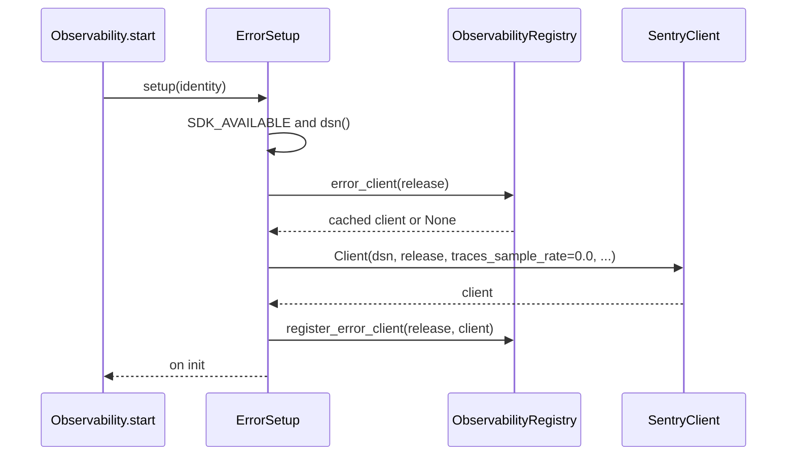
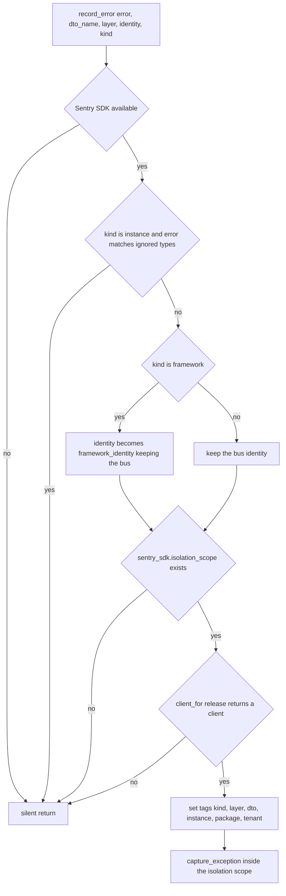
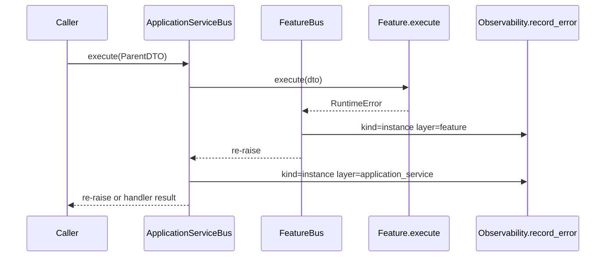

# Observability: error reporting to Sentry/GlitchTip

Error reporting is the second backend of the framework's observability package, next to
[tracing](/openwiki/integrations/observability-tracing.md). It lives under
`sincpro_framework/observability/errors/` and is reached only through
`Observability` — the object every `UseFramework` owns and injects into its three buses
(`sincpro_framework/observability/api.py:101-118`, `sincpro_framework/use_bus.py:58`).
The package docstring states the encapsulation rule: the rest of the framework never
imports `sentry_sdk`, and works unchanged when it is not installed
(`sincpro_framework/observability/api.py:1-14`).

Three properties drive everything else on this page:

- **The client is the framework's own, not the host's.** Setup builds a
  `sentry_sdk.Client` per release and never calls `sentry_sdk.init()`
  (`sincpro_framework/observability/errors/setup.py:1-6`, `:44-69`).
- **Reporting never raises and never blocks the bus.** Every entry point is wrapped in
  `try/except Exception` and returns silently
  (`sincpro_framework/observability/errors/record_error.py:29-31`, `:63-64`;
  `sincpro_framework/observability/errors/setup.py:72-83`).
- **The bus reports before the handler runs**, so a swallowed unexpected exception
  still produces an event (`sincpro_framework/bus.py:60-64`, `:116-120`).

Turning it on is environment work, not code:

```bash
pip install sincpro-framework[sentry]
export SENTRY_PYTHON_DSN=https://KEY@glitchtip.sincpro.dev/1
export TENANT=acme          # optional: GlitchTip environment + tenant tag
```

The DSN is read from the framework conf, which resolves `sentry_dsn` from
`SENTRY_PYTHON_DSN` (`sincpro_framework/conf/sincpro_framework_conf.yml:6`); with the
extra installed and that variable set, a bus build reports `on:init` instead of `off`.
`package=` on `UseFramework` is the escape hatch when the caller that built the bus is
not the library that should own the release (`sincpro_framework/use_bus.py:32-58`).

## The isolated client

`setup(identity)` prepares one client for one bus's release and returns a
`ComponentStatus` — it is called from `Observability.start()`, which
`build_root_bus()` triggers (`sincpro_framework/observability/api.py:69-87`,
`sincpro_framework/use_bus.py:150`).



*One client per release, cached in the process registry — a second bus of the same deployment reuses it.*

The client is created with exactly these options (`sincpro_framework/observability/errors/setup.py:57-67`):

| Option | Value | Why it matters |
|---|---|---|
| `dsn` | the conf DSN, validated | no usable DSN means no client at all |
| `release` | `identity.release` | see [the release rule](#the-release-rule) |
| `traces_sample_rate` | `0.0` | traces deliberately do **not** go to GlitchTip; Tempo stays on OTLP |
| `auto_enabling_integrations` | `False` | the framework does not turn on SDK integrations behind the host's back |
| `send_default_pii` | `False` | no request user data is attached by the framework |
| `environment` | `tenant()` when non-empty | lets the UI filter by tenant |

Because `sentry_sdk.init()` is never called, the global client the host installed —
Odoo's, FastAPI's — is untouched, and the host's own errors keep reporting under the
host's release. The consequence on the receiving side is intended and stated in the
module docstring: **the host may capture the same exception object with its own
release**, and the framework does not try to suppress that
(`sincpro_framework/observability/errors/record_error.py:24-28`, `README.md:955`).
Two products, two releases, same traceback.

### Gating: DSN, SDK and status

Everything is a status, never an exception (`sincpro_framework/observability/errors/setup.py:72-83`):

- `off("sdk_missing")` — `import sentry_sdk` failed at module import, so
  `SDK_AVAILABLE` is `False` (`:21-26`).
- `off("dsn_missing")` — `dsn()` returned `""`. The DSN is validated beyond being
  present: it must start with `http://` or `https://` **and** contain `@`, and any
  exception while reading the setting also yields `""` (`:33-41`). A string like
  `not-a-dsn` is therefore reported as `dsn_missing`, not as a failure.
- `on("init")` — the client exists.
- `failed("client_not_created")` — the DSN looked usable but no client came back (`:79-80`).
- `failed(<exception text>)` — client construction raised; `failure_of` uses
  `str(exc).strip()` (or the class name when empty) truncated to 200 characters
  (`sincpro_framework/observability/domain.py:90-94`).

`sentry_dsn` resolves from `SENTRY_PYTHON_DSN` in the shipped conf file, and `tenant`
from `TENANT` (`sincpro_framework/conf/sincpro_framework_conf.yml:6`, `:9`); the
[configuration page](/openwiki/concepts/configuration.md) owns those fields. What
error reporting does with `tenant` is its own behaviour: it becomes the client's
`environment` when non-empty (`setup.py:64-66`) **and** the `tenant` tag on every
event (`record_error.py:59-61`), so an empty `TENANT` sets neither.

### Where clients live

Error clients are cached in the process-wide `registry`, keyed by the **release
string**, not by the bus (`sincpro_framework/observability/registry.py:41-45`,
`setup.py:51-53`, `:68`). Two buses of one deployment therefore share one client
object — a different arrangement from tracer providers, which are keyed per bus. That
matches the release rule: two buses of one deployment ship one release, so they share the
client that reports under it. `registry.reset()` clears the error clients along with the
providers and the announced process identity
(`sincpro_framework/observability/registry.py:47-50`).

## The release rule

`ObservabilityIdentity.release` is what the `release` field of the client gets
(`sincpro_framework/observability/domain.py:51-60`):

1. `APP_RELEASE` is taken **verbatim** as the artifact, version segment included and
   never split (`sincpro_framework/observability/domain.py:173-183`). Since the release
   joins artifact and version with `":"`, a value like `sincpro_mcp_odoo:0.8.0` arrives
   as `sincpro_mcp_odoo:0.8.0`.
2. A resolved distribution contributes `artifact:version` instead, the two coming from
   the same source (`:239-245`).
3. The **bus is not part of the release.** Two buses of one deployment ship the same
   release and are told apart by the `sincpro.instance` tag (`:55-57`).
4. Only when there is no artifact at all does the bus stand in for it, so events stay
   separable per bounded context (`:59-60`).

| Situation | release | sincpro.instance |
|---|---|---|
| Service with `APP_RELEASE=sincpro_mcp_odoo:0.8.0` | `sincpro_mcp_odoo:0.8.0` | the bus name |
| SDK resolved to `sincpro-payments-sdk:5.0.3` | `sincpro-payments-sdk:5.0.3` | the bus name |
| Nothing resolvable, bus `payments` | `payments` | `payments` |
| Framework-internal failure on bus `payments` | `sincpro-framework:<installed version>` | `payments` |

The artifact itself comes from `resolve_identity`, whose sources are evaluated one at a
time, cheapest first (`sincpro_framework/observability/domain.py:205-247`): an explicit
`package=` argument to `UseFramework`, then the library that built the bus via the
`_` → `-` distribution convention, then `APP_RELEASE` (named by `OTEL_SERVICE_NAME`
when needed), and only last the `packages_distributions()` scan, which costs about
200 ms. A source contributes its artifact **and its own version**, never one paired
with another source's version (`:225-227`). The caller's module must be captured while
it is still on the stack — at `UseFramework` construction — because read from a request
the stack belongs to Odoo, not to the SDK (`api.py:52-54`,
`domain.py:147-165`); the identity itself is resolved once, lazily, on first use
(`api.py:60-67`).

### Framework-internal failures

A failure raised by the framework itself is not the bounded context's bug, so
`kind="framework"` swaps the identity for `framework_identity(...)` before the event is
built (`sincpro_framework/observability/errors/record_error.py:35-36`,
`sincpro_framework/observability/domain.py:109-117`). That identity keeps the bus so the
event still says which instance hit it, but reports `artifact=sincpro-framework` with
the installed framework version — `framework_version()` returns `"unknown"` when the
distribution is not installed (`domain.py:105-106`) — which also becomes the
`sincpro.package` tag.

The framework-kind call sites are all reported with layer `"framework"`:

| Failure | Reported from |
|---|---|
| `UnknownDTOToExecute` or `DTOAlreadyRegistered` raised by `FrameworkBus.execute` | `sincpro_framework/bus.py:196-200` |
| `DependencyAlreadyRegistered` raised by `add_dependency` | `sincpro_framework/use_bus.py:166-169` |
| `SincproFrameworkNotBuilt` raised by `__call__` when the bus is `None` | `sincpro_framework/use_bus.py:380-386` |

None of these calls passes a span, so nothing is recorded on a span either
(`sincpro_framework/observability/api.py:110`, `sincpro_framework/observability/tracing/span_error.py:8-16`).
They also differ in whether a DTO is named: the facade passes `dto_name`, so an unroutable
DTO produces a `sincpro.dto` tag, while `add_dependency` and the not-built guard pass `""`
and produce none (`sincpro_framework/bus.py:198-200`, `sincpro_framework/use_bus.py:168`,
`:385`). The per-call routing re-check inside `FrameworkBus.execute` raises
`DTOAlreadyRegistered` inside the `try` and that type is in the `isinstance` filter of the
surrounding `except`, so it is reported the same way
(`sincpro_framework/bus.py:175-182`, `:196-200`). A `KeyError` from calling a sub-bus
directly with an unregistered DTO is **not** framework-kind — it is reported by that
sub-bus as an ordinary instance error, if at all (`bus.py:53`, `:109`). The
duplicate-name check in `FrameworkBus.__init__` raises `DTOAlreadyRegistered` at build time
and is **not** reported: it runs before any `except` clause wraps it
(`sincpro_framework/bus.py:154-162`).

## record_error: tags, gates and what it never does

`record_error(error, dto_name, layer, identity, kind="instance", ignored_exceptions=())`
(`sincpro_framework/observability/errors/record_error.py:16-23`) is the single function
that talks to GlitchTip. `Observability.record_error` forwards to it after giving the
span its exception (`api.py:101-118`), so a bus failure is recorded twice in two
different places: a span event for tracing and a GlitchTip event for errors
(`span_error` and `record_error` are separate modules by design —
`sincpro_framework/observability/tracing/span_error.py:1`).



*Four ways to skip, one way to report: the whole path is silent unless every gate passes.*

The tags set on the isolated scope, in the order the code sets them
(`sincpro_framework/observability/errors/record_error.py:51-61`):

| Tag | Value | Set when |
|---|---|---|
| `sincpro.kind` | `"instance"` or `"framework"` | always |
| `sincpro.layer` | `"feature"`, `"application_service"`, `"framework"`, or a transport layer | always |
| `sincpro.dto` | the bare DTO class name | `dto_name` is non-empty |
| `sincpro.instance` | `identity.bus` | `identity.bus` is non-empty |
| `sincpro.package` | `identity.artifact` | the artifact is known and not `"unknown"` |
| `tenant` | `settings.tenant`, stripped | non-empty |

The scope is a `sentry_sdk.isolation_scope()` entered around the tags and the capture,
and the framework's client is attached to it with `scope.set_client(client)` whenever the
installed SDK exposes that method before the tags are set (`:47-51`, `:62`). That is what
makes the event go through the framework's client while the host's global client stays
installed for everything else. The guard on `isolation_scope` existing returns early
rather than capturing through whatever client the SDK would pick (`:40-42`), and the
import of `sentry_sdk` itself happens inside the function so the module stays importable
without the extra.

Skip conditions, all silent (`sincpro_framework/observability/errors/record_error.py:29-45`):

1. `SDK_AVAILABLE` is `False`.
2. `kind == "instance"` and the error matches `ignored_exceptions`.
3. The installed SDK has no `isolation_scope` attribute.
4. `client_for(identity.release)` returns `None` — an empty release or no usable DSN,
   which is also why a misconfigured framework never piggybacks the host's client.

Note the ordering in the source: the ignore check runs **before** the framework swap, and
the ignore check itself is guarded by `kind == "instance"`. A framework-kind error is
therefore never filtered by the ignore list, even when the list contains `Exception`
(`:32-36`).

### The ignored-exceptions path

`UseFramework.ignore_sentry_exceptions(*exc_types)` is the public door
(`sincpro_framework/use_bus.py:240-247`); it forwards to `Observability.ignore`, which
appends unknown types to a tuple without duplicating
(`sincpro_framework/observability/api.py:89-95`). The tuple is read again on every
report (`api.py:117`), and all three buses hold the *same* `Observability` object, so
registering after `build_root_bus()` takes effect immediately with no propagation step
(`sincpro_framework/use_bus.py:148`, `tests/observability/test_bus_wiring.py:96-110`).

```python
app = UseFramework("payment-cybersource")
app.ignore_sentry_exceptions(ValidationError, InsufficientFunds)
```

Error handlers still run for those types (`use_bus.py:241-246`): the ignore list only
removes the GlitchTip event. Its purpose is to keep expected domain errors from hiding
real bugs — anything *not* in the list is reported even if a handler swallows it.

## Reporting order, and why it is the thing to know

The bus reports inside its `except` block, and only then consults `handle_error`
(`sincpro_framework/bus.py:60-64`, `:116-120`):



*One pass through two layers produces two events, and both happen before any error handler sees the exception.*

Consequences a user has to plan for:

- **A swallowing handler does not hide an unexpected exception.** A feature-level handler
  that returns a value produces a GlitchTip event and a normal response at the same time
  (`bus.py:61-63`, `README.md:957`).
- **One exception can produce two events.** Nothing marks an error as already captured,
  so an exception raised in a Feature reached through a delegating ApplicationService is
  reported once with `sincpro.layer="feature"` and once with
  `sincpro.layer="application_service"`, both with `sincpro.kind="instance"`
  (`sincpro_framework/bus.py:61`, `:117`). The two layers are distinct observations —
  which layer failed — rather than duplicates to collapse.
- **Expected domain errors must be excluded explicitly.** They reach the same `except`
  clause as a bug, so the only way to keep the project quiet is
  `ignore_sentry_exceptions` (`use_bus.py:240-247`).
- **The reporting is wired into the bus, not around it.** `UseFramework.__call__` runs
  the middleware pipeline with no `except` (`sincpro_framework/use_bus.py:373-404`), so a
  middleware that raises propagates without any `record_error` call — the same is true
  for anything raised before `FrameworkBus.execute` is reached
  (`sincpro_framework/middleware.py:44-53`).
- **Only `Exception` is reported.** Every reporting `except` clause is `except Exception`
  (`bus.py:60`, `:116`, `:196`), so `KeyboardInterrupt`, `SystemExit` and
  `asyncio.CancelledError` skip both reporting and the error handlers.
- **The DTO name in the tag is the routing key**, `dto.__class__.__name__`
  (`bus.py:45`, `:101`, `:173`) — the same bare class name the registries are keyed by,
  which is why the tag can be used to find the handler.

## The transport case: process errors

A 500 that dies before any Feature runs belongs to the process, not to a bounded
context. `process.record_error(error, layer="process")` reports it under the process
identity — `artifact:version` with no bus segment — and with `kind="instance"`
(`sincpro_framework/observability/api.py:139-153`, `:204-206`). Because
`identity.bus` is empty, such an event carries no `sincpro.instance` tag
(`record_error.py:55-56`), and the call passes no ignore list, so
`ignore_sentry_exceptions` does not apply to transport errors. The process door itself
is documented with tracing, since it is also what instruments the ASGI request and the
httpx call ([observability tracing](/openwiki/integrations/observability-tracing.md)).

Practically: a process 500 and the DTO errors of the same deployment share one release
and one cached client, and the DTO events are the ones that name a bounded context.

## Operations: reading the status probe

After `build_root_bus()` — or the first `app(dto)` call — every instance exposes
`framework.observability.status` (`sincpro_framework/observability/api.py:56`, `:69-87`):

```python
status = app.observability.status   # ObservabilityStatus
status.sentry.state                 # off | on | failed
status.sentry.reason                # not_built | sdk_missing | dsn_missing | init | client_not_created | exception text
status.sentry.active                # bool
```

`ObservabilityStatus.sentry` is a `ComponentStatus(active, state, reason)`
(`sincpro_framework/observability/domain.py:63-68`). Before `start()` runs, the reason is
the field default `not_built` (`api.py:56`, `domain.py:63-68`). After it, the values are
whatever `setup()` returned, listed [above](#gating-dsn-sdk-and-status). `start()` also
emits one line to the instance logger —
`observability sentry=<state>:<reason> otel=<state>:<reason>` — at **warning** level when
either backend is `failed`, and info otherwise; a logger that raises is swallowed
(`api.py:76-86`).

`status` is a live attribute of the `Observability` object, not a snapshot: assigning into
`settings` after the bus was built changes the next `build_root_bus()` but not the status
already recorded, which is why the supported configuration surface is the environment
([configuration](/openwiki/concepts/configuration.md)).

## Boundaries and extension points

- **The public surface is `Observability` and `process`.** The errors modules are
  documented as implementation detail; `sincpro_framework/observability/__init__.py:1-14`
  says so, and nothing in `errors/` is re-exported from the package `__init__`.
- **The framework never reuses or replaces the host's client.** Adding a
  `sentry_sdk.init()` anywhere in this package would break the isolation that is the
  point of `setup.py:1-6`; the per-release client and `scope.set_client` are the
  alternative (`record_error.py:47-50`).
- **New reporting call sites must choose a `kind`.** `kind="instance"` (the default)
  means the bounded context's release and the ignore list apply; `kind="framework"`
  means the framework's release and no filtering (`record_error.py:32-36`).
- **The ignore list is per `Observability` instance**, so it is per bounded context; the
  process door does not consult it.
- **The extra is optional**: `sentry-sdk` is the `sentry` extra
  (`pyproject.toml:34`, `:46`), and without it every method on this path is a no-op while
  the bus keeps raising the original exception
  (`tests/observability/errors/test_sentry.py:129-142`,
  `tests/observability/test_optional_extras.py:8-51`).

### What pins this behaviour

The contract above is pinned by `tests/observability/errors/test_sentry.py`, which fakes
`sentry_sdk` so nothing leaves the process: it asserts that `sentry_sdk.init` is never
called and that the client is built with the release, `traces_sample_rate=0.0` and
`auto_enabling_integrations=False` (`:94-108`), that an absent or unusable DSN means no
capture (`:110-122`, `:462-470`), that reporting never raises (`:125-127`) and that the
bus still raises when Sentry is off (`:129-142`), the exact tag set per event
(`:225-252`), the handler-still-reports case (`:265-283`), the ignore list (`:285-301`),
the framework release and its immunity to the ignore list (`:303-340`), the two-layer
double report (`:485-517`), the status values (`:368-403`, `:406-441`), the conf wiring
for `SENTRY_PYTHON_DSN` (`:472-482`) and the release-resolution cases (`:174-222`). The
wiring — one `Observability` object shared by the three buses, ignored types registered
after the build still reaching them — is pinned by
`tests/observability/test_bus_wiring.py:46-110`. This repository's documentation
instructions exclude `tests/` from the wiki's content, so these are recorded as pointers
for a maintainer, not restated as behaviour.

## Related pages

- [Observability: tracing](/openwiki/integrations/observability-tracing.md) — the span
  half, the two doors, and the process provider model.
- [Configuration and settings](/openwiki/concepts/configuration.md) — `sentry_dsn`,
  `tenant`, `app_release` and how they are read.
- [Bus execution](/openwiki/architecture/bus-execution.md) — where in the routing the
  three `except` clauses sit.
- [Error handling](/openwiki/workflows/error-handling.md) — the handler chain that runs
  after reporting.
- `README.md:938-980` — the user-facing Sentry/GlitchTip walkthrough.
