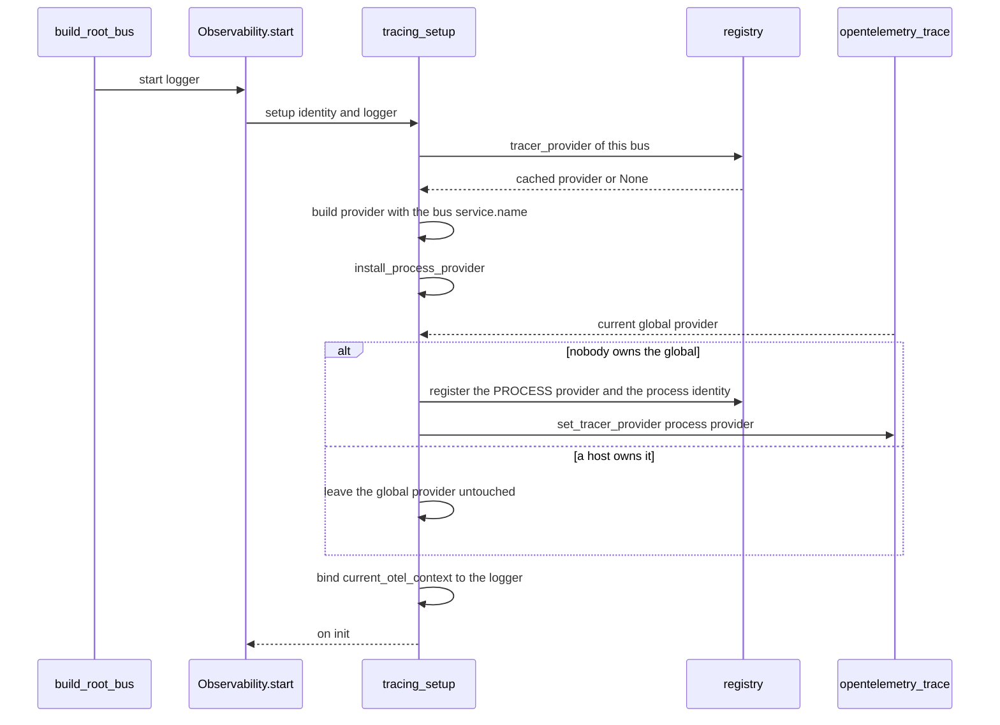
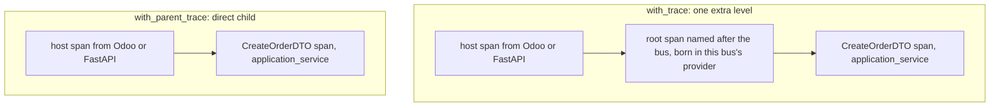
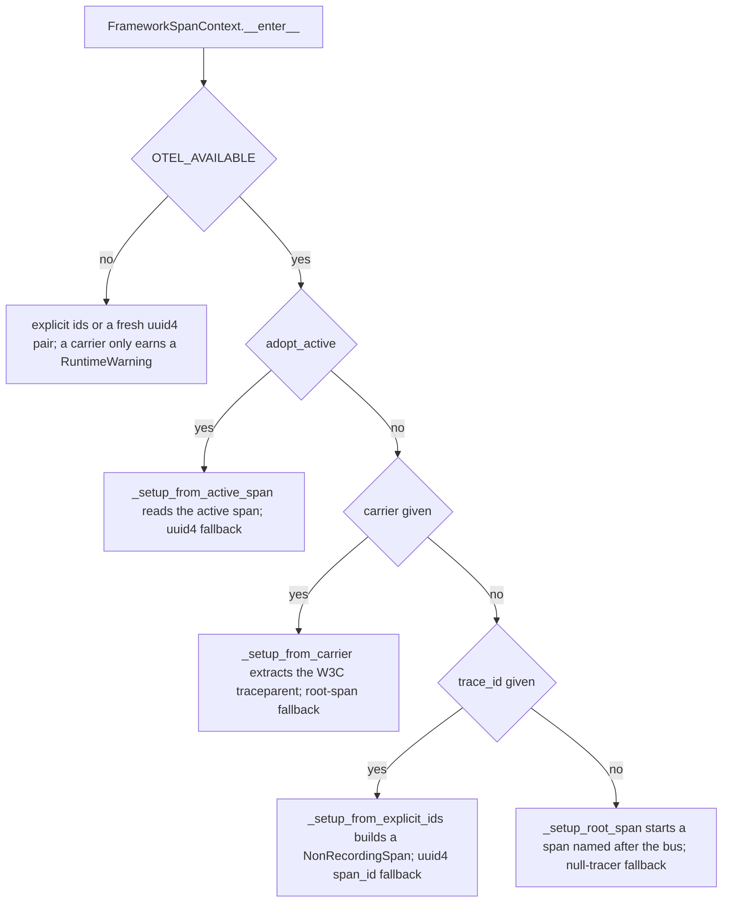

# Observability: tracing, log correlation and the process/provider model

Tracing is the first backend of the framework's observability package; its sibling is
[error reporting to GlitchTip](/openwiki/integrations/observability-errors.md). It lives under
`sincpro_framework/observability/tracing/` and is reached only through the package's two public
objects (`sincpro_framework/observability/__init__.py:1-14`, `:29-42`):

| Door | Object | Who it is | Lifetime |
|---|---|---|---|
| Per bus | `Observability` | one bounded context — `artifact:version:bus` | one per `UseFramework` |
| Per process | `process` (`ProcessObservability`) | the transport around the buses — `artifact:version`, no bus | one module-level singleton |

`use_bus.py` and `bus.py` talk only to `Observability`; the rest of the framework never imports
`opentelemetry`, `sentry_sdk`, or anything under `observability.errors` /
`observability.tracing` (`sincpro_framework/observability/api.py:1-14`,
`sincpro_framework/observability/tracing/__init__.py:1`).

The service-name segment is what makes the split worth having. A span inside `UseFramework("sales_mcp")`
of deployment `sincpro-odoo-mcp:0.8.0` reports `service.name=sincpro-odoo-mcp:0.8.0:sales_mcp`; an
ASGI request or an httpx call in that same process reports `service.name=sincpro-odoo-mcp:0.8.0`.
They share a `trace_id` because OpenTelemetry propagates through `contextvars`, not because they
share a `Resource` (`README.md:1107-1119`).

## The invariant that makes this safe to change

Observability is never allowed to change what the bus does, and it is never required:

- **Nothing here raises and nothing here is required.** With neither extra installed every method
  is a no-op and the bus runs exactly as it would without observability
  (`sincpro_framework/observability/api.py:12-13`). A missing SDK, an unset endpoint, a broken
  provider or an exporter that explodes while closing a span all become a value the caller reads,
  never an exception it has to survive (`sincpro_framework/observability/tracing/setup.py:1-6`,
  `:131-165`).
- **Every failure is a `ComponentStatus`.** `off(reason)` / `on(reason)` / `failed(reason)` set
  `active`, `state` and `reason`; `failure_of` takes `str(exc).strip()` — or the class name when
  empty — and truncates it to 200 characters
  (`sincpro_framework/observability/domain.py:63-94`).
- **`_shielded` is the reason an exporter cannot swallow a business error.** It runs a block
  inside a context manager and catches failures on *enter* and on *exit*, but it re-raises the
  block's own exception and **ignores a suppressing `__exit__` on purpose**: "a failing exporter
  must never swallow a business error"
  (`sincpro_framework/observability/tracing/span_execution.py:9-37`). Its counterpart for the
  trace block is `_end_root_span`, which ends the span inside its own `try/except` and always lets
  `__exit__` return `False` (`sincpro_framework/observability/tracing/span_context.py:98-136`).

## Identity: who is emitting

`ObservabilityIdentity` is a frozen Pydantic model — two backends read it and neither may rewrite
what the other reports (`sincpro_framework/observability/domain.py:27-34`). Its `service_name` is
`artifact:version:bus` with empty segments omitted, and values travel **verbatim**: rewriting `-`
to `_` used to mangle both the distribution name to search for and the version itself
(`18.5.0-rc2` became `18.5.0_rc2`) (`:36-49`).

`release` (the GlitchTip half, documented on
[the errors page](/openwiki/integrations/observability-errors.md#the-release-rule)) drops the bus;
`service_name` keeps it, so two buses of one deployment stay distinguishable in Tempo
(`:51-60`).

`resolve_identity` (`:216-247`) walks its sources lazily and the first one that names an artifact
wins:

1. what the caller declared explicitly (`package=`, `version=` on `UseFramework`) — an escape
   hatch, rarely used;
2. the library that built the bus, by the module → distribution `_` → `-` convention (~0.7 ms);
3. the deployment: `APP_RELEASE` verbatim, named by `OTEL_SERVICE_NAME` only when `APP_RELEASE`
   is absent;
4. a distribution whose import name differs from its package name — the
   `packages_distributions()` scan, ~200 ms, cached for the life of the process.

A source contributes its artifact **and its own version**, never one paired with another source's
(`:225-227`). The sources are a generator on purpose, so the expensive scan is not paid before an
earlier source answers (`:205-213`). The caller's module is captured at `UseFramework`
construction, while the stack still holds the library that is building the bus; read later, from a
request, it would name Odoo instead (`sincpro_framework/observability/api.py:52-54`,
`sincpro_framework/observability/domain.py:147-165`). The identity itself is resolved once, lazily,
on first use, because the distribution lookup behind it is not free
(`sincpro_framework/observability/api.py:60-67`).

Configuration fields (`otlp_endpoint`, `otlp_traces_sample_rate`, `app_release`,
`otel_service_name`) are owned by
[configuration and settings](/openwiki/concepts/configuration.md#what-each-observability-field-changes);
this page documents only what tracing does with them.

## One TracerProvider per bus, and why a bus never takes the global one

Each bus gets its own `TracerProvider` so its spans carry its own `service.name` even when the host
application — Odoo, FastAPI, Celery — already registered a global provider of its own
(`sincpro_framework/observability/tracing/setup.py:1-6`):

- the `Resource` is built with `Resource.create({SERVICE_NAME: identity.service_name})`, which
  merges `OTEL_RESOURCE_ATTRIBUTES` and the SDK defaults (`telemetry.sdk.*`, tenant/env) that the
  bare constructor would drop (`:86-91`);
- the sampler is `ParentBased(root=_root_sampler(settings.otlp_traces_sample_rate))`, where
  `>= 1.0` is `ALWAYS_ON`, `<= 0.0` is `ALWAYS_OFF` and anything between is
  `TraceIdRatioBased(ratio)`; a decision already taken upstream always wins over this ratio
  (`:59-72`, `:90`);
- the exporter is a `BatchSpanProcessor(OTLPSpanExporter(endpoint=endpoint))` with the endpoint
  passed **explicitly**, because without that argument the SDK ignores the conf and falls back to
  its own env var or `localhost:4317`; the gRPC exporter is preferred and the HTTP one covers for
  it when only that extra is installed (`:75-95`).

Providers are not owned by the setup functions that build them. They live in the process-wide
`registry`, keyed by the bus that owns them, which is what makes a second `build_root_bus()` reuse
what the first one created and what lets a test reset everything with one call
(`sincpro_framework/observability/registry.py:1-6`, `:31-39`, `:47-50`).

`tracer_for(bus)` is the rule that keeps identities from leaking
(`sincpro_framework/observability/tracing/setup.py:168-187`):

1. the bus's own provider from the registry, if it has one;
2. otherwise the host's global provider — so a bus can ride on Odoo's OTel setup;
3. **unless** the framework itself owns that global provider for a *different* bus, in which case it
   returns `None`: "a span exported under another service's name is worse than no span at all".

A bus provider is therefore never installed globally, and the process door installs the only
globally registered one.



*Building a bus is what installs the process provider; a second bus of the same deployment reuses
it instead of opening another global one.*

## The process door and the `PROCESS` key

`PROCESS = "<process>"` is a reserved registry key: the provider that owns the process, not any
bounded context (`sincpro_framework/observability/registry.py:12-13`).

`install_process_provider(identity, endpoint)` (`tracing/setup.py:98-118`) is called from `setup()`
on every bus build (`:160`) and:

- returns `None` immediately when the current global provider is anything other than OTel's
  `ProxyTracerProvider` / `NoOpTracerProvider` — **a host that already owns the global is left
  alone**, which is the Odoo case: "inside Odoo there is nothing for us to install";
- otherwise builds (or reuses, under `PROCESS`) a provider whose identity is the bus's with
  `bus=""`, so its `service.name` has no bus segment, and calls
  `registry.register_process_identity(...)`;
- then registers it globally with `trace.set_tracer_provider(provider)`.

Because the second bus finds a real global provider already in place, three buses of one deployment
open exactly one process provider and do not fight over it.

`process` is the second door (`sincpro_framework/observability/api.py:139-209`) and offers the
transport exactly four things:

```python
from sincpro_framework.observability import process

process.identity                     # artifact:version, no bus segment
process.status                       # on:installed | on:host | off:...
process.tracer("opentelemetry.instrumentation.asgi")   # the global tracer, or None
process.bind_logger(access_log)      # this logger now stamps the request's trace_id
process.trace_ids()                  # the same ids, for a structlog processor
process.record_error(error, "asgi")  # a 500 that dies before any Feature runs
```

`process.identity` prefers the identity a bus already announced in the registry, so the transport
and the buses of one deployment never disagree about the version that is running; without an
announcement it resolves from the caller and forces `bus=""`
(`sincpro_framework/observability/api.py:142-153`, `registry.py:24-29`). `process.tracer(name)`
returns the **global** tracer — what `OpenTelemetryMiddleware` and
`HTTPXClientInstrumentor` ask for — and `None` instead of raising when opentelemetry is not
installed, so a caller can skip instrumenting without guarding the import itself (`:171-182`).
`process.record_error` passes no span and `kind="instance"`, which is why a transport event carries
no `sincpro.instance` tag ([errors page](/openwiki/integrations/observability-errors.md#the-transport-case-process-errors)).

## One span per DTO execution

`Observability.span(dto_name, layer)` (`api.py:97-99`) forwards to `span_execution`, and the two
sub-buses call it around every execution: `layer="feature"` in `FeatureBus.execute`
(`sincpro_framework/bus.py:47`) and `layer="application_service"` in
`ApplicationServiceBus.execute` (`:103`). `FrameworkBus.execute` opens no span of its own — it
routes and reports framework-kind errors (`:164-205`).

`span_execution` (`tracing/span_execution.py:70-76`) is two nested shields around the body:

```python
with _shielded(_span_for(dto_name, layer, bus)) as span:
    with _shielded(_log_ids_of(span, logger)):
        yield span
```

- `_span_for` returns `nullcontext()` when OTel is absent, when `tracer_for(bus)` returns `None`,
  or when anything raises. Otherwise it starts a span named after the DTO class, as the current
  span, with `{"sincpro.layer": layer}` and — only when the bus name is non-empty —
  `sincpro.instance: bus` (`:40-52`). "Feature" versus "application_service" is therefore derivable
  from the span, and an `ApplicationService` that delegates to a Feature produces a parent/child
  pair.
- `_log_ids_of` binds that span's ids to the shared logger with
  `logger.context(trace_id=…, span_id=…)`, formatted `032x` / `016x`
  (`:55-67`). This is what puts a `trace_id` on the log lines of a bare `framework(dto)` call,
  which never enters a trace block — see
  [context propagation](/openwiki/concepts/context-propagation.md#trace-ids-logs-and-error-paths).

`span_error` is the tracing half of failure reporting and is deliberately the only thing it does:
`span.record_exception(error)` plus `set_status(StatusCode.ERROR, str(error))`, guarded by
`OTEL_AVAILABLE` and a non-`None` span, never raising and never touching GlitchTip
(`sincpro_framework/observability/tracing/span_error.py:1-16`).
`Observability.record_error` calls it first and then forwards to the errors backend, so a bus
failure lands on the span *and* in GlitchTip (`api.py:101-118`).

## `with_trace()` and `with_parent_trace()`

Both are thin wrappers that build the root bus lazily and hand the work to
`Observability.trace_context` (`sincpro_framework/use_bus.py:272-320`, `:322-357`,
`sincpro_framework/observability/api.py:120-136`), which constructs a `FrameworkSpanContext`. The
objects differ in exactly one flag, and that flag changes the shape of the trace:



*`with_trace()` adds a root span named after the bounded context; `with_parent_trace()` adds none.*

`__enter__` (`tracing/span_context.py:55-80`) resolves the ids, binds them to the **shared**
`LoggerProxy` (so `FrameworkBus`, `FeatureBus` and `ApplicationServiceBus` all report them without
any propagation step), then enters a `FrameworkContext` carrying exactly
`{"trace_id": …, "span_id": …}` so a handler can read `self.context.get("trace_id")` without
importing anything. If the logger refuses, the OTel context already attached is cleaned up before
re-raising — otherwise it would leak into the next request on that worker thread (`:64-96`).
`__exit__` ends the root span (marking it `StatusCode.ERROR` with the exception text when one is in
flight), detaches the token even if ending the span blew up, exits the logger context and the
framework context, and **returns `False`** — it never suppresses (`:98-136`).

The resolution order inside `_setup_trace_context` is fixed
(`tracing/span_context.py:142-166`):



- **Active-span adoption** (`adopt_active=True`, set only by `with_parent_trace`) reads
  `get_current_span().get_span_context()` and returns its hex ids. It creates no span and attaches
  no context, so the bus's DTO spans become **direct children** of whatever the host had active —
  the Odoo WSGI middleware, a FastAPI middleware, a Celery task decorator. When no valid span is
  active it returns two fresh UUIDs, so log correlation still works (`:168-186`, `:345-346`).
- **W3C carrier** extracts with `TraceContextTextMapPropagator().extract(carrier=…)` and, when the
  extracted span context is valid, attaches the context and returns its ids; an extraction that
  yields nothing falls back to the root-span path (`:188-203`). This is the path JSON-RPC uses for
  an incoming `traceparent` header
  ([entrypoint rpc](/openwiki/integrations/entrypoint-rpc.md)).
- **Explicit ids** build a remote `NonRecordingSpan` with `TraceFlags.SAMPLED` from
  `int(trace_id, 16)` / `int(span_id, 16)` and attach it. A `ValueError` (plain UUIDs from
  `sincpro_log`, say) skips only the OTel attachment: the provided strings are still returned for
  log correlation, and a missing `span_id` becomes a `uuid4()` (`:205-227`).
- **Root span** uses `tracer_for(self._identity.bus)` — so the root span and its children report the
  same identity even when the host registered OTel first — starts a span named after the bus,
  attaches it and returns its ids (`:229-257`).
- **Without OTel at all**, ids are `trace_id or uuid4()` / `span_id or uuid4()`, and passing a
  `carrier` emits a `RuntimeWarning` naming the missing extra, because the carrier is silently
  ignored (`:144-155`).

Every path that cannot get a valid OTel span context falls back to UUID-based log correlation, so
`trace_id` is always present on the lines of the block; whether it is a 32-hex OTel id or a 36-char
UUID is what tells you which branch ran.

## The status probe: verifying configuration without a backend

Both doors answer with the same `ComponentStatus(active, state, reason)` model
(`sincpro_framework/observability/domain.py:63-68`), so configuration can be checked from a boot log
or a REPL with no collector running.

`framework.observability.status.otel` is whatever `tracing.setup` returned
(`tracing/setup.py:131-165`); before `start()` runs it is the field default
`off:not_built` (`api.py:56`, `domain.py:63-68`):

| state | reason | Means | Source |
|---|---|---|---|
| `off` | `not_built` | `start()` has not run yet | `api.py:56`, `domain.py:63-68` |
| `off` | `sdk_missing` | `import opentelemetry.sdk.trace` failed | `setup.py:135-138` |
| `off` | `no_endpoint` | no endpoint **and** no real global provider, so transport spans would be no-ops | `setup.py:142-149` |
| `on` | `host` | no endpoint, but the host owns a real provider; the bus rides on it and the logger is still bound | `setup.py:144-148` |
| `on` | `init` | this bus's provider is up (built or reused), the process provider is installed, the logger bound | `setup.py:151-163` |
| `failed` | `exporter_missing` | an endpoint is configured but neither the gRPC nor the HTTP exporter can be imported | `setup.py:154-157`, `:81-84` |
| `failed` | exception text | anything else raised while building; truncated to 200 characters | `setup.py:164-165`, `domain.py:90-94` |

`failed` is the only state that is a real misconfiguration rather than a legitimate deployment;
`off` is not an error.

`process.status` answers a different question — **who owns the global provider transport
instrumentation will find** (`api.py:155-169`):

| state | reason | Means |
|---|---|---|
| `off` | `sdk_missing` | `OTEL_AVAILABLE` is `False` |
| `on` | `installed` | this framework put the process provider in the global slot (registry under `PROCESS`) |
| `on` | `host` | someone got there first — Odoo, or an operator's auto-instrumentation |
| `off` | `no_endpoint` | nothing is registered, so transport spans would be no-ops |

The checks are ordered: the `PROCESS` registry entry is consulted before the global provider, which
is what makes `on:installed` stable for the lifetime of the process.

`Observability.start(logger)` returns the full `ObservabilityStatus` and emits one line to the
instance logger — `observability sentry=<state>:<reason> otel=<state>:<reason>` — at **warning**
level when either backend is `failed`, at info otherwise, swallowing a logger that raises
(`api.py:69-87`). It is called from `build_root_bus()` (`use_bus.py:150`), so in a service the log
line appears at boot, before the first request.

## Operations: what a service's boot does

The two doors exist for the parts the framework cannot know on its own. In a service that serves
HTTP, the order matters: **building a bus is what installs the process provider**, which the ASGI
middleware needs before it opens its first span (`README.md:1121-1138`).

```python
from sincpro_framework.observability import process

def main() -> None:
    for bus in ALL_BUSES:
        bus.build_root_bus()          # installs the process provider, binds each bus's provider

    process.bind_logger(access_log)   # access log lines now carry the request's trace_id
    logger.info("otel proceso=%s:%s", process.status.state, process.status.reason)

    serve(middleware=[Middleware(OpenTelemetryMiddleware), Middleware(JsonAccessLog)])
```

Per request, the transport starts its own span with `process.tracer(...)` and the bus either runs
under it with `framework.with_parent_trace()` (no extra level) or under a fresh
`framework.with_trace()` block. `process.bind_logger` and `process.trace_ids` read
`current_otel_context()` — `trace_id` / `span_id` of the active span, or `{}` outside one — and
`bind_logger` never raises: "a logger that does not support it simply keeps logging"
(`api.py:184-202`, `tracing/setup.py:33-46`).

## Boundaries and extension points

- **Never install a bus provider globally, and never let a bus borrow one.** The per-bus provider is
  what keeps `service.name` honest; the global slot belongs to the process identity or to the host
  (`tracing/setup.py:98-118`, `:168-187`).
- **`setup()` binds the logger even when it rides the host.** Returning `on("host")` without
  `_bind_log_ids` would leave every log line of an embedded bus without a `trace_id`
  (`tracing/setup.py:144-148`, `:121-128`).
- **New tracing entry points go through the two doors.** `Observability` is what the buses hold and
  what is re-assigned at build time (`use_bus.py:148`); `tracing/` and `errors/` are documented as
  implementation detail and are not re-exported (`observability/__init__.py:1-14`).
- **The extra is optional packaging.** `opentelemetry-api`, `-sdk` and both OTLP exporters are the
  `opentelemetry` extra (`pyproject.toml:30-45`); without it `OTEL_AVAILABLE` is `False`
  (`tracing/setup.py:23-28`), `_span_for` returns a `nullcontext` and `tracer_for` is not reached,
  so a Feature result is unchanged (`tracing/span_execution.py:40-52`).
- **Sampling is not a per-span decision.** It is decided once per provider at build time and wrapped
  in `ParentBased`, so the only way to change how much of a bus's own traffic is recorded is
  `otlp_traces_sample_rate` / `OTEL_TRACES_SAMPLER_ARG` before the bus is built
  (`tracing/setup.py:59-72`, `:86-90`;
  [configuration](/openwiki/concepts/configuration.md#what-each-observability-field-changes)).
- **Rebuilds are free but not re-configuring.** A second `build_root_bus()` reuses the provider in the
  registry (`tracing/setup.py:152-158`), and `registry.reset()` is the only supported way to clear
  providers, error clients and the announced process identity (`registry.py:47-50`). One
  `Observability` object is shared by the three buses of a framework and identity is resolved once
  (`use_bus.py:148`, `tests/observability/test_bus_wiring.py:46-110`).

### What pins this behaviour

The contract above is pinned by the tracing and process test modules: the status outcomes, the
"host provider is never replaced" rule, the `PROCESS` versus bus provider separation, the process
`service.name` without a bus segment, provider reuse, the `tracer_for` fallback and refusal rules,
sampling, and the exploding-`SpanProcessor` cases that prove a broken exporter neither breaks an
execution nor swallows a real error
(`tests/observability/tracing/test_provider_contract.py:96-166`, `:175-323`, `:364-398`,
`:405-524`); the four `FrameworkSpanContext` resolution paths, root-span-versus-direct-child
hierarchy, `sincpro.layer` / `sincpro.instance`, the carrier warning and the logger getter
(`tests/observability/tracing/test_tracing.py:180-358`, `:508-614`, `:622-732`); the process door
end to end, including one trace with two `service.name`s and the process release
(`tests/observability/test_process.py:62-357`). This repository's documentation instructions exclude
`tests/` from the wiki's content, so these are pointers for a maintainer, not restated behaviour.

## Related pages

- [Observability: error reporting](/openwiki/integrations/observability-errors.md) — the other
  backend, the release rule and the transport error path.
- [Configuration and settings](/openwiki/concepts/configuration.md) — `otlp_endpoint`,
  `otlp_traces_sample_rate`, `app_release` and how they are read.
- [Context propagation](/openwiki/concepts/context-propagation.md) — how `with_trace()` publishes
  `trace_id`/`span_id` into `self.context`, and how a bare call still gets log ids.
- [Bus execution](/openwiki/architecture/bus-execution.md) — where the two `span()` call sites sit in
  the routing.
- [Building a bounded context](/openwiki/workflows/building-a-bounded-context.md) — what a bounded
  context owns, including its service name.
- `README.md:902-1164` — the user-facing tracing walkthrough.
