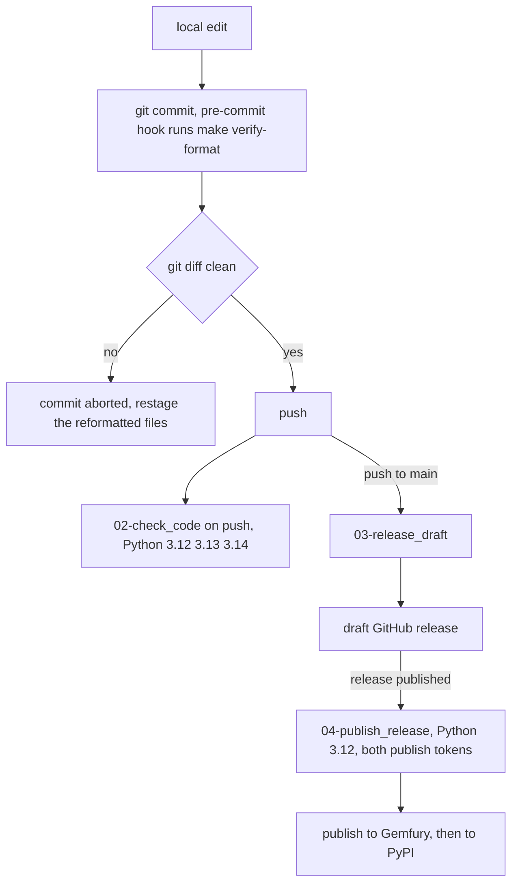

# Build, test and release

`sincpro-framework` ships as **one Poetry package** and has no executable of its own; everything a
maintainer runs locally goes through the `Makefile`. This page describes the commands, the gates and
what each gate fails on. It does **not** restate the user-facing walkthrough (the README owns it,
`README.md:1264-1286`) nor the design rationale, which stays in
[`docs/architecture/ARCHITECTURE.md`](../../docs/architecture/ARCHITECTURE.md) — the authoritative
design document. The contents of `tests/` are out of scope here, except where a test is itself a gate
(the `typing_cases` harness below).

## What the package is

`pyproject.toml` declares a single `poetry-core` package named `sincpro-framework`
(`pyproject.toml:1-8`, `:69-71`):

| Field | Value |
| --- | --- |
| `name` / `version` | `sincpro-framework` / `4.0.0` (`pyproject.toml:2-3`) |
| `packages` | `[{include = "sincpro_framework"}]` (`pyproject.toml:7`) |
| build backend | `poetry.core.masonry.api` (`pyproject.toml:69-71`) |
| extra index | source `fury` = `https://pypi.fury.io/sincpro/`, priority `supplemental` (`pyproject.toml:10-13`) |

`poetry.toml` forces an **in-project** virtualenv (`[virtualenvs] create = true, in-project = true`,
`poetry.toml:1-3`), and the pyright configuration points at exactly that directory
(`venvPath = "."`, `venv = ".venv"`, `pyproject.toml:76-80`) — so a fresh clone resolves types against
the `.venv` Poetry created rather than an ambient interpreter.

### Required dependencies

Four runtime dependencies are unconditional (`pyproject.toml:24-29`): `dependency-injector ^4.49.1`
(the `FrameworkContainer` in `sincpro_framework/ioc.py:15`), `pydantic ^2.13.5` (`DataTransferObject`
subclasses `BaseModel`, `sincpro_framework/sincpro_abstractions.py:5`; configuration models in
`sincpro_framework/sincpro_conf.py:8`), `pyyaml >=6.0.1`, and `sincpro-log ^1.2.1`
(`sincpro_framework/sincpro_logger.py:3`). The declared interpreter range is `python = "^3.12"`
(`pyproject.toml:25`).

There is no committed `poetry.lock` in the tree (its `.gitignore` entry is commented out,
`.gitignore:97-102`), so the constraint *shape* is what governs a build: `dependency-injector` and
`pydantic` use caret ranges, `pyyaml` and `sincpro-log` use lower bounds, and the extras use `>=`
ranges (`pyproject.toml:24-37`). Most of the final resolution is decided at install time rather than by
this repository, and a consumer's resolved set can differ from the one CI tested.

### Optional extras and what each one enables

The extras are declared at `pyproject.toml:39-48`, and each one backs a feature that is otherwise
absent rather than degraded — the host code imports the optional library lazily and raises a message
naming the extra:

| Extra | Dependencies it pulls (`pyproject.toml:30-37`, `:39-48`) | What it enables | Missing-extra behaviour |
| --- | --- | --- | --- |
| `opentelemetry` | `opentelemetry-api`, `opentelemetry-sdk`, `opentelemetry-exporter-otlp-proto-grpc`, `opentelemetry-exporter-otlp-proto-http` | per-DTO spans plus OTLP export; the gRPC exporter is tried first and the HTTP one is the fallback (`sincpro_framework/observability/tracing/setup.py:81-84`). Trace ids on log lines need no extra at all (`README.md:908-916`) | status `off("sdk_missing")` / `off("no_endpoint")`, the bus keeps working (`sincpro_framework/observability/tracing/setup.py:135-149`) |
| `sentry` | `sentry-sdk` | an isolated GlitchTip/Sentry client per release (`sincpro_framework/observability/errors/setup.py:44-69`) — never `sentry_sdk.init()` | status `off("sdk_missing")` / `off("dsn_missing")` (`sincpro_framework/observability/errors/setup.py:72-81`) |
| `mcp` | `fastmcp >=3.0,<4` | publishing the bus as MCP tools (`Entrypoint.server` / `build_mcp_server`) | `ImportError` carrying `FASTMCP_MISSING` = "Install with: pip install sincpro-framework[mcp]" (`sincpro_framework/entrypoints/mcp/mcp.py:10`, `sincpro_framework/entrypoints/mcp/entrypoint.py:49-52`) |
| `rpc` | `starlette`, `uvicorn` | the JSON-RPC 2.0 ASGI app plus OpenRPC discovery (`RpcGateway.app`, `sincpro_framework/entrypoints/rpc/entrypoint.py:116-153`) and `run()` on uvicorn (`:155-161`) | `ImportError` carrying `RPC_MISSING` = "Install with: pip install sincpro-framework[rpc]" (`sincpro_framework/entrypoints/rpc/entrypoint.py:21-23`) |

So the core is dependency-injector + pydantic + pyyaml + sincpro-log; observability and the two
entrypoint hosts are optional installs, and the framework's own docstring states the intent that it
"works unchanged when neither is installed" (`sincpro_framework/observability/__init__.py:11-13`).

The dev dependency group (`pyproject.toml:50-66`) is what a maintainer actually gets from
`poetry install`: the toolchain (`black`, `isort`, `autoflake`, `pytest`, `pytest-cov`, `pyright`,
`mypy`, `ipython`, `jupyterlab`, `nbconvert`) **and** the observability SDKs
(`opentelemetry-api`/`-sdk`/both exporters, `sentry-sdk`, `pyproject.toml:62-66`) even though those
are optional extras for consumers — so the local suite can exercise the optional paths without
installing an extra.

### Interpreter facts as recorded in the source

`pyproject.toml:15-23` carries the interpreter note verbatim, and `sincpro_framework/ioc.py:7-14`
repeats the dependency half of it:

- The comment states a hands-on verification on 3.14.7 / 3.14.7t that every declared dependency
  installs cleanly on regular (GIL) 3.14 with **no code changes**, full test suite green.
- On a free-threaded `python3.14t` interpreter, `dependency-injector` (core, required — see
  `ioc.py`) and `grpcio` (transitive dependency of `opentelemetry-exporter-otlp-proto-grpc`, only if
  that extra's gRPC exporter is used) have **no free-threaded wheel**, so importing them makes CPython
  print a `RuntimeWarning` about re-enabling the GIL and silently re-enable it for the process.
- The comment is explicit that free-threading "is not implemented/targeted in this codebase yet" and
  that this is a dependency-ecosystem gap, not something to work around here.

Record these as the repository states them; they are status notes, not a support guarantee. CI only
runs GIL builds (see [CI and release workflows](#ci-and-release-workflows)), and the deeper
concurrency consequences are owned by
[concurrency and context hand-off](/openwiki/architecture/concurrency-and-context-handoff.md).

## The Makefile as the single entry point

`Makefile` is the operational API of this repository, and the README states the intent behind it: "CI
calls the same targets you run locally" (`README.md:1264-1266`). Targets, in the order a maintainer
meets them:

| Target | Runs | Fails when |
| --- | --- | --- |
| `make init` | `prepare-environment` + `install` (`Makefile:41`) | either dependency fails, i.e. pipx/poetry unavailable or `poetry install` cannot resolve |
| `make prepare-environment` | `pipx install poetry black autoflake isort pyright pre-commit`, `pipx ensurepath`, `pre-commit install` (`Makefile:27-36`) | pipx is missing, or the directory is not a git checkout (`pre-commit install`) |
| `make install` | `add-gemfury-repo` then `poetry install` (`Makefile:38-39`) | `poetry config` fails, or resolution/installation against the configured indexes fails |
| `make format-yaml` | `prettier --write "**/*.yml" "**/*.yaml"`, then `yamllint` (`Makefile:69-81`) | yamllint reports a violation in the two linted paths |
| `make format-python` | `autoflake --in-place … -r sincpro_framework`, same for `tests`, then `isort` and `black` on both, then it recurses into `make format-yaml` (`Makefile:83-90`) | a file cannot be parsed/reformatted |
| `make format` | `format-python` + `format-yaml` (`Makefile:92`) | as above (YAML is formatted/linted twice, because `format-python` recurses) |
| `make lint` | `poetry run pyright sincpro_framework`, then `poetry run pyright tests` (`Makefile:103-113`) | pyright reports any issue |
| `make verify-format` | `format` + `lint`, then a clean-tree check (`Makefile:94-100`) | formatting changed a tracked file, or pyright failed |
| `make test` | `poetry run pytest tests --cov --cov-fail-under=$(COVERAGE_MIN) --cov-report=term-missing --cov-report=xml` (`Makefile:16-17`, `:135-136`) | a test fails or total coverage is under `COVERAGE_MIN` |
| `make test_one t=<path>` | `poetry run pytest ${t} -vvs` — one file or node id, verbose, no coverage (`Makefile:152-153`) | that selection fails |
| `make test_debug` | `poetry run pytest -vvs tests` (`Makefile:149-150`) | — |
| `make test-coverage` / `test-coverage-open` | `test`, then `coverage html` (`Makefile:138-147`) | as `test` |
| `make clean-coverage` | removes `htmlcov`, `coverage.xml`, `.coverage*` (`Makefile:155-156`) | — |
| `make build` | `configure-gemfury`, then `poetry build` (`Makefile:120-121`) | credentials/index configuration fails |
| `make update-version VERSION=…` | `poetry version $(VERSION)` (`Makefile:123-129`) | `VERSION` is not set — the target raises `VERSION is required. Usage: make update-version VERSION=1.2.3` |
| `make publish` | `configure-gemfury`, `poetry publish -r fury --build`, `poetry publish -u __token__ -p $(POETRY_PYPI_TOKEN)` (`Makefile:131-133`) | either upload fails |
| `make docs` / `docs-init` / `docs-view` | OpenWiki through `npx` (`Makefile:60-67`) | `check-openwiki` fails |
| `make ipython`, `make clean-pyc` | a REPL in the project venv; delete `__pycache__`/`*.pyc` (`Makefile:43-44`, `:116-118`) | — |

Two smaller conventions matter when editing the file: the credential-bearing helper
`configure-gemfury` is marked `.SILENT:` (`Makefile:19`, `:21-25`) so the token-bearing command line is
not echoed, and recipes that need to print their own diagnostic (or must not abort on a non-zero
sub-command) prefix it with `@` — `check-openwiki`, `format-yaml`, `verify-format` and `lint` do, while
the plain command wrappers do not. The `.PHONY` list at `Makefile:158-159` names `start`, `clean` and
`format-all` — targets that do not exist — and omits several real ones, including `lint`,
`verify-format`, `test_one`, `update-version` and `publish`; harmless today (no same-named files
exist) but worth fixing when touching the file.

## Formatting and the pre-commit gate

`.pre-commit-config.yaml` installs exactly one hook, a **local** hook whose `entry` is
`make verify-format` with `language: system`, `pass_filenames: false` and `always_run: true`
(`.pre-commit-config.yaml:1-9`). `make init` registers it (`Makefile:36`).

The hook's semantics are deliberately "reformat, then refuse": `verify-format` depends on
`format lint`, so it *is* the formatter, and afterwards it runs `git diff --quiet` and aborts the
commit listing the files it just changed (`Makefile:94-100`). A commit therefore only passes once the
reformatted files have been staged — the gate cannot be satisfied by leaving the working tree alone.
The failure message of that check is in Spanish (`Makefile:96`), the one Spanish string on an otherwise
English-facing build path (`.yamllint`'s rule comments are also Spanish, `.yamllint:2-3`, `:13`), so an
operator grepping for the English wording will not find it.

`format-yaml` is asymmetric on purpose: prettier rewrites **every** `*.yml`/`*.yaml` in the repository,
while yamllint lints only `sincpro_framework/conf/*.yml tests/config/resources/*.yml`
(`Makefile:69-81`). `.prettierignore` keeps the generated documentation out of the rewrite
(`openwiki/`, `AGENTS.md`, `CLAUDE.md`, `.github/workflows/openwiki-update.yml`,
`.prettierignore:1-13`), so a format run never dirties agent-owned files. `.yamllint` extends the
default ruleset and relaxes only `line-length` (max 100, level *warning*) plus a few compatibility
switches; `trailing-spaces`, `truthy` and 2-space `indentation` stay enabled
(`.yamllint:5-27`).

Python formatting is `autoflake` (in place, dropping unused variables and imports, keeping
`__init__.py` imports) then `isort` then `black` (`Makefile:83-89`), with `line-length = 94` in
`[tool.black]` (`pyproject.toml:73-74`) — the same limit the project's contributor notes repeat
(`.github/copilot-instructions.md:12-16`).

## Type-check gates

`pyright` is the only type checker wired into any gate:

- `make lint` runs it over `sincpro_framework` and then over `tests` (`Makefile:103-113`), so test
  code is type-checked too.
- `[tool.pyright]` sets `venvPath = "."` / `venv = ".venv"` (matching `poetry.toml`) and downgrades
  two diagnostics to `none`: `reportInvalidTypeVarUse` and `reportInvalidTypeForm`
  (`pyproject.toml:76-80`).
- `mypy` is declared as a dev dependency (`pyproject.toml:59`) but **no Makefile target or workflow
  step invokes it**; do not treat a passing mypy run — or its absence — as part of the pipeline.

Static typing examples are enforced by a test that shells out to pyright: `_run_pyright` prefers a
`pyright` binary found on `PATH`, else falls back to `poetry run pyright`, and **skips** the test when
neither executable exists (`tests/typing_and_linter/test_typing_and_linter.py:12-29`). The test runs
that command over `tests/typing_and_linter/typing_cases` with the repository root as the working
directory (`:27`, `:31-36`) and asserts a zero exit code, dumping pyright's stdout/stderr on failure
(`:38-41`). The consequence for an operator: inside `poetry install`-ed environments the gate is real,
but on a machine without pyright it degrades to a skip instead of a failure, so it is the Makefile's
`lint` target — not this test — that is the binding gate. What the case files contain is deliberately
not documented here; see
[dependency injection and typing](/openwiki/concepts/dependency-injection-and-typing.md) for the
contract they exercise.

## Tests and coverage

`make test` is the coverage gate (`Makefile:16-17`, `:135-136`):

```bash
make test                          # pytest + coverage; fails under COVERAGE_MIN
make test COVERAGE_MIN=80          # one-off, higher floor
make test_one t=tests/test_async_bus.py
make test-coverage                 # + htmlcov/index.html
make clean-coverage
```

`COVERAGE_MIN ?= 85` and `COVERAGE_ARGS = --cov --cov-fail-under=$(COVERAGE_MIN)`
(`Makefile:16-17`), so the floor is a Make variable that a local run and an organisation workflow can
both bind, per invocation. Note the drift between the two places that state it: the README still says
"65% by default" (`README.md:1276-1282`) while the Makefile pins **85**, and the Makefile is what
executes.

What the coverage run measures is declared in `pyproject.toml`, not on the command line:

| Setting | Value | Line |
| --- | --- | --- |
| `[tool.coverage.run] source` | `["sincpro_framework"]` — the package only | `pyproject.toml:85-87` |
| `[tool.coverage.run] branch` | `true` | `pyproject.toml:87` |
| `[tool.coverage.report]` | `show_missing`, `skip_empty`, and `exclude_also` for `TYPE_CHECKING`, `raise NotImplementedError`, `abstractmethod`, `overload` and `__main__` guards | `pyproject.toml:89-98` |
| HTML / XML output | `htmlcov/` and `coverage.xml` | `pyproject.toml:100-104` |

Pytest's default selection is `testpaths = ["tests"]` (`pyproject.toml:82-83`), and `make test` passes
`tests` explicitly. All generated artifacts (`.coverage`, `coverage.xml`, `htmlcov/`) are git-ignored
(`.gitignore:39-47`), and `make clean-coverage` removes them (`Makefile:155-156`).

## Build, version and publish

The release path is three Makefile targets plus one configuration helper:

1. `make update-version VERSION=1.2.3` runs `poetry version $(VERSION)` and refuses to run without the
   variable (`Makefile:123-129`) — the version lives in `pyproject.toml` and is what publishing uses.
2. `make build` depends on `configure-gemfury` and then runs `poetry build` (`Makefile:120-121`).
3. `make publish` depends on `configure-gemfury` and uploads twice in one run: first
   `poetry publish -r fury --build` (builds and pushes to Gemfury) and then
   `poetry publish -u __token__ -p $(POETRY_PYPI_TOKEN)` (pushes the already-built artifacts to PyPI
   as `__token__`) — `Makefile:131-133`.

Credentials come from Make variables with placeholder defaults, so a misconfigured run fails at upload
rather than silently succeeding: `GEMFURY_PUSH_TOKEN ?= DEFAULT_TOKEN` and
`POETRY_PYPI_TOKEN ?= DEFAULT_TOKEN` (`Makefile:1-2`).
`add-gemfury-repo` registers the repository `fury` → `https://pypi.fury.io/sincpro/`, and
`configure-gemfury` sets its `http-basic` credentials to the token with the password `NOPASS`
(`Makefile:21-25`); the same URL is the supplemental index in `pyproject.toml:10-13`. Never put real
tokens in the Makefile — CI injects them from secrets (below).

## CI and release workflows

The workflows in this repository are thin callers of reusable workflows hosted in
`Sincpro-SRL/.github` (branch `main`), inheriting secrets rather than re-declaring steps:



The release lifecycle from commit to PyPI: the local pre-commit gate, the push-triggered validation matrix, the draft release, and the publish workflow.

| Workflow | Trigger | Delegates with | Notes |
| --- | --- | --- | --- |
| `02-check_code.yaml` | `on: push` (`:4`) | `environments: '["3.12", "3.13", "3.14"]'` (`:13-14`) | declares a workflow-level `GEMFURY_PUSH_TOKEN` env from secrets (`:6-7`); the multi-version matrix is why the interpreter facts above matter |
| `04-publish_release.yml` | `on: release: types: [published]` (`:3-5`) | `environments: '["3.12"]'` (`:16`) | declares `GEMFURY_PUSH_TOKEN` and `POETRY_PYPI_TOKEN` env from secrets (`:7-9`) — the same two variable names the Makefile reads (`Makefile:1-2`) |
| `03-release_draft.yaml` | `on: push: branches: [main]` (`:3-6`) | `environments: '["3.12"]'` (`:13`) | produces the draft release that, once published, triggers the upload |
| `01-add_label_to_pr.yaml` | `on: pull_request: types: [opened, reopened, synchronize]` (`:3-6`) | inherits secrets only | label automation, no build step |
| `05-discord_notify.yaml` | PR `closed` on `main`/`release/**`, or `release: published` (`:3-11`) | inherits secrets only | notification only |

Two things to keep straight when reading these files. Each caller references the org workflow by
filename plus `@main`, and the one name mismatch is that the local `04-publish_release.yml` delegates to
the reusable `04-publish_release.yaml` (`04-publish_release.yml:13`) — the `.yml`/`.yaml` split between
local callers and org workflows is real, not a typo. And because every job body is just `uses: …` with
`secrets: inherit`, this repository declares only the *inputs* to those workflows (`environments`) and
the token *names* as workflow-level `env`; the steps that actually build and publish live in
`Sincpro-SRL/.github`, so what this repository can be read for is the trigger, the Python version and
which secrets must exist — not the upload mechanics.

Note the asymmetry: validation runs on three Python versions while draft and publish run on 3.12 only
(`02-check_code.yaml:13-14` vs. `04-publish_release.yml:16`, `03-release_draft.yaml:13`).

`.github/actions/prepare-env/action.yml` is the local composite action that encapsulates the setup
contract: it takes an `environment` input (the Python version), installs it with
`actions/setup-python@v4`, and runs `make init` (`action.yml:9-18`). **No workflow in this repository
references it** — the workflows above delegate to the org's reusable workflows — so treat it as the
Sincpro-wide convention for how a job boots this project, not as a step that runs here today.

Documentation generation is a separate scheduled workflow, `openwiki-update.yml`
(`on: workflow_dispatch` and a daily cron, `openwiki-update.yml:3-6`); it is unrelated to building or
publishing the package. The equivalent local targets are `make docs*`, which are gated by
`make check-openwiki`: Node >= 22, `npx` present, and `OPENAI_COMPATIBLE_API_KEY` set (or stored in
`~/.openwiki/.env`), otherwise the target exits with a message explaining exactly which piece is
missing (`Makefile:46-58`). Provider, model and endpoint are pinned in the Makefile
(`OPENWIKI_VERSION ?= 0.5.1`, `OPENWIKI_PROVIDER`, `OPENWIKI_MODEL_ID`,
`OPENAI_COMPATIBLE_BASE_URL`, `Makefile:4-14`); the API key is the only value never versioned.

## What to watch when changing this area

- **The coverage floor is stated twice and only one statement executes.** If you raise or lower
  `COVERAGE_MIN` (`Makefile:16`), update the README's "65% by default" sentence (`README.md:1276`) in
  the same change; `COVERAGE_MIN` is a `?=` variable, so callers can also override it per run.
- **`make verify-format` mutates the tree.** Any new file must be formatter-clean before it is staged,
  and formatter configuration changes (`black` line length, `.yamllint` rules) reflow unrelated files
  on the next commit.
- **The typing gate is `make lint`, not the `typing_cases` test.** The test skips when no pyright
  executable is available (`tests/typing_and_linter/test_typing_and_linter.py:18-20`), so a green
  `pytest` run is not evidence that types check.
- **`make build` and `make publish` depend on `configure-gemfury`, and `make install` on
  `add-gemfury-repo`.** The `fury` source must be configured before Poetry resolves anything — the
  in-project `.venv` (`poetry.toml:1-3`) is created by that same `poetry install`.
- **The extras are the release surface's risk.** All four are optional for consumers, so a change that
  moves an import of `opentelemetry`, `sentry_sdk`, `fastmcp`, `starlette` or `uvicorn` out of a lazy
  import makes the extra effectively mandatory for everyone — and the local suite will not catch it,
  because the dev group installs the observability SDKs unconditionally
  (`pyproject.toml:50-66`).

## Related pages

- [Quickstart](/openwiki/quickstart.md) — the shortest path from a DTO to a registered bus, for the
  user-facing view of the package this page builds and ships.
- [Configuration and settings](/openwiki/concepts/configuration.md) — the `$ENV:` mechanism behind the
  runtime variables the extras read (`OTEL_EXPORTER_OTLP_ENDPOINT`, `SENTRY_PYTHON_DSN`, `APP_RELEASE`).
- [Concurrency and context hand-off](/openwiki/architecture/concurrency-and-context-handoff.md) — the
  consequences of the interpreter facts recorded above.
- [Maintaining and extending](/openwiki/operations/maintaining-and-extending.md) — the invariants and
  stub-sync rules a change to this package must respect.

