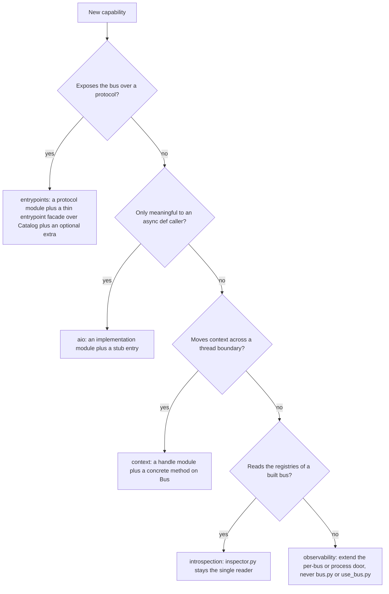

# Maintaining and extending: compatibility surface, invariants and open caveats

`sincpro-framework` is a library other repositories import — it has no entrypoint of its own and is
never deployed (`openwiki/INSTRUCTIONS.md:5-11`). That single fact is the root of everything on this
page: a change here is not a change to one application, it is a change to every SDK and service built
on top of it (`sincpro_payments_sdk`, `sincpro_siat_soap`, `sincpro_mcp_odoo` are the named
downstream readers, `openwiki/INSTRUCTIONS.md:9-11`).

**The authoritative design document is `docs/architecture/ARCHITECTURE.md`, not this page.** It owns
the component matrix, the pattern matrix and the design rationale
(`docs/architecture/ARCHITECTURE.md:18-31`, `:45-61`). This page owns only one question: *may I make
this change, and what does it break if I do?* Read it before editing internals. Where the
architecture doc differs, treat its API prose as intent and the code as current — it carries a stale
version footer and a stale dependency table ([architecture overview](/openwiki/architecture/overview.md)
records that discrepancy: `docs/architecture/ARCHITECTURE.md:889-890` is stamped v2.4.1 while
`pyproject.toml:2-3` declares `4.0.0`).

## The compatibility surface

`openwiki/INSTRUCTIONS.md:51-54` states the rule and the code confirms it: the public API is whatever
`sincpro_framework/__init__.py:12-22` exports.

| Exported name | Defined in | What a downstream SDK does with it |
| --- | --- | --- |
| `UseFramework` | `sincpro_framework/use_bus.py:19` | builds and invokes the bus |
| `Feature`, `ApplicationService` | `sincpro_framework/sincpro_abstractions.py:85`, `:141` | base classes for decorated use cases |
| `DataTransferObject` | `sincpro_framework/sincpro_abstractions.py:21` | input/response payloads |
| `Middleware` | `sincpro_framework/middleware.py:4` | the middleware protocol |
| `TypeDTO`, `TypeDTOResponse` | `sincpro_framework/sincpro_abstractions.py:12-13` | parameterizing `Feature`/`ApplicationService` |
| `logger` | `sincpro_framework/sincpro_logger.py:19` | the bundled-context logger |

Everything else is internal: `ioc.py` is not re-exported
(`sincpro_framework/__init__.py:1-22`), and the observability package explicitly frames itself as
"two doors, nothing else" — `Observability` per bus and `process` for the transport, with the rest
declared an implementation detail (`sincpro_framework/observability/__init__.py:1-14`). Renaming or
re-shaping an internal module is fair game; renaming an exported name, or changing a parameter of an
exported callable, is a breaking change for repositories you do not control.

## The typing contract: `py.typed` and the hand-written stubs

The distribution ships `sincpro_framework/py.typed` (an empty marker file) plus **five hand-written
stubs**. They are part of the public contract, not generated leftovers: the stub is what pyright and
mypy read, while the `.py` file is what runs.

| Stub | Mirrors | Why it exists |
| --- | --- | --- |
| `sincpro_framework/use_bus.pyi` | `use_bus.py` | `UseFramework` attribute declarations (`:29-58`), `deps`, tracing and handler signatures, and the `__call__` overloads (`:79-106`) |
| `sincpro_framework/bus.pyi` | `bus.py` | `FeatureBus` / `ApplicationServiceBus` / `FrameworkBus` with registries and `execute` overloads (`:15-123`) |
| `sincpro_framework/sincpro_abstractions.pyi` | `sincpro_abstractions.py` | `DataTransferObject`, `Bus`, `Feature`, `ApplicationService`, `TypeVar`s, plus `thread_context()` / `get_async_bus()` (`:32-59`) |
| `sincpro_framework/aio/bus.pyi` | `aio/bus.py` | `AsyncBus.execute` / `__call__` async overloads (`:18-40`) |
| `sincpro_framework/context/framework_context.pyi` | `context/framework_context.py` | `FrameworkContext` (`:6-53`) |

Two rules follow, and both matter more than they look:

1. **A signature change must be mirrored in the stub, in the same change.** The runtime file and the
   stub are two files describing one surface; updating only the `.py` silently leaves every type
   checker and IDE reading the old contract. The overloads are the reason the `return_type` argument
   and `UseFramework[DependencyContextType]` are useful at all
   (`sincpro_framework/use_bus.pyi:79-106`, `sincpro_framework/sincpro_abstractions.pyi:24-31`).
2. **A new surface needs a stub entry too.** `sincpro_framework/aio/bus.pyi` is the counterpart of
   `aio/bus.py`, and `Bus.thread_context()` / `Bus.get_async_bus()` are declared in
   `sincpro_framework/sincpro_abstractions.pyi:32-59`. A new public method or class without a stub
   entry is invisible to the checker
   ([concurrency and context hand-off](/openwiki/architecture/concurrency-and-context-handoff.md) has
   the same note for the two thread/async handles).

One asymmetry to know: `return_type` is a **static-typing device only**. It reaches the middleware
pipeline as a keyword (`sincpro_framework/use_bus.py:401`), but the facade's local `executor` calls
`self.bus.execute(processed_dto)` without it (`sincpro_framework/use_bus.py:393-398`), and the three
`Bus.execute` implementations accept and ignore it (`sincpro_framework/bus.py:41-42`, `:97-98`,
`:164-165`). Do not "fix" this by making the buses honour `return_type` without checking the
enumeration of runtypes that a change of return semantics would break.

## Invariants a change must not break

Each row states the invariant, the code that establishes it, and what starts failing when a change
drops it.

| Invariant | Established by | What a change breaks |
| --- | --- | --- |
| The container and its registries are **per `UseFramework` instance**, never per process | container built in `UseFramework.__init__` (`sincpro_framework/use_bus.py:63-66`); decorators bound to it as `partial`s (`:69-70`); Singletons declared per container (`sincpro_framework/ioc.py:49-57`) | two bounded contexts in one process would share handlers and identity; pinned by `tests/observability/test_bus_wiring.py:76-83`, `tests/use_container/test_multiple_instances.py:30-41` |
| One handler **instance** is produced per registration, and only at build time | registration stores `providers.Factory(...)` per DTO name (`sincpro_framework/ioc.py:126-131`, `:137-147`); only `framework_bus()` evaluates them (`sincpro_framework/use_bus.py:128-131`) | instantiate a handler at registration and `self.context` binding, per-instance caches and the "handlers are created by the container" model all change shape |
| The **routing key is the input DTO class `__name__`**, at registration and at execution | written at `sincpro_framework/ioc.py:96`; read at `sincpro_framework/bus.py:45`, `:53`, `:101`, `:109`, `:173` | switching to the class object (or to a qualified name) makes every existing registry key miss; two same-named DTO classes also stop colliding |
| **A name may live in only one layer.** The facade rejects a DTO registered in both | `FrameworkBus.__init__` intersects both key sets and raises `DTOAlreadyRegistered` (`sincpro_framework/bus.py:150-162`), re-checked on every call (`:175-182`); unregistered names raise `UnknownDTOToExecute` (`:191-194`) | ambiguous routing becomes silent priority resolution instead of a build-time error |
| **Observability never changes what the bus does, and is never required** | "Nothing here raises and nothing here is required … works unchanged when neither is installed" (`sincpro_framework/observability/api.py:12-13`); `_shielded` re-raises the block's own exception and ignores a suppressing `__exit__` on purpose (`sincpro_framework/observability/tracing/span_execution.py:9-37`); `record_error` is a whole-function `try/except` (`sincpro_framework/observability/errors/record_error.py:29-64`) | a raising exporter or a missing SDK would break or swallow business results; pinned by `tests/observability/test_api.py:79-94`, `tests/observability/test_optional_extras.py:8-50` |
| The three buses share **one** `Observability` object per framework, and the build re-asserts it | injected by the container (`sincpro_framework/ioc.py:49-66`) and re-assigned defensively so the guarantee does not depend on the captured provider (`sincpro_framework/use_bus.py:145-148`) | spans carry the wrong `sincpro.instance` and `ignore_sentry_exceptions` stops reaching the buses; pinned by `tests/observability/test_bus_wiring.py:46-51`, `:96-110` |
| The **caller identity is read at construction time**, and resolved once | `caller_module()` runs in `Observability.__init__` — "from a request it would name the host" (`sincpro_framework/observability/api.py:48-58`, `sincpro_framework/observability/domain.py:147-165`); `identity` is cached on first use (`sincpro_framework/observability/api.py:60-67`) | an SDK inside Odoo would report under Odoo's release identity; pinned by `tests/observability/test_api.py:38-46`, `:28-35` |
| **Handlers are bound to the live context at build time** | `_bind_context_to_handlers()` calls `bind_to_framework(self)` on every registry value (`sincpro_framework/context/mixin.py:65-71`), and `ContextConsumer.context` then resolves through that binder (`sincpro_framework/context/framework_context_consumer.py:15-23`) | `self.context` silently falls back to the empty fallback dict |
| **Middleware must not change the lookup key**; the pipeline restores the class for that reason | `MiddlewarePipeline.execute` monkey-patches `processed_dto.__class__ = original_dto_class` when a middleware returns another type (`sincpro_framework/middleware.py:41-53`) | a middleware that replaces the DTO would route to `UnknownDTOToExecute`; pinned by `tests/test_middleware.py:166-205` |
| **The DTO registry is the description contract**, not just a routing table | `bus.dto_registry` is snapshotted from the container at build (`sincpro_framework/use_bus.py:128`, `:142-143`); introspection looks every registry key up in it and `continue`s past the ones it cannot find (`sincpro_framework/introspection/inspector.py:83-86`) | handlers wired through `register_feature` / `register_app_service` stay callable but invisible to introspection and to every entrypoint host ([registration and IoC](/openwiki/architecture/registration-and-ioc.md) works this consequence out in full) |

Two of these deserve a longer note, because both are the kind of change that looks local.

### Lifecycle: the built flag flips before the facade exists

`build_root_bus()` sets `self.was_initialized = True` (`sincpro_framework/use_bus.py:127`) *before*
materialising the facade (`:130`). A build that raises therefore leaves `was_initialized` `True` with
`self.bus` still `None`, and every later `framework(dto)` raises `SincproFrameworkNotBuilt`
(`sincpro_framework/use_bus.py:377-386`) instead of retrying the build. Reordering those two lines
would turn "the first caller saw the original error" into "a broken instance silently retries on every
call" — decide deliberately, not incidentally.

### One handler class, several DTO names

`@framework.feature([A, B])` normalises to a list and loops, giving each name its own
`providers.Factory` entry (`sincpro_framework/ioc.py:93`, `:126-131`). By the library's `Factory`
semantics each entry is evaluated separately at build time, so a class registered for two DTOs is
instantiated twice and the two names do not share a handler object — which matters for any per-instance
state a handler keeps. **No test in this repository asserts the identity or the count of handler
instances**, so treat the per-name provider as what the code shows and the separate instantiation as a
deduction from the library's contract. `tests/typing_and_linter/typing_cases/list_dto_registration_case.py:15`
checks only that the list form type-checks.

## Where a new capability belongs

The repository has settled locations for each kind of addition. Pick the one that matches, and add the
stub entry when the surface is public.

*Routing a new capability to the package that already owns that concern.*

| Capability | Home | The rule, as the source states it |
| --- | --- | --- |
| A new wire (REST, CLI, another protocol) | `sincpro_framework/entrypoints/` | "Hosts only add a wire: FastMCP tools, JSON-RPC methods, FastAPI routes, CLI commands. Do not put FastMCP, Starlette, or argparse types here" (`sincpro_framework/entrypoints/catalog.py:1-7`); `docs/architecture/entrypoint_rpc.md:18` adds "REST/CLI should do the same — reuse `Catalog`, do not reimplement it" |
| Anything async-only | `sincpro_framework/aio/` | package docstring: "anything meant for an `async def` caller … Future async-only additions belong here too, so this stays the one place to look" (`sincpro_framework/aio/__init__.py:1-6`) |
| Per-thread context hand-off | `sincpro_framework/context/` | `ThreadContextBus` exists because a `ContextVar` overlay is thread-isolated (`sincpro_framework/context/thread_context_bus.py:1-22`) |
| Reading a built instance's registries | `sincpro_framework/introspection/` | "Single place that knows the bus's internal shape … entrypoints builds on this same metadata; it never reaches into `FrameworkBus` or resolves docstrings on its own" (`sincpro_framework/introspection/inspector.py:1-8`) |
| Tracing, error reporting, identities | `sincpro_framework/observability/` | the framework never imports `opentelemetry` or `sentry_sdk` outside that package, and `use_bus.py` / `bus.py` talk only to `Observability` (`sincpro_framework/observability/api.py:1-14`) |

**A new async or thread handle follows a three-place pattern**: a concrete method on the `Bus` ABC
(`sincpro_framework/sincpro_abstractions.py:45-82`), an implementation module
(`sincpro_framework/aio/bus.py`, `sincpro_framework/context/thread_context_bus.py`) that keeps its
back-reference to `Bus` behind `if TYPE_CHECKING:` to avoid a circular import
(`sincpro_framework/aio/bus.py:22-27`, `sincpro_framework/context/thread_context_bus.py:27-31`), and a
stub entry (`sincpro_framework/sincpro_abstractions.pyi:32-59`). Those `pyright:
ignore[reportArgumentType]` comments next to `self._bus.execute(dto, return_type)` are load-bearing:
`Bus` is only resolvable under `TYPE_CHECKING`, so changing the import shape there is a typing-risk
change, not a refactor.

**A new wire needs an optional extra, imported lazily.** FastMCP and Starlette/uvicorn are extras
(`pyproject.toml:35-37`, `:47-48`); the hosts import them inside the method that needs them and raise a
message naming the extra (`sincpro_framework/entrypoints/mcp/entrypoint.py:49-52`,
`sincpro_framework/entrypoints/rpc/entrypoint.py:21-23`). Moving such an import to module scope makes
the extra mandatory for every consumer while the local suite stays green, because the dev group
installs the observability SDKs unconditionally ([build and release](/openwiki/operations/build-and-release.md)
carries the same warning).

A documentation-side note that is easily missed: the wiki agent reads `.openwikiignore`, never
`.gitignore` — the file says so explicitly ("Do not assume it honours .gitignore: list everything
here", `.openwikiignore:1-3`). A capability whose documentation would depend on an ignored path
(secrets, `dist/`, `poetry.lock`, coverage artifacts, `.openwikiignore:5-25`) cannot be documented from
that path.

## Open caveats: what the source flags, and what to verify first

These are places where the repository itself says a behaviour is unverified, deliberate, or a current
limitation. They are recorded as caveats, not as facts — do not promote them into contracts.

| Caveat | What the source says | Verify before changing |
| --- | --- | --- |
| **Provider attribute plumbing** | The duplicate check reads `feature_bus.kwargs` / `app_service_bus.kwargs` (`sincpro_framework/ioc.py:101`, `:109`) while the accumulation is attached with `add_attributes(...)` (`:133-135`, `:148-150`) and read back from `.attributes` at build time (`sincpro_framework/use_bus.py:91-94`, `:99-102`). How `add_attributes` surfaces on `.kwargs` is dependency-injector's behaviour and no test exercises the decorator-side raise paths | Check both accessors against the installed `dependency-injector` before changing how entries are attached; the only `DTOAlreadyRegistered` assertions go through the bus API or the cross-layer check (`tests/bus/test_framework_bus.py:50-63`) |
| **Non-atomic list registration** | The loop registers DTO names one at a time (`sincpro_framework/ioc.py:95-150`), so a collision on the third element of a list leaves the first two already in the layer registry **and** in `dto_registry` when `DTOAlreadyRegistered` is raised | Decide the intended behaviour (roll back, or document the partial state) rather than assuming atomicity; nothing instantiates at that point, but a later build will route the partial entries |
| **A `str` DTO element is admitted by the internal alias but unusable** | `DTORegistration = DTOClass \| str \| list[DTOClass \| str]` (`sincpro_framework/ioc.py:28`) while the loop reads `__name__` off every element unconditionally (`:96`) and nothing resolves a string to a class; the public stub narrows to classes (`sincpro_framework/use_bus.pyi:27`, `:45-46`) | Treat the stub as the accurate contract; if the string form is ever wanted, it needs a resolution step, not a type widening |
| **Free-threading gaps (not implemented or targeted)** | `dependency-injector` (required) forces CPython to re-enable the GIL at import on `python3.14t` (`sincpro_framework/ioc.py:7-14`, `pyproject.toml:15-23`); `_live_overlays` is a plain unlocked list (`sincpro_framework/context/mixin.py:13-24`);  `dynamic_dep_registry` is a lock-free dict and the docstring says to call `add_dependency` during startup, "not concurrently with in-flight requests" (`sincpro_framework/use_bus.py:155-165`) | Reproduce the concurrent mutation you care about on both a GIL and a free-threaded build before "fixing" it; two named tests encode the GIL-build assumption and would legitimately fail on a free-threaded interpreter (`sincpro_framework/context/thread_context_bus.py:16-21`) |
| **Handler identity and count are not asserted** | Per-name `Factory` providers (`sincpro_framework/ioc.py:126-131`, `:137-147`) imply one instance per registration, and a rebuild yields a fresh facade over the same Singleton sub-buses | Assert the identity you are relying on before designing around it; no test pins either the count or the survival across a rebuild |
| **`injected_dependencies` is declared but never read** | `providers.Dict()` on the container (`sincpro_framework/ioc.py:44`); the live path is `dynamic_dep_registry` plus `DependencyLocator` (`sincpro_framework/use_bus.py:72-74`, `:172-181`) | Do not wire a new dependency path through it; either use it or leave it alone deliberately |

## What pins these invariants

| Behaviour | Pinned by |
| --- | --- |
| Two instances share no registry | `tests/use_container/test_multiple_instances.py:30-41` |
| The three buses share one `Observability`; two frameworks never do | `tests/observability/test_bus_wiring.py:46-51`, `:66-73` |
| The `FeatureBus` injected into an `ApplicationService` is the facade's own | `tests/observability/test_bus_wiring.py:54-63` |
| A second `build_root_bus()` keeps the same observability identity | `tests/observability/test_bus_wiring.py:113-121` |
| Truthiness of the optional extras: the bus runs with neither SDK installed | `tests/observability/test_optional_extras.py:8-50` |
| Cross-layer `DTOAlreadyRegistered` and `UnknownDTOToExecute` | `tests/bus/test_framework_bus.py:50-63`, `:36-47` |
| A rebuild does not orphan the identity; a hand-built `FeatureBus` still has one | `tests/observability/test_bus_wiring.py:113-121`, `:124-129` |
| Middleware cannot break the routing key | `tests/test_middleware.py:166-205` |
| Registrations reach introspection; an unbuilt framework raises | `tests/test_introspection.py:43-48` |
| Thread/async hand-off semantics | `tests/test_thread_context_bus.py`, `tests/test_async_bus.py` |

Two gate details that decide whether a change is actually verified:

- **The typing gate is `make lint`, not the `typing_cases` test.** The test runs pyright over
  `tests/typing_and_linter/typing_cases` (`tests/typing_and_linter/test_typing_and_linter.py:31-41`)
  but *skips* when no pyright executable is available (`:18-20`), so a green `pytest` run is not
  evidence that types check. `make lint` runs pyright over `sincpro_framework` and `tests`
  (`Makefile:103-113`), and `make verify-format` runs that plus the formatter with a clean-tree check
  (`Makefile:94-100`).
- **`tests/typing_and_linter/typing_cases/` is where a new typing feature must be exercised.** The
  typed-deps, typed-context and list-registration cases are the checked examples of
  `UseFramework[DependencyContextType]`, `context: ContextApp` and `@framework.feature([A, B])`
  (`tests/typing_and_linter/typing_cases/typed_deps_case.py:15-22`,
  `tests/typing_and_linter/typing_cases/typed_context_case.py:39-52`,
  `tests/typing_and_linter/typing_cases/list_dto_registration_case.py:15`) — the pattern to copy when a
  change adds a public generic or a new decorator form.

## Related pages

- [Architecture overview](/openwiki/architecture/overview.md) — the component matrix, the typing
  contract table and the stale-docs caveats this page only points at.
- [Registration and IoC](/openwiki/architecture/registration-and-ioc.md) — the two moments of a
  registration, provider scoping, and every duplicate/unknown-DTO failure.
- [Concurrency and context hand-off](/openwiki/architecture/concurrency-and-context-handoff.md) — the
  three-place pattern for a new handle and the Python 3.14 / free-threading status notes.
- [The shared entrypoint layer](/openwiki/integrations/entrypoints-catalog.md) — what a new wire must
  reuse and must not reimplement.
- [Observability: tracing](/openwiki/integrations/observability-tracing.md) — the per-bus versus process
  door split that keeps observability from entering `bus.py`.
- [Build, test and release](/openwiki/operations/build-and-release.md) — the gates a change has to pass
  before it ships.
- `docs/architecture/ARCHITECTURE.md` — the authoritative design document for the patterns behind these
  invariants; reference it, do not rewrite it.
