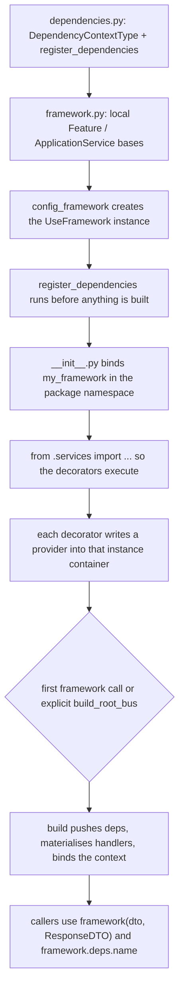
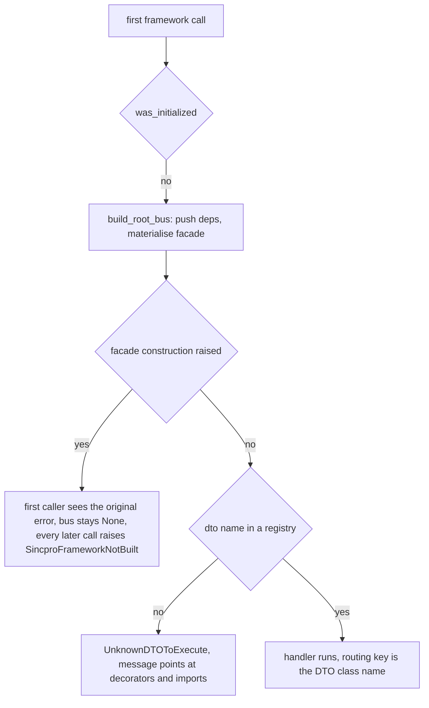

# Building a bounded context: create the instance first, import the services second

A **bounded context** in this framework is exactly one `UseFramework` instance. Everything the
context owns is created in `UseFramework.__init__`: the `FrameworkContainer`, the two decorator
attributes bound to that container, the dependency registry behind `framework.deps`, the error-handler
chains, the middleware pipeline and the context storage
(`sincpro_framework/use_bus.py:60-88`). Registrations never cross instances — the container's
`feature_bus` / `app_service_bus` are per-container `Singleton`s
(`sincpro_framework/ioc.py:49-57`), and `tests/use_container/test_multiple_instances.py:30-41` pins that two
instances in one process keep different `feature_registry` key sets. That is why the design rule is
"one framework per bounded context" (`docs/architecture/ARCHITECTURE.md:866`, `:881`).

Standing one up therefore has **two orderings that must hold**, and both are consequences of code
rather than conventions:

1. The instance must exist **before** the service modules are imported, because the decorators are
   `partial`s over that instance's container (`sincpro_framework/use_bus.py:69-70`).
2. Dependencies must be registered **before** the first build, because the build is the only thing
   that pushes them onto the registration entries (`sincpro_framework/use_bus.py:125`, `:90-105`).

The README's recommended module layout (`README.md:392-408`) is what keeps both satisfied:

```plaintext
apps/
└── my_domain/
    ├── infrastructure/
    │   ├── dependencies.py   # registers adapters; declares DependencyContextType
    │   ├── framework.py      # defines local Feature/ApplicationService + config_framework()
    │   └── error_handler.py  # (optional) registers error handlers
    ├── services/
    │   ├── tokenization.py   # a Feature
    │   └── payments.py       # an ApplicationService
    └── __init__.py           # creates the framework instance and imports services
```



*The bootstrap order: adapters, then the instance, then the service imports, then the first build.*

## Step 1 — `dependencies.py`: declare the typing helper and register the adapters

```python
# apps/my_domain/infrastructure/dependencies.py
from sincpro_framework import UseFramework

from my_sdk.adapters import PaymentAdapter, TokenizationAdapter


class DependencyContextType:
    """Typing helper — gives Features/AppServices IDE autocomplete for injected deps."""

    token_adapter: TokenizationAdapter
    payment_adapter: PaymentAdapter


def register_dependencies(
    framework: UseFramework[DependencyContextType],
) -> UseFramework[DependencyContextType]:
    """Register all adapters with the framework instance."""
    framework.add_dependency("token_adapter", TokenizationAdapter())
    framework.add_dependency("payment_adapter", PaymentAdapter())
    return framework
```

(`README.md:410-435`.) Two things about `DependencyContextType` are easy to get wrong:

- It is **never instantiated**. It exists only so that `Feature` / `ApplicationService` subclasses
  inherit the annotated names for a type checker (`README.md:412-414`).
- Its annotations are **not read at runtime**. `UseFramework` is generic over the dependency context
  (`class UseFramework(ContextMixin, Generic[TDeps])`, `sincpro_framework/use_bus.py:19`,
  `TDeps = TypeVar("TDeps", default=Any)` `sincpro_framework/deps.py:9`), but `add_dependency` only
  refuses a duplicate *name* (`sincpro_framework/use_bus.py:166-169`); nothing validates that the
  object stored under `token_adapter` is a `TokenizationAdapter`. `UseFramework[DependencyContextType]`
  buys autocomplete and checker errors at development time, not runtime safety.

`register_dependencies` must run **once** per instance and before the first build: the name guard
raises `DependencyAlreadyRegistered` on a repeat call (`sincpro_framework/use_bus.py:166-169`,
`sincpro_framework/exceptions.py:5-6`), and dependencies registered after the build are not pushed
onto handlers that already exist (`sincpro_framework/use_bus.py:125` is the only call site of the push).

## Step 2 — `framework.py`: local bases plus `config_framework()`

```python
# apps/my_domain/infrastructure/framework.py
from sincpro_framework import ApplicationService as _ApplicationService
from sincpro_framework import DataTransferObject  # re-exported for convenience
from sincpro_framework import Feature as _Feature
from sincpro_framework import UseFramework

from .dependencies import DependencyContextType, register_dependencies


class Feature(_Feature, DependencyContextType):
    """Base Feature for this bounded context — typed deps included."""


class ApplicationService(_ApplicationService, DependencyContextType):
    """Base ApplicationService for this bounded context — typed deps included."""


def config_framework(name: str) -> UseFramework[DependencyContextType]:
    """Create and configure the framework instance."""
    instance = UseFramework[DependencyContextType](name)
    register_dependencies(instance)
    return instance
```

(`README.md:437-470`.) The local bases subclass **both** the framework base class and
`DependencyContextType`, so every service in this context sees `self.token_adapter` as a typed
attribute; the alias imports (`_Feature`, `_ApplicationService`) exist so the local names can be the
short ones (`README.md:445-447`). The typing case the repository actually checks is the same idiom
with `context` re-annotated on the local bases, because a handler's `self.context` type comes from the
handler class and not from the dependency map
(`tests/typing_and_linter/typing_cases/typed_context_case.py:29-52`); the minimal root-side version is
`tests/typing_and_linter/typing_cases/typed_deps_case.py:11-22`.

`config_framework` is the single creation point, and it is deliberately shaped so that dependencies are
registered before the instance is returned: a caller receives an instance that already has its
`deps` registry, and no module can decorate against a half-configured instance.

Two responsibilities stay outside these bases:

- **The local bases do not implement `execute`.** `Feature.execute` and `ApplicationService.execute`
  are abstract (`sincpro_framework/sincpro_abstractions.py:128-138`, `:196-197`), so the concrete
  service module must define it.
- **Instances are created by the container, not by you.** An `ApplicationService.__init__` takes its
  `feature_bus` positionally (`sincpro_framework/sincpro_abstractions.py:185-194`), and the container
  supplies it: the decorator stores `providers.Factory(decorated_class, framework_container.feature_bus)`
  (`sincpro_framework/ioc.py:137-147`). Handlers are materialised only at build time; the mechanics are
  owned by [registration and IoC](/openwiki/architecture/registration-and-ioc.md).

## Step 3 — `__init__.py`: instance first, service imports second

```python
# apps/my_domain/__init__.py
from .infrastructure.framework import (
    ApplicationService,
    DataTransferObject,
    Feature,
    config_framework,
)

my_framework = config_framework("my-domain")

# Import services AFTER creating the instance so decorators register against it
from .services import tokenization, payments  # noqa: E402, F401

__all__ = ["my_framework", "Feature", "ApplicationService", "DataTransferObject"]
```

(`README.md:476-494`.) The `# noqa: E402` is not cosmetic: the import is intentionally not at the top
of the file, and the comment above it states why — `my_framework` must be bound in the package
namespace before any module that imports it back is executed.

## Step 4 — the service modules

A Feature takes the local `Feature` base and the instance from the same package:

```python
# apps/my_domain/services/tokenization.py
from my_sdk.apps.my_domain import DataTransferObject, Feature, my_framework


class TokenizationParams(DataTransferObject):
    card_number: str
    expiration_date: str


class TokenizationResponse(DataTransferObject):
    token: str
    status: str


@my_framework.feature(TokenizationParams)
class NewTokenizationFeature(Feature):
    def execute(self, dto: TokenizationParams) -> TokenizationResponse:
        token = self.token_adapter.create_token(
            card_number=dto.card_number,
            expiration_date=dto.expiration_date,
        )
        return TokenizationResponse(token=token, status="success")
```

(Mirrors `README.md:534-563`.) An ApplicationService orchestrates through its injected `feature_bus`:

```python
# apps/my_domain/services/payments.py
from my_sdk.apps.my_domain import ApplicationService, DataTransferObject, my_framework
from my_sdk.apps.my_domain.services.tokenization import (
    TokenizationParams,
    TokenizationResponse,
)


class PaymentServiceParams(DataTransferObject):
    card_number: str
    expiration_date: str
    amount: float


class PaymentServiceResponse(DataTransferObject):
    status: str
    transaction_id: str


@my_framework.app_service(PaymentServiceParams)
class PaymentOrchestrationService(ApplicationService):
    def execute(self, dto: PaymentServiceParams) -> PaymentServiceResponse:
        tokenization = self.feature_bus.execute(
            TokenizationParams(
                card_number=dto.card_number,
                expiration_date=dto.expiration_date,
            ),
            TokenizationResponse,
        )
        transaction_id = self.payment_adapter.charge(tokenization.token, dto.amount)
        return PaymentServiceResponse(status="success", transaction_id=transaction_id)
```

(Mirrors `README.md:565-608`.) Two constraints on this step come from the registries, not from
convention:

- **The routing key is the input DTO's `__name__`**, written at registration
  (`sincpro_framework/ioc.py:96`) and read at execution
  (`sincpro_framework/bus.py:45`, `:53`, `:101`, `:109`, `:173`). Renaming a DTO class, or having two
  same-named DTO classes registered in the same layer of the same instance, changes routing.
- **A name may live in only one layer.** Each layer's registration check only looks at its own
  registry (`sincpro_framework/ioc.py:99-113`), so registering the same DTO name as both a feature and
  an application service succeeds at decoration time and fails when the facade is constructed
  (`sincpro_framework/bus.py:150-162`). The documented remedy for a genuine collision is to change one
  name or create another framework instance (`sincpro_framework/bus.py:159-162`) — which is what
  `examples/context_manager_demo.py:169-175` does when it spins up a second `UseFramework` for a
  differently named context in the same process.

## Step 5 — expose the instance and invoke it

`__init__.py` re-exports `my_framework`, so a caller needs one import to reach the whole context:

```python
from my_sdk.apps.my_domain import my_framework
from my_sdk.apps.my_domain.services.payments import (
    PaymentServiceParams,
    PaymentServiceResponse,
)

my_framework.build_root_bus()  # optional: build explicitly instead of on the first call

result = my_framework(
    PaymentServiceParams(card_number="4111111111111111", expiration_date="12/25", amount=100.00),
    PaymentServiceResponse,
)
```

(`README.md:610-643`.) Notes on the exposure surface:

- **Invocation is lazy by default.** `__call__` runs `build_root_bus()` when `was_initialized` is
  `False` (`sincpro_framework/use_bus.py:377-378`), so nothing has to build the instance up front.
  `with_trace()`, `with_parent_trace()`, `get_async_bus()` and the entrypoint `Catalog` repeat the same
  lazy build (`sincpro_framework/use_bus.py:316-317`, `:355-356`, `:368-369`,
  `sincpro_framework/entrypoints/catalog.py:49-50`).
- **Building eagerly is an operational choice, not a formality.** A service that also serves HTTP
  builds its buses before the first request, because building any bus is what installs the
  process-level OTel provider the transport middleware needs (`README.md:1129-1132`, `:1102-1105`).
- **Outside a handler, read dependencies through `framework.deps`.** Inside a Feature /
  ApplicationService keep `self.<name>`; from SDK callers, tests and entrypoints use
  `my_framework.deps.token_adapter` (`README.md:472-474`, `README.md:258-261`). The locator is
  read-only and works before any build (`sincpro_framework/deps.py:12-66`,
  `tests/use_container/test_deps.py:16-22`).
- **Handlers are hosts for the instance, not the other way around.** `build_mcp_server(instance)` and
  `RpcGateway({...})` take the same object (`sincpro_framework/entrypoints/mcp/entrypoint.py:74-75`,
  `sincpro_framework/entrypoints/rpc/__init__.py:1-3`); the context's own module layout does not change
  when a wire is added.
- **Pass `package=` when the caller is not the library itself** (tests, a thin adapter), so the Sentry
  release and OTel `service.name` are resolved from the right distribution
  (`sincpro_framework/use_bus.py:38`, `:47-49`, `README.md:964`).

## Why the instance must exist before the imports

The decorator attributes are not methods that could be created on demand. `__init__` builds the
container and then binds two `partial`s to it (`sincpro_framework/use_bus.py:63-70`):

```python
self._sp_container = ioc.FrameworkContainer(logger_bus=self.logger, observability=self.observability)
self.feature = partial(ioc.inject_feature_to_bus, self._sp_container)
self.app_service = partial(ioc.inject_app_service_to_bus, self._sp_container)
```

So `my_framework.feature(TokenizationParams)` **is** `inject_feature_to_bus(container,
TokenizationParams)`: the outer call returns a decorator whose body is
`_register_service(framework_container, ServiceType.FEATURE, dto, cls)` followed by
`return cls` (`sincpro_framework/ioc.py:153-171`). The decorated class is returned unchanged — not
wrapped, not proxied — and it is the container that later instantiates it. `_register_service` is the
only writer: per DTO name it updates the container's `dto_registry` and the layer registry with a
fresh `providers.Factory`, then attaches that registry to the layer's bus provider
(`sincpro_framework/ioc.py:84-150`).

Four consequences follow, and they are the whole reason this page's ordering is explicit:

1. **Before `UseFramework(...)` returns, there is no decorator to call.** The container the partial
   captures is created inside `__init__` (`sincpro_framework/use_bus.py:63-65`); a module that
   decorates against a not-yet-created instance has nothing to reference.
2. **Nothing scans for decorated classes.** Registration happens where a decorator (or the bus-level
   `register_feature` / `register_app_service` API) is evaluated, i.e. as a side effect of importing
   the defining module. An import that never happens registers nothing.
3. **A module registers into exactly one container — the one its decorator came from.** The container
   is captured in the closure, so a service module that imports a *different* bounded context's
   instance writes its DTO and handler into *that* instance's registries. Nothing warns: the
   registration is legal there, and the importing context simply never has the DTO.
4. **The module body runs once.** Because the registration is a side effect of the module body and
   Python caches imported modules, a service module belongs to the single instance it imported; a
   second bounded context cannot adopt it by importing it again, which is the mechanical reading of
   the "one framework per bounded context" rule (`docs/architecture/ARCHITECTURE.md:866`, `:881`).

The delayed import in `__init__.py` also avoids an **import cycle**, which is the second reason the
`# noqa: E402` line is where it is: the service modules import `my_framework`, `Feature`,
`ApplicationService` and `DataTransferObject` **from the package they live in**
(`README.md:534-535`, `README.md:572-573`). If the package imported its services before binding
`my_framework`, those modules would import a partially-initialised package. The README states the
rule positively: "Import services AFTER creating the instance so decorators register against it"
(`README.md:492-493`).

The same ordering is visible in the single-module example, where the instance, its dependencies and
the decorators live in one file — the constraint is satisfied simply because the decorators appear
after the constructor call (`examples/context_manager_demo.py:101-114`). The end-to-end shape the test
suite exercises is `tests/use_container/test_use_framework.py`: dependency registered at `:36-37`, the
local bases mixing in `DependencyContextType` at `:28-45`, decoration at `:64-65` and `:84-85`,
execution at `:99-102`.

## What a violated ordering actually produces

None of these mistakes raise at import time, so the failure you see rarely names the cause. The
build's own laziness is what decides which one you get.



*Two different bootstrap failures: a missing registration routes nowhere, while a failed build poisons the instance.*

| Symptom | What actually happened | Where the code is |
| --- | --- | --- |
| Invoking a DTO raises `UnknownDTOToExecute` ("review if the decorators are used properly … was never register using the decorator") | The module that decorates that DTO was never imported **in the process that built this instance**. The build itself succeeded, with a shorter (possibly empty) registry. | `sincpro_framework/bus.py:191-194` |
| The DTO runs, but in the wrong bounded context; the context that should own it raises `UnknownDTOToExecute` | The service module imported another instance and its decorator wrote into **that** container. | `sincpro_framework/use_bus.py:69-70`, `sincpro_framework/ioc.py:153-171` |
| The first call raises the real error, and **every later** call raises `SincproFrameworkNotBuilt` ("check the imports of each feature and app service") | The build raised after `was_initialized` was set `True` and before `self.bus` was assigned — for example a cross-layer `DTOAlreadyRegistered` from `FrameworkBus.__init__`. The instance is now permanently unusable; re-importing modules does not retry the build. | `sincpro_framework/use_bus.py:127-130`, `:380-386`; `sincpro_framework/bus.py:150-162`; `sincpro_framework/exceptions.py:17-18` |
| `DTOAlreadyRegistered` on the first call, naming a DTO present in both layers | The same DTO name was decorated as a feature and as an application service in this instance. | `sincpro_framework/bus.py:150-162`, re-checked per call at `:175-182` |
| `DependencyAlreadyRegistered` while wiring | `register_dependencies` (or `add_dependency`) ran twice for one name on the same instance. | `sincpro_framework/use_bus.py:166-169` |

The `SincproFrameworkNotBuilt` message is worth reading carefully, because it **points at the wrong
thing for the most common mistake**: it says to check the imports of each feature and app service, but
the only reachable path is a build whose facade construction raised
(`sincpro_framework/use_bus.py:380-386` is the sole raise site,
`sincpro_framework/exceptions.py:17-18`). A module that was simply never imported produces a
successful build over an empty registry and therefore `UnknownDTOToExecute` at call time instead.
Either way the diagnosis starts in the same place — was the module that decorates this DTO imported by
*this* instance — but the two errors mean different things and one of them is not recoverable in the
running process.

## Verifying a bootstrap without inventing behaviour

Because `DependencyContextType` is the only place all injected names are written down, the README
recommends a test that walks its annotations and asserts each name reached the registry
(`README.md:496-518`):

```python
# tests/my_domain/test_framework_setup.py
from my_sdk.apps.my_domain import my_framework
from my_sdk.apps.my_domain.infrastructure.dependencies import DependencyContextType


def test_declared_deps_are_registered():
    for dep_name in DependencyContextType.__annotations__:
        assert dep_name in my_framework.deps, f"Missing dep: {dep_name}"
```

This uses the locator's `__contains__` (`sincpro_framework/deps.py:38-39`) and needs no build: `deps`
does not touch `self.bus` (`sincpro_framework/use_bus.py:172-181`, pinned by
`tests/use_container/test_deps.py:16-22`). It is the only check that catches the mismatch the framework
itself cannot — a name declared for the checker and never passed to `add_dependency`.

For the registrations themselves, the supported reader is introspection, and it requires a built
instance: `features(framework)`, `app_services(framework)` and `dtos(framework)` raise
`ValueError("Framework must be built before introspection")` otherwise
(`sincpro_framework/introspection/inspector.py:21`, `:72-75`). So a smoke test calls
`framework.build_root_bus()` (or performs one `framework(dto)` call) first, then asserts the key set,
as `tests/test_introspection.py:43-48` does — that file also shows the whole bootstrap in miniature,
with the instance created, decorated and built in one module (`:23-40`).

Handlers wired through the bus-level `register_feature` / `register_app_service` API appear in neither
place: they never reach `dto_registry`, and introspection skips registry keys it cannot find there
(`sincpro_framework/introspection/inspector.py:83-86`). Use the decorators for anything that must be
visible to introspection or published over a wire.

## Bootstrap checklist

1. `dependencies.py` — declare `DependencyContextType` (typing only, never instantiated) and register
   every adapter through `add_dependency`, before anything is built.
2. `framework.py` — local `Feature` / `ApplicationService` bases subclassing the framework base **and**
   `DependencyContextType`; one `config_framework(name)` that creates the instance and registers the
   dependencies before returning it.
3. `__init__.py` — bind the instance, *then* import the service modules (`# noqa: E402`), then export
   the instance and the local bases.
4. Services — import the instance and the bases from the bounded-context package; decorate with
   `@my_framework.feature(...)` / `@my_framework.app_service(...)`; give each DTO name a single layer.
5. Callers — `framework(dto, ResponseDTO)` in process, `framework.deps.<name>` outside handlers,
   `build_root_bus()` at startup when a transport needs the process provider installed first.
6. Verify — declarations against `framework.deps`, then registrations through introspection on a
   built instance.

## Where to go next

- [Registration and IoC](/openwiki/architecture/registration-and-ioc.md) — the two moments of a
  registration, provider scoping, and every duplicate/unknown-DTO failure in full.
- [Dependency injection and typing](/openwiki/concepts/dependency-injection-and-typing.md) — the
  `add_dependency` → `dynamic_dep_registry` → build-push path and the `DependencyLocator` behind
  `framework.deps`.
- [Feature vs ApplicationService](/openwiki/concepts/feature-vs-application-service.md) — which layer a
  given use case belongs to.
- [Configuration and settings](/openwiki/concepts/configuration.md) — the `$ENV:` settings the context
  inherits at import time, and the module-level logger.
- [Error handling](/openwiki/workflows/error-handling.md) — the optional `error_handler.py` in this
  layout, and why handlers can be registered before or after the build.
- [Quickstart](/openwiki/quickstart.md) — the same steps in a single module.
