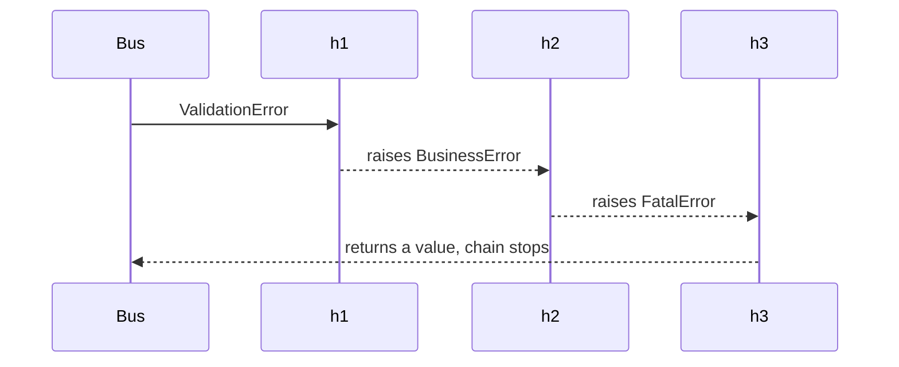
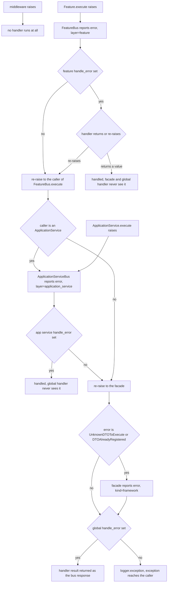
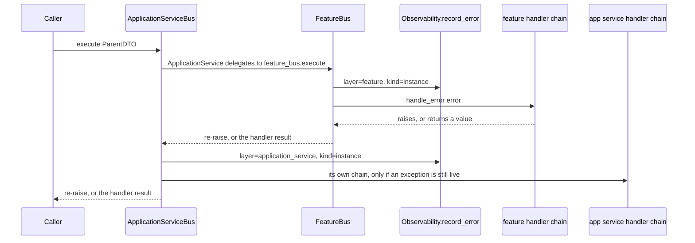

# Error handling: three scopes, one chain per bus, and reporting before the handler

Error handling in this framework is not a framework-wide hook: it is **one optional callable per bus**
plus **three independent registration scopes** on `UseFramework`. Both bus classes and the facade start
with `handle_error: Optional[Callable] = None` (`sincpro_framework/bus.py:26`, `:78`, `:146`) and each
`execute` consults only its own attribute, from inside its own `except` block
(`sincpro_framework/bus.py:60-64`, `:116-120`, `:196-205`). Everything on this page follows from that
layout: what a handler receives is decided by *which bus's `except` clause caught the exception*, and
whether a handler runs at all is decided by the order in which the buses are nested.

Rationale for the facade-over-two-registries design is in
[docs/architecture/ARCHITECTURE.md](../../docs/architecture/ARCHITECTURE.md) (authoritative, not restated
here). The execution path itself is on [executing a DTO](/openwiki/architecture/bus-execution.md);
this page owns the handler contract.

## The handler contract

`ErrorHandler` is a type alias, not a class: `Callable[[Exception], Any]`
(`sincpro_framework/error_handler.py:3-16`). A handler receives the exception and either

- **returns a value** — the exception is considered handled; the returned value becomes the bus
  response (`sincpro_framework/bus.py:62-63`, `:118-119`, `:201-202`), or
- **re-raises** — the framework treats the raise as a request to delegate to the next handler in the
  chain (`sincpro_framework/error_handler.py:19-41`).

Nothing else is passed in: no DTO, no span, no layer name, no return type. Whatever a handler returns
is returned to the *caller of `execute`* verbatim, so a handled failure is indistinguishable from a
success at the call site — a handler may return a plain string instead of a DTO.

```python
from sincpro_framework import UseFramework

framework = UseFramework("my_app")

def handle_error(error: Exception):
    return {"error": str(error)}      # suppresses the exception

framework.add_global_error_handler(handle_error)
```

Two properties of this contract are easy to miss and both matter in production code:

- **A raise from a handler is indistinguishable from a deliberate delegation.** `compose_handler`
  wraps each handler in `try: return handler(error) except Exception as exc: …`
  (`sincpro_framework/error_handler.py:33-39`), so a *bug* inside a handler (a `TypeError` on a bad
  attribute, say) is silently turned into the next handler's input, exactly like an intentional
  `raise error`. There is no opt-out; the only way to see such a failure is to be the last handler.
- **Only `Exception` is caught.** A handler that raises something derived from `BaseException` —
  `KeyboardInterrupt`, `SystemExit`, `asyncio.CancelledError` — propagates immediately and the
  remaining handlers never run (same clause, `:36`).

### Registering a handler that is not callable

All three registration methods validate first and refuse before the chain is touched:

```python
if not callable(handler):
    raise TypeError("The handler must be a callable")
```

(`sincpro_framework/use_bus.py:207-208` for the global scope, `:219-220` for feature, `:231-232` for app
service). The `TypeError` propagates to the registration call site and the rejected object never enters
the chain list, so a partially-registered scope keeps whatever was already accepted. Note the asymmetry
with middleware, which performs no such check on `add_middleware`
(`sincpro_framework/middleware.py:30-32`) — the callable check exists only on this API.

## Chain construction: `compose_handler` and `build_error_handler_chain`

`UseFramework` never hands the bus a list. It hands it **one composed callable** per scope, rebuilt on
every registration:

```python
self._global_error_handlers.append(handler)
self.global_error_handler = build_error_handler_chain(self._global_error_handlers)
if self.was_initialized and self.bus is not None:
    self.bus.handle_error = self.global_error_handler
```

(`sincpro_framework/use_bus.py:209-212`; the feature and app-service methods are the same shape at
`:221-224` and `:233-238`.)

`build_error_handler_chain(handlers)` folds the list **in reverse** with `compose_handler`, so the
first-registered handler ends up outermost — and therefore runs first
(`sincpro_framework/error_handler.py:44-57`). `compose_handler(handler, next_handler)` wraps a handler
so that, on raise, the handler at `next_handler` is called with the exception that was raised; with no
`next_handler` it re-raises (`sincpro_framework/error_handler.py:33-41`). The chain returns `None` when
the list is empty (`:53-54`), which is why `handle_error` stays `None` — and the buses fall through to
`raise error` — until at least one handler exists.

Because the fold is re-run from the accumulated list on each call, **the list of registered handlers is
the source of truth and the composed callable is replaced, never appended to**. Re-registration
re-wraps every previously registered handler.

### Registration order is execution order

| Registration order | Role | Executes |
| --- | --- | --- |
| `add(h1)` first | classify / intercept the errors it claims, delegate the rest | first |
| `add(h2)` second | log or observe the error, then delegate | second |
| `add(h3)` third | final fallback that returns a structured response | last |

There is no priority field, no de-duplication and no removal API: order is the order of
`add_*_error_handler` calls, and the only lever is which handler re-raises. A short example, with each
handler converting the exception type to show that the *next* handler sees what the previous one
raised (`ValidationError`, `BusinessError` and `FatalError` are user-defined exception classes):

```python
def h1(error):   # first: only claims the type it knows
    if isinstance(error, ValidationError):
        raise BusinessError(f"h1 got [{error}]")   # delegate with a new type
    raise error                                    # keep delegating unchanged

def h2(error):
    if isinstance(error, BusinessError):
        raise FatalError(f"h2 got [{error}]")
    raise error

def h3(error):   # last: never raises
    return f"h3 handled [{error}]"

app.add_global_error_handler(h1)
app.add_global_error_handler(h2)
app.add_global_error_handler(h3)
# a Feature raising ValidationError("invalid input") returns:
# "h3 handled [h2 got [h1 got [invalid input]]]"
```

The chain therefore composes as `h1 → h2 → h3` and the exception object flowing between handlers is
whatever the previous one raised — the original instance if it re-raised `error` unchanged, otherwise a
new object. A handler that *returns* stops the chain there: `h2` and `h3` never run.



*First registered runs first; a raise delegates the exception object to the next handler, a return ends the chain.*

## The three scopes, and exactly which exception each one sees

| Scope | Registration method | Lands on | Consulted from |
| --- | --- | --- | --- |
| global | `add_global_error_handler` (`sincpro_framework/use_bus.py:187-212`) | `FrameworkBus.handle_error` | `FrameworkBus.execute` `except` (`sincpro_framework/bus.py:196-205`) |
| feature | `add_feature_error_handler` (`sincpro_framework/use_bus.py:214-224`) | `FeatureBus.handle_error` | `FeatureBus.execute` `except` (`sincpro_framework/bus.py:60-64`) |
| app service | `add_app_service_error_handler` (`sincpro_framework/use_bus.py:226-238`) | `ApplicationServiceBus.handle_error` | `ApplicationServiceBus.execute` `except` (`sincpro_framework/bus.py:116-120`) |

Each scope's `except` clause is the *only* thing that decides visibility. Reading the three clauses
together gives the scope rules:

- **A middleware exception never reaches any handler.** `MiddlewarePipeline.execute` runs before the
  facade, and `UseFramework.__call__` has no `except` at all
  (`sincpro_framework/use_bus.py:400-404`, `sincpro_framework/middleware.py:34-53`). A validation
  failure a middleware raises propagates to the caller with no handler consulted — and, as
  [middleware](/openwiki/concepts/middleware.md) documents, no span and no error report either.
- **A feature exception can be swallowed by the feature handler before the global handler would ever
  run.** The feature handler's return value becomes `FeatureBus.execute`'s response
  (`sincpro_framework/bus.py:62-63`), travels back through the facade's `try` body
  (`sincpro_framework/bus.py:183-185`) and is returned as the bus response — no exception exists any
  more for the facade's `except` to see (`sincpro_framework/bus.py:201-202`).
- **An app-service handler only sees what the feature layer re-raised.** When an
  `ApplicationService` calls `self.feature_bus.execute(dto)` and the feature bus has *no* handler, the
  original exception propagates into the app service body and is caught by
  `ApplicationServiceBus.execute`. When the feature bus *does* have a handler, only what that handler
  re-raised arrives — including a new type it raised on purpose.
- **The facade handles only what a sub-layer re-raised, plus its own routing errors.** Its `except`
  reads two things: `UnknownDTOToExecute` and `DTOAlreadyRegistered` raised by the routing logic itself
  (`sincpro_framework/bus.py:175-182`, `:191-194`), and anything that escaped the sub-bus's own
  `except` — including an exception *raised by a sub-bus handler chain* when the last handler
  re-raised, or a handler bug that propagated.

The constructive rule that follows: **put a handler at the layer whose exceptions you can actually
name.** An `ApplicationService` that delegates to a Feature inherits two independent handler chains
around the same failure, and the innermost one wins the race.

| Failure origin | Feature handler | App-service handler | Global handler |
| --- | --- | --- | --- |
| middleware raises (`sincpro_framework/middleware.py:45-46`) | — | — | — |
| `Feature.execute` raises, feature chain swallows | runs, ends chain | — | — |
| `Feature.execute` raises, feature chain re-raises | runs | runs (if reached through an app service) | runs if the app-service chain re-raises or does not exist |
| `ApplicationService.execute` raises directly | — | runs | runs if the app-service chain re-raises or does not exist |
| `UnknownDTOToExecute` / `DTOAlreadyRegistered` from routing (`sincpro_framework/bus.py:175-194`) | — | — | runs |
| `SincproFrameworkNotBuilt` (`sincpro_framework/use_bus.py:380-386`) | — | — | — |



*Where each failure stops, and which scope gets to see it. Reporting happens on the way in, before the handler.*

The `FrameworkBus` constructor also re-asserts, once at build time, that no DTO name is in both
registries (`sincpro_framework/bus.py:150-162`), and `FrameworkBus.execute` repeats that check on every
call (`sincpro_framework/bus.py:175-182`). Only the call-time one is inside the facade's `try`, so only
the call-time one can be handled: the constructor's raise happens during `build_root_bus()`, before any
`handle_error` assignment matters, and reaches the building caller as-is.

## Registering before or after the build

Handlers may be registered at any point in the instance's life. The mechanism is a two-way push, and the
two halves are not the same code path:

- **Before the build**, the composed chains are attached to the *container providers*:
  `_add_error_handlers_provided_by_user()` (`sincpro_framework/use_bus.py:107-121`) calls
  `add_attributes(handle_error=…)` on the `framework_bus`, `feature_bus` and `app_service_bus`
  providers, and it is invoked as step 2 of `build_root_bus()`
  (`sincpro_framework/use_bus.py:126`). An unset scope is skipped, so the bus keeps the `None` its
  `__init__` set.
- **After the build**, the chain is assigned **straight onto the live bus instances**:
  `self.bus.handle_error = …`, `self.bus.feature_bus.handle_error = …`,
  `self.bus.app_service_bus.handle_error = …`, guarded by `if self.was_initialized and self.bus is not
  None` (`sincpro_framework/use_bus.py:211-212`, `:223-224`, `:237-238`). That direct assignment is
  what makes a post-build registration take effect immediately: the composed callable is read from the
  attribute on every `execute` (`sincpro_framework/bus.py:62`, `:118`, `:201`), so there is no
  propagation step to forget.

```python
framework = UseFramework("my_app")

framework.add_global_error_handler(base_handler)   # before the bus exists
framework(some_dto)                                # first call builds the bus
framework.add_global_error_handler(extra_handler)  # after the build — takes effect at once
```

Two consequences of the guard:

- If a build raised (leaving `was_initialized = True` but `self.bus is None`, see
  [building a bounded context](/openwiki/workflows/building-a-bounded-context.md)), an `add_*` call
  still records the handler in its list and rebuilds the composed chain, but cannot attach it — the
  next successful `build_root_bus()` does.
- `FeatureBus` and `ApplicationServiceBus` are container **singletons** while `FrameworkBus` is a
  **factory** (`sincpro_framework/ioc.py:49-66`), so handlers already assigned to a sub-bus survive a
  rebuild of the facade; the facade itself is a new object and gets its chain from
  `_add_error_handlers_provided_by_user()`.

### The bypass: assigning `handle_error` yourself

`handle_error` is a plain mutable attribute on each bus, typed `Optional[Callable[..., Any]]`
(`sincpro_framework/bus.pyi:25`, `:56`, `:93`). Hand-wired buses can therefore set it directly and skip
`UseFramework` entirely — no chain, no `callable` check, no accumulation:

```python
feature_bus.handle_error = lambda error: "handled"
feature_bus.register_feature(SomeDTO, SomeFeature())
```

That is the supported path when a bus is built by hand instead of through the decorators, and it is how
one reaches the `register_feature` / `register_app_service` entry points at all
(`sincpro_framework/bus.py:30-39`, `:82-95`). It is a deliberate escape hatch, not a second
configuration API: the bus reads one callable, so whatever you assign *is* the whole scope.

## What observability does first

Reporting is wired **inside** each `except` block, immediately before the handler is consulted:

```python
except Exception as error:
    self.observability.record_error(error, dto_name, "feature", span)
    if self.handle_error:
        return self.handle_error(error)
    raise error
```

(`sincpro_framework/bus.py:60-64` for the feature layer; `:116-120` is identical with the
`"application_service"` layer string.) `Observability.record_error` does two things in one call: it
marks the current span (`span_error(span, error)`, which is a no-op without OpenTelemetry) and sends an
event to GlitchTip/Sentry with `kind="instance"` (`sincpro_framework/observability/api.py:101-118`).



*Reporting happens per layer and always before that layer's handler. Reaching the app-service layer requires the feature chain to re-raise.*

The ordering is the single most consequential fact on this page:

- **A swallowing handler does not hide an unexpected exception.** The event is already sent when the
  handler returns a value, so the caller gets a normal response and GlitchTip gets the error at the
  same time.
- **One exception can produce two events.** Nothing marks an error as already captured, so a Feature
  failure reached through a delegating ApplicationService is reported once with `sincpro.layer="feature"`
  and once with `"application_service"` — two observations of *which layer failed*, not duplicates to
  collapse. The richer the layer stack that re-raises, the more events.
- **The DTO name in the event is the routing key** — the bare `dto.__class__.__name__` each `except`
  computed before the `try` (`sincpro_framework/bus.py:45`, `:101`, `:173`), which is why the tag can
  be used to find the handler.
- **The span is recorded before the handler too**, so the span's status is `ERROR` for an exception a
  handler then swallows (`sincpro_framework/observability/tracing/span_error.py:8-16`).

### Expected domain errors: `ignore_sentry_exceptions`

The only way to stop an *expected* error from producing an event is to declare it up front:

```python
app = UseFramework("payment-cybersource")
app.ignore_sentry_exceptions(ValidationError, InsufficientFunds)
```

`UseFramework.ignore_sentry_exceptions(*exc_types)` forwards to `Observability.ignore`
(`sincpro_framework/use_bus.py:240-247`), which appends unknown types to a tuple without duplicating
them (`sincpro_framework/observability/api.py:89-95`). The tuple is read on every report
(`sincpro_framework/observability/api.py:117`).

What it does and does not do:

- **Handlers still run.** The ignore list removes the GlitchTip event only; the `except` block reaches
  `self.handle_error(error)` exactly as before (`sincpro_framework/bus.py:60-64`).
- **It applies to `kind="instance"` errors only.** The guard is `if kind == "instance" and
  ignored_exceptions`, and the ignore check runs *before* the `kind == "framework"` release swap
  (`sincpro_framework/observability/errors/record_error.py:32-36`). A routing error reported by the
  facade with `kind="framework"` is therefore never filtered, even when the list contains `Exception`.
- **It is per bounded context and needs no propagation.** The single `Observability` object created in
  `UseFramework.__init__` is what the container injects into all three buses and what the build also
  assigns onto the facade (`sincpro_framework/use_bus.py:63-65`, `:148`,
  `sincpro_framework/ioc.py:49-66`), so registering after the build takes effect immediately. The process
  door (`process.record_error`) consults no ignore list; see
  [observability errors](/openwiki/integrations/observability-errors.md).

### Framework-kind reporting is the facade's alone

`FrameworkBus.execute` is the only layer that reports with `kind="framework"`, and it does so
**conditionally**:

```python
except Exception as error:
    if isinstance(error, (UnknownDTOToExecute, DTOAlreadyRegistered)):
        self.observability.record_error(error, dto_name, "framework", kind="framework")
    if self.handle_error:
        return self.handle_error(error)
    self.logger.exception(f"Error with DTO {dto_name}({dto})")
    raise error
```

(`sincpro_framework/bus.py:196-205`.) Four things to read out of it:

- An exception re-raised by a sub-bus is **not** reported again by the facade — it was already reported
  by the layer that caught it. The facade adds an event only for its own routing errors.
- `kind="framework"` switches the reported release to the framework's own distribution
  (`sincpro_framework/observability/errors/record_error.py:35-36`) and escapes the ignore list.
- No `span` is passed at this level, so nothing is recorded on a span for a framework error — the
  facade opens no span of its own.
- When no global handler exists, the facade logs with `logger.exception` and re-raises the original
  object; when one exists, the log line is skipped entirely.

The same `kind="framework"` reporting exists on one non-execution path: `add_dependency` reports a
duplicate name before raising `DependencyAlreadyRegistered`, with no layer and no DTO name
(`sincpro_framework/use_bus.py:166-169`). No handler can see that one — the failure happens at
configuration time, before any bus executes.

## Invariants, failure modes and extension points

- **One composed callable per bus, read per execution.** There is no registry the bus iterates; a
  handler chain is replaced wholesale on each `add_*` (`sincpro_framework/use_bus.py:210`, `:222`,
  `:234-236`).
- **Scopes are independent and never merged.** The global chain is not appended to a sub-bus chain and
  the sub-bus cannot consult the global one; nesting is the only composition
  (`sincpro_framework/bus.py:60-64`, `:116-120`, `:196-205`).
- **A handler's return value is the result, of whatever type.** No validation, no coercion — a
  `Feature`-level handler that returns a string hands that string to the `ApplicationService` that
  called `feature_bus.execute`, which may then treat it as a feature response.
- **A handler is a plain callable, not bound to the framework.** It receives the exception and nothing
  else — no DTO, no layer name, no span (`sincpro_framework/error_handler.py:3-16`), and it is not the
  `Feature`/`ApplicationService` object, so it has no `self.context`. Anything contextual a handler needs
  it must close over from the composition root that registered it.
- **Nothing above the facade catches anything.** `UseFramework.__call__` has no `except`, so whatever
  the facade re-raises reaches the caller (`sincpro_framework/use_bus.py:400-404`). A wire host that
  wants its own error shape must compose it at the facade scope or at the transport — the JSON-RPC
  entry, for example, turns anything escaping a method into `INTERNAL_ERROR`
  (`sincpro_framework/entrypoints/rpc/jrpc.py:129-131`).
- **Validated registration only exists on `UseFramework`.** The `TypeError` for a non-callable lives in
  the `add_*_error_handler` methods (`sincpro_framework/use_bus.py:207-208`, `:219-220`, `:231-232`);
  assigning `bus.handle_error` directly has no check.
- **A handler chain that always re-raises is a diagnostic, not a handler.** The last handler's raise is
  what the caller and the enclosing layer see, so a chain ending in `raise error` behaves exactly like
  no handler at that scope — plus the reporting, which happened anyway.

## Where to go next

- [Executing a DTO: the end-to-end bus flow](/openwiki/architecture/bus-execution.md) — the routing,
  middleware and failure-path context these handlers sit in.
- [Middleware](/openwiki/concepts/middleware.md) — the one pipeline stage documented to have no
  handler and no reporting.
- [Observability: error reporting](/openwiki/integrations/observability-errors.md) — releases, tags,
  skip conditions and the `process` door.
- [Building a bounded context](/openwiki/workflows/building-a-bounded-context.md) — where a
  `error_handler.py` module fits in the recommended layout.
- [Architecture overview](/openwiki/architecture/overview.md) — the three buses and why one
  `Observability` object must reach all of them.
